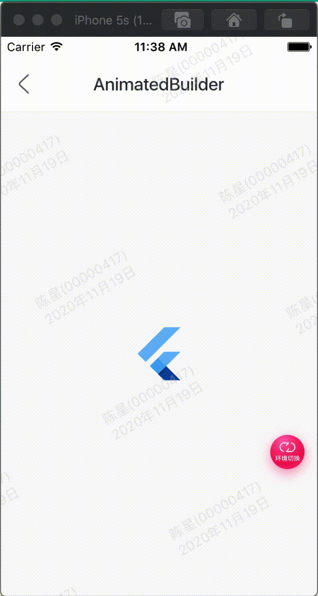

AnimatedBuilder可以让我们轻松的构建动画控件，下面的案例是让flutter logo图片旋转

效果：




代码如下：

```
class GMExampleAnimatedBuilderTest extends StatefulWidget {
  GMExampleAnimatedBuilderTest({Key key}) : super(key: key);

  @override
  _GMExampleAnimatedBuilderTestState createState() =>
      _GMExampleAnimatedBuilderTestState();
}

class _GMExampleAnimatedBuilderTestState
    extends State<GMExampleAnimatedBuilderTest> with TickerProviderStateMixin {
  AnimationController animationController;

  Animation<double> animation;

  @override
  void initState() {
    super.initState();

    this.animationController =
        AnimationController(duration: Duration(seconds: 2), vsync: this);

    this.animationController.addStatusListener((status) {
      if (status == AnimationStatus.completed) {
        this.animationController.reverse();
      } else if (status == AnimationStatus.dismissed) {
        this.animationController.forward();
      }
    });

    this.animation =
        Tween(begin: 0.0, end: 2.0 * math.pi).animate(this.animationController);

    //开始动画
    this.animationController.forward();
  }

  @override
  Widget build(BuildContext context) {
    return AnimatedBuilder(
      animation: animation,
      builder: (BuildContext ctx, Widget child) {
        return Transform.rotate(
          angle: animation.value,
          child: child,
        );
      },
      child: FlutterLogo(
        size: 60,
      ),
    );
  }

  @override
  void dispose() {
    this.animationController.dispose();
    super.dispose();
  }
}

```