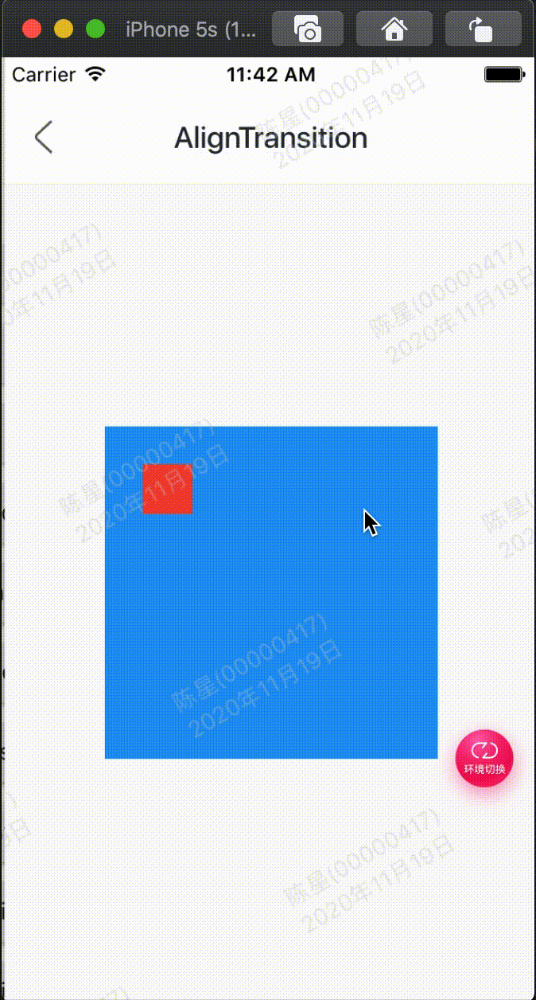

效果：



代码:

```
class GMExampleAlignTransitionTest extends StatefulWidget {
  GMExampleAlignTransitionTest({Key key}) : super(key: key);

  @override
  _GMExampleAlignTransitionTestState createState() =>
      _GMExampleAlignTransitionTestState();
}

class _GMExampleAlignTransitionTestState
    extends State<GMExampleAlignTransitionTest>
    with SingleTickerProviderStateMixin {
  AnimationController _animationController;

  Animation<AlignmentGeometry> _animation;

  @override
  void initState() {
    this._animationController =
        AnimationController(duration: Duration(seconds: 2), vsync: this);
    this._animation = Tween<AlignmentGeometry>(
            begin: Alignment.topLeft, end: Alignment.bottomRight)
        .animate(this._animationController);

    //开始动画
    this._animationController.forward();

    super.initState();
  }

  @override
  void dispose() {
    this._animationController.dispose();
    super.dispose();
  }

  @override
  Widget build(BuildContext context) {
    return Container(
      height: 200,
      width: 200,
      color: Colors.blue,
      child: AlignTransition(
        alignment: _animation,
        child: Container(
          height: 30,
          width: 30,
          color: Colors.red,
        ),
      ),
    );
  }
}

```