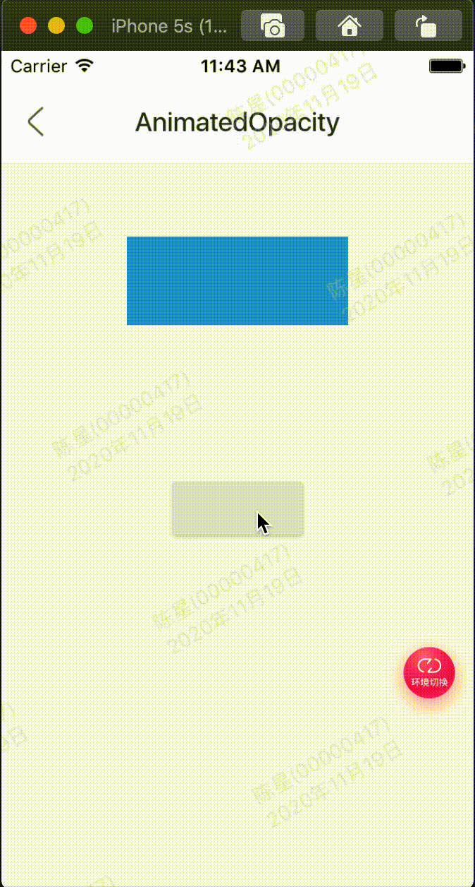

AnimatedOpacity是一个隐式的动画组件，它可以使子组件变的透明，用法如下：

```
var _opacity = 1.0;
AnimatedOpacity(
  opacity: _opacity,
  duration: Duration(seconds: 2),
  child: Container(
    height: 60,
    width: 150,
    color: Colors.blue,
  ),
)
```

duration参数是动画执行的时间，opacity参数是透明值，值的范围是0.0-1.0。如果仅仅是构建这样一个组件是不会有动画效果，需要让opacity参数发生变化，点击按钮设置新的opacity值：

```
RaisedButton(
  onPressed: (){
    setState(() {
      _opacity = 0;
    });
  },
)
```

整体效果：



代码:

```

class GMExampleAnimatedOpacityTest extends StatefulWidget {
  GMExampleAnimatedOpacityTest({Key key}) : super(key: key);

  @override
  _GMExampleAnimatedOpacityTestState createState() =>
      _GMExampleAnimatedOpacityTestState();
}

class _GMExampleAnimatedOpacityTestState
    extends State<GMExampleAnimatedOpacityTest> {
  var _opacity = 1.0;

  @override
  Widget build(BuildContext context) {
    return Column(
      children: <Widget>[
        SizedBox(
          height: 50,
        ),
        AnimatedOpacity(
          opacity: this._opacity,
          curve: Curves.easeIn,
          duration: Duration(seconds: 2),
          child: Container(
            height: 60,
            width: 150,
            color: Colors.blue,
          ),
          onEnd: () {
            GMToast.show("动画执行完毕", context);
          },
        ),
        SizedBox(
          height: 100,
        ),
        RaisedButton(
          onPressed: () {
            setState(() {
              _opacity = 0;
            });
          },
        )
      ],
    );
  }
}

```

