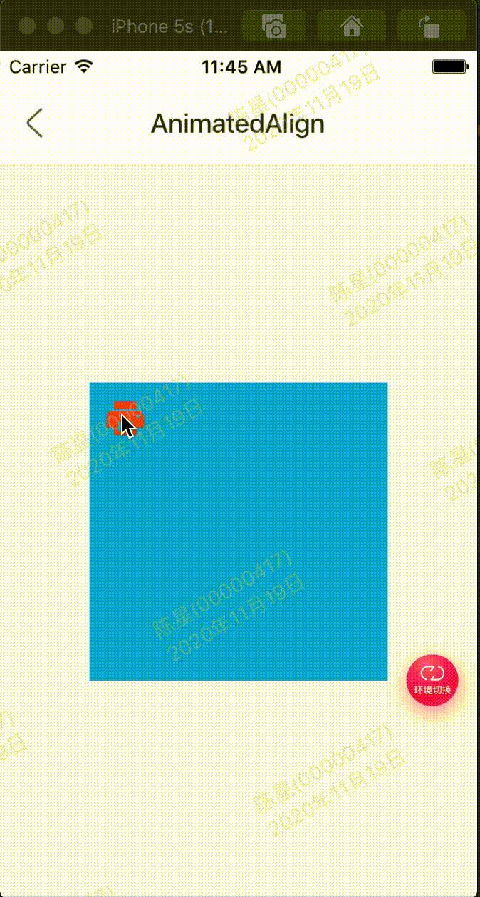

AnimatedAlign组件方便我们构建位置动画

效果：



代码:

```

class GMExampleAnimatedAlignTest extends StatefulWidget {
  GMExampleAnimatedAlignTest({Key key}) : super(key: key);

  @override
  _GMExampleAnimatedAlignTestState createState() =>
      _GMExampleAnimatedAlignTestState();
}

class _GMExampleAnimatedAlignTestState
    extends State<GMExampleAnimatedAlignTest> {
  var _alignment = Alignment.topLeft;

  @override
  Widget build(BuildContext context) {
    return Container(
      width: 200,
      height: 200,
      color: Colors.lightBlue,
      child: AnimatedAlign(
        alignment: _alignment,
        curve: Curves.bounceInOut,
        duration: Duration(seconds: 2),
        child: IconButton(
          icon: Icon(
            Icons.print,
            color: Colors.red,
            size: 30,
          ),
          onPressed: () {
            setState(() {
              _alignment = Alignment.bottomRight;
            });
          },
        ),
        onEnd: () {
          GMToast.show("动画执行完毕", context);
        },
      ),
    );
  }
}

```