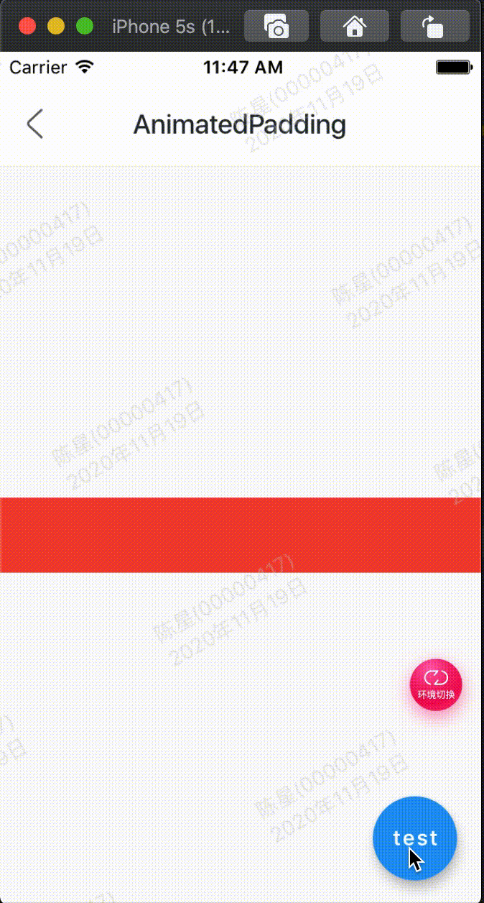

AnimatedPadding是一个隐式的动画组件，提供动态改变内边距的动画组件，用法如下：

```
var _padding = 0.0;
AnimatedPadding(
  padding: EdgeInsets.symmetric(horizontal: _padding),
  duration: Duration(seconds: 2),
  child: Container(color: Colors.red),
)
```

duration参数是动画执行的时间。如果仅仅是构建这样一个组件是不会有动画效果，需要让padding参数发生变化，点击按钮设置新的_padding值：

```
RaisedButton(
  onPressed: () {
    setState(() {
      _padding = 50;
    });
  },
)
```

效果：



整体代码:

```
class GMExampleAnimatedPaddingTest extends StatefulWidget {
  GMExampleAnimatedPaddingTest({Key key}) : super(key: key);

  @override
  _GMExampleAnimatedPaddingTestState createState() =>
      _GMExampleAnimatedPaddingTestState();
}

class _GMExampleAnimatedPaddingTestState
    extends State<GMExampleAnimatedPaddingTest> {
  var _padding = 0.0;

  @override
  Widget build(BuildContext context) {
    return Scaffold(
      body: Center(
        child: AnimatedPadding(
          padding: EdgeInsets.symmetric(horizontal: _padding),
          duration: Duration(seconds: 2),
          child: Container(
            height: 50,
            color: Colors.red,
          ),
        ),
      ),
      floatingActionButton: FloatingActionButton(
        child: Text("test"),
        onPressed: () {
          setState(() {
            _padding = 50;
          });
        },
      ),
    );
    return Column(
      children: <Widget>[
        Container(
          width: 300,
          height: 30,
          color: Colors.blue,
        ),
        SizedBox(
          height: 50,
        ),
        SizedBox(
          height: 100,
        ),
        RaisedButton(
          color: Colors.orange,
          onPressed: () {},
        ),
      ],
    );
  }
}

```