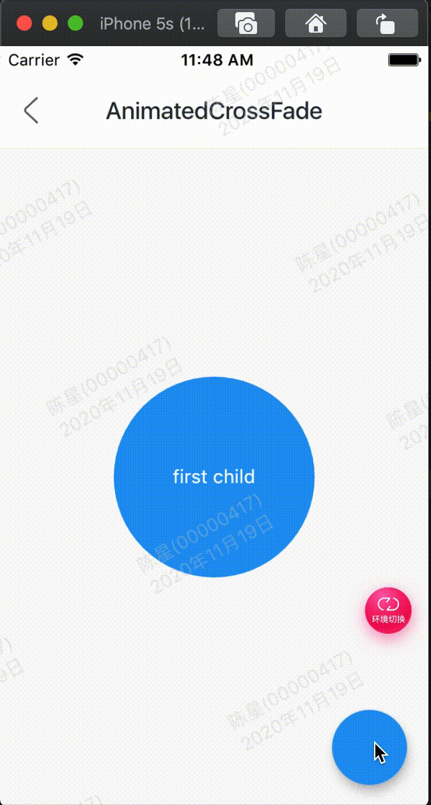

```
AnimatedCrossFade组件让2个组件在切换时出现交叉渐入的效果，因此AnimatedCrossFade需要设置2个子控件、动画时间和显示第几个子控件，用法如下：

AnimatedCrossFade(
  duration: Duration(seconds: 1),
  crossFadeState:
      _showFirst ? CrossFadeState.showFirst : CrossFadeState.showSecond,
  firstChild: Container(
    height: 150,
    width: 150,
    alignment: Alignment.center,
    decoration: BoxDecoration(shape: BoxShape.circle, color: Colors.blue),
    child: Text('first child',style: TextStyle(color: Colors.white),),
  ),
  secondChild: Container(
    height: 150,
    width: 150,
    alignment: Alignment.center,
    decoration:
        BoxDecoration(shape: BoxShape.rectangle, color: Colors.orange,borderRadius:BorderRadius.circular(20)),
    child: Text('second child',style: TextStyle(color: Colors.white),),
  ),
)
```

_showFirst参数由一个按钮按住，代码如下：

```
bool _showFirst = true;
RaisedButton(
  child: Text('切换'),
  onPressed: () {
    setState(() {
      _showFirst = !_showFirst;
    });
  },
),

```

效果：



代码:

```
class GMExampleAnimatedCrossFadeTest extends StatefulWidget {
  GMExampleAnimatedCrossFadeTest({Key key}) : super(key: key);

  @override
  _GMExampleAnimatedCrossFadeTestState createState() =>
      _GMExampleAnimatedCrossFadeTestState();
}

class _GMExampleAnimatedCrossFadeTestState
    extends State<GMExampleAnimatedCrossFadeTest> {
  bool _isShowFirst = true;
  @override
  Widget build(BuildContext context) {
    return Scaffold(
      body: Center(
        child: AnimatedCrossFade(
          duration: Duration(seconds: 1),
          crossFadeState: _isShowFirst
              ? CrossFadeState.showFirst
              : CrossFadeState.showSecond,
          firstChild: Container(
            height: 150,
            width: 150,
            alignment: Alignment.center,
            decoration: BoxDecoration(
              shape: BoxShape.circle,
              color: Colors.blue,
            ),
            child: Text(
              "first child",
              style: TextStyle(color: Colors.white),
            ),
          ),
          secondChild: Container(
            height: 150,
            width: 150,
            alignment: Alignment.center,
            decoration: BoxDecoration(
              shape: BoxShape.rectangle,
              color: Colors.orange,
              borderRadius: BorderRadius.circular(20),
            ),
            child: Text(
              "second child",
              style: TextStyle(color: Colors.white),
            ),
          ),
        ),
      ),
      floatingActionButton: FloatingActionButton(
        onPressed: () {
          setState(() {
            _isShowFirst = !_isShowFirst;
          });
        },
      ),
    );
  }
}
```