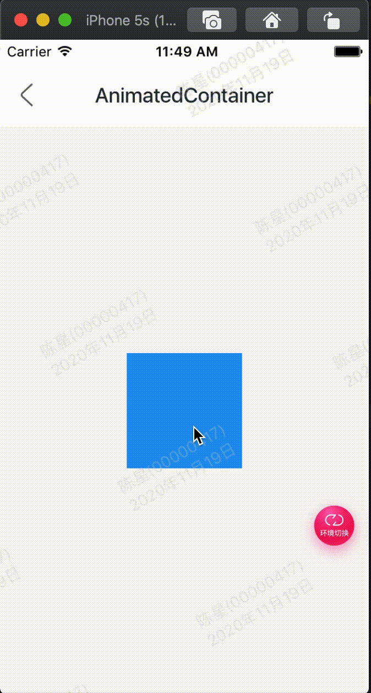

Flutter中很多用于动画的控件，这篇文章介绍动画控件AnimatedContainer，我们可以通俗的理解AnimatedContainer是带动画功能的Container，关于Container的详细介绍可以查看Flutter Widgets 之 Container，这篇详细介绍了Container的用法。

AnimatedContainer只需要提供动画开始值和结束值，它就会动起来并不需要我们主动调用setState方法。 变化AnimatedContainer的宽高实现变大的效果，代码如下：​

```
bool click = false;

@override
Widget build(BuildContext context) {
return Center(
  child: GestureDetector(
    onTap: () {
      setState(() {
        click = !click;
      });
    },
    child: AnimatedContainer(
      height: click ? 200 : 100,
      width: click ? 200 : 100,
      color: Colors.blue,
      duration: Duration(seconds: 3),

    ),
  ),
);
}
  
```


效果：



整体代码:

```
class GMExampleAnimatedContainerText extends StatefulWidget {
  GMExampleAnimatedContainerText({Key key}) : super(key: key);

  @override
  _GMExampleAnimatedContainerTextState createState() =>
      _GMExampleAnimatedContainerTextState();
}

class _GMExampleAnimatedContainerTextState
    extends State<GMExampleAnimatedContainerText> {
  bool click = false;

  @override
  Widget build(BuildContext context) {
    debugPrint("build ----- ");
    return Center(
      child: GestureDetector(
        onTap: () {
          setState(() {
            click = !click;
          });
        },
        child: AnimatedContainer(
          height: click ? 200 : 100,
          width: click ? 200 : 100,
          color: Colors.blue,
          duration: Duration(seconds: 1),
        ),
      ),
    );
  }
}

```