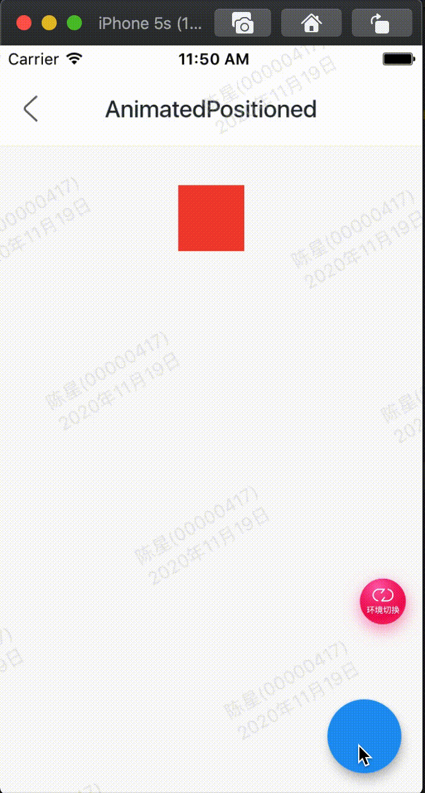

AnimatedPositioned是一个隐式的动画组件，提供动态改变位置的动画组件，用法如下：

```
var _top = 30.0;
Stack(
      alignment: Alignment.center,
      children: <Widget>[
        AnimatedPositioned(
          top: _top,
          duration: Duration(seconds: 2),
          child: Container(height: 50, width: 50, color: Colors.red),
        )
      ],
    )
```

相关参数：

 - duration参数是动画执行的时间。
 - AnimatedPositioned提供left、top、right、bottom四种定位属性，和 Positioned组件用相同。
 - AnimatedPositioned只能用于Stack组件中。
 - left、right和width3个参数只能设置其中2个，因为设置了其中2个，第三个已经确定了，同理top、bottom和height也只能设置其中2个。


效果：



整体代码:

```
class GMExampleAnimatedPositionedTest extends StatefulWidget {
  GMExampleAnimatedPositionedTest({Key key}) : super(key: key);

  @override
  _GMExampleAnimatedPositionedTestState createState() =>
      _GMExampleAnimatedPositionedTestState();
}

class _GMExampleAnimatedPositionedTestState
    extends State<GMExampleAnimatedPositionedTest> {
  var _top = 30.0;

  @override
  Widget build(BuildContext context) {
    return Scaffold(
      body: Stack(
        alignment: Alignment.center,
        children: <Widget>[
          AnimatedPositioned(
            top: _top,
            duration: Duration(seconds: 1),
            child: Container(
              height: 50,
              width: 50,
              color: Colors.red,
            ),
          ),
        ],
      ),
      floatingActionButton: FloatingActionButton(
        onPressed: () {
          if (_top == 180) {
            _top = 30.0;
          } else {
            _top = 180.0;
          }
          setState(() {});
        },
      ),
    );
  }
}
```
