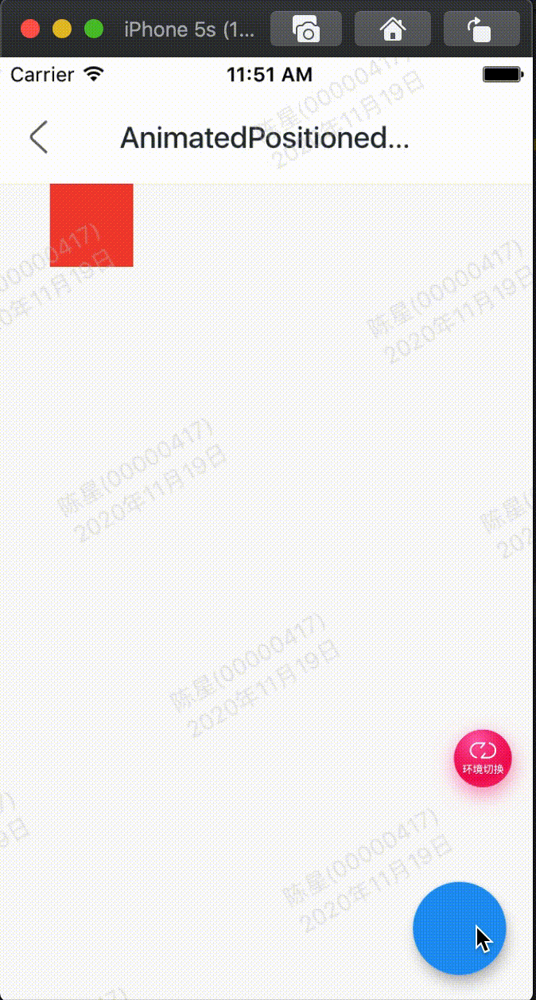

AnimatedPositionedDirectional是一个隐式的动画组件，提供动态改变位置的动画组件，用法如下：

```
Stack(
      children: <Widget>[
        AnimatedPositionedDirectional(
          start: _start,
          width: 50,
          height: 50,
          duration: Duration(seconds: 2),
          child: Container(color: Colors.red),
        ),
      ],
    )
```

相关参数：

 - duration参数是动画执行的时间。
 - 提供top、bottom、start、end四种定位属性，分别表示距离上、下、开始、结尾的距离。
 - 只能用于Stack组件中。
 - start、end和width3个参数只能设置其中2个，因为设置了其中2个，第三个已经确定了，同理top、bottom和height也只能设置其中2个。

效果：



代码:

```
class GMExampleAnimatedPositionedDirectionalText extends StatefulWidget {
  GMExampleAnimatedPositionedDirectionalText({Key key}) : super(key: key);

  @override
  _GMExampleAnimatedPositionedDirectionalTextState createState() =>
      _GMExampleAnimatedPositionedDirectionalTextState();
}

class _GMExampleAnimatedPositionedDirectionalTextState
    extends State<GMExampleAnimatedPositionedDirectionalText> {
  var _start = 30.0;

  @override
  Widget build(BuildContext context) {
    return Scaffold(
      body: Center(
        child: Stack(
          children: <Widget>[
            AnimatedPositionedDirectional(
              start: _start,
              // end: _start,
              // top: _start,
              // bottom: _start,
              width: 50,
              height: 50,
              duration: Duration(seconds: 2),
              curve: Curves.easeIn,
              onEnd: () {
                GMToast.show("结束啦...", context);
              },
              child: Container(
                color: Colors.red,
              ),
            ),
          ],
        ),
      ),
      floatingActionButton: FloatingActionButton(
        onPressed: () {
          setState(() {
            _start = 180;
          });
        },
      ),
    );
  }
}
```