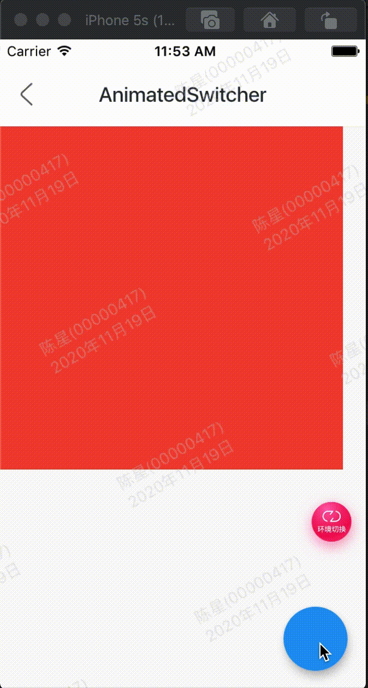

AnimatedSwitcher在2个或者多个子组件之间切换时使用动画

效果：



代码:

```
class GMExampleAnimatedSwitcherTest extends StatefulWidget {
  GMExampleAnimatedSwitcherTest({Key key}) : super(key: key);

  @override
  _GMExampleAnimatedSwitcherTestState createState() =>
      _GMExampleAnimatedSwitcherTestState();
}

class _GMExampleAnimatedSwitcherTestState
    extends State<GMExampleAnimatedSwitcherTest> {
  var _currChild;

  @override
  void initState() {
    super.initState();

    _currChild = Container(
      key: ValueKey("1"),
      height: 300,
      width: 300,
      color: Colors.red,
    );
  }

  @override
  Widget build(BuildContext context) {
    return Scaffold(
      body: AnimatedSwitcher(
        duration: Duration(seconds: 1),
        child: _currChild,
        switchInCurve: Curves.easeIn,
        layoutBuilder: (Widget currentChild, List<Widget> previousChildren) {
          return Stack(
            children: <Widget>[
              ...previousChildren,
              currentChild,
            ],
          );
        },
      ),
      floatingActionButton: FloatingActionButton(
        onPressed: () {
          setState(() {
            _currChild = Container(
              key: ValueKey("2"),
              height: 100,
              width: 100,
              color: Colors.blue,
            );
          });
        },
      ),
    );
    // return Scaffold(
    //   body: Center(
    //     child: AnimatedSwitcher(
    //       duration: Duration(seconds: 1),
    //       child: _currChild,
    //       switchInCurve: Curves.easeIn,
    //       transitionBuilder: (Widget child, Animation<double> value) {
    //         return ScaleTransition(
    //           child: child,
    //           scale: value,
    //         );
    //       },
    //     ),
    //   ),
    //   floatingActionButton: FloatingActionButton(
    //     onPressed: () {
    //       setState(() {
    //         _currChild = Container(
    //           key: ValueKey("2"),
    //           height: 300,
    //           width: 300,
    //           color: Colors.blue,
    //         );
    //       });
    //     },
    //   ),
    // );
  }
}
```