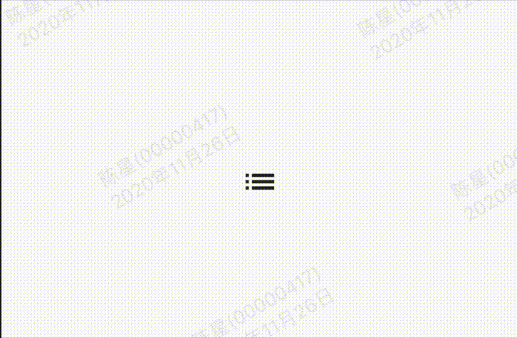

我们都知道Flutter系统中提供了大量的图标，但你是否知道Flutter还提供了很多动画图标，想要使用这些动画图标需要使用AnimatedIcon控件，首先需要设置图标，

效果：



代码:

```
class GMExampleAnimatedIconTest extends StatefulWidget {
  GMExampleAnimatedIconTest({Key key}) : super(key: key);

  @override
  _GMExampleAnimatedIconTestState createState() =>
      _GMExampleAnimatedIconTestState();
}

class _GMExampleAnimatedIconTestState extends State<GMExampleAnimatedIconTest>
    with SingleTickerProviderStateMixin {
  AnimationController animationController;

  @override
  void initState() {
    super.initState();

    animationController =
        AnimationController(duration: Duration(seconds: 1), vsync: this)
          ..addStatusListener((AnimationStatus status) {
            if (status == AnimationStatus.completed) {
              animationController.reverse();
            } else if (status == AnimationStatus.dismissed) {
              animationController.forward();
            }
          });
    animationController.forward();
  }

  @override
  Widget build(BuildContext context) {
    return Container(
      height: 100,
      width: 100,
      alignment: Alignment.center,
      child: AnimatedIcon(
        icon: AnimatedIcons.view_list,
        progress: animationController,
      ),
    );
  }

  @override
  void dispose() {
    animationController.dispose();
    super.dispose();
  }
}
```