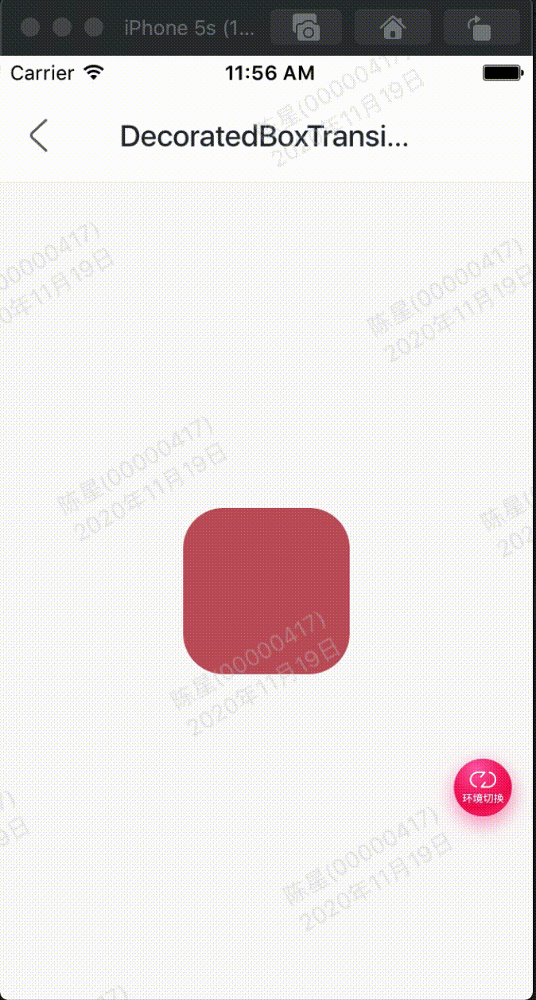

效果：



代码:

```
class GMExampleDecoratedBoxTransitionTest extends StatefulWidget {
  GMExampleDecoratedBoxTransitionTest({Key key}) : super(key: key);

  @override
  _GMExampleDecoratedBoxTransitionTestState createState() =>
      _GMExampleDecoratedBoxTransitionTestState();
}

class _GMExampleDecoratedBoxTransitionTestState
    extends State<GMExampleDecoratedBoxTransitionTest>
    with SingleTickerProviderStateMixin {
  AnimationController _animationController;
  Animation _animation;

  @override
  void initState() {
    _animationController =
        AnimationController(duration: Duration(seconds: 1), vsync: this);

    _animation = DecorationTween(
      begin: BoxDecoration(
        color: Colors.red,
        borderRadius: BorderRadius.circular(15),
      ),
      end: BoxDecoration(
        color: Colors.blue,
        borderRadius: BorderRadius.circular(55),
      ),
    ).animate(_animationController);

    _animationController.addStatusListener((AnimationStatus status) {
      if (status == AnimationStatus.completed) {
        _animationController.reverse();
      } else if (status == AnimationStatus.dismissed) {
        _animationController.forward();
      }
    });

    //开始动画
    _animationController.forward();

    super.initState();
  }

  @override
  Widget build(BuildContext context) {
    return DecoratedBoxTransition(
      decoration: _animation,
      child: Container(
        height: 100,
        width: 100,
      ),
    );
  }

  @override
  void dispose() {
    _animationController.dispose();
    super.dispose();
  }
}

```