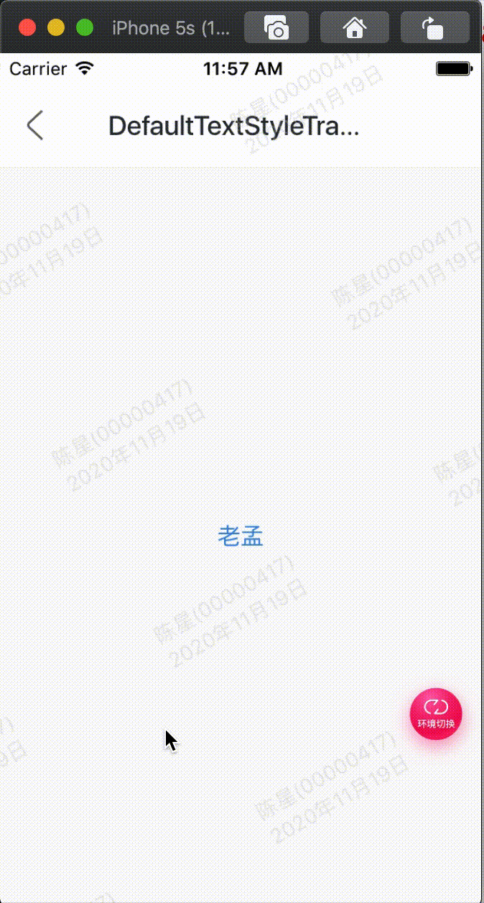

效果：



代码:

```
class GMExampleDefaultTextStyleTransitionTest extends StatefulWidget {
  GMExampleDefaultTextStyleTransitionTest({Key key}) : super(key: key);

  @override
  _GMExampleDefaultTextStyleTransitionTestState createState() =>
      _GMExampleDefaultTextStyleTransitionTestState();
}

class _GMExampleDefaultTextStyleTransitionTestState
    extends State<GMExampleDefaultTextStyleTransitionTest>
    with SingleTickerProviderStateMixin {
  AnimationController _animationController;
  Animation _animation;

  @override
  void initState() {
    _animationController =
        AnimationController(duration: Duration(seconds: 2), vsync: this);
    _animation = TextStyleTween(
      begin: TextStyle(color: Colors.blue, fontSize: 14),
      end: TextStyle(color: Colors.red, fontSize: 24),
    ).animate(_animationController);

    //开始动画
    _animationController.forward();

    super.initState();
  }

  @override
  Widget build(BuildContext context) {
    return DefaultTextStyleTransition(
      style: _animation,
      child: Text("老孟"),
    );
  }

  @override
  void dispose() {
    _animationController.dispose();
    super.dispose();
  }
}

```