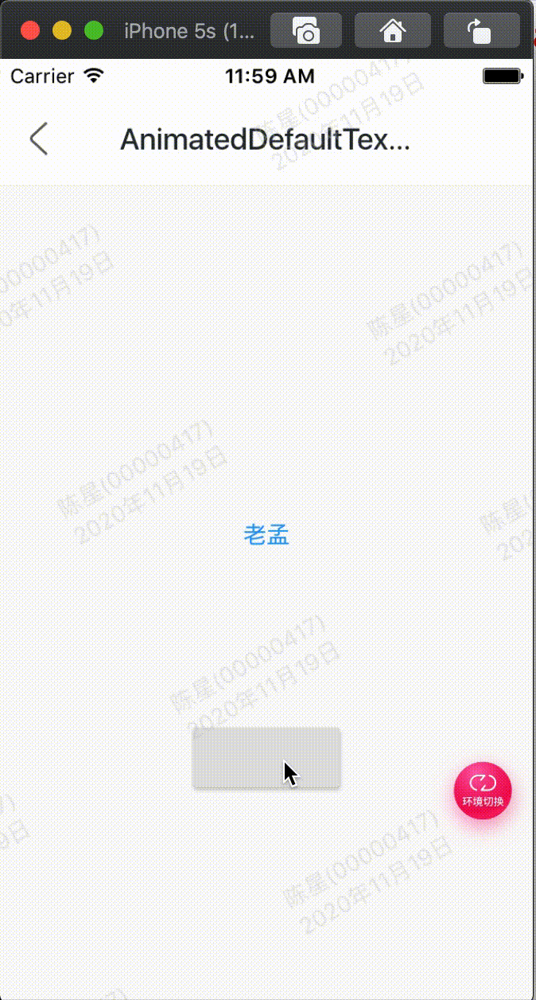

效果：



代码:

```
class GMExampleAnimatedDefaultTextStyleTest extends StatefulWidget {
  GMExampleAnimatedDefaultTextStyleTest({Key key}) : super(key: key);

  @override
  _GMExampleAnimatedDefaultTextStyleTestState createState() =>
      _GMExampleAnimatedDefaultTextStyleTestState();
}

class _GMExampleAnimatedDefaultTextStyleTestState
    extends State<GMExampleAnimatedDefaultTextStyleTest>
    with SingleTickerProviderStateMixin {
  TextStyle _style;

  @override
  void initState() {
    _style = TextStyle(color: Colors.blue, fontSize: 14);
    super.initState();
  }

  @override
  Widget build(BuildContext context) {
    return Column(
      children: <Widget>[
        SizedBox(
          height: 200,
        ),
        AnimatedDefaultTextStyle(
          style: _style,
          duration: Duration(seconds: 2),
          child: Text("老孟"),
        ),
        SizedBox(
          height: 100,
        ),
        RaisedButton(
          onPressed: () {
            setState(() {
              _style = TextStyle(color: Colors.red, fontSize: 24);
            });
          },
        ),
      ],
    );
  }
}
```