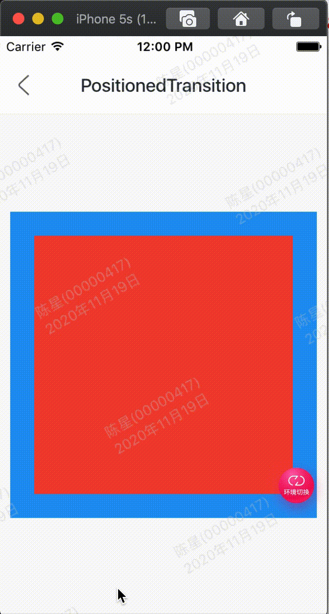

效果：



代码:

```
class GMExamplePositionedTransitionTest extends StatefulWidget {
  GMExamplePositionedTransitionTest({Key key}) : super(key: key);

  @override
  _GMExamplePositionedTransitionTestState createState() =>
      _GMExamplePositionedTransitionTestState();
}

class _GMExamplePositionedTransitionTestState
    extends State<GMExamplePositionedTransitionTest>
    with SingleTickerProviderStateMixin {
  AnimationController _animationController;
  Animation _animation;

  @override
  void initState() {
    _animationController = AnimationController(
      duration: Duration(seconds: 2),
      vsync: this,
    );

    _animation = RelativeRectTween(
      begin: RelativeRect.fromLTRB(10, 10, 10, 10),
      end: RelativeRect.fromLTRB(100, 100, 100, 100),
    ).animate(_animationController);

    //开始动画
    _animationController.forward();

    super.initState();
  }

  @override
  Widget build(BuildContext context) {
    return Container(
      height: 300,
      width: 300,
      color: Colors.blue,
      child: Stack(
        children: <Widget>[
          PositionedTransition(
            rect: _animation,
            child: Container(color: Colors.red),
          ),
        ],
      ),
    );
  }

  @override
  void dispose() {
    _animationController.dispose();

    super.dispose();
  }
}
```