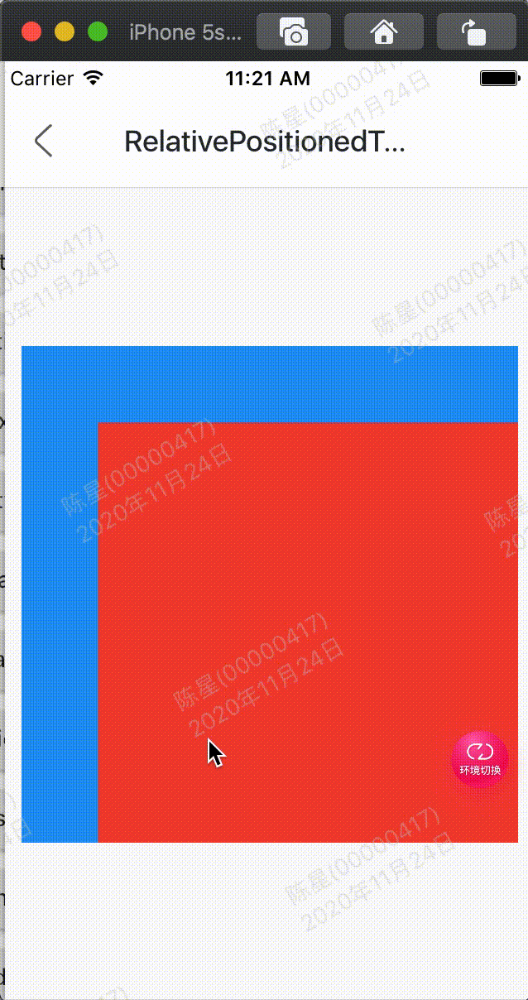

效果：



代码:

```
class GMExampleRelativePositionedTransitionTest extends StatefulWidget {
  GMExampleRelativePositionedTransitionTest({Key key}) : super(key: key);

  @override
  _GMExampleRelativePositionedTransitionTestState createState() =>
      _GMExampleRelativePositionedTransitionTestState();
}

class _GMExampleRelativePositionedTransitionTestState
    extends State<GMExampleRelativePositionedTransitionTest>
    with SingleTickerProviderStateMixin {
  AnimationController _animationController;
  Animation _animation;

  @override
  void initState() {
    _animationController =
        AnimationController(duration: Duration(seconds: 2), vsync: this);

    _animation = RectTween(
      begin: Rect.fromLTRB(10.0, 10.0, 10.0, 10.0),
      end: Rect.fromLTRB(300.0, 300.0, 300.0, 300.0),
    ).animate(_animationController);

    //开始动画
    _animationController.forward();

    super.initState();
  }

  @override
  Widget build(BuildContext context) {
    return Container(
      height: 300,
      width: 300,
      color: Colors.blue,
      child: Stack(
        children: <Widget>[
          RelativePositionedTransition(
            rect: _animation,
            size: Size(0.0, 0.0),
            child: Container(
              color: Colors.red,
            ),
          ),
        ],
      ),
    );
  }

  @override
  void dispose() {
    _animationController.dispose();

    super.dispose();
  }
}
```