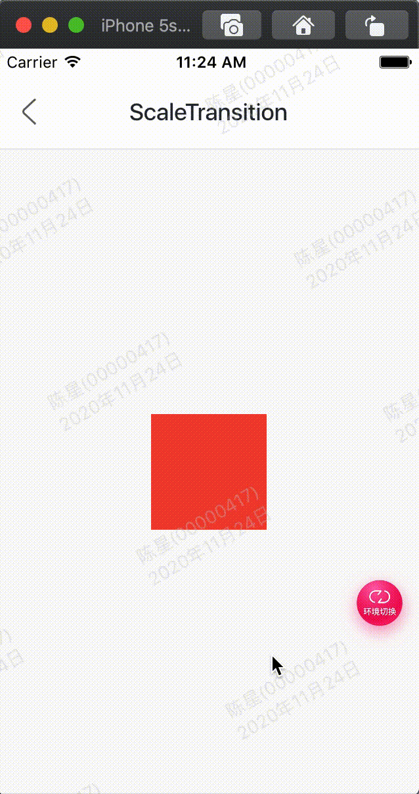

效果：



代码:

```
class GMExampleScaleTransitionTest extends StatefulWidget {
  GMExampleScaleTransitionTest({Key key}) : super(key: key);

  @override
  _GMExampleScaleTransitionTestState createState() =>
      _GMExampleScaleTransitionTestState();
}

class _GMExampleScaleTransitionTestState
    extends State<GMExampleScaleTransitionTest>
    with SingleTickerProviderStateMixin {
  AnimationController _animationController;
  Animation _animation;

  @override
  void initState() {
    _animationController =
        AnimationController(duration: Duration(seconds: 2), vsync: this);

    _animation = Tween(begin: 0.5, end: 0.1).animate(_animationController);

    //开始动画
    _animationController.forward();

    super.initState();
  }

  @override
  Widget build(BuildContext context) {
    return ScaleTransition(
      scale: _animation,
      child: Container(
        height: 200,
        width: 200,
        color: Colors.red,
      ),
    );
  }

  @override
  void dispose() {
    _animationController.dispose();
    super.dispose();
  }
}
```