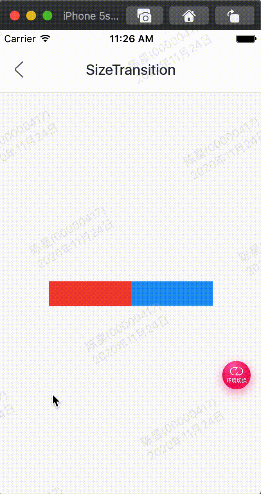

尺寸控件动画，并不是控制子控件的尺寸，而是父控件。

效果：



代码:

```
class GMExampleSizeTransitionTest extends StatefulWidget {
  GMExampleSizeTransitionTest({Key key}) : super(key: key);

  @override
  _GMExampleSizeTransitionTestState createState() =>
      _GMExampleSizeTransitionTestState();
}

class _GMExampleSizeTransitionTestState
    extends State<GMExampleSizeTransitionTest>
    with SingleTickerProviderStateMixin {
  AnimationController _animationController;
  Animation _animation;

  @override
  void initState() {
    _animationController =
        AnimationController(duration: Duration(seconds: 2), vsync: this);

    _animation = Tween(begin: 0.1, end: 1.5).animate(_animationController);

    //开始动画
    _animationController.forward();

    super.initState();
  }

  @override
  Widget build(BuildContext context) {
    return Container(
      color: Colors.blue,
      // height: 200,
      width: 200,
      child: SizeTransition(
        sizeFactor: _animation,
        // axis: Axis.horizontal,
        axis: Axis.vertical,
        child: Container(
          height: 100,
          width: 100,
          color: Colors.red,
        ),
      ),
    );
  }

  @override
  void dispose() {
    _animationController.dispose();
    super.dispose();
  }
}

```