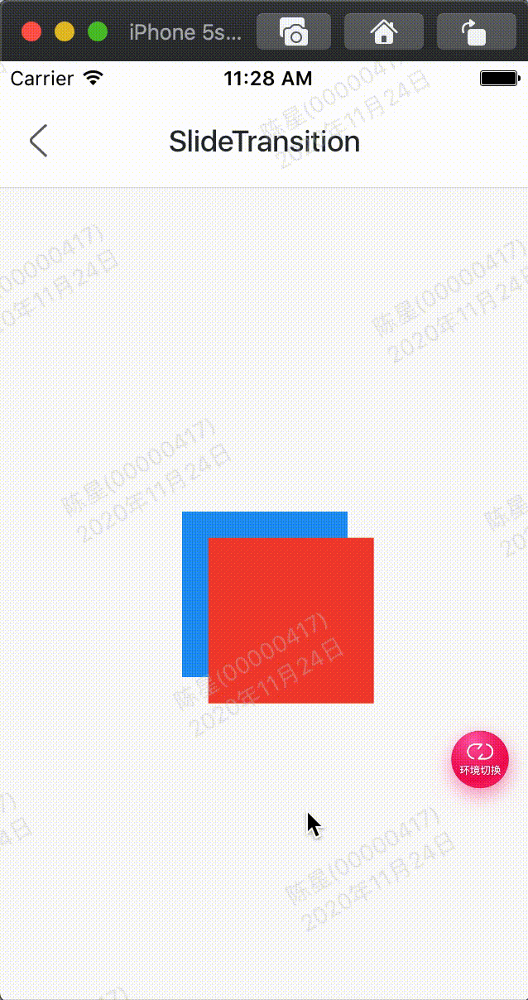

效果：



代码:

```
class GMExampleSlideTransitionTest extends StatefulWidget {
  GMExampleSlideTransitionTest({Key key}) : super(key: key);

  @override
  _GMExampleSlideTransitionTestState createState() =>
      _GMExampleSlideTransitionTestState();
}

class _GMExampleSlideTransitionTestState
    extends State<GMExampleSlideTransitionTest>
    with SingleTickerProviderStateMixin {
  AnimationController _animationController;
  Animation _animation;

  @override
  void initState() {
    _animationController =
        AnimationController(duration: Duration(seconds: 2), vsync: this);
    _animation = Tween(begin: Offset(0.0, 0.0), end: Offset(1.0, 1.0))
        .animate(_animationController);

    //开始动画
    _animationController.forward();

    super.initState();
  }

  @override
  Widget build(BuildContext context) {
    return Container(
      color: Colors.blue,
      height: 100,
      width: 100,
      child: SlideTransition(
        position: _animation,
        child: Container(
          color: Colors.red,
        ),
      ),
    );
  }

  @override
  void dispose() {
    _animationController.dispose();
    super.dispose();
  }
}
```