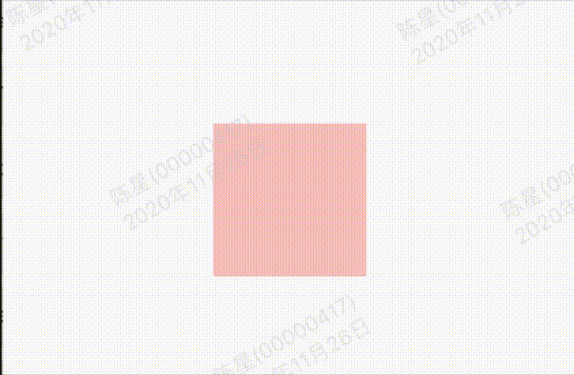

FadeTransition提供了快速构建渐隐渐显动画的组件

效果：



代码:

```
class GMExampleFadeTransitionTest extends StatefulWidget {
  GMExampleFadeTransitionTest({Key key}) : super(key: key);

  @override
  _GMExampleFadeTransitionTestState createState() =>
      _GMExampleFadeTransitionTestState();
}

class _GMExampleFadeTransitionTestState
    extends State<GMExampleFadeTransitionTest>
    with SingleTickerProviderStateMixin {
  AnimationController _animationController;
  Animation<double> _animation;

  @override
  void initState() {
    _animationController =
        AnimationController(duration: Duration(seconds: 1), vsync: this);

    _animation = Tween(begin: 0.0, end: 1.0).animate(_animationController);

    //开始动画
    _animationController.forward();

    super.initState();
  }

  @override
  Widget build(BuildContext context) {
    return Center(
      child: FadeTransition(
        opacity: _animation,
        child: Container(
          color: Colors.red,
          width: 100,
          height: 100,
        ),
      ),
    );
  }

  @override
  void dispose() {
    _animationController.dispose();
    super.dispose();
  }
}
```