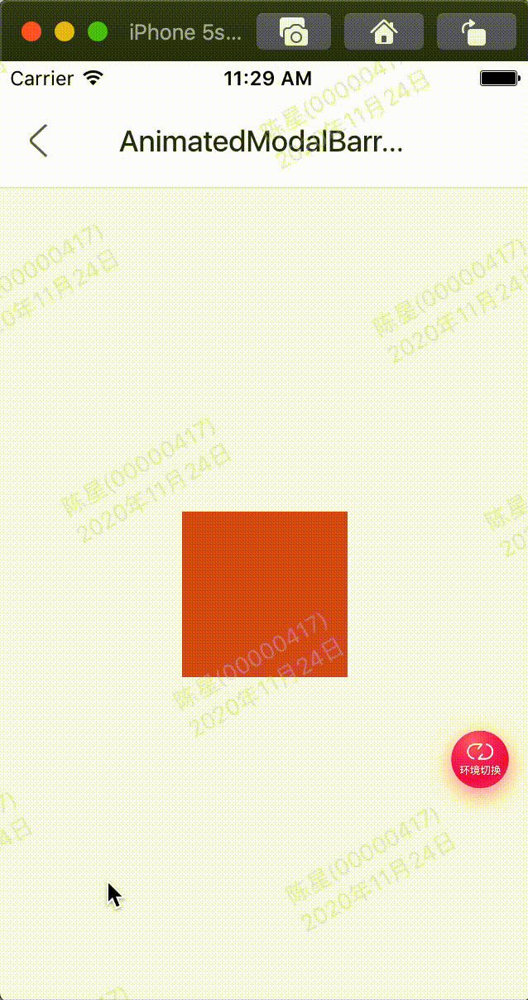

效果：



代码:

```
class GMExampleAnimatedModalBarrierTest extends StatefulWidget {
  GMExampleAnimatedModalBarrierTest({Key key}) : super(key: key);

  @override
  _GMExampleAnimatedModalBarrierTestState createState() =>
      _GMExampleAnimatedModalBarrierTestState();
}

class _GMExampleAnimatedModalBarrierTestState
    extends State<GMExampleAnimatedModalBarrierTest>
    with SingleTickerProviderStateMixin {
  AnimationController _animationController;
  Animation _animation;

  @override
  void initState() {
    _animationController =
        AnimationController(duration: Duration(seconds: 2), vsync: this);

    _animation = ColorTween(begin: Colors.red, end: Colors.blue)
        .animate(_animationController);

    //开始动画
    _animationController.forward();

    super.initState();
  }

  @override
  Widget build(BuildContext context) {
    return Center(
      child: Container(
        height: 100,
        width: 100,
        child: AnimatedModalBarrier(
          color: _animation,
        ),
      ),
    );
  }

  @override
  void dispose() {
    _animationController.dispose();
    super.dispose();
  }
}
```