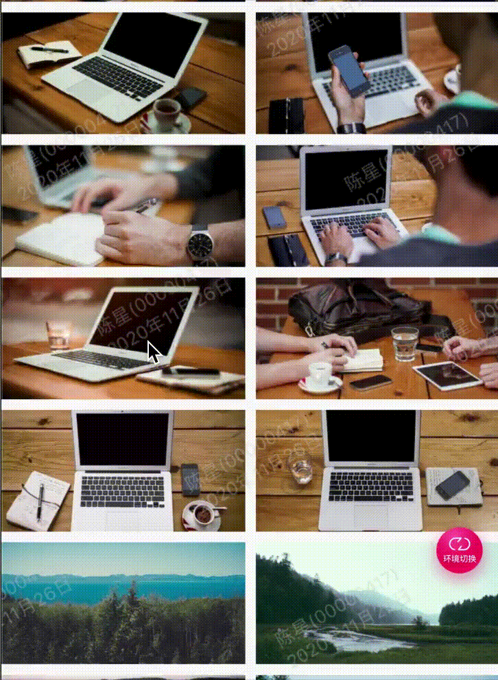

效果：



代码:

```
import 'package:flutter/material.dart';
import 'package:gm_staff_module/demo/example/example_common.dart';

///hero动画
class GMExampleAnimationHeroPage extends StatefulWidget {
  GMExampleAnimationHeroPage({Key key}) : super(key: key);

  @override
  _GMExampleAnimationHeroPageState createState() =>
      _GMExampleAnimationHeroPageState();
}

class _GMExampleAnimationHeroPageState
    extends State<GMExampleAnimationHeroPage> {
  @override
  Widget build(BuildContext context) {
    return Scaffold(
      appBar: example_common_appBar(context, "Hero动画"),
      body: _buildContent(context),
    );
  }

  Widget _buildContent(ctx) {
    return GridView(
      gridDelegate: SliverGridDelegateWithFixedCrossAxisCount(
          crossAxisCount: 2,
          crossAxisSpacing: 8,
          mainAxisSpacing: 8,
          childAspectRatio: 2),
      children: List.generate(20, (index) {
        String imageURL = "https://picsum.photos/id/$index/400/200";
        return GestureDetector(
          onTap: () {
            Navigator.of(ctx).push(PageRouteBuilder(pageBuilder:
                (BuildContext context, Animation<double> animation,
                    Animation<double> secondaryAnimation) {           
              return FadeTransition(
                opacity: animation,
                child: GMExampleAnimationHeroDetailPage(
                  imageURL: imageURL,
                ),
              );
            }));
          },
          child: Hero(
            tag: imageURL,
            child: Image.network(imageURL),
          ),
        );
      }),
    );
  }
}

///图片详情页
class GMExampleAnimationHeroDetailPage extends StatelessWidget {
  final String imageURL;
  GMExampleAnimationHeroDetailPage({Key key, this.imageURL}) : super(key: key);

  @override
  Widget build(BuildContext context) {
    return Scaffold(
      backgroundColor: Colors.black,
      body: Center(
        child: GestureDetector(
          onTap: () {
            Navigator.of(context).pop();
          },
          child: Hero(
            tag: this.imageURL,
            child: Image.network(
              this.imageURL,
              width: double.infinity,
              fit: BoxFit.cover,
            ),
          ),
        ),
      ),
    );
  }
}

```