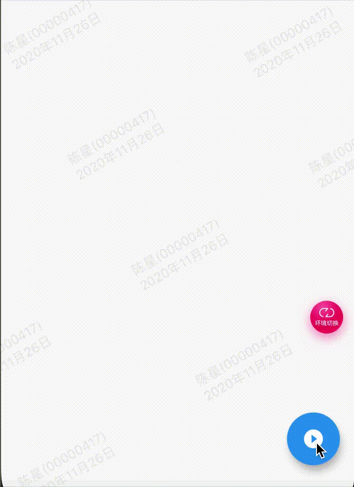

效果：



代码:

```
import 'dart:math';

import 'package:flutter/material.dart';
import 'package:gm_staff_module/demo/example/example_common.dart';

//交织动画
class GMExampleAnimationMixedPage extends StatefulWidget {
  GMExampleAnimationMixedPage({Key key}) : super(key: key);

  @override
  _GMExampleAnimationMixedPageState createState() =>
      _GMExampleAnimationMixedPageState();
}

class _GMExampleAnimationMixedPageState
    extends State<GMExampleAnimationMixedPage> {
  final GlobalKey<_AnimationDemo02State> demo02Key = GlobalKey();

  @override
  Widget build(BuildContext context) {
    debugPrint("GMExampleAnimationMixedPage  build ----  ");
    return Scaffold(
      appBar: example_common_appBar(context, "交织动画"),
      body: _buildContent(context),
      floatingActionButton: FloatingActionButton(
        child: Icon(Icons.play_circle_filled),
        onPressed: () {
          if (!this.demo02Key.currentState.controller.isAnimating) {
            demo02Key.currentState.controller.forward();
          } else {
            demo02Key.currentState.controller.stop();
          }
        },
      ),
    );
  }

  Widget _buildContent(ctx) {
    print("_buildContent ----------");
    return AnimationDemo02(key: demo02Key);
  }
}

class AnimationDemo02 extends StatefulWidget {
  AnimationDemo02({Key key}) : super(key: key);

  @override
  _AnimationDemo02State createState() => _AnimationDemo02State();
}

class _AnimationDemo02State extends State<AnimationDemo02>
    with SingleTickerProviderStateMixin {
  AnimationController controller;
  Animation<double> animation;
  Animation<Color> colorAnim;
  Animation<double> sizeAnim;
  Animation<double> rotationAnim;

  @override
  void initState() {
    super.initState();

    //1.创建AnimationController
    controller =
        AnimationController(duration: Duration(seconds: 2), vsync: this);

    //2.动画添加Curve效果
    animation = CurvedAnimation(parent: controller, curve: Curves.easeIn);

    //3.监听动画
    animation.addListener(() {
      setState(() {});
    });

    animation.addStatusListener((AnimationStatus status) {
      if (status == AnimationStatus.completed) {
        controller.reverse();
      } else if (status == AnimationStatus.dismissed) {
        controller.forward();
      }
    });

    //4.设置值的变化
    colorAnim =
        ColorTween(begin: Colors.blue, end: Colors.red).animate(controller);
    sizeAnim = Tween(begin: 0.0, end: 200.0).animate(controller);
    rotationAnim = Tween(begin: 0.0, end: 2 * pi).animate(controller);
  }

  @override
  Widget build(BuildContext context) {
    debugPrint("_AnimationDemo02State  build ----  ");
    return Center(
      child: AnimatedBuilder(
        animation: animation,
        builder: (BuildContext context, Widget child) {
          return Opacity(
            opacity: animation.value,
            child: Transform(
              alignment: Alignment.center,
              transform: Matrix4.rotationZ(rotationAnim.value),
              child: Container(
                width: sizeAnim.value,
                height: sizeAnim.value,
                color: colorAnim.value,
                alignment: Alignment.center,
              ),
            ),
          );
        },
      ),
    );
  }

  @override
  void dispose() {
    controller.dispose();
    super.dispose();
  }
}

```