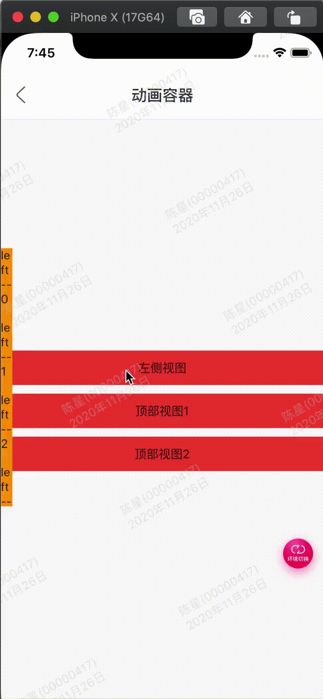

效果：



代码:

```
import 'package:flutter/material.dart';

import 'package:flutter/material.dart';
import 'package:gm_staff_module/demo/example/example_common.dart';

///动画容器
class GMExampleAnimationContainerPage extends StatefulWidget {
  GMExampleAnimationContainerPage({Key key}) : super(key: key);

  @override
  _GMExampleAnimationContainerPageState createState() =>
      _GMExampleAnimationContainerPageState();
}

class _GMExampleAnimationContainerPageState
    extends State<GMExampleAnimationContainerPage> {
  double leftWidth = 0;
  double topHeight1 = 0;
  double topHeight2 = 0;

  bool isLeftFlag = false;
  bool isTopFlag1 = false;
  bool isTopFlag2 = false;

  @override
  Widget build(BuildContext context) {
    return Scaffold(
      body: Stack(
        children: <Widget>[
          Scaffold(
            appBar: example_common_appBar(context, "动画容器"),
            body: _buildContent(context),
          ),
          _buildContent_topView1(),
        ],
      ),
    );
  }

  Widget _buildContent(ctx) {
    return Stack(
      children: <Widget>[
        _buildContent_dataView(),
        _buildContent_leftView(),
        _buildContent_topView2(),
      ],
    );
  }

  //数据视图
  Widget _buildContent_dataView() {
    return Column(
      crossAxisAlignment: CrossAxisAlignment.center,
      mainAxisAlignment: MainAxisAlignment.center,
      children: <Widget>[
        GestureDetector(
          child: Container(
            width: double.infinity,
            height: 40,
            color: Colors.red,
            alignment: Alignment.center,
            child: Text("左侧视图"),
          ),
          onTap: () {
            this.isLeftFlag = !this.isLeftFlag;
            if (this.isLeftFlag) {
              this.leftWidth = 200;
            } else {
              this.leftWidth = 0;
            }
            setState(() {});
          },
        ),
        SizedBox(
          height: 10,
        ),
        GestureDetector(
          child: Container(
            width: double.infinity,
            height: 40,
            color: Colors.red,
            alignment: Alignment.center,
            child: Text("顶部视图1"),
          ),
          onTap: () {
            this.isTopFlag1 = !this.isTopFlag1;
            if (this.isTopFlag1) {
              this.topHeight1 = 200;
            } else {
              this.topHeight1 = 0;
            }
            setState(() {});
          },
        ),
        SizedBox(
          height: 10,
        ),
        GestureDetector(
          child: Container(
            width: double.infinity,
            height: 40,
            color: Colors.red,
            alignment: Alignment.center,
            child: Text("顶部视图2"),
          ),
          onTap: () {
            this.isTopFlag2 = !this.isTopFlag2;
            if (this.isTopFlag2) {
              this.topHeight2 = 200;
            } else {
              this.topHeight2 = 0;
            }
            setState(() {});
          },
        ),
      ],
    );
  }

  //左侧视图
  Widget _buildContent_leftView() {
    return Positioned(
      top: 150,
      left: 0,
      child: AnimatedContainer(
        duration: Duration(milliseconds: 250),
        width: leftWidth,
        height: 300,
        child: Container(
          width: 200,
          color: Colors.orange,
          alignment: Alignment.center,
          child: ListView.separated(
              itemBuilder: (BuildContext ctx, int index) {
                return Text("left -- $index");
              },
              separatorBuilder: (BuildContext ctx, int index) {
                return Divider(color: Colors.grey,);
              },
              itemCount: 30),
        ),
      ),
    );
  }

  //顶部视图1
  Widget _buildContent_topView1() {
    return Positioned(
      top: 0,
      left: 0,
      child: AnimatedContainer(
        duration: Duration(milliseconds: 250),
        width: MediaQuery.of(context).size.width,
        height: this.topHeight1,
        child: Container(
          width: 200,
          height: 200,
          color: Colors.blue,
          alignment: Alignment.center,
        ),
      ),
    );
  }
  //顶部视图2
  Widget _buildContent_topView2() {
    return Positioned(
      top: 0,
      left: 0,
      child: AnimatedContainer(
        duration: Duration(milliseconds: 250),
        width: MediaQuery.of(context).size.width,
        height: this.topHeight2,
        child: Container(
          width: 200,
          height: 200,
          color: Colors.purple,
          alignment: Alignment.center,
        ),
      ),
    );
  }
}

```