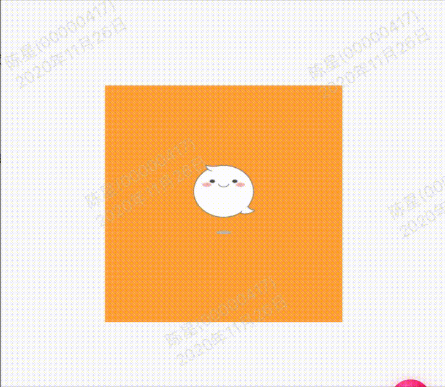

效果：



代码:

```
import 'package:flutter/material.dart';

import '../example_common.dart';

///一组图片动画
class GMExampleAnimationGroupImagePage extends StatefulWidget {
  GMExampleAnimationGroupImagePage({Key key}) : super(key: key);

  @override
  _GMExampleAnimationGroupImagePageState createState() => _GMExampleAnimationGroupImagePageState();
}

class _GMExampleAnimationGroupImagePageState extends State<GMExampleAnimationGroupImagePage> {
  @override
  Widget build(BuildContext context) {
    debugPrint("build ---------");
    return Scaffold(
      appBar: example_common_appBar(context, "一组图片动画"),
      body: Center(
        child: Container(
          child: _buildContent(context),
          height: 200,
          width: 200,
          color: Colors.orangeAccent,
          padding: EdgeInsets.all(30.0),
        ),
      ),
    );
  }

  Widget _buildContent(ctx) {
    return GMExampleImagesAnimation(
      w: 100,
      h: 100,
      entry: ImagesAnimationEntry(1, 7, "assets/images/example_ani_0"),
    );
  }
}

class GMExampleImagesAnimation extends StatefulWidget {
  final double w;
  final double h;
  final ImagesAnimationEntry entry;
  final int durationMilliseconds;

  GMExampleImagesAnimation(
      {Key key, this.w: 80, this.h: 80, this.entry, this.durationMilliseconds: 700})
      : super(key: key);

  @override
  _GMExampleImagesAnimationState createState() =>
      _GMExampleImagesAnimationState();
}

class _GMExampleImagesAnimationState extends State<GMExampleImagesAnimation>
    with TickerProviderStateMixin {
  AnimationController _controller;
  Animation<int> _animation;

  @override
  void initState() {
    super.initState();

    _controller = AnimationController(
        vsync: this, duration: Duration(milliseconds: this.widget.durationMilliseconds))
      ..repeat();

    _animation =
        new IntTween(begin: widget.entry.lowIndex, end: widget.entry.highIndex)
            .animate(_controller);
  }

  @override
  void dispose() {
    _controller.dispose();
    super.dispose();
  }

  @override
  Widget build(BuildContext context) {
    return AnimatedBuilder(
      animation: _animation,
      builder: (BuildContext ctx, Widget child) {
        String frame = _animation.value.toString();
        return Image.asset(
          this.widget.entry.basePath + frame + ".png",
          gaplessPlayback: true, //避免图片闪烁
          width: widget.w,
          height: widget.h,
        );
      },
    );
  }
}


class ImagesAnimationEntry {
  int lowIndex = 0;
  int highIndex = 0;
  String basePath;

  ImagesAnimationEntry(this.lowIndex, this.highIndex, this.basePath);
}


```
