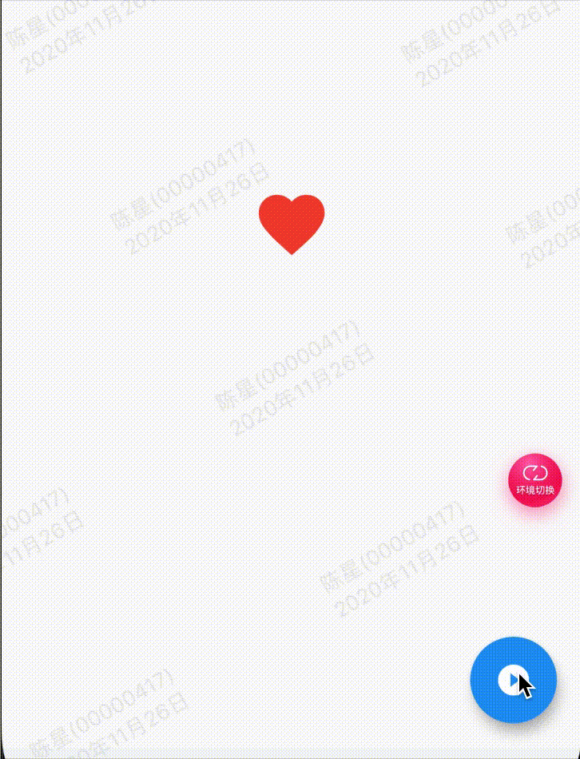

效果：



代码:

```
import 'package:flutter/material.dart';
import 'package:gm_staff_module/demo/example/example_common.dart';

//简单动画
class GMExampleAnimationSimplePage extends StatefulWidget {
  GMExampleAnimationSimplePage({Key key}) : super(key: key);

  @override
  _GMExampleAnimationSimplePageState createState() =>
      _GMExampleAnimationSimplePageState();
}

class _GMExampleAnimationSimplePageState
    extends State<GMExampleAnimationSimplePage> {
  final GlobalKey<_AnimationDemo01State> demo01Key = GlobalKey();

  @override
  Widget build(BuildContext context) {
    return Scaffold(
      appBar: example_common_appBar(context, "简单动画"),
      body: _buildContent(context),
      floatingActionButton: FloatingActionButton(
        child: Icon(Icons.play_circle_filled),
        onPressed: () {
          if (!this.demo01Key.currentState.controller.isAnimating) {
            demo01Key.currentState.controller.forward();
          } else {
            demo01Key.currentState.controller.stop();
          }
        },
      ),
    );
  }

  Widget _buildContent(ctx) {
    return AnimationDemo01(
      key: demo01Key,
    );
  }
}

class AnimationDemo01 extends StatefulWidget {
  AnimationDemo01({Key key}) : super(key: key);

  @override
  _AnimationDemo01State createState() => _AnimationDemo01State();
}

class _AnimationDemo01State extends State<AnimationDemo01>
    with SingleTickerProviderStateMixin {
  AnimationController controller;
  Animation<double> animation;

  @override
  void initState() {
    super.initState();

    //1.创建AnimationController
    controller =
        AnimationController(duration: Duration(seconds: 1), vsync: this);

    //2.动画添加Curve效果
    animation = CurvedAnimation(
        parent: controller,
        curve: Curves.elasticInOut,
        reverseCurve: Curves.easeOut);

    // //3.监听动画
    // animation.addListener(() {
    //   print("addListener ...");
    //   setState(() {});
    // });

    //4.控制动画的翻转
    animation.addStatusListener((status) {
      print("addStatusListener -- $status");
      if (status == AnimationStatus.completed) {
        controller.reverse();
      } else if (status == AnimationStatus.dismissed) {
        controller.forward();
      }
    });

    //5.设置值的范围
    animation = Tween(begin: 50.0, end: 120.0).animate(controller);
  }

  @override
  Widget build(BuildContext context) {
    return Center(
      child: AnimatedBuilder(
        animation: animation,
        builder: (ctx, child) {
          return Icon(
            Icons.favorite,
            color: Colors.red,
            size: animation.value,
          );
        },
        // child: Container(),
      ),
    );
  }

  @override
  void dispose() {
    controller.dispose();
    super.dispose();
  }
}

class IconAnimation extends AnimatedWidget {
  IconAnimation(Animation animation) : super(listenable: animation);
  @override
  Widget build(BuildContext context) {
    Animation animation = listenable;
    print("IconAnimation -- ${animation.value}");
    return Icon(
      Icons.favorite,
      color: Colors.red,
      size: animation.value,
    );
  }
}

```