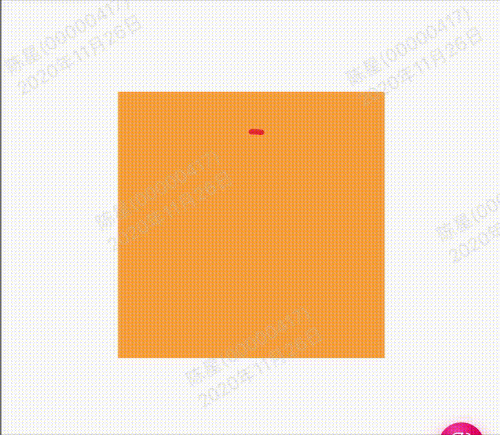

效果：



代码:

```
import 'package:flutter/material.dart';
import 'dart:math' as math;

import '../example_common.dart';

class GMExampleAnimationRingPage extends StatefulWidget {
  GMExampleAnimationRingPage({Key key}) : super(key: key);

  @override
  _GMExampleAnimationRingPageState createState() => _GMExampleAnimationRingPageState();
}

class _GMExampleAnimationRingPageState extends State<GMExampleAnimationRingPage> with SingleTickerProviderStateMixin{
  AnimationController _controller;

  Animation<double> angleAnim;

  @override
  void initState() {
    // _controller = AnimationController(duration: Duration(milliseconds: 1500), vsync: this)..repeat();
    _controller =
        AnimationController(duration: Duration(milliseconds: 1500), vsync: this)
          ..repeat();

    angleAnim = Tween(begin: math.pi * 1.5, end: math.pi * 3.5)
        .chain(CurveTween(curve: Interval(0.5, 1.0)))
        .animate(_controller);

    super.initState();
  }

  @override
  void dispose() {
    _controller.dispose();
    super.dispose();
  }

  @override
  Widget build(BuildContext context) {
    debugPrint("build ---------");
    return Scaffold(
      appBar: example_common_appBar(context, "环形动画"),
      body: Center(
        child: Container(
          child: _buildContent(context),
          height: 200,
          width: 200,
          color: Colors.orangeAccent,
          padding: EdgeInsets.all(30.0),
        ),
      ),
      floatingActionButton: FloatingActionButton(
        child: Icon(Icons.account_balance),
        onPressed: () {
          debugPrint("status: ${_controller.status}");
          if (_controller.status == AnimationStatus.forward) {
            _controller.fling();
          } else {
            _controller.reset();
            _controller..forward()..repeat();
          }
        },
      ),
    );
  }

  Widget _buildContent(ctx) {
    return AnimatedBuilder(
      animation: _controller,
      builder: (context, child) {
        return CustomPaint(
          painter: GMExampleRingDemoPainter(angleAnim.value, math.sin(_controller.value * math.pi) * math.pi),
        );
      },
    );
  }
}

//自定义绘画
class GMExampleRingDemoPainter extends CustomPainter {
  final double _arcStart;
  final double _arcSweep;

  GMExampleRingDemoPainter(this._arcStart, this._arcSweep);

  @override
  void paint(Canvas canvas, Size size) {
    // debugPrint("_arcStart: $_arcStart, _arcSweep:$_arcSweep");
    //找到最小的一边
    double side = math.min(size.width, size.height);

    Paint paint = Paint()
      ..color = Colors.red
      ..strokeCap = StrokeCap.round
      ..strokeWidth = 4.0
      ..style = PaintingStyle.stroke;

    canvas.drawArc(
        Offset.zero & Size(side, side), _arcStart, _arcSweep, false, paint);
    
  }

  @override
  bool shouldRepaint(GMExampleRingDemoPainter other) {
    return _arcStart != other._arcStart || _arcSweep != other._arcSweep;
  }
}

```