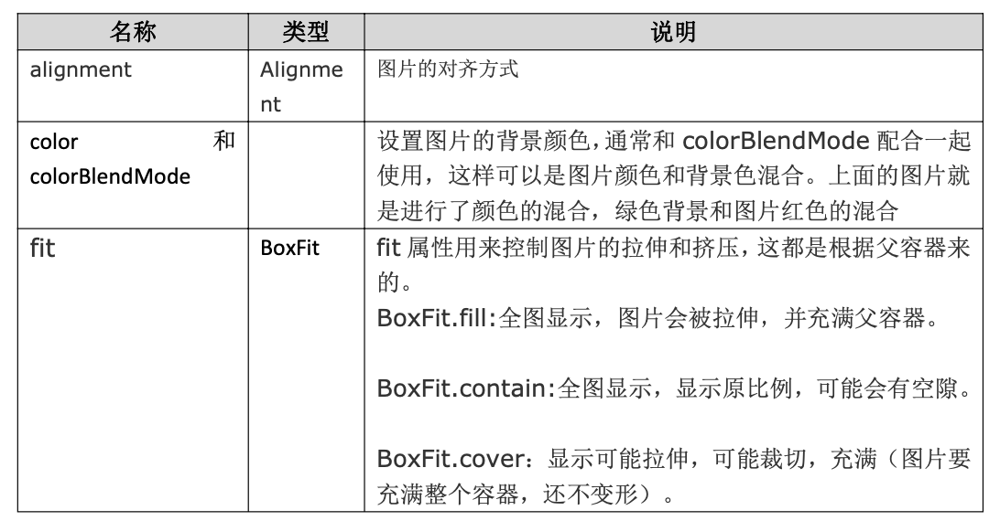
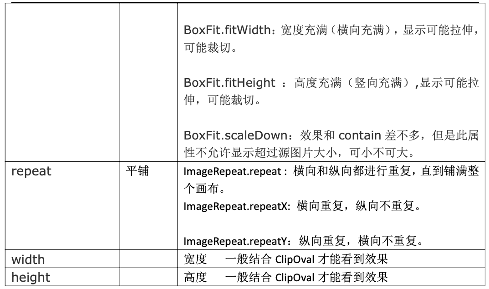
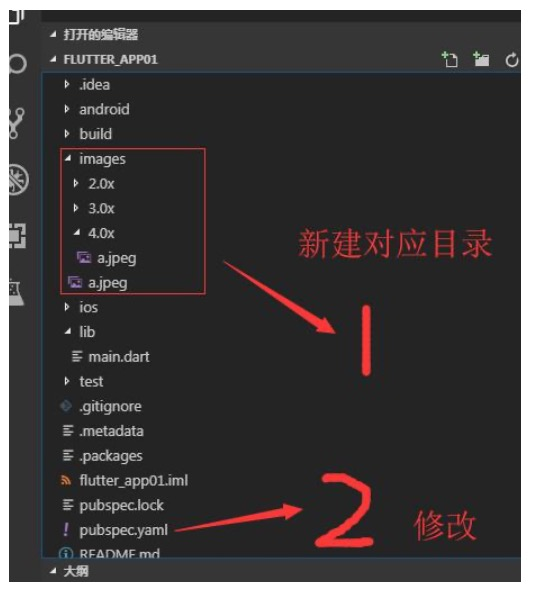
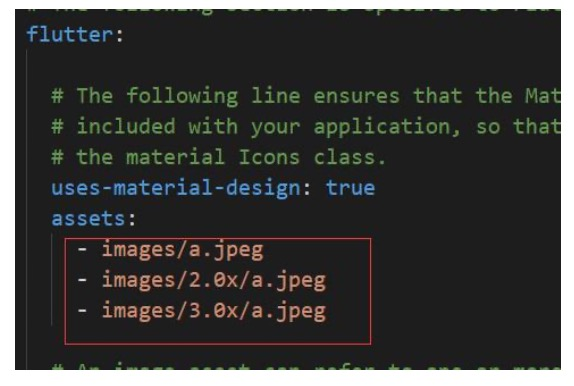

# 一、Flutter 图片组件

图片组件是显示图像的组件，Image 组件有很多构造函数，这里我们只给大家讲两个

 - Image.asset， 本地图片 
 - Image.network 远程图片

Image 组件的常用属性:





```
return Center(
  child: Container(
    child: Image.network(
      "http://pic.baike.soso.com/p/20130828/20130828161137-1346445960.jpg",
      alignment: Alignment.topLeft,
      color: Colors.red,
      colorBlendMode: BlendMode.colorDodge, // repeat: ImageRepeat.repeatX,
      fit: BoxFit.cover,
    ),
    width: 300.0,
    height: 400.0,
    decoration: BoxDecoration(color: Colors.yellow),
  ),
);

```

# 二、Flutter 引入本地图片



然后，打开 pubspec.yaml 声明一下添加的图片文件，注意要配置对



最后，在代码中就可以用了

```
child: Container(
  child: Image.asset("images/a.jpeg", fit:BoxFit.cover ),
  width: 300.0,
  height: 300.0,
  decoration: BoxDecoration(
    color: Colors.yellow 
  ),
)
```

# 三、Flutter 实现圆角以及实现圆形图片

### 1， 实现圆角图片

```
return Center(
  child: Container(
    width: 300.0,
    height: 300.0,
    decoration: BoxDecoration(
      color: Colors.yellow,
      borderRadius: BorderRadius.circular(150), image: DecorationImage(
        image: new NetworkImage('https://www.itying.com/images/201905/thumb_img/1101_thumb_G_15578 45381862.jpg'),
        fit: BoxFit.cover 
      )
    ), 
  ),
);
```

### 2，实现圆形图片

```
return Center(
	child: Container(
	  child:ClipOval(
	    child:Image.network("https://www.itying.com/images/201905/thumb_img/1101_thumb_G_1557845381862.jpg", 
	      width: 150.0,
	      height: 150.0, 
	    ),
	  )
	), 
);
```

# 四、Vscode 调试 Flutter 项目

1、Vscode 中打开 flutter 项目进行开发

2、运行 Flutter 项目

```
flutter run
```


- r 键:点击后热加载，也就算是重新加载吧。
- p 键:显示网格，这个可以很好的掌握布局情况，工作中很有用。 
- o 键:切换 android 和 ios 的预览模式。
- q 键:退出调试预览模式。

3、Vscode 默认连不上第三方模拟器解决方案

cd 到对应夜神模拟器 D:\Program Files\Nox\bin 目录 然后运行

```
nox_adb.exe connect 127.0.0.1:62001
```