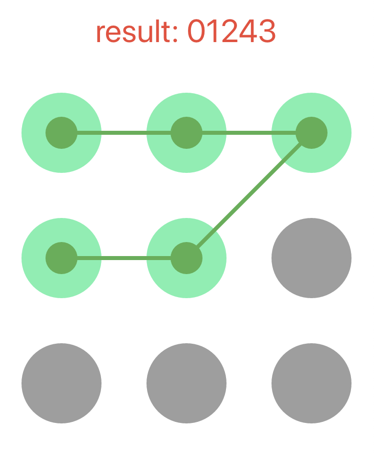

效果图：




代码：

```
import 'dart:async';
import 'dart:ui';
import 'package:flutter/material.dart';
class GesturePWDPage extends StatefulWidget {
  GesturePWDPage({Key key}) : super(key: key);

  @override  _GesturePWDPageState createState() => _GesturePWDPageState();
}
class _GesturePWDPageState extends State<GesturePWDPage> {
  String password = "";
  @override
  Widget build(BuildContext context) {
    return Scaffold(
      appBar: AppBar(
        title: Text("test"),
      ),
      body: Column(
        children: <Widget>[
          SizedBox(height: 20,),
          Text("result: $password",style: TextStyle(color: Colors.red,fontSize: 32),),
          SizedBox(height: 20,),
          Container(
            color: Colors.white,
            alignment: Alignment.center,
            child: GesturePwdModel(
              width: MediaQueryData.fromWindow(window).size.width,
              height: MediaQueryData.fromWindow(window).size.width,
              onSuccess: (value) {
                setState(() {
                  password = value;
                });
              },
              onError: () {
                setState(() {
                  password = "密码长度小于4位";
                });
              },
            ),
          )
        ],
      )
    );
  }
}

/* 手势密码 */
class GesturePwdModel extends StatefulWidget {
  final double width;
  final double height;
  final Color unSelectedColor;
  final Color selectedColor;
  final Color selectedCenterColor;
  final double circleSize;
  final double circleCenterSize;
  final Color lineColor;
  final double lineWidth;
  final ValueChanged<String> onSuccess;
  final VoidCallback onError;
  final int minLineLength;
  final int showTimes;

  GesturePwdModel({Key key,
    this.width,
    this.height,
    this.unSelectedColor = Colors.grey,
    this.selectedColor = Colors.greenAccent,
    this.selectedCenterColor = Colors.green,
    this.circleSize = 40.0,
    this.circleCenterSize = 16.0,
    this.lineColor = Colors.green,
    this.lineWidth = 4.0,
    this.minLineLength = 4,
    this.showTimes = 1000,
    @required this.onSuccess,
    this.onError
  }): super(key: key);

  @override
  _GesturePwdModelState createState() => _GesturePwdModelState();
}

class _GesturePwdModelState extends State<GesturePwdModel> {
  List<Circle> circleList = []; //每个的圆心
  List<Circle> lineList = [];  //连线的拐点
  Offset nowMoveXY;
  Timer _timer;

  @override
  void initState() {
    /* 确定九个点的圆心 */
    double width = widget.width??MediaQueryData.fromWindow(window).size.width;
    double itemWidthHalf = width / 6;
    double height = widget.height??MediaQueryData.fromWindow(window).size.width;
    double itemHeightHalf = height / 6;    //每个圆的中心点
    for (int i = 0; i < 9; i++) {
      double coordinateX = (2 * (i % 3) + 1) * itemWidthHalf;  //x为2n-1的位置
      double coordinateY = (2 * ((i ~/ 3)) +1) * itemHeightHalf;
      circleList.add(Circle(Offset(coordinateX, coordinateY),i));
    }
    super.initState();  
  }

  /* 手指按下或移动 */
  headDownOrMove(details) {
    setState(() {
      RenderBox box = context.findRenderObject();
      nowMoveXY = box.globalToLocal(details.globalPosition);
      if (nowMoveXY.dy < 0) {
        nowMoveXY = Offset(nowMoveXY.dx, 0.0);
      }
      if (nowMoveXY.dy > widget.height) {
        nowMoveXY = Offset(nowMoveXY.dx, widget.height);
      }
      for (var i = 0; i < circleList.length; i++) {
        Offset cross = nowMoveXY - circleList[i].offset;
        if(!circleList[i].isSelected){
          if (cross.dx.abs() < (widget.circleSize??40.0) / 2 &&
             cross.dy.abs() < (widget.circleSize??40.0) / 2) {
            circleList[i].isSelected = true;
            lineList.add(circleList[i]);
            if(lineList.length == 9){
              successBack();
            }
          }
        }
      }
    });
  }

  /* 松手指或者连接9个回调 */
  successBack() {
    if(lineList.length < widget.minLineLength){
      widget.onError != null?widget.onError():print(lineList.length);
    }else{
      String result = "";
      for (int i = 0; i < lineList.length; i++) {
        result += "${lineList[i].index}";
      }
      widget.onSuccess(result);
    }
    startTimer();
  }

  startTimer() {
    _timer = Timer.periodic(Duration(milliseconds: widget.showTimes), (timer){
      setState(() {
        lineList.clear();
        circleList.forEach((element) {
          element.isSelected = false;
        });
      });
      timer.cancel();
    });
  }

  @override  void dispose() {
    if(_timer != null){
      _timer.cancel();
    }
    super.dispose();
  }

  @override
  Widget build(BuildContext context) {
    return GestureDetector(
      onPanDown: (DragDownDetails details) {
        headDownOrMove(details);
      },
      onPanUpdate: (DragUpdateDetails details) {
        if(lineList.length < 9){
          headDownOrMove(details);
        }
      },
      onPanEnd: (DragEndDetails details) {
        successBack();
      },
      child: CustomPaint(
        size: Size(widget.width??MediaQuery.of(context).size.width, widget.height??MediaQuery.of(context).size.width),
        painter: MyPainter(
          circleList,
          lineList,
          nowMoveXY,
          unSelectedColor: widget.unSelectedColor,
          selectedColor: widget.selectedColor,
          selectedCenterColor: widget.selectedCenterColor,
          circleSize: widget.circleSize,
          circleCenterSize: widget.circleCenterSize,
          lineColor: widget.lineColor,
          lineWidth: widget.lineWidth,
        ),
      )
    );
  }
}

class MyPainter extends CustomPainter {
  List<Circle> circleList;
  List<Circle> lineList;
  Color unSelectedColor;  //未选中颜色
  Color selectedColor;  //选中圆的颜色
  Color selectedCenterColor;  //选中圆心颜色
  double circleSize;  //圆宽度
  double circleCenterSize;  //圆心宽度
  Color lineColor;  //线颜色
  double lineWidth;  //线宽度
  Offset nowMoveXY;  //现在的手指位置

  MyPainter(
    this.circleList,
    this.lineList,
    this.nowMoveXY,
    {
      this.unSelectedColor,
      this.selectedColor,
      this.selectedCenterColor,
      this.circleSize,
      this.circleCenterSize,
      this.lineColor,
      this.lineWidth,
    }
  );

  @override
  void paint(Canvas canvas, Size size) {

    /* 未选中 */    
    var unSelectPanint = Paint()
      ..style = PaintingStyle.fill
      ..color = unSelectedColor;

    /* 选中颜色 */
    var selectPanint = Paint()
      ..style = PaintingStyle.fill
      ..color = selectedColor;

    /* 选中圆心颜色 */
    var selectCenterPanint = Paint()
      ..style = PaintingStyle.fill
      ..color = selectedCenterColor;

    //线
    final linePaint = new Paint()
      ..color = lineColor
      ..style = PaintingStyle.fill
      ..strokeWidth = lineWidth;

    //画圆    
    for (int i = 0; i < circleList.length; i++) {
      Circle circle = circleList[i];
      if(circle.isSelected){
        canvas.drawCircle(circle.offset, circleSize, selectPanint);
        canvas.drawCircle(circle.offset, circleCenterSize, selectCenterPanint);
      }else{
        canvas.drawCircle(circle.offset, circleSize, unSelectPanint);
      }
    }
    /* 画线 */
    if (lineList.length > 0) {
      for (int i = 0; i < lineList.length; i++) {
        canvas.drawLine(
          lineList[i].offset,
           i == lineList.length - 1 ? nowMoveXY : lineList[i + 1].offset,
          linePaint
        );
      }
    }
  }

  @override
  bool shouldRepaint(CustomPainter oldDelegate) => true;}

class Circle{
  Offset offset; //(x,y)
  bool isSelected = false; //是否被选中
  int index;  //第几个小圆点

  Circle(this.offset, this.index);
}

```
