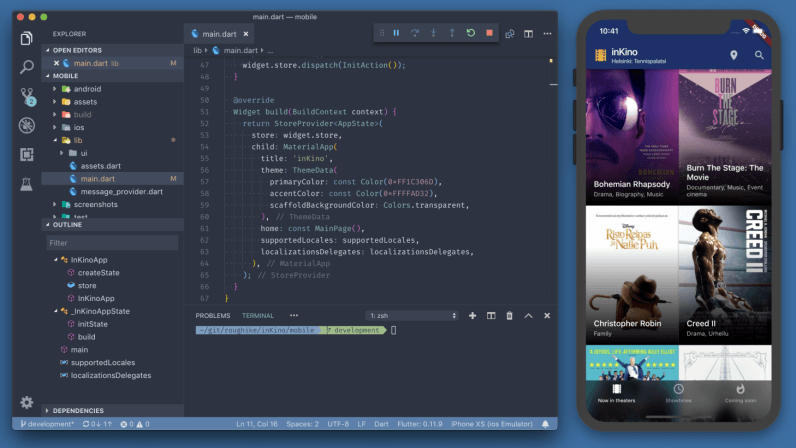

# 一. 认识Flutter

### 1.1. 什么是Flutter ?

Flutter就是一个UI开发工具包，可以开发各个平台，但是目前最活跃的地方依然 移动平台，虽然他也支持Web、桌面，甚至也将是Google Fuchsia下开发应用的主要工具。
但是现在，它只是活跃于移动端。

那么，目前移动平台主要有哪些呢？没错，iOS、Android！

于是，我们可以简单概述一下Flutter：

Flutter目前被应用最广泛的就是作为iOS、Android跨平台解决方案，而且可以说是目前最优秀的跨平台解决方案。
它不仅仅性能优越，而且开发非常高效！

为什么需要这样一种跨平台解决方案呢？
待会儿我会讲到移动端开发的历史（各端独立开发到跨平台开发的出现）以及在整个历史进程中出现的各个痛点，直到Flutter的出现。

### 1.2. Flutter的特点

Google公司在国内做过很多宣讲，其中多次提到Flutter的几个特点：美观、快速、高效、开放。
这部分了解即可，后面学习过程中，慢慢体会。

美观

使用Flutter内置美丽的Material Design和Cupertinowidget（什么是widget，不着急）、丰富的motion API、平滑而自然的滑动效果和平台感知，为您的用户带来全新体验。

当然，在我们真正学会使用它开发之前，这些东西不能深刻的体会，后面大家会慢慢体会到的

快速

后面有专门讲解为什么性能这么高，先做一个了解即可

Flutter 的 UI 渲染性能很好。在生产环境下，Flutter 将代码编译成机器码执行，并充分利用 GPU 的图形加速能力，因此使用 Flutter 开发的移动应用即使在低配手机上也能实现每秒 60 帧的 UI 渲染速度。

Flutter 引擎使用 C++ 编写，包括高效的 Skia 2D 渲染引擎，Dart 运行时和文本渲染库。

这个引擎使得 Flutter 框架可以自由、灵活、高效地绘制 UI 组件。而应用开发者则可以用 Flutter 框架来轻松实现各种设计语言和动画效果。

高效

对开发者来说，使用 Flutter 开发应用十分高效。
Flutter 广受好评的 Hot Reload (热重载) 功能可以在 1 秒内实现代码到 UI 的更新，使得开发操作周期被大幅缩短。

另外，热重载能够在执行的时候保留应用的当前状态 (即 Stateful)，比如您可能在修改一个导航结构里的子页面，保留状态的热重载可以让您不需要重新从起始页一路点击回到这个子页面，而是在代码修改完成后即刻看到结果。

开放

Flutter 是开放的，它是一个完全开源的项目。全球的开发者都可以免费使用和拓展 Flutter 的源代码，并为 Flutter 的生态和文档作贡献。 我们已经看到许多中国开发者（比如闲鱼开发团队）活跃在社区中，并为 Flutter 做出了很多贡献。
github地址： https://github.com/flutter/flutter

# 二. 跨平台历史
### 2.1. 平台独立开发
目前移动端有两大系统：iOS和Android

很多公司为了扩散自己的产品，都需要在两大系统上跑自己的应用程序App

  - 意味着Android系统上需要一个Android版本的App
  
  - 意味着iOS系统上需要一个iOS版本的App
  
  - 但是他们的开发方式完全不同！！！

iOS系统

  - 最初，如果希望在其上开发应用程序，所采用的语言是Objective-C（没用过的人会被他的语法吓到）。
  
  - 2014年，苹果在WWDC大会上发布了新的语言Swift，Swift更加现代化，也更加接近于其他语言，被认为是Objective-C的替代品（但是到现在都还没有替代，两个都在用）。
  
  - 也就是现在开发iOS系统上的应用需要掌握两门语言：Objective-C和Swift

Android系统

  - 最初，如果希望在其上开发应用程序，所采用的语言是Java

  - 2011年JetBrains推出Kotlin项目，在Google I/O2017中，Google宣布在Android上为Kotlin提供最佳支持

  - 也就是现在开发Android系统上的应用需要掌握两门语言：Java和Kotlin

通常在一个公司，很难让一个人同时去胜任iOS开发和Android开发两个岗位，所以在一家公司可能就需要同时有iOS组和Android组分别针对不同的系统进行开发。

但是，对于一家小公司来说，这样的成本是非常高的。
在很长一段时间内，大家都在需求一种移动端的跨平台解决方案，希望可以通过一套代码开发出可以同时运行在iOS和Android两个系统上的应用程序.

### 2.2. 跨平台解决方案
基于 JavaScript 和 WebView的跨平台

最早出现的跨平台框架是基于 JavaScript 和 WebView，代表框架有PhoneGap，Apache Cordova，Ionic 等等。

主要是通过HTML来构建自己的界面，再将其显示在各个平台的WebView中。
但是它默认是不能调用本地的一些服务的（比如相机、蓝牙等），所以需要通过JavaScript进行桥接调用Native的一些代码来完成某些功能。
但是，它本身的体验并不理想，而且开发过程中的坑非常多。

备受欢迎的React Native

在寻求最佳跨平台解决方案的过程中，无疑React Native 是之前最优秀的一个。

React Native (简称RN)是Facebook于2015年4月开源的跨平台移动应用开发框架，是Facebook早先开源的JS框架 React 在原生移动应用平台的衍生产物，目前支持iOS和安卓两大平台。

RN使用JavaScript语言，类似于HTML的JSX，以及CSS来开发移动应用，因此熟悉Web前端开发的技术人员只需很少的学习就可以进入移动应用开发领域。

并且在保留基本渲染能力的基础上，用原生自带的 UI 组件实现代替了核心的渲染引擎，从而保证了良好的渲染性能。

但是，由于RN的本质是通过JavaScript VM调用远程接口，通信相对比较低效，而且框架本身不负责渲染，而是是间接通过原生进行渲染的。

还有一个就是在进行iOS和Android适配的过程中，还要求开发者对两大系统本身有所熟悉才行。

所在在RN上做出非常多贡献的Airbnb之前就宣布放弃RN，而转向Native进行开发。

可能是终极的解决方案: Flutter
从Flutter出现到现在，我个人就一直非常看好，因为它可能才是我们很久依赖所期待的跨平台的终极解决方案。
我们直接看下面这幅图来对比flutter - native - rn的区别

  - Flutter利用Skia绘图引擎，直接通过CPU、GPU进行绘制，不需要依赖任何原生的控件（后面有原理讲解）
  - Android操作系统中，我们编写的原生控件实际上也是依赖于Skia进行绘制，所以flutter在某些Android操作系统上甚至还要高于原生（因为原生Android中的Skia必须随着操作系统进行更新，而Flutter SDK中总是保持最新的）
  - 而类似于RN的框架，必须通过某些桥接的方式先转成原生进行调用，之后再进行渲染。

具体Flutter如何实现接近于原生的高性能的，下一个章节我们具体分析。

# 三. Flutter绘制原理
### 3.1. Flutter渲染本质

问题：一个图像到底是如何显示到屏幕上的呢？
首先，你需要知道，我们在屏幕上可以看到的所有内容都是计算机绘制出来的图像，无论是视频还是GIF图片，还是操作系统给我们看到的图形化界面中的画面，都是图像。

比如下面的一个GIF图片:

我们将它分解出来，就会发现它是很多张图片连续播放所看到的画面:

但是我们为什么能看到类似于动画的效果呢？
这是因为它播放的速度非常快，研究表明：
*   当图片连续播放的频率超过16帧（16张图片），人眼就会感觉非常流畅，当少于16帧时，会感觉到卡顿
*   所以我们平时看到的电影，通常都是24帧或者30帧的（李安之前拍摄120帧的电影，目的就是让图片间隔更小，画面更加的流畅）

我们说回到电脑、手机屏幕的显示

事实上显示器就是以固定的频率显示图像的，比如 iPhone的 60Hz、iPad Pro的 120Hz。

一帧图像绘制完毕后准备绘制下一帧时，显示器会发出一个垂直同步信号（VSync），所以 60Hz的屏幕就会一秒内发出 60次这样的信号。

在计算机系统中，CPU、GPU和显示器以一种特定的方式协作：

- CPU将计算好的显示内容提交给 GPU；
- GPU渲染后放入帧缓冲区；
- 视频控制器按照 VSync信号从帧缓冲区取帧数据传递给显示器显示；
当然，Android、iOS 的 UI 渲染过程是如此，Flutter 也是如此，在整个 Flutter 架构中，Flutter 只关心向 GPU 提供显示数据，并不关心显示器、视频控制器以及 GPU 是如何工作的。

  - GPU将信号同步到 UI 线程
  - UI 线程用Dart来构建图层树
  - 图层树在GPU 线程进行合成
  - 合成后的视图数据提供给Skia 引擎
  - Skia 引擎通过OpenGL 或者 Vulkan将显示内容提供给GPU
这也是flutter区别于React Native的本质区别：

  - React Native 之类的框架，只是通过 JavaScript 虚拟机扩展调用系统组件，由 Android 和 iOS 系统进行组件的渲染；
  - Flutter 则是自己完成了组件渲染的闭环。

### 3.2. Dart语言优势
Flutter为什么要选择Dart作为开发语言？

有一种半开玩笑的说法： 因为Dart团队就在Flutter团队的旁边，沟通起来非常方便（是玩笑，也是事实，dart语言本身针对Flutter进行过很多次的优化）

早期的 Flutter 团队评估了十多种语言，并选择了 Dart，因为它符合他们构建用户界面的方式。
其实针对于前端开发者来说，选择JavaScript看起来更合适，因为大家的入门成本会更低，会有更多人选择学习和使用Flutter。

但是Flutter团队从一开始就决定，不将就！！！

*   Dart 是 AOT（Ahead Of Time）编译的，编译成快速、可预测的本地代码，使 Flutter 几乎都可以使用 Dart 编写。这不仅使 Flutter 变得更快，而且几乎所有的东西（包括所有的小部件）都可以定制。

*   Dart 也可以 JIT（Just In Time）编译，开发周期异常快，工作流颠覆常规（包括 Flutter 流行的亚秒级有状态热重载）。

*   Dart 可以更轻松地创建以 60fps 运行的流畅动画和转场。Dart 可以在没有锁的情况下进行对象分配和垃圾回收。就像 JavaScript 一样，Dart 避免了抢占式调度和共享内存（因而也不需要锁）。由于 Flutter 应用程序被编译为本地代码，因此它们不需要在领域之间建立缓慢的桥梁（例如，JavaScript 到本地代码）。它的启动速度也快得多。
*   Dart 使 Flutter 不需要单独的声明式布局语言，如 JSX 或 XML，或单独的可视化界面构建器，因为 Dart 的声明式编程布局易于阅读和可视化。所有的布局使用一种语言，聚集在一处，Flutter 很容易提供高级工具，使布局更简单。
*   开发人员发现 Dart 特别容易学习，因为它具有静态和动态语言用户都熟悉的特性。

并非所有这些功能都是 Dart 独有的，但它们的组合却恰到好处，使 Dart 在实现 Flutter 方面独一无二。因此，没有 Dart，很难想象 Flutter 像现在这样强大。

### 3.3. 渲染引擎skia
想要了解Flutter的本质，必须先了解它的底层图像渲染引擎 Skia，前面提到了 Flutter只关心如何构建视图抽象结构，向 GPU提供视图数据。Skia就是 Flutter向 GPU提供数据的途径。

Skia全名Skia Graphics Library（SGL）是一个由C++编写的开源图形库，能在低端设备如手机上呈现高质量的2D图形，最初由Skia公司开发，后被Google收购，应用于Android、Google Chrome、Chrome OS等等当中。

目前，Skia 已然是 Android 官方的图像渲染引擎了，因此 Flutter Android SDK 无需内嵌 Skia 引擎就可以获得天然的 Skia 支持；

而对于 iOS 平台来说，由于 Skia 是跨平台的，因此它作为 Flutter iOS 渲染引擎被嵌入到 Flutter 的 iOS SDK 中，替代了 iOS 闭源的 Core Graphics/Core Animation/Core Text，这也正是 Flutter iOS SDK 打包的 App 包体积比 Android 要大一些的原因。

底层渲染能力统一了，上层开发接口和功能体验也就随即统一了，开发者再也不用操心平台相关的渲染特性了。也就是说，Skia 保证了同一套代码调用在 Android 和 iOS 平台上的渲染效果是完全一致的。

# 四. 如何学习flutter
### 4.1. 大前端学不动了
很多人看到Google的flutter框架的时候，第一反应就是：别出新东西了，实在学不动了。

但是作为大前端开发者就是这样，各种折腾：

*   客户端开发者：从Android到iOS，或者从iOS到Android，到RN，甚至现在越来越多的客户端开发者接触前端相关知识（Vue、React、Angular、小程序）
*   前端开发者：从jQuery到AngularJS，到三大框架并行：Vue、React、Angular，还有小程序，甚至现在也要接触客户端开发（比如RN、Flutter）

大前端开发就是，不像服务器一样可能几年甚至几十年还是那一套的东西，新技术会层出不穷。
但是每一样技术的出现都会让惊喜，因为他必然是解决了之前技术的某一个痛点的，所以我们要学会拥抱这种变化。
并且很多知识在学习的过程中，你会发现他们都是相同的，并不是说都要从头再来，最重要的是建立属于自己的知识体系。

### 4.2. flutter学得会吗？

很多人对于学习望而却步，主要是基于两点考虑：

*   学习一门全新的语言：dart，也就是你必须从你原来熟悉的语言JavaScript或Swift或Java或其他转向这门全新的语言。
*   flutter是全新的跨平台技术，意味着自己需要去学习很多新的内容：开发模式、框架原理、底层原理渲染机制等等

dart语言并不复杂，而且非常现代化

*   首先，所有编程语言都是大同小异，你花两天的时间去练习一定可以快速掌握它。（我个人一直认为一个开发者不可能在整个开发生涯只会一种编程语言，不现实！）
*   其次，dart语言几乎集结了现代语言所有好用的特性，并不复杂（后面我们慢慢来学）

flutter并没有非常多创新的概念：
 
*   flutter从其他框架中借鉴了非常多设计思想：框架原理、底层渲染机制、事件处理方式都大同小异。
*   声明式编程方式、组件化开发也是现代框架都有的特性，比如Vue、React。

## 参考资料
> - 
> - 
