Hello Flutter

这个章节我们学习如何安装Flutter，并且写第一个Flutter程序。

之后在iOS模拟器和Android模拟器上分别跑起来我们的应用程序（之后我会讲解如何跑在真机上）。

当然，这个程序中的很多代码你可能并不是特别理解，里面涉及到一些dart知识，也涉及到一些flutter的东西。这些都没有关系，我们的目的是把这个工程跑起来，就表示你的环境是OK的。


# 一. 环境搭建
环境搭建有点麻烦，特别是Android环境的安装，大家耐心安装，有任何问题可以添加我的微信 372623326

### 1.1. 操作系统选择

很多同学会问，学习Flutter到底使用什么操作系统呢？

学习阶段： Windows或者macOS（苹果操作系统）都是可以的

开发阶段： 一般需要使用macOS，因为我们需要针对iOS进行调试，通常方便起见还是选择macOS

疑问： 如果以后做Flutter开发没有macOS怎么办？

这个可以完全放心，使用Flutter开发的公司必然会给你配备macOS的
Flutter可以在Windows上学习，也可以在macOS上，因为我之后的课程要进行Android和iOS的调试，所以我当前使用的环境是macOS的。

这里我再次强调，学习阶段使用Windows是没有任何问题，我之前也在Windows上写过很多Flutter的东西！

在安装的过程中，我也会说到很多Windows安装的注意事项，大家按照步骤一步步完成即可。

### 1.2. 安装Flutter SDK
使用Flutter开发，首先我们需要安装一个Flutter的SDK。

下载Flutter的SDK

来到Flutter的官网网站，选择最新稳定的Flutter SDK的版本

网站地址：flutter.dev/docs/develo…

选择自己的操作系统和最新稳定的版本（Stable版本）（我当前最新稳定的版本是1.7.8）

安装Flutter

* 1.解压下载好的Flutter SDK

	这个在Windows和macOS都是一样的（选择一个自己想要安装的目录）
	但是在macOS中，我通常会讲flutter目录拖入到应用程序中，将其当作我的一个应用（个人习惯而已）

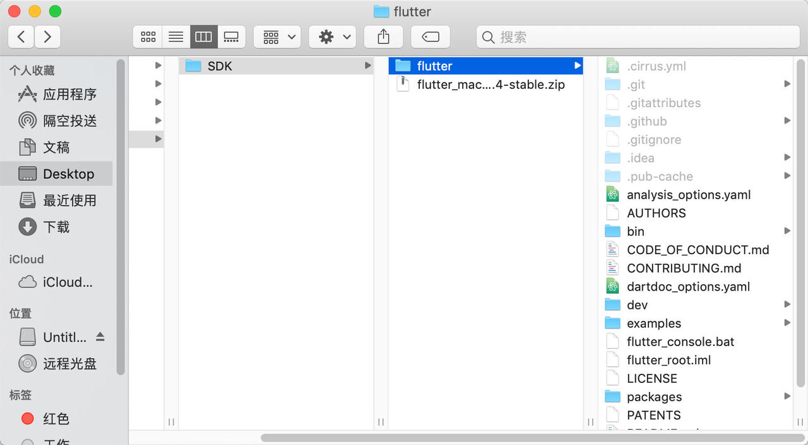


* 2.配置Flutter的环境变量

因为我们之后需要在命令行执行Flutter的命令，所以需要配置环境变量
macOS或者Linux系统，需要编辑~/.bash_profile文件
export PATH=$PATH:/Applications/flutter/bin

Windows用户将所在路径添加到环境变量的Path下

Windows环境变量修改：点击计算机图标 - 属性 - 高级系统设置 - 高级 - 环境变量

找到Path，在其中添加Flutter SDK目录下bin目录

在终端中执行flutter --version，出现如下内容，说明安装flutter成功

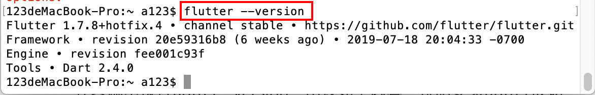

配置镜像

flutter项目会依赖一些东西，在国内下载这些依赖会有一些慢，所以我们可以将它们的安装源换成国内的（也就是设置国内的镜像）

macOS或者Linux操作系统，依然是编辑~/.bash_profile文件

```
export PUB_HOSTED_URL=https://pub.flutter-io.cn

export FLUTTER_STORAGE_BASE_URL=https://storage.flutter
```

Windows用户还是需要修改环境变量

Windows环境变量修改：点击计算机图标 - 属性 - 高级系统设置 - 高级 - 环境变量

新建 变量 PUB_HOSTED_URL，其值为https://pub.flutter-io.cn

新建 变量 FLUTTER_STORAGE_BASE_URL， 其值为https://storage.flutter-io.cn

注意： 此镜像为临时镜像，并不能保证一直可用，大家可以参考详情请参考 Using Flutter in China 以获得有关镜像服务器的最新动态。

### 1.3. 配置iOS环境
如果想为Flutter配置iOS开发环境，需要在我们的电脑上安装一个Xcode（此部分Windows电脑忽略）
Xcode是苹果公司的iOS和macOS的IDE，进行过iOS开发的童鞋应该都非常熟悉

如何安装Xcode呢？ 常见的是两种

- 1.直接在App Store上搜索Xcode，找到安装即可
这种安装方式有一个缺点，安装的一定是最新版本的（当然是用最新版本的最好）
但是最新版本的Xcode会对macOS系统有一定的要求，所以可能还要设计到系统升级
如果不希望系统升级，可以选择第二种方式

- 2.第二种方式是安装自己想要的Xcode的版本，需要手动去下载

进入developer.apple.com/download/mo…页面

登录自己的Apple ID

在搜索框输入Xcode，回车搜索，找到各种版本Xcode下载即可

打开安装好的Xcode，可能打开速度有点慢：不着急，慢慢来

选择自己想用的iOS模拟器

打开Xcode，右上角点击Xcode - Open Developer Tools - Simulator

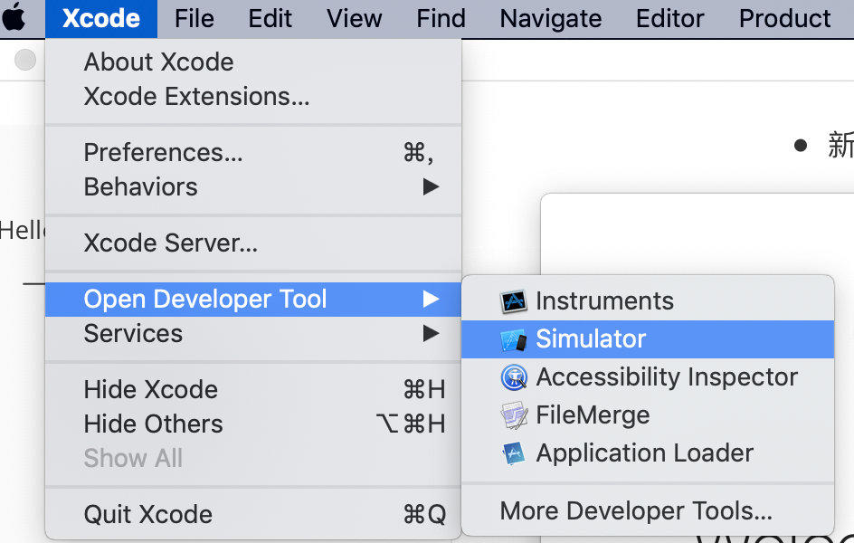

这个时候会打开一个默认的iOS模拟器，也可以在Hardware - Device - 系统版本中选择自己想要测试的模拟器

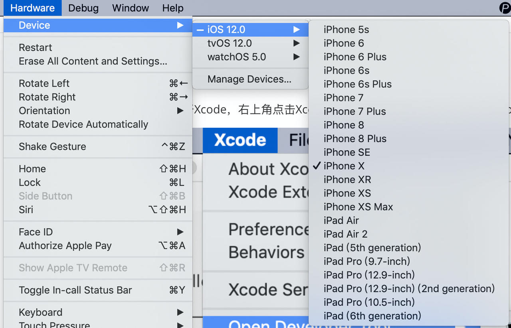


这个时候，我们就能看到如下模拟器了

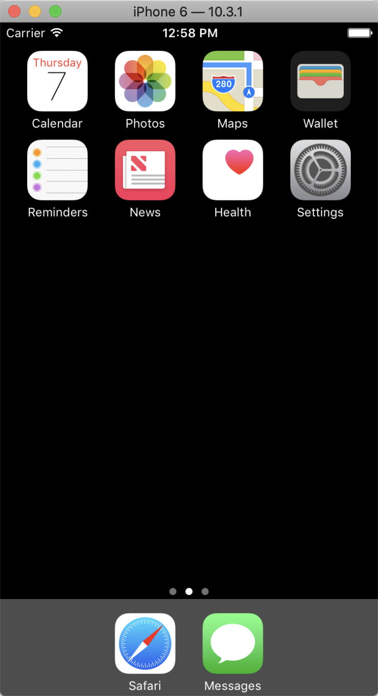

这个时候我们执行一下如下终端命令：

flutter doctor

看到如下有一个

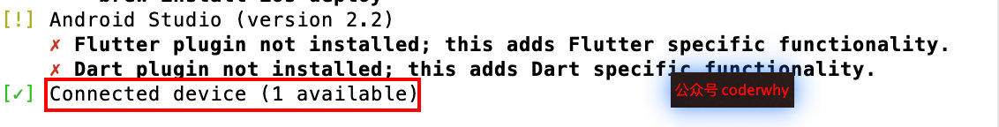


### 1.4. 配置Android环境

如果想为Flutter配置Android开发环境，需要在我们的电脑上安装一个Android Studio

- Android Studio是基于IntelliJ IDEA的、Google 官方的 Android 应用集成开发环境 (IDE)。
Android Studio的下载
- 官网地址：developer.android.com/studio/?utm…
- 直接在官方下载即可
- 安装直接双击安装即可
Android的环境配置

打开Android Studio，会问我们是否要设置代理，这是因为下载Android SDK等在国内不好下载
- 至于如何设置代理，这里就不再讲解了~~~
- 最好要设置代理哦，不然估计会被气死~~~

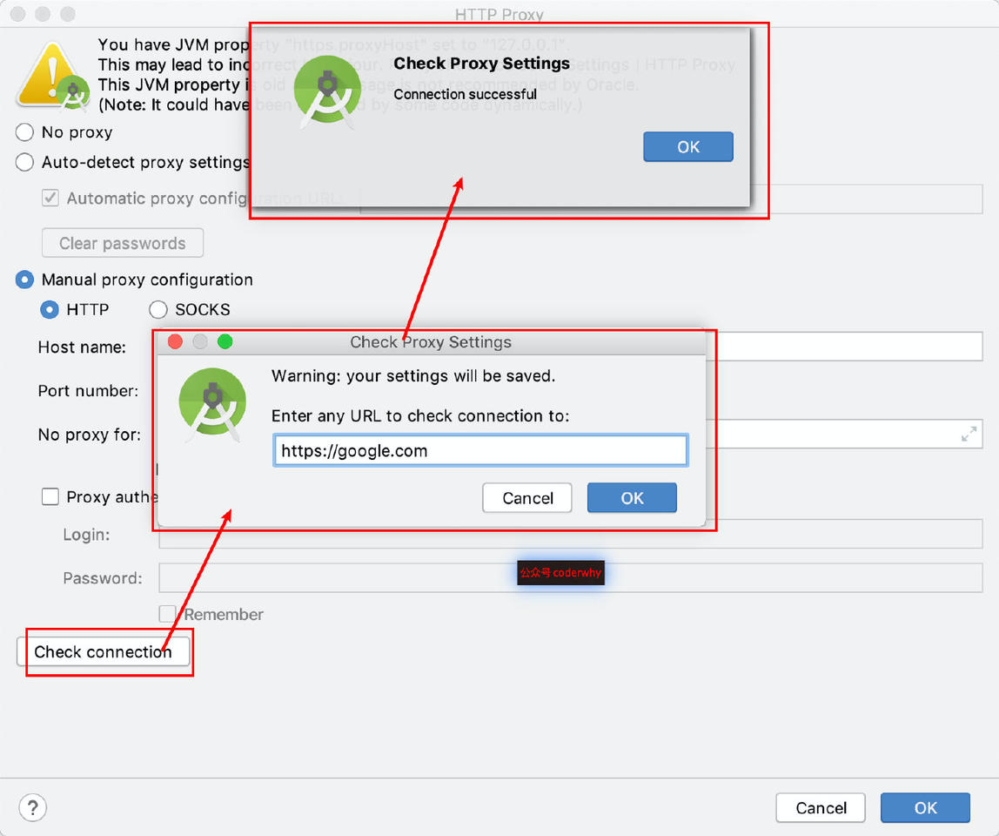

之后各种下一步，就会帮我们安装SDK等相关需要使用的内容

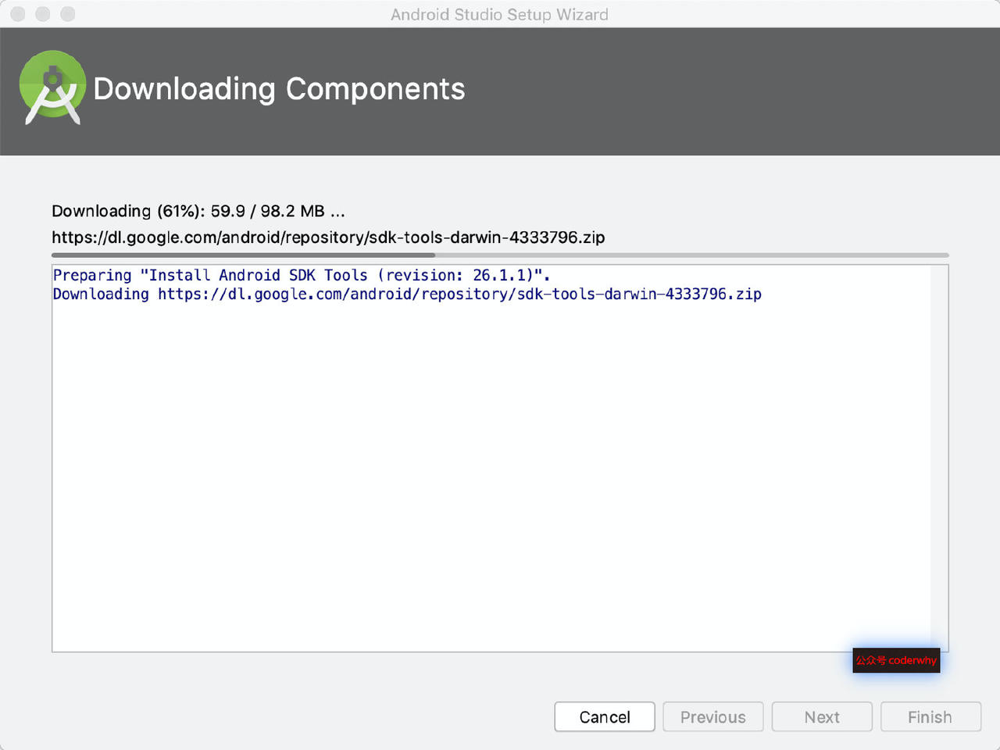

安装好后，点击Finish即可。


创建Android模拟器
安装好后，我们就可以去创建模拟器：选择Configure - AVD Manger

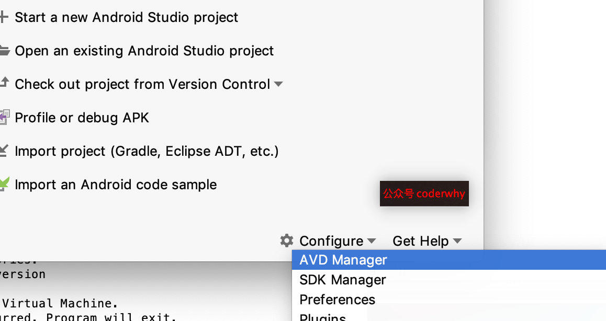

选择create virtual device

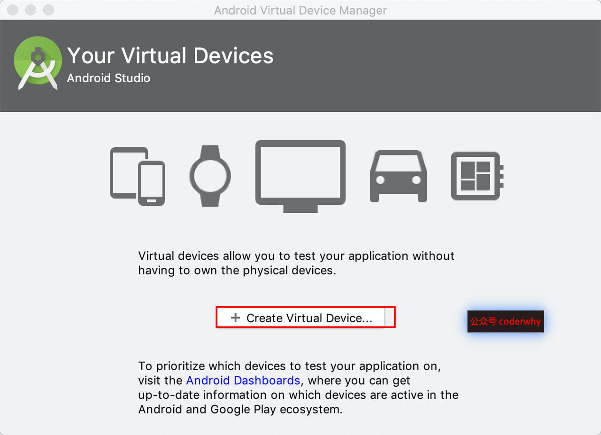

选择一个你想用的设备

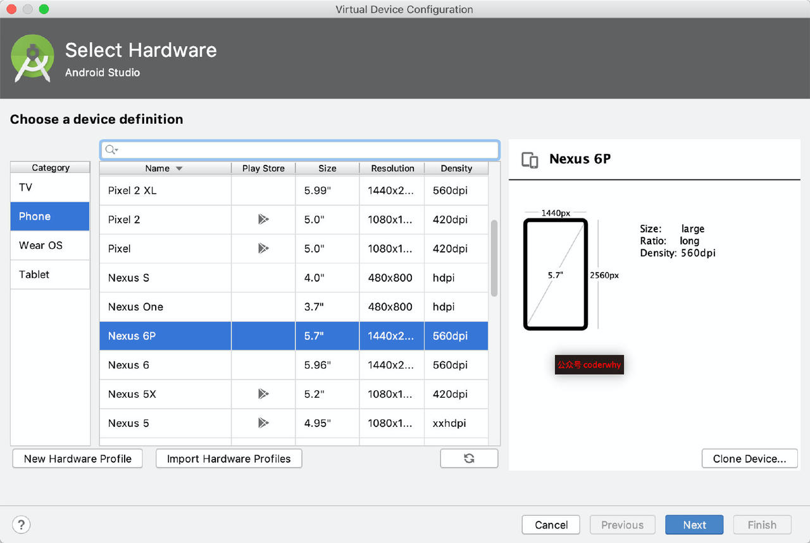

选择Android的版本（这里我没有选择Q版本，它目前还是一个bata版本），点击download

下一个界面，点击accept - next就可以了

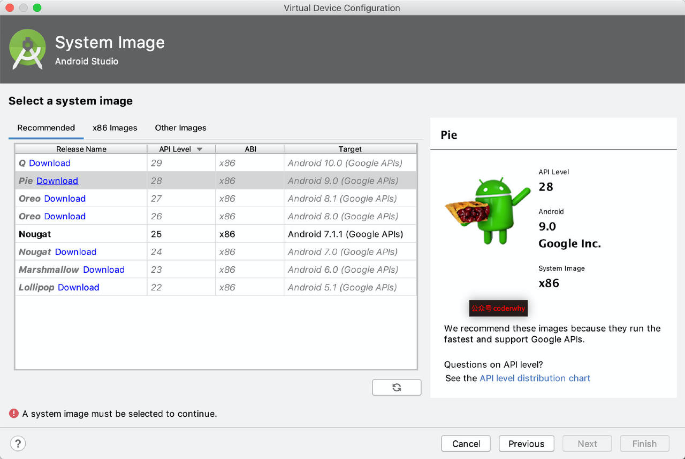


接着下一步，给自己的模拟器起个名字

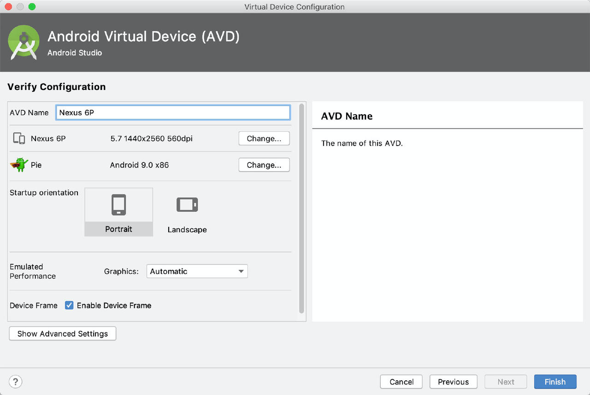

启动Android模拟器

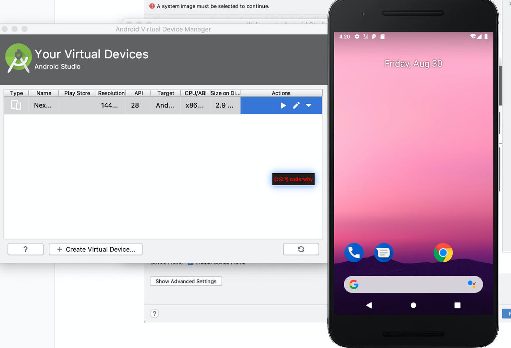

这个时候我们执行一下如下终端命令：

flutter doctor

看到如下有两个可用的设备


### 1.5. 开发工具的选择

官方推荐两个工具来开发Flutter：Android Studio 和 VSCode，我们选择哪一个呢？

对于有选择恐惧症的人，还真不是特别好选择，所以下面我会分别说出它们的优缺点，选择权在你

最后我也会给出我的选择

**VSCode优缺点**

VSCode是最近非常非常流行的开发工具，并且非常好用！（我之前在微博感慨微软的东西最近两年越来越好用，其中之一就是VSCode）

而且VSCode最近已经有取代WebStorm作为前端首选开发工具的趋势了

VSCode的优点：

- VSCode其实并不能称之为是一个IDE，它只是一个编辑器而已。
- 所以它非常的轻量级，不会占用你非常大的内存消耗，而且启动速度等都非常快，对于电脑配置不是特别高的同学，肯定是一个非常好的选择。
- 并且你可以在VSCode上安装各种各样的插件来满足自己的开发需求。

VSCode的缺点：

- 很多Android Studio包括的方便操作没有，比如点击启动、热更新点击等；
- 而且在某些情况下会出现一些问题；
- 比如之前我在使用的过程中，有时候热更新不及时常常看不到效果，必须重启；
- 比如某些情况下，没有代码提示不够灵敏；


使用须知：

使用VSCode开发Flutter我们需要安装两个插件：Flutter和Dart

**Android Studio优缺点**

对于进行过Android开发或者使用过Webstorm、IDEA、PHPStorm等的同学，使用Android Studio肯定是没有任何问题的
Android Studio的优点：

- 集成开发环境（IDE）不用多说，你需要的功能基本都有
- 而且上面说的VSCode存在的问题，在Android Studio中基本不会出现

Android Studio的缺点：

- 一个字：重
- 无论是IDE本身，还是使用Android Studio启动项目，都会相对慢一些
- 占据的计算机资源也很多，所以电脑配置较低是会出现卡顿

使用须知：

使用Android Studio开发Flutter我们需要安装两个插件：Flutter和Dart


## 参考资料
> - []()
> - []()
