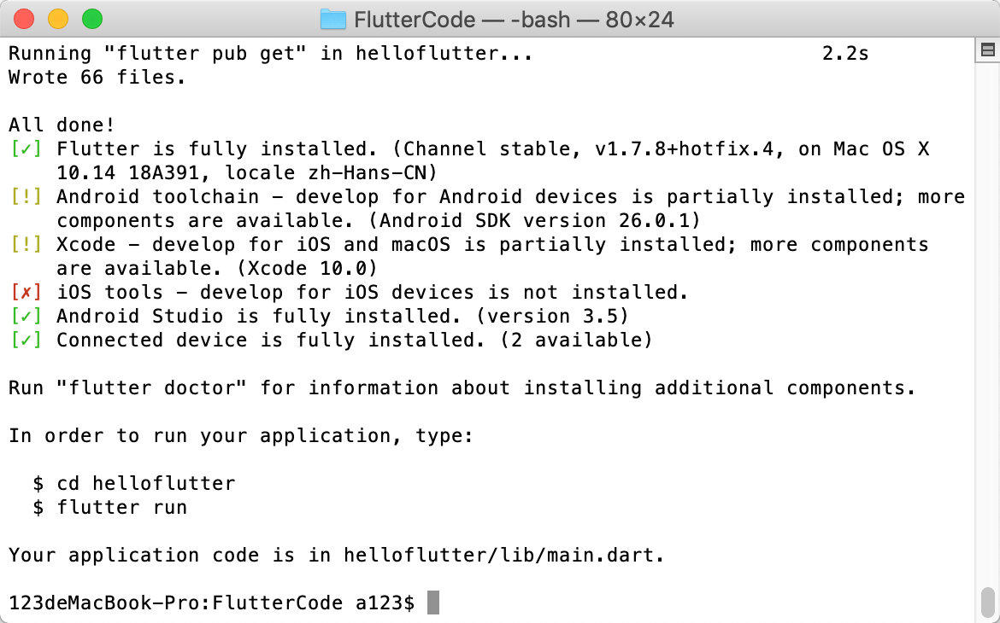
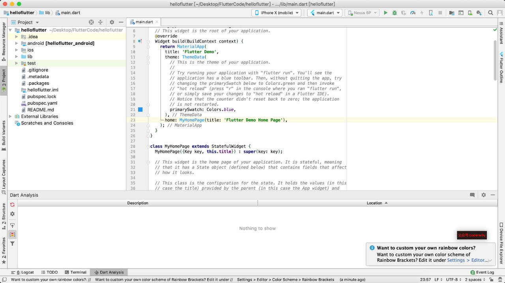
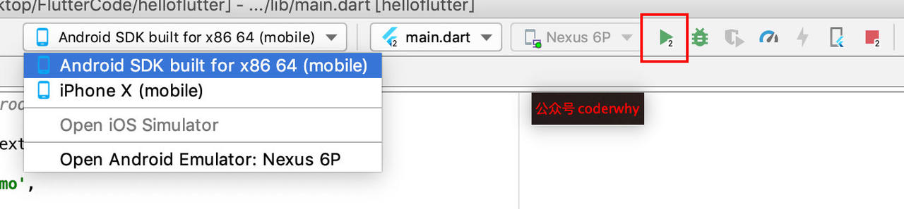
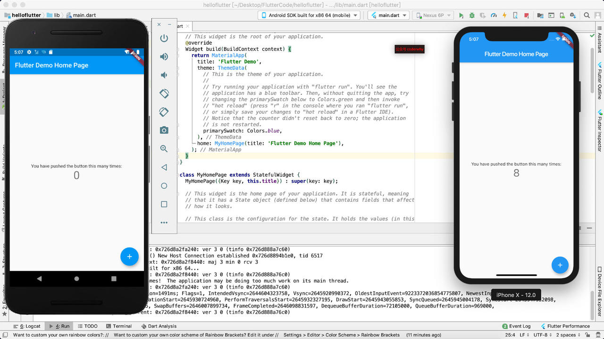
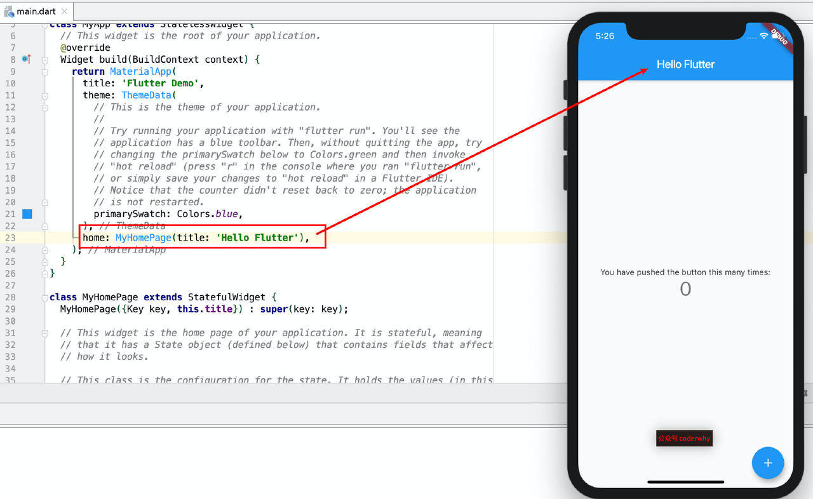
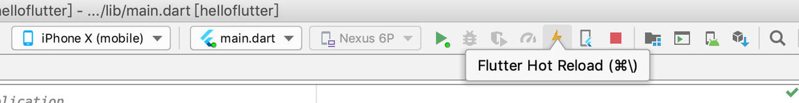
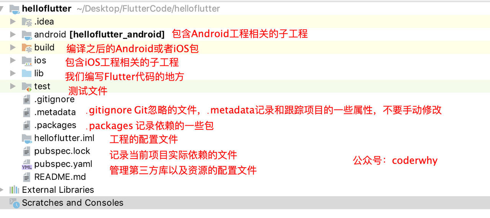

# 一：创建Flutter应用
### 1.1.  有两种方式创建Flutter应用：通过终端，通过编辑器。

这里我先选择通过终端（Windows和macOS都是一样的命令）

打开终端 - 执行如下命令：

```
flutter create helloflutter
```

注意：后面的名称不能由特殊符号，也不能由大写



### 1.2. 项目跑在模拟器

通过一个你喜欢的开发工具打开（我这里暂时选择Android Studio）



选择你要启动的设备，点击 运行 按钮：



我把项目运行在了两个模拟器上



### 1.3. 体验Flutter热重载

对于我们开发测试阶段，如果每次修改代码都需要重新编译整个项目再加载的话，那每次可能都需要花费10秒左右甚至是几分钟的时间（电脑太慢的话），这样的开发效率是非常低的。

现在前端开发都支持热重载（Hot Reload），可以大大加快我们的开发效率。

- 热重载可以在无需重新编译代码、重新启动应用程序的情况下，看到修改后界面的效果

Flutter在开发阶段使用JIT编译模式（后面我会讲解什么是JIT模式），所以可以做到热重载来提高我们的开发效率

下面我们体会一下热重载，后面有时间我们来分析热重载是如何实现的

将下面红框中的内容改成Hello Flutter，保存一下应用程序

- 你会发现在不到1秒钟内，界面直接发生了刷新
- 并且没有应用程序没有进行任何的重新，效率非常高



如果热重载不起作用，我们也可以点击右上角的 Hot Restart，并不需要重新运行项目



### 1.4. 工程目录分析

Flutter工程创建完毕会，会感觉比较复杂，我们来看下图：



目录包含哪些东西呢？

- 其中包含Flutter开发和测试需要的lib、test，在开发过程中，我们主要使用的就是lib目录
- 另外一些是管理项目的配置文件信息等，当然也包括一些Git相关的文件
- 除此之外，还包括一个Android子工程和iOS子工程

为什么包含Android子工程和iOS子工程呢？

- 这是因为作为一个跨平台的开发方案，最终还是要嵌入到Android工程或者iOS工程中来运行的
- 并且在开发过程中也需要调用原生的一些功能


## 参考资料
> - []()
> - []()
