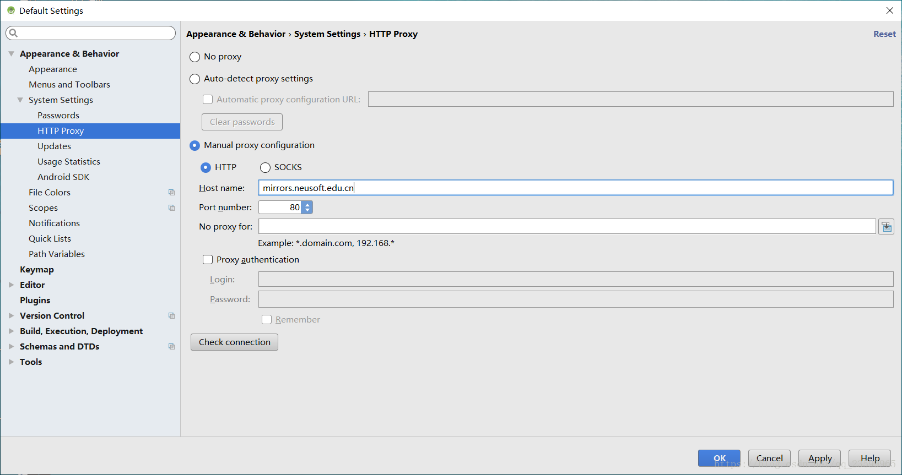
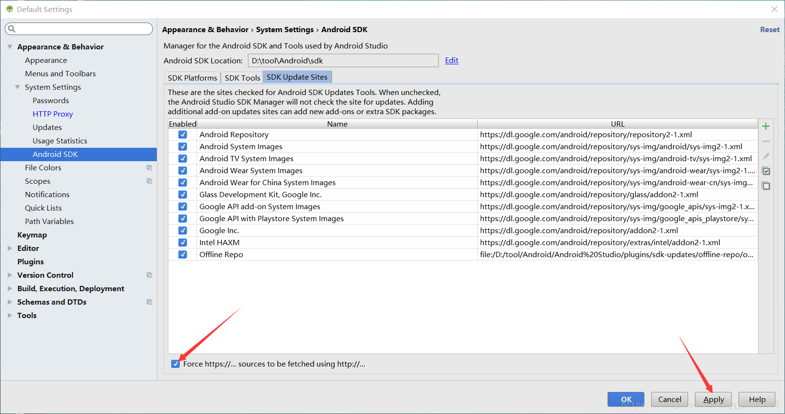
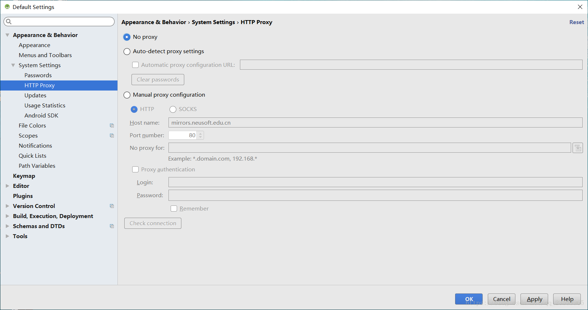
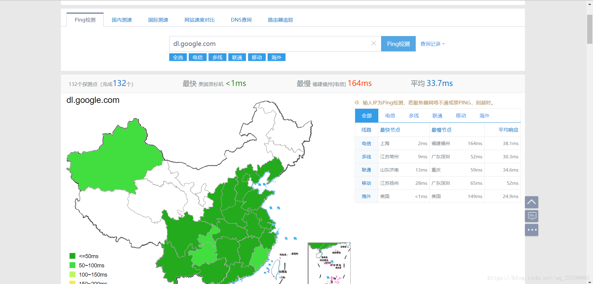
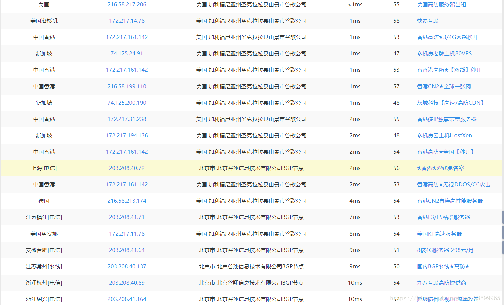
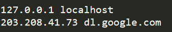
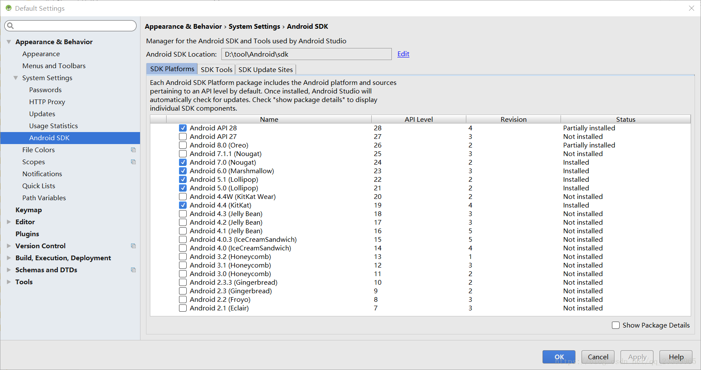
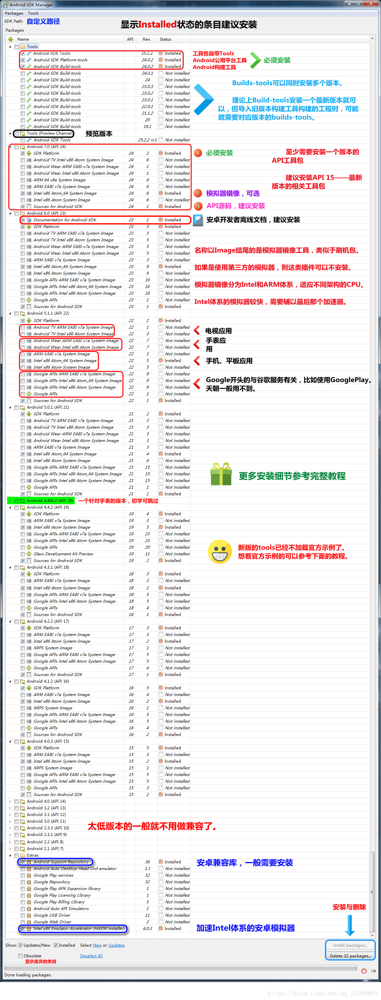

# 方式一：网站下载：https://androidsdkmanager.azurewebsites.net/SDKPlatform

# 方式二、设置HTTP Proxy

1. 打开Settings

2. 点击HTTP Proxy，选择Manual proxy configuration：
		设置 Host name 为：mirrors.opencas.cn(备用服务器地址：mirrors.opencas.org mirrors.opencas.ac.cn)
	
	设置 Port number 为：80
	
	

3. 点击Android SDK，选择SDK Update sites，勾选上Force Https://…，点击Apply
	
4. 点击ok，重新进入Android SDK即可. 最近设置代理已经不好用了，如果未能成功请尝试第二种方式

# 方式二、更改hosts文件
1. 首先取消方式一中设置的HTTP Proxy
	
2. 进入网站http://ping.chinaz.com/，进行 dl.google.com ping检查，选择大陆响应时间最短的IP地址

	

	

3. 进入cmd对此IP地址进行ping测试，如果可以将（IP地址 dl.google.com）加入hosts文件中, hosts文件地址：C:\WINDOWS\System32\drivers\etc\hosts

	

4. 点击Apply、OK，重新打开Android SDK，可以看到列表已经获得

	

	勾选对应的项点击Apply即可下载安装。 
	

## 参考资料
> - 
> - 
