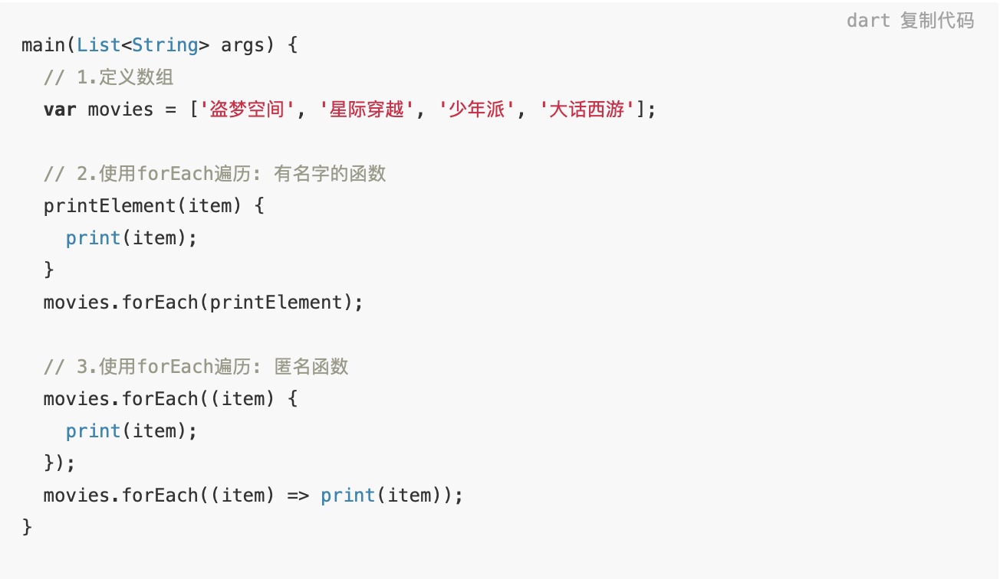

# 一. Dart介绍和安装
### 1.1. 认识Dart

Google为Flutter选择了Dart就已经是既定的事实，无论你多么想用你熟悉的语言，比如JavaScript、Java、Swift、C++等来开发Flutter，至少目前都是不可以的。

在讲解Dart的过程中，我会假定你已经有一定的编程语言基础，比如JavaScript、Java、Python、C++等。

其实如果你对编程语言足够的自信，Dart的学习过程甚至可以直接忽略：

- 因为你学过N种编程语言之后，你会发现他们的差异是并不大；
- 无非就是语法上的差异+某些语言有某些特性，而某些语言没有某些特性而已；
- 在我初次接触Flutter的时候，并没有专门去看Dart的语法，而是对于某些语法不太熟练的时候回头去了解而已；

所以，如果你对编程语言已经足够了解，可以跳过我们接下来的Dart学习：

- 我也并不会所有特性都一一罗列，我会挑出比较重要的语言特性来专门讲解；
- 某些特性可能会等到后面讲解Flutter的一些知识的时候单独拿出来讲解；

下面，我们就从安装Dart开始吧！

### 1.2. 安装Dart
为什么还需要安装Dart呢？

事实上在安装Flutter SDK的时候，它已经内置了Dart了，我们完全可以直接使用Flutter去进行Dart的编写并且运行。

但是，如果你想单独学习Dart，并且运行自己的Dart代码，最好去安装一个Dart SDK。

到Dart的官方，根据不同的操作系统下载对应的Dart

- 官方网站：dart.dev/get-dart

无论是什么操作系统，安装方式都是有两种：通过工具安装和直接下载SDK，配置环境变量

1.通过工具安装

- Windows可以通过Chocolatey
- macOS可以通过homebrew
- 具体安装操作官网网站有详细的解释

2.直接下载SDK，配置环境变量

- 下载地址：dart.dev/tools/sdk/a…
- 我采用了这个安装方式。
- 下载完成后，根据路径配置环境变量即可。

### 1.3. VSCode配置
学习Dart过程中，我使用VSCode作为编辑器

- 一方面编写代码非常方便，而且界面风格我也很喜欢
- 另一方面我可以快速在终端看到我编写代码的效果

使用VSCode编写Dart需要安装Dart插件：我目前给这个VSCode装了四个插件


# 二. Hello Dart
### 2.1. Hello World

接下来，就可以步入正题了。学习编程语言，从祖传的Hello World开始。

在VSCode中新建一个helloWorld.dart文件，添加下面的内容：

```
main(List<String> args) {
  print('Hello World');
}
```

然后在终端执行dart helloWorld.dart，就能看到Hello World的结果了。

完成了这个执行过程之后，以你之前学习的编程语言来看，你能得到多少信息呢？


### 2.2. 程序的分析

接下来，就是我自己的总结：

- 一、Dart语言的入口也是main函数，并且必须显示的进行定义；
- 二、Dart的入口函数main是没有返回值的；
- 三、传递给main的命令行参数，是通过List<String>完成的。
	- 从字面值就可以理解List是Dart中的集合类型。
	- 其中的每一个String都表示传递给main的一个参数；
- 四、定义字符串的时候，可以使用单引号或双引号；
- 五、每行语句必须使用分号结尾，很多语言并不需要分号，比如Swift、JavaScript；

# 三. 定义变量
### 3.1. 明确声明(Explicit)
明确声明变量的方式, 格式如下:

##### 变量类型 变量名称 = 赋值;


示例代码:

```
String name = 'coderwhy';
int age = 18;
double height = 1.88;
print('${name}, ${age}, ${height}'); // 拼接方式后续会讲解
```


注意事项: 定义的变量可以修改值, 但是不能赋值其他类型

```
String content = 'Hello Dart';
content = 'Hello World'; // 正确的
content = 111; // 错误的, 将一个int值赋值给一个String变量
```

### 3.2. 类型推导(Type Inference)

类型推导声明变量的方式, 格式如下:

##### var/dynamic/const/final 变量名称 = 赋值;


### 3.3.1. var的使用

var的使用示例:

runtimeType用于获取变量当前的类型

```
var name = 'coderwhy';
name = 'kobe';
print(name.runtimeType); // String
```


var的错误用法:

```
var age = 18;
age = 'why'; // 不可以将String赋值给一个int类型
```

### 3.3.2. dynamic的使用
如果确实希望这样做,可以使用dynamic来声明变量:

但是在开发中, 通常情况下不使用dynamic, 因为类型的变量会带来潜在的危险

```
dynamic name = 'coderwhy';
print(name.runtimeType); // String
name = 18;
print(name.runtimeType); // int
```

### 3.3.3. final&const的使用

final和const都是用于定义常量的, 也就是定义之后值都不可以修改

```
final name = 'coderwhy';
name = 'kobe'; // 错误做法

const age = 18;
age = 20; // 错误做法
```

final和const有什么区别呢?
const在赋值时, 赋值的内容必须是在编译期间就确定下来的
final可以通过计算/函数 获取一个值(运行期间确定一个值)

```
String getName() {
return 'coderwhy'; 
} 
main(List<String> args) { 
const name = getName(); // 错误的做法, 因为要执行函数才能获取到值 
final name = getName(); // 正确的做法 
}
```

final和const小案例:

- 首先, const是不可以赋值为DateTime.now()
- 其次, final一旦被赋值后就有确定的结果, 不会再次赋值


const放在赋值语句的右边，可以共享对象，提高性能:

- 这里可以暂时先做了解，后面讲解类的常量构造函数时，我会再次提到这个概念


# 四. 数据类型
### 4.1. 数字类型

对于数值来说，我们也不用关心它是否有符号，以及数据的宽度和精度等问题。只要记着整数用int，浮点数用double就行了。

不过，要说明一下的是Dart中的int和double可表示的范围并不是固定的，它取决于运行Dart的平台。


字符串和数字之间的转化:


### 4.2. 布尔类型
布尔类型中,Dart提供了一个bool的类型, 取值为true和false

```
// 布尔类型
var isFlag = true;
print('$isFlag ${isFlag.runtimeType}');

```

##### 注意: Dart中不能判断非0即真, 或者非空即真

Dart的类型安全性意味着您不能使用if(非booleanvalue)或assert(非booleanvalue)之类的代码。


### 4.3. 字符串类型

Dart字符串是UTF-16编码单元的序列。您可以使用单引号或双引号创建一个字符串:


可以使用三个单引号或者双引号表示多行字符串:


字符串和其他变量或表达式拼接:
 
```
使用 ${expression}, 如果表达式是一个标识符, 那么{}可以省略
```


### 4.4. 集合类型
### 4.4.1. 集合类型的定义

对于集合类型，Dart则内置了最常用的三种：List / Set / Map。


其中，List可以这样来定义：


其中，set可以这样来定义：

- 其实，也就是把[]换成{}就好了。
- Set和List最大的两个不同就是：Set是无序的，并且元素是不重复的。


最后，Map是我们常说的字典类型，它的定义是这样的：


### 4.4.2. 集合的常见操作
了解了这三个集合的定义方式之后，我们来看一些最基础的公共操作

第一类，是所有集合都支持的获取长度的属性length：


第二类, 是添加/删除/包含操作

 - 并且，对List来说，由于元素是有序的，它还提供了一个删除指定索引位置上元素的方法


第三类，是Map的操作

- 由于它有key和value，因此无论是读取值，还是操作，都要明确是基于key的，还是基于value的，或者是基于key/value对的。

```
// Map的操作
// 1.根据key获取value
print(infoMap1['name']); // why

// 2.获取所有的entries
print('${infoMap1.entries} ${infoMap1.entries.runtimeType}'); // (MapEntry(name: why), MapEntry(age: 18)) MappedIterable<String, MapEntry<String, Object>>

// 3.获取所有的keys
print('${infoMap1.keys} ${infoMap1.keys.runtimeType}'); // (name, age) _CompactIterable<String>

// 4.获取所有的values
print('${infoMap1.values} ${infoMap1.values.runtimeType}'); // (why, 18) _CompactIterable<Object>

// 5.判断是否包含某个key或者value
print('${infoMap1.containsKey('age')} ${infoMap1.containsValue(18)}'); // true true

// 6.根据key删除元素
infoMap1.remove('age');
print('${infoMap1}'); // {name: why}
```

# 五. 函数
### 5.1. 函数的基本定义

Dart是一种真正的面向对象语言，所以即使函数也是对象，所有也有类型, 类型就是Function。

这也就意味着函数可以作为变量定义或者作为其他函数的参数或者返回值.

函数的定义方式:


按照上面的定义方式, 我们定义一个完整的函数:


Effective Dart建议对公共的API, 使用类型注解, 但是如果我们省略掉了类型, 依然是可以正常工作的


另外, 如果函数中只有一个表达式, 那么可以使用箭头语法(arrow syntax)

- 注意, 这里面只能是一个表达式, 不能是一个语句

```
sum(num1, num2) => num1 + num2;
```


### 5.2. 函数的参数问题
函数的参数可以分成两类: 必须参数和可选参数

前面使用的参数都是必须参数.

### 5.2.1. 可选参数
可选参数可以分为 命名可选参数 和 位置可选参数

定义方式:


命名可选参数的演示:


位置可选参数的演示:


命名可选参数, 可以指定某个参数是必传的(使用@required, 有问题)


### 5.2.2. 参数默认值
参数可以有默认值, 在不传入的情况下, 使用默认值

- 注意, 只有可选参数才可以有默认值, 必须参数不能有默认值


Dart中的main函数就是一个接受可选的列表参数作为参数的, 所以在使用main函数时, 我们可以传入参数, 也可以不传入

### 5.3. 函数是一等公民

在很多语言中, 函数并不能作为一等公民来使用, 比如Java/OC. 这种限制让编程不够灵活, 所以现代的编程语言基本都支持函数作为一等公民来使用, Dart也支持.

这就意味着你可以将函数赋值给一个变量, 也可以将函数作为另外一个函数的参数或者返回值来使用.


### 5.4. 匿名函数的使用
大部分我们定义的函数都会有自己的名字， 比如前面定义的foo、test函数等等。

但是某些情况下，给函数命名太麻烦了，我们可以使用没有名字的函数，这种函数可以被称之为匿名函数( anonymous function)，也可以叫lambda或者closure。




### 5.5. 词法作用域
dart中的词法有自己明确的作用域范围，它是根据代码的结构({})来决定作用域范围的
优先使用自己作用域中的变量，如果没有找到，则一层层向外查找。


### 5.6. 词法闭包
闭包可以访问其词法范围内的变量，即使函数在其他地方被使用，也可以正常的访问。


5.7. 返回值问题
所有函数都返回一个值。如果没有指定返回值，则语句返回null;隐式附加到函数体。


## 参考资料
> - []()
> - []()
