# 一. 运算符
这里，我只列出来相对其他语言比较特殊的运算符，因为某些运算符太简单了，不浪费时间，比如+、-、+=、==。

你可能会疑惑，Dart为什么要搞出这么多特殊的运算符呢？

你要坚信一点：所有这些特殊的运算符都是为了让我们在开发中可以更加方便的操作，而不是让我们的编码变得更加复杂。

### 1.1. 除法、整除、取模运算
我们来看一下除法、整除、取模运算

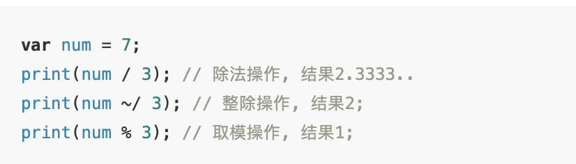

### 1.2. ??=赋值操作
dart有一个很多语言都不具备的赋值运算符：

- 当变量为null时，使用后面的内容进行赋值。
- 当变量有值时，使用自己原来的值。

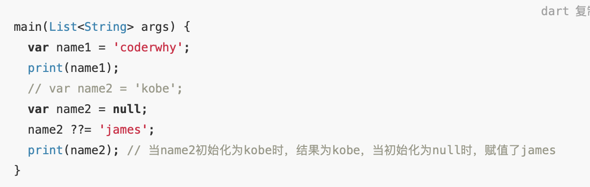

### 1.3. 条件运算符：
Dart中包含一直比较特殊的条件运算符：expr1 ?? expr2

- 如果expr1是null，则返回expr2的结果;
- 如果expr1不是null，直接使用expr1的结果。

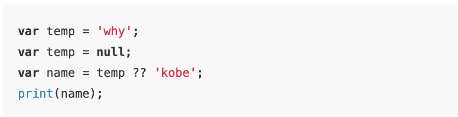

### 1.4. 级联语法：..
某些时候，我们希望对一个对象进行连续的操作，这个时候可以使用级联语法

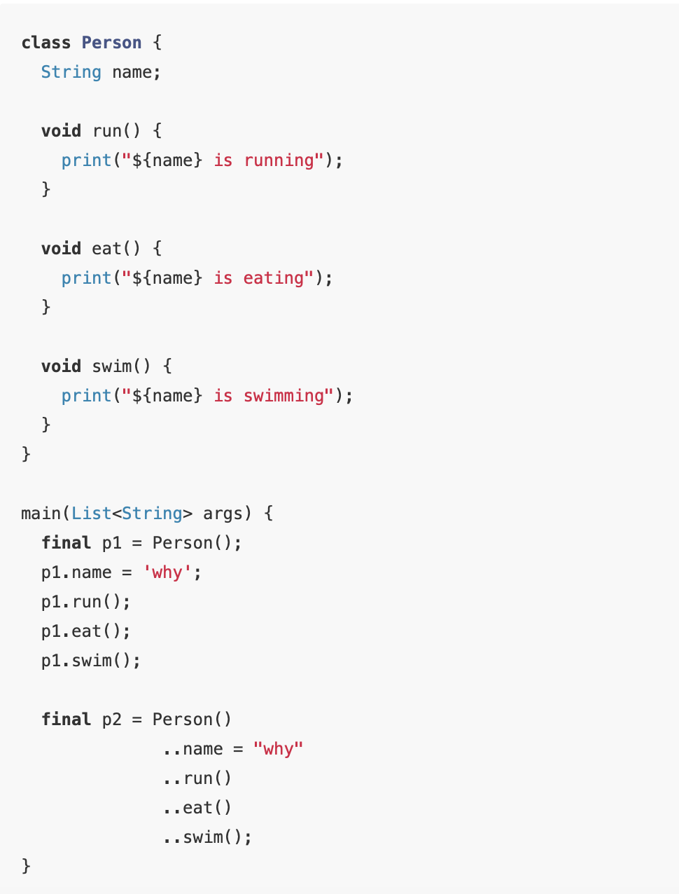

# 二. 流程控制
### 2.1. if和else
和其他语言用法一样

这里有一个注意点：不支持非空即真或者非0即真，必须有明确的bool类型

 - 我们来看下面name为null的判断

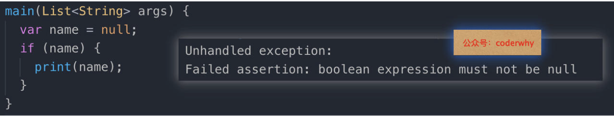

### 2.2. 循环操作
基本的for循环

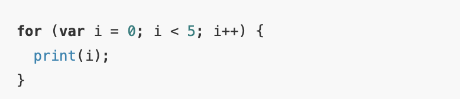

for in遍历List和Set类型

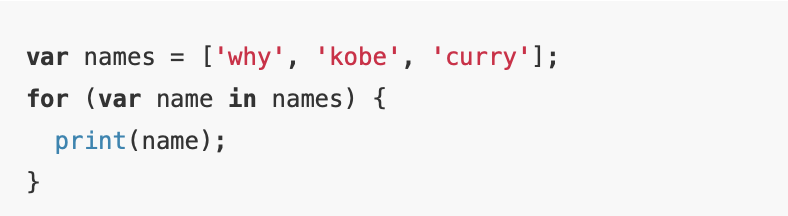

while和do-while和其他语言一致

break和continue用法也是一致

### 2.3. switch-case
普通的switch使用

- 注意：每一个case语句，默认情况下必须以一个break结尾

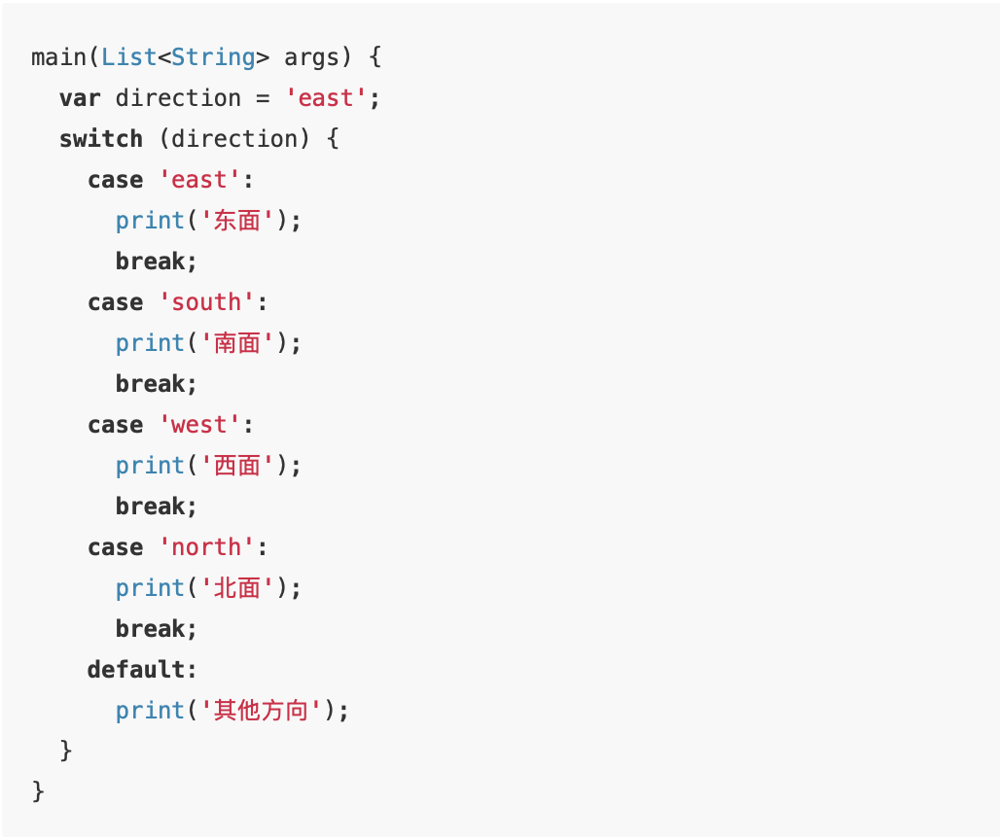

# 三. 类和对象
Dart是一个面向对象的语言，面向对象中非常重要的概念就是类，类产生了对象。

这一节，我们就具体来学习类和对象，但是Dart对类进行了很多其他语言没有的特性，所以，这里我会花比较长的篇幅来讲解。

### 3.1. 类的定义
在Dart中，定义类用class关键字。

类通常有两部分组成：成员（member）和方法（method）。

定义类的伪代码如下：

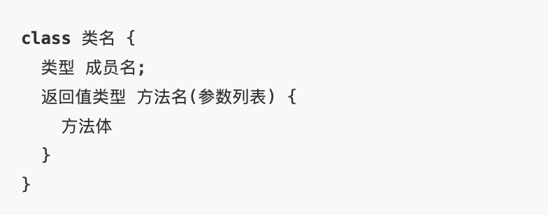

编写一个简单的Person类：

- 这里有一个注意点: 我们在方法中使用属性(成员/实例变量)时，并没有加this；
- Dart的开发风格中，在方法中通常使用属性时，会省略this，但是有命名冲突时，this不能省略；

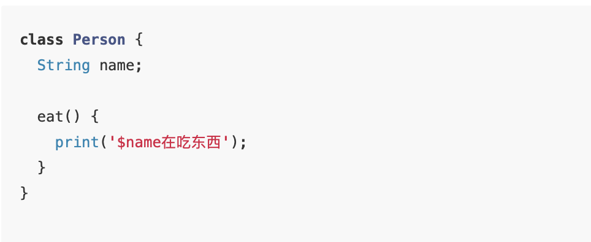

我们来使用这个类，创建对应的对象：

- 注意：从Dart2开始，new关键字可以省略。

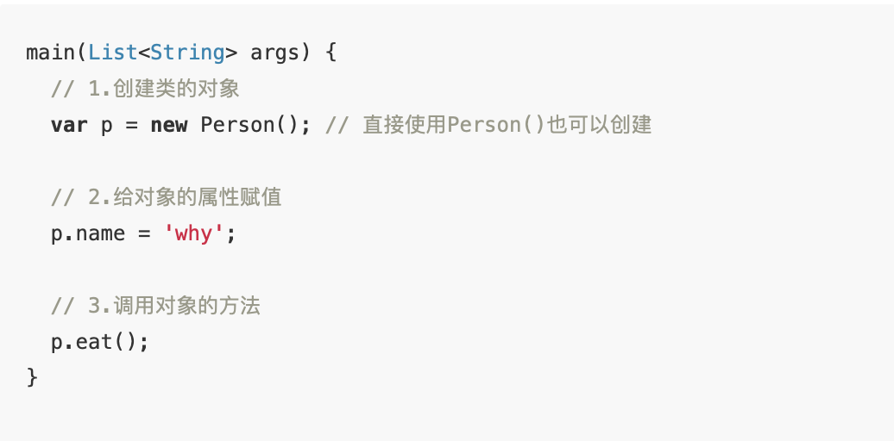

### 3.2. 构造方法
#### 3.2.1. 普通构造方法
我们知道, 当通过类创建一个对象时，会调用这个类的构造方法。

- 当类中没有明确指定构造方法时，将默认拥有一个无参的构造方法。
- 前面的Person中我们就是在调用这个构造方法.

我们也可以根据自己的需求，定义自己的构造方法:

**注意一：**当有了自己的构造方法时，默认的构造方法将会失效，不能使用

- 当然，你可能希望明确的写一个默认的构造方法，但是会和我们自定义的构造方法冲突；
- 这是因为Dart本身不支持函数的重载（名称相同, 参数不同的方式）。

**注意二：**这里我还实现了toString方法

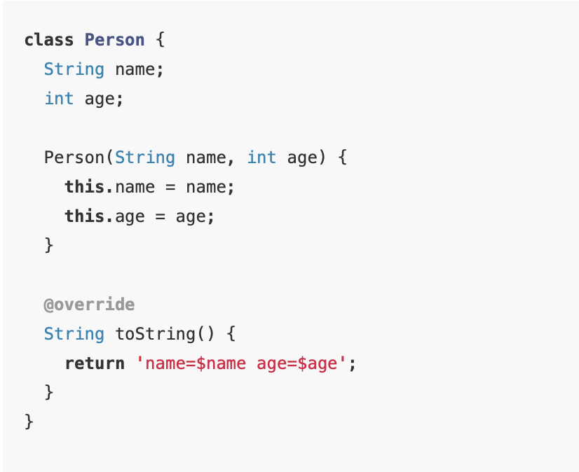

另外，在实现构造方法时，通常做的事情就是通过**参数给属性**赋值

为了简化这一过程, Dart提供了一种更加简洁的语法糖形式.

上面的构造方法可以优化成下面的写法：

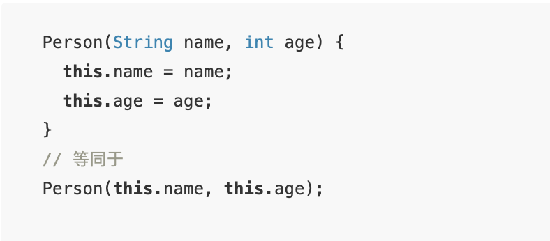

#### 3.2.2. 命名构造函数

但是在开发中, 我们确实希望实现更多的构造方法，怎么办呢？

 - 因为不支持方法（函数）的重载，所以我们没办法创建相同名称的构造方法。

我们需要使用命名构造函数:

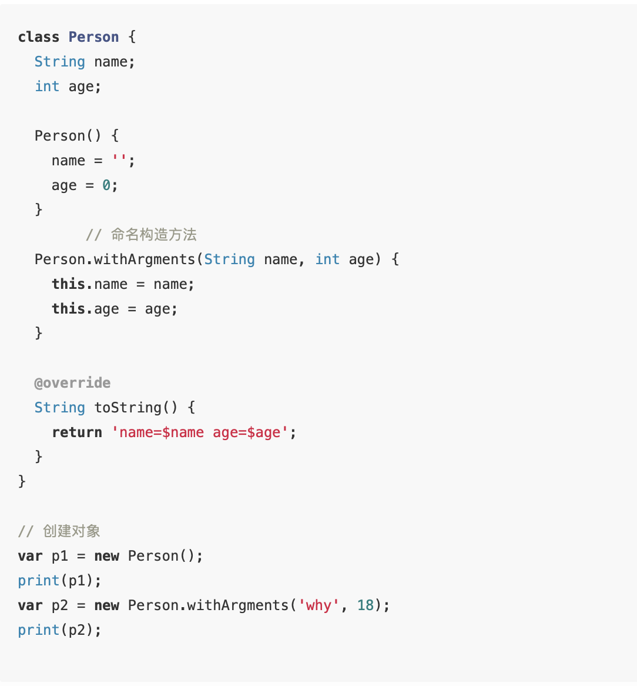

在之后的开发中, 我们也可以利用命名构造方法，提供更加便捷的创建对象方式:

 - 比如开发中，我们需要经常将一个Map转成对象，可以提供如下的构造方法

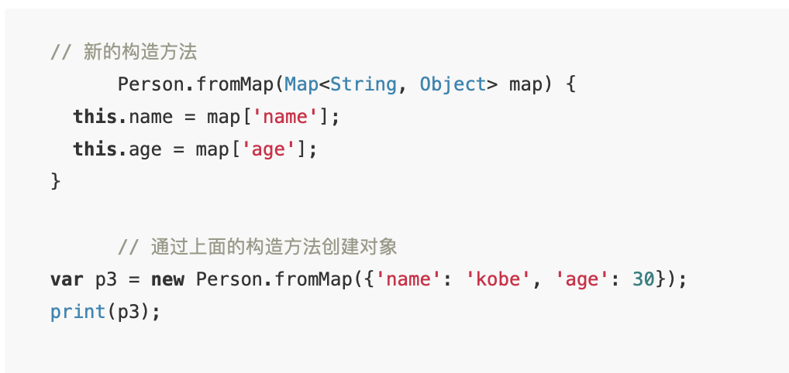

#### 3.2.3. 初始化列表

我们来重新定义一个类Point, 传入x/y，可以得到它们的距离distance:

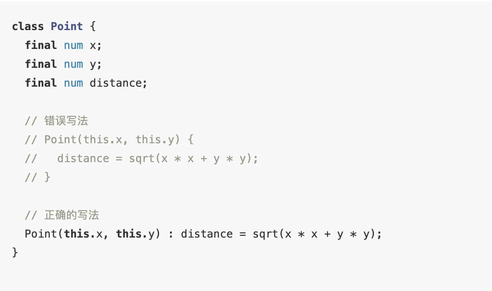

上面这种初始化变量的方法, 我们称之为初始化列表(Initializer list)

#### 3.2.4. 重定向构造方法
在某些情况下, 我们希望在一个构造方法中去调用另外一个构造方法, 这个时候可以使用重定向构造方法：

 - 在一个构造函数中，去调用另外一个构造函数（注意：是在冒号后面使用this调用）

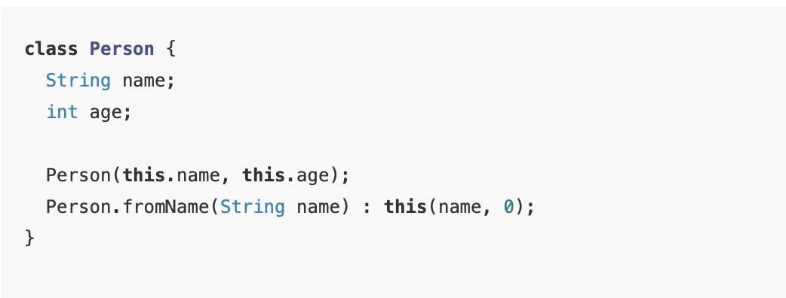

#### 3.2.5. 常量构造方法
在某些情况下，传入相同值时，我们希望返回同一个对象，这个时候，可以使用常量构造方法.

默认情况下，创建对象时，即使传入相同的参数，创建出来的也不是同一个对象，看下面代码:

 - 这里我们使用identical(对象1, 对象2)函数来判断两个对象是否是同一个对象:

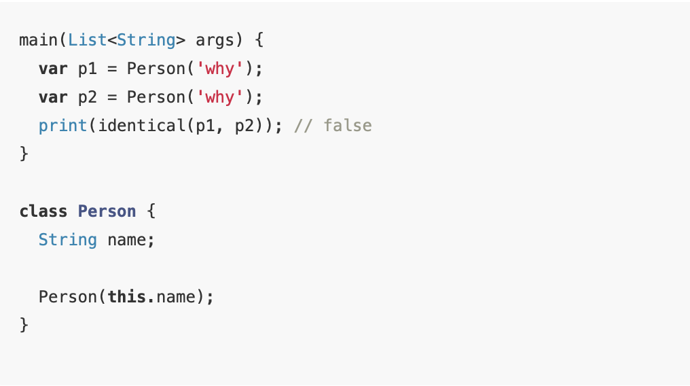

但是, 如果将构造方法前加const进行修饰，那么可以保证同一个参数，创建出来的对象是相同的

 - 这样的构造方法就称之为常量构造方法。

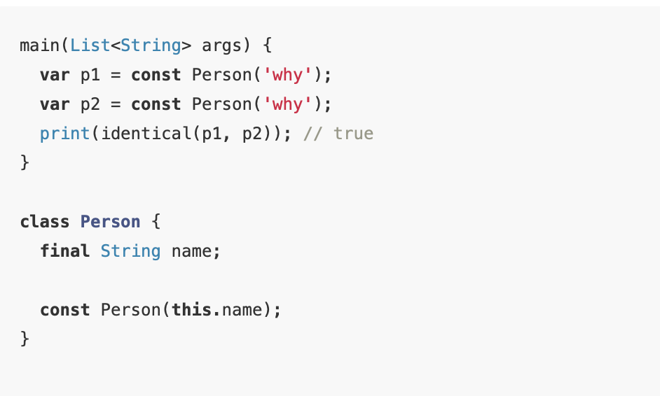

常量构造方法有一些注意点:

 - 注意一：拥有常量构造方法的类中，所有的成员变量必须是final修饰的.
 - 注意二: 为了可以通过常量构造方法，创建出相同的对象，不再使用 new关键字，而是使用const关键字
 - 如果是将结果赋值给const修饰的标识符时，const可以省略.

#### 3.2.6. 工厂构造方法
Dart提供了factory关键字, 用于通过工厂去获取对象

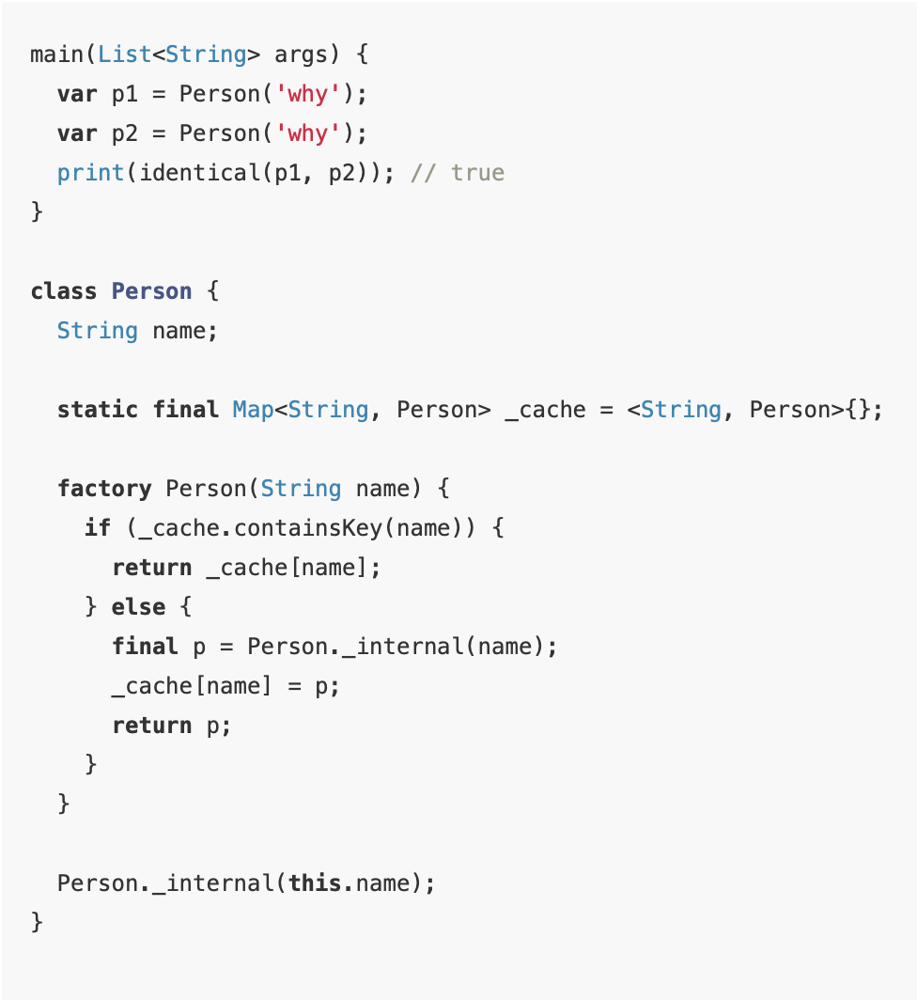

### 3.3. setter和getter
默认情况下，Dart中类定义的属性是可以直接被外界访问的。

但是某些情况下，我们希望监控这个类的属性被访问的过程，这个时候就可以使用setter和getter了

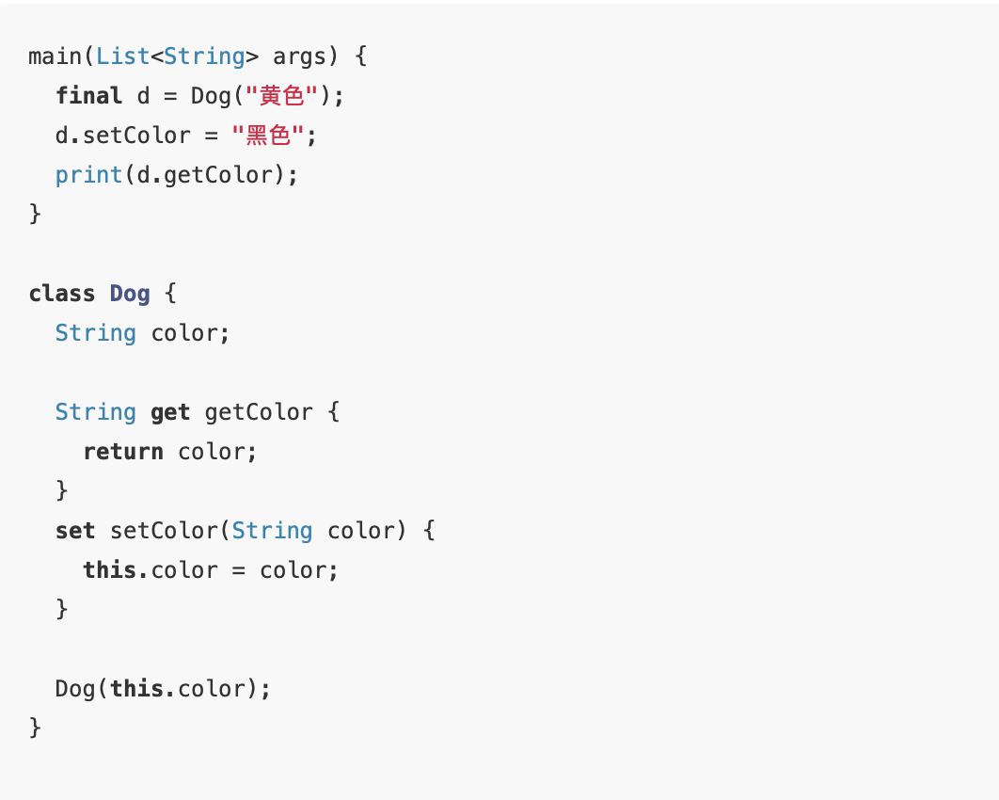

### 3.4. 类的继承
面向对象的其中一大特性就是继承，继承不仅仅可以减少我们的代码量，也是多态的使用前提。

Dart中的继承使用extends关键字，子类中使用super来访问父类。

父类中的所有成员变量和方法都会被继承,，但是构造方法除外。

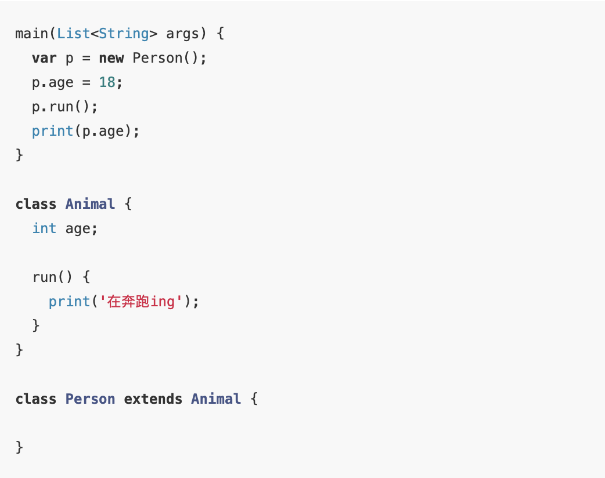

子类可以拥有自己的成员变量, 并且可以对父类的方法进行重写：

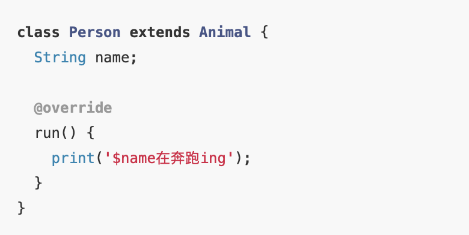

子类中可以调用父类的构造方法，对某些属性进行初始化：

 - 子类的构造方法在执行前，将隐含调用父类的无参默认构造方法（没有参数且与类同名的构造方法）。
 - 如果父类没有无参默认构造方法，则子类的构造方法必须在初始化列表中通过super显式调用父类的某个构造方法。

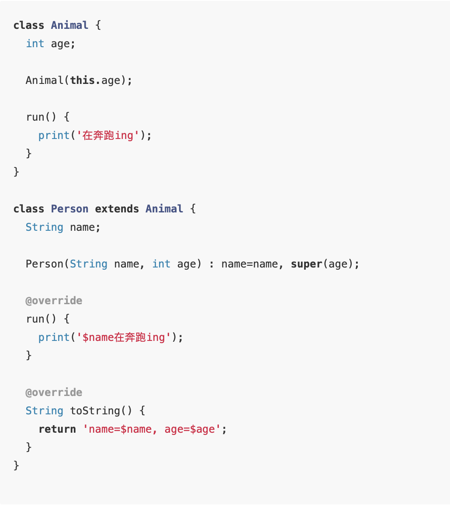

### 3.5. 抽象类

我们知道，继承是多态使用的前提。

所以在定义很多通用的**调用接口**时, 我们通常会让调用者传入父类，通过多态来实现更加灵活的调用方式。

但是，父类本身可能并不需要对某些方法进行具体的实现，所以父类中定义的方法,，我们可以定义为抽象方法。

什么是 抽象方法? 在Dart中没有具体实现的方法(没有方法体)，就是抽象方法。
 
 - 抽象方法，必须存在于抽象类中。
 - 抽象类是使用abstract声明的类。

下面的代码中, Shape类就是一个抽象类, 其中包含一个抽象方法.

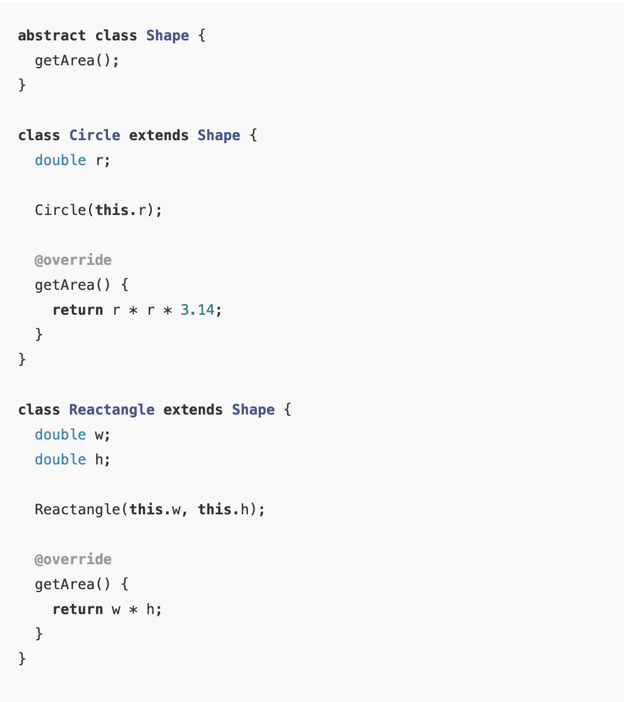

注意事项:

 - **注意一：**抽象类不能实例化.
 - **注意二：**抽象类中的抽象方法必须被子类实现, 抽象类中的已经被实现方法, 可以不被子类重写.

### 3.6. 隐式接口
Dart中的接口比较特殊, 没有一个专门的关键字来声明接口.(像java中的interface，oc中的protocol)

默认情况下，定义的每个类都相当于默认也声明了一个接口，可以由其他的类来实现(因为Dart不支持多继承)

在开发中，我们通常将用于给别人实现的类声明为抽象类:

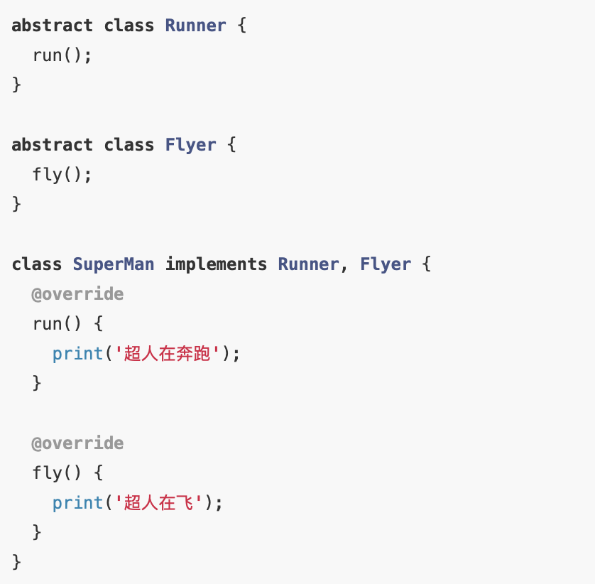

### 3.7. Mixin混入
在通过implements实现某个类时，类中所有的方法都必须被重新实现(无论这个类原来是否已经实现过该方法)。

但是某些情况下，一个类可能希望直接复用之前类的原有实现方案，怎么做呢?

 - 使用继承吗？但是Dart只支持单继承，那么意味着你只能复用一个类的实现。

Dart提供了另外一种方案: Mixin混入的方式

 - 除了可以通过class定义类之外，也可以通过mixin关键字来定义一个类。
 - 只是通过mixin定义的类用于被其他类混入使用，通过with关键字来进行混入。

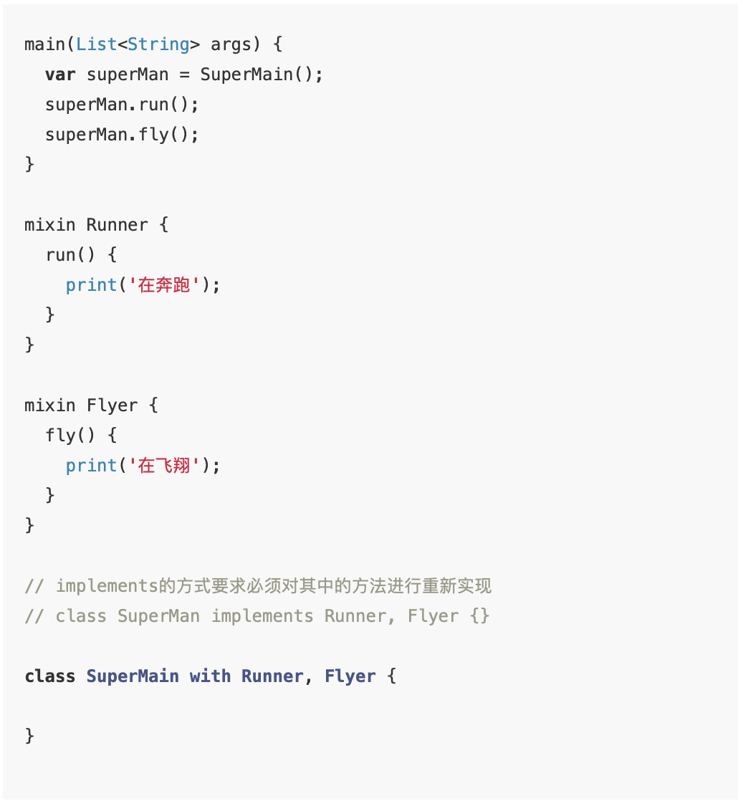

### 3.8. 类成员和方法
前面我们在类中定义的成员和方法都属于对象级别的, 在开发中, 我们有时候也需要定义类级别的成员和方法

在Dart中我们使用static关键字来定义:

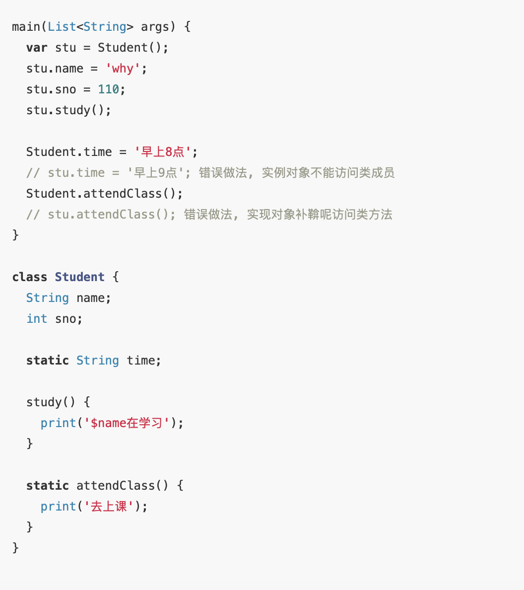

### 3.9. 枚举类型
枚举在开发中也非常常见, 枚举也是一种特殊的类, 通常用于表示固定数量的常量值。

#### 3.9.1. 枚举的定义
枚举使用enum关键字来进行定义:

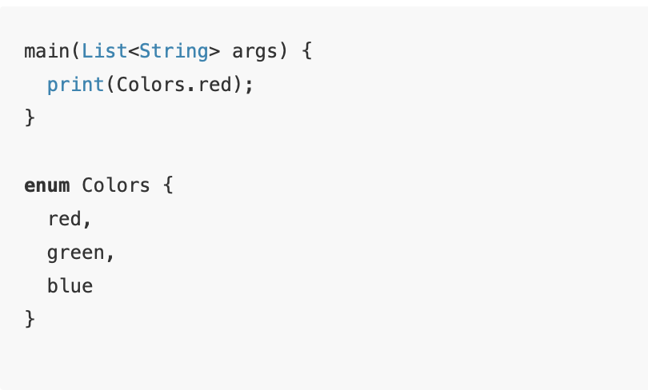

#### 3.9.2. 枚举的属性

枚举类型中有两个比较常见的属性:

 - index: 用于表示每个枚举常量的索引, 从0开始.
 - values: 包含每个枚举值的List.

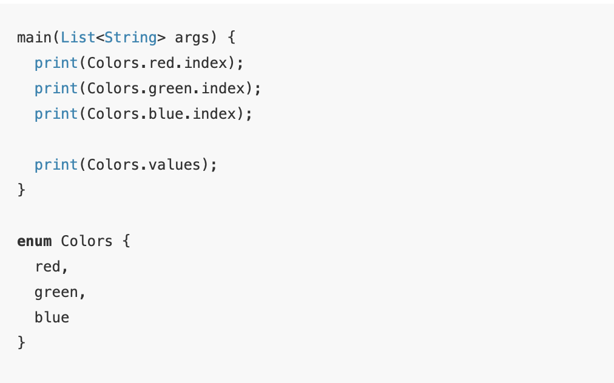

枚举类型的注意事项:
 
 - 注意一: 您不能子类化、混合或实现枚举。
 - 注意二: 不能显式实例化一个枚举

# 四. 泛型
### 4.1. 为什么使用泛型?
对于有基础的同学, 这部分不再解释
### 4.2. List和Map的泛型
List使用时的泛型写法:

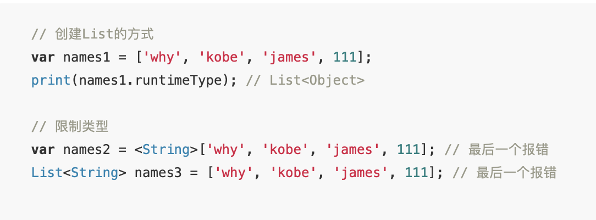

Map使用时的泛型写法:

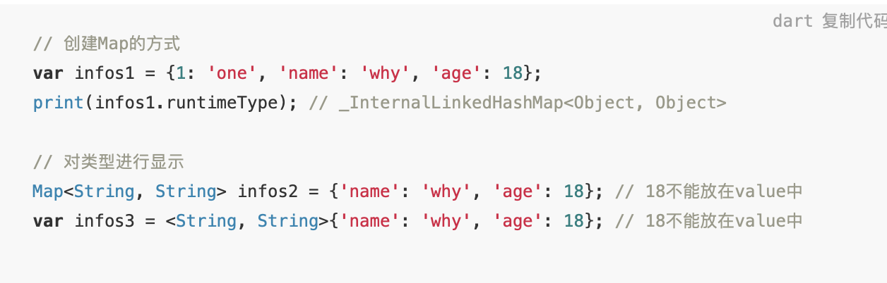

### 4.3. 类定义的泛型

如果我们需要定义一个类, 用于存储位置信息Location, 但是并不确定使用者希望使用的是int类型,还是double类型, 甚至是一个字符串, 这个时候如何定义呢?

 - 一种方案是使用Object类型, 但是在之后使用时, 非常不方便
 - 另一种方案就是使用泛型.

Location类的定义: Object方式

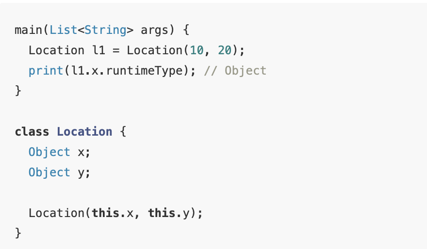

Location类的定义: 泛型方式

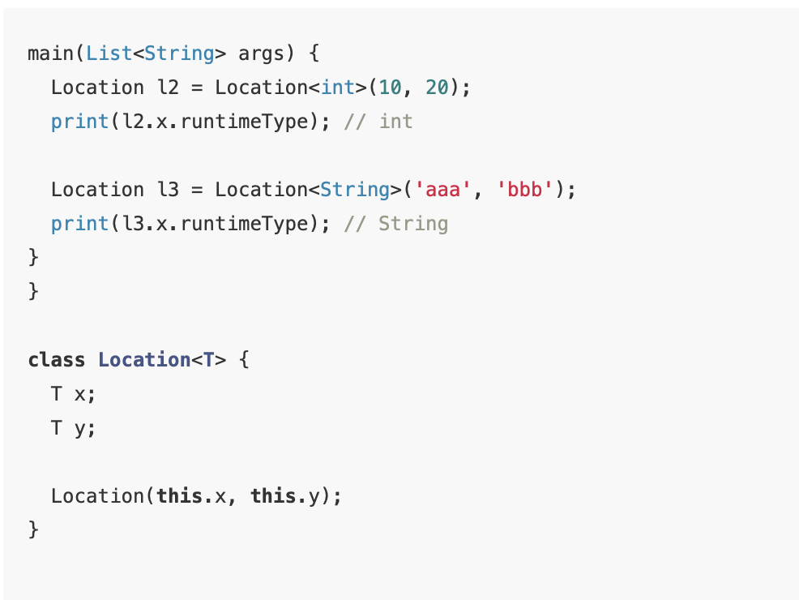

如果我们希望类型只能是num类型, 怎么做呢?

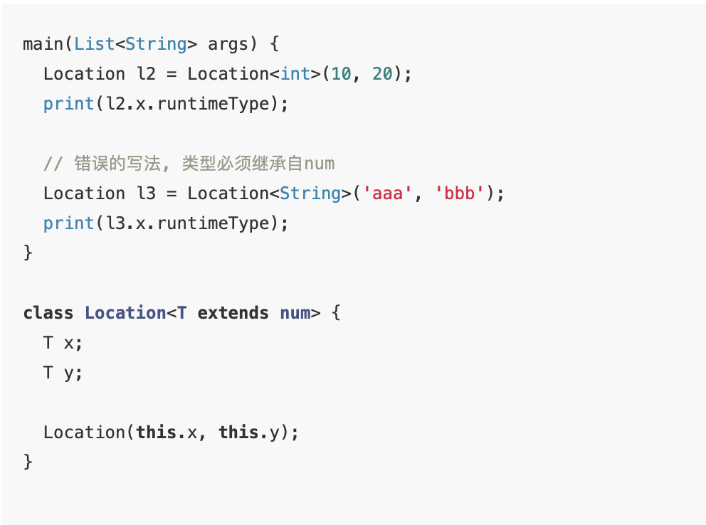

### 4.4. 泛型方法的定义
最初，Dart仅仅在类中支持泛型。后来一种称为泛型方法的新语法允许在方法和函数中使用类型参数。

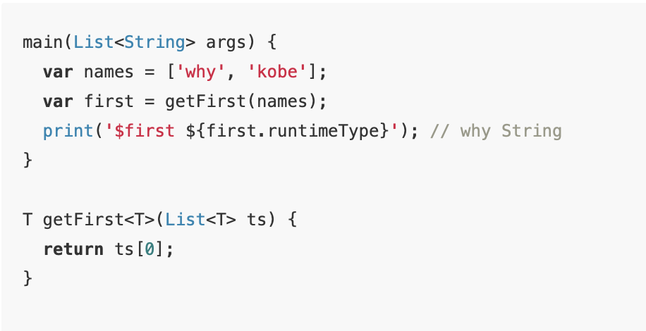

# 五. 库的使用
在Dart中，你可以导入一个库来使用它所提供的功能。

库的使用可以使代码的重用性得到提高，并且可以更好的组合代码。

Dart中任何一个dart文件都是一个库，即使你没有用关键字library声明

### 5.1. 库的导入
import语句用来导入一个库，后面跟一个字符串形式的Uri来指定表示要引用的库，语法如下：

常见的库URI有三种不同的形式

 - 来自dart标准版，比如dart:io、dart:html、dart:math、dart:core(但是这个可以省略)

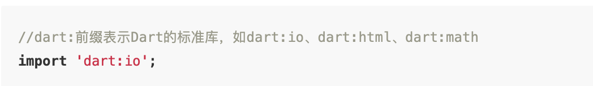

 - 使用相对路径导入的库，通常指自己项目中定义的其他dart文件

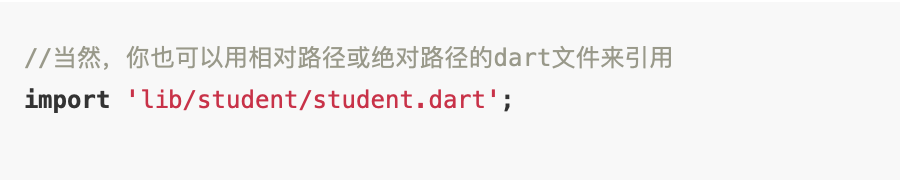

 - Pub包管理工具管理的一些库，包括自己的配置以及一些第三方的库，通常使用前缀package

**库文件中内容的显示和隐藏**

如果希望只导入库中某些内容，或者刻意隐藏库里面某些内容，可以使用show和hide关键字

 - **show关键字：**可以显示某个成员（屏蔽其他）
 - **hide关键字：**可以隐藏某个成员（显示其他）

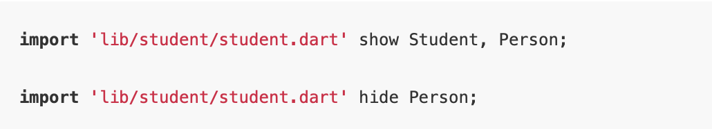

库中内容和当前文件中的名字冲突

当各个库有命名冲突的时候，可以使用as关键字来使用命名空间

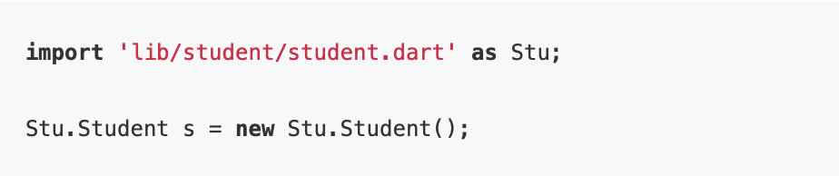

### 5.2. 库的定义
**library关键字**

通常在定义库时，我们可以使用library关键字给库起一个名字。

但目前我发现，库的名字并不影响导入，因为import语句用的是字符串URI

**part关键字**

在之前我们使用student.dart作为演练的时候，只是将该文件作为一个库。

在开发中，如果一个库文件太大，将所有内容保存到一个文件夹是不太合理的，我们有可能希望将这个库进行拆分，这个时候就可以使用part关键字了

不过官方已经不建议使用这种方式了：

 - dart.dev/guides/libr…

 - mathUtils.dart文件

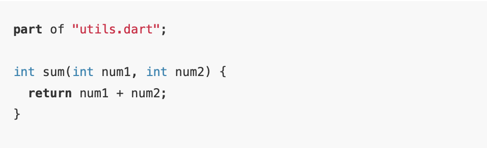

 - dateUtils.dart文件

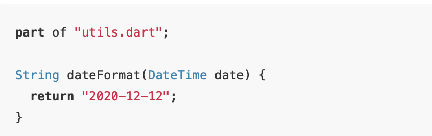

 - utils.dart文件

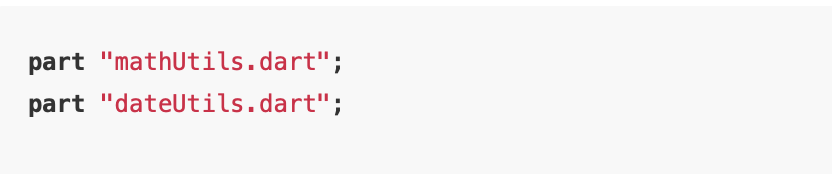

- test_libary.dart文件

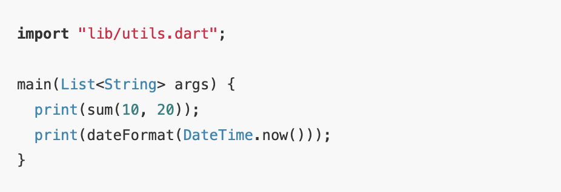

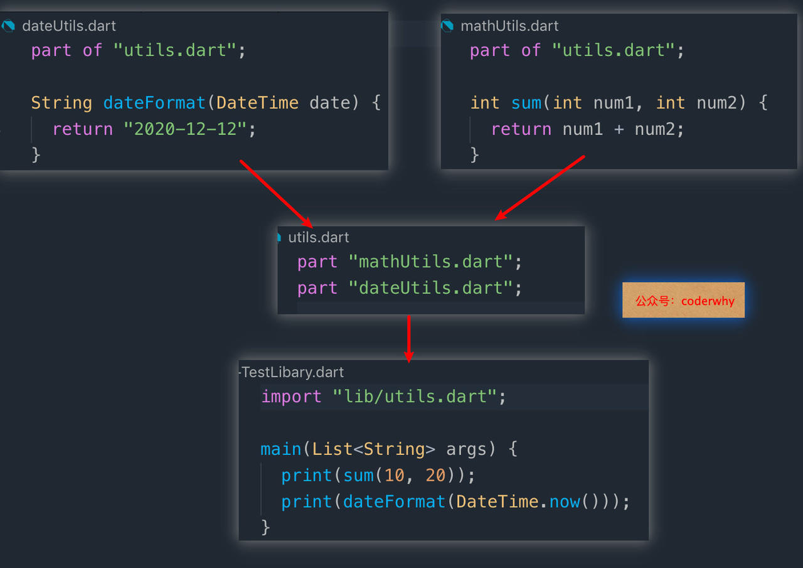

**export关键字**

官方不推荐使用part关键字，那如果库非常大，如何进行管理呢？

 - 将每一个dart文件作为库文件，使用export关键字在某个库文件中单独导入

- mathUtils.dart文件

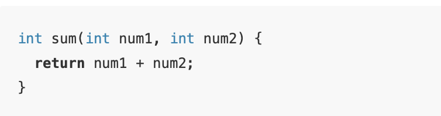

- dateUtils.dart文件

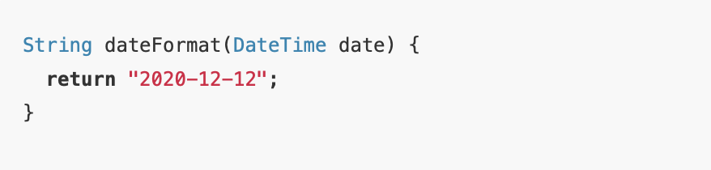

- utils.dart文件

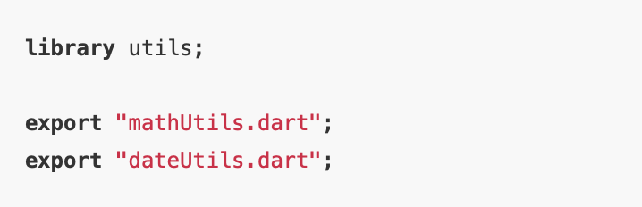

- test_libary.dart文件

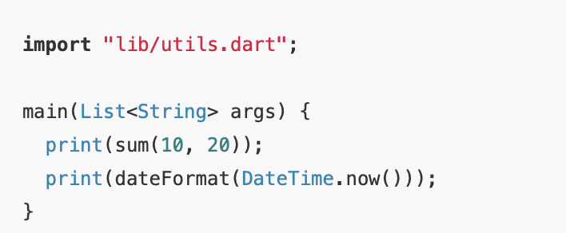

最后，也可以通过Pub管理自己的库，在项目开发中个人觉得不是非常有必要，所以暂时不讲解这种方式。

## 参考资料
> - 
> - 
