# 一. 文本Widget
在Android中，我们使用TextView，iOS中我们使用UILabel来显示文本；

Flutter中，我们使用Text组件控制文本如何展示；

### 1.1. 普通文本展示
在Flutter中，我们可以将文本的控制显示分成两类：

 - 控制文本布局的参数： 如文本对齐方式 textAlign、文本排版方向 textDirection，文本显示最大行数 maxLines、文本截断规则 overflow 等等，这些都是构造函数中的参数；
 - 控制文本样式的参数： 如字体名称 fontFamily、字体大小 fontSize、文本颜色 color、文本阴影 shadows 等等，这些参数被统一封装到了构造函数中的参数 style 中；


下面我们来看一下其中一些属性的使用：

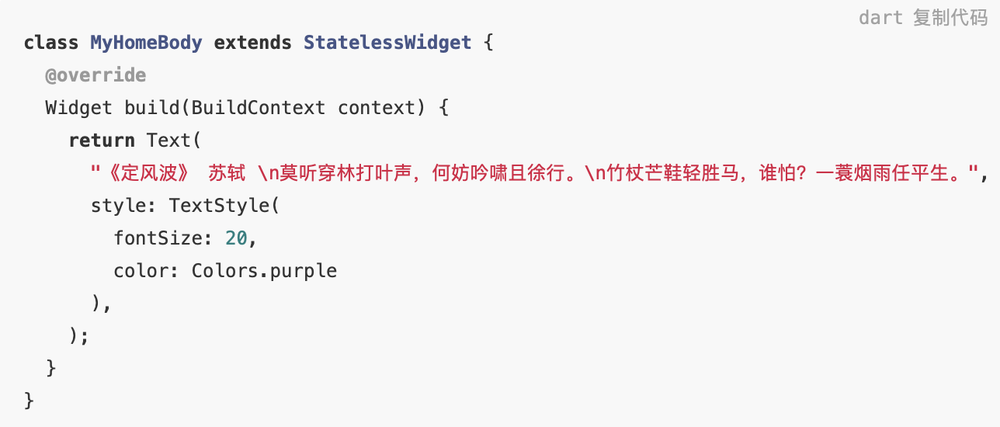

展示效果如下：

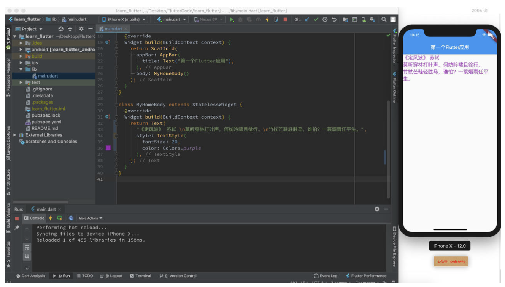

我们可以通过一些属性来改变Text的布局：

 - textAlign：文本对齐方式，比如TextAlign.center
 - maxLines：最大显示行数，比如1
 - overflow：超出部分显示方式，比如TextOverflow.ellipsis
 - textScaleFactor：控制文本缩放，比如1.24

代码如下：

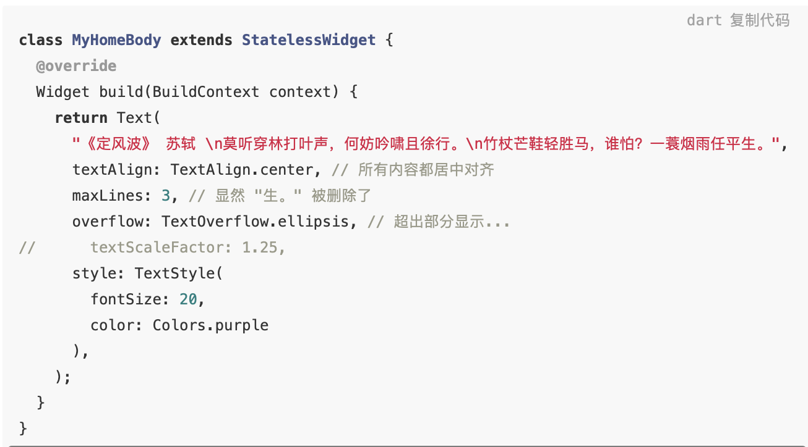

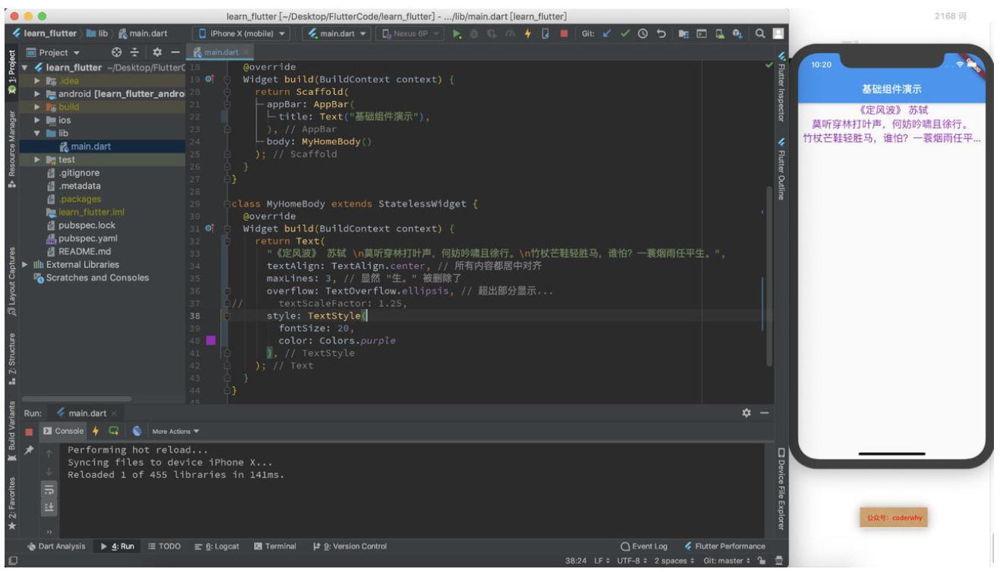


### 1.2. 富文本展示
前面展示的文本，我们都应用了相同的样式，如果我们希望给他们不同的样式呢？

 - 比如《定风波》我希望字体更大一点，并且是黑色字体，并且有加粗效果；
 - 比如 苏轼 我希望是红色字体；

如果希望展示这种混合样式，那么我们可以利用分片来进行操作（在Android中，我们可以使用SpannableString，在iOS中，我们可以使用NSAttributedString完成，了解即可）

代码如下：

```
class MyHomeBody extends StatelessWidget {
  @override
  Widget build(BuildContext context) {
    return Text.rich(
      TextSpan(
        children: [
          TextSpan(text: "《定风波》", style: TextStyle(fontSize: 25, fontWeight: FontWeight.bold, color: Colors.black)),
          TextSpan(text: "苏轼", style: TextStyle(fontSize: 18, color: Colors.redAccent)),
          TextSpan(text: "\n莫听穿林打叶声，何妨吟啸且徐行。\n竹杖芒鞋轻胜马，谁怕？一蓑烟雨任平生。")
        ],
      ),
      style: TextStyle(fontSize: 20, color: Colors.purple),
      textAlign: TextAlign.center,
    );
  }
}
```

# 二. 按钮Widget
### 2.1. 按钮的基础
Material widget库中提供了多种按钮Widget如FloatingActionButton、RaisedButton、FlatButton、OutlineButton等

我们直接来对他们进行一个展示：

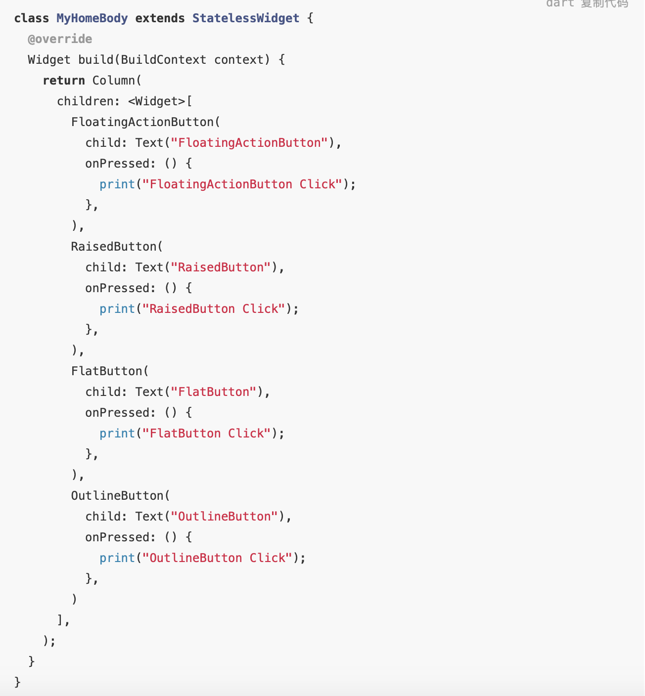

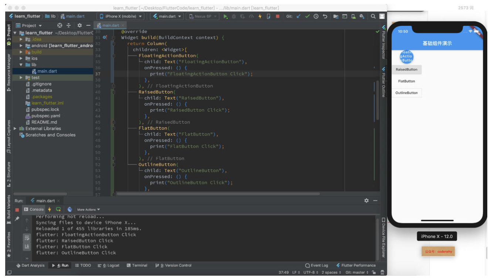

### 2.2. 自定义样式
前面的按钮我们使用的都是默认样式，我们可以通过一些属性来改变按钮的样式

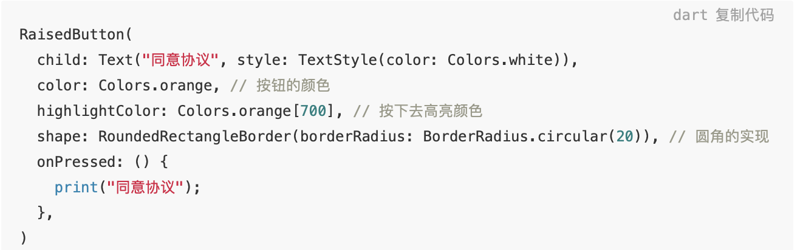

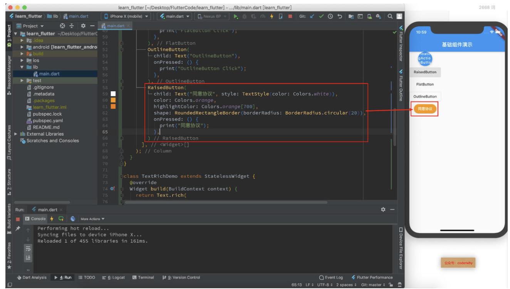


事实上这里还有一个比较常见的属性：elevation，用于控制阴影的大小，很多地方都会有这个属性，大家可以自行演示一下

### 2.3. 图文混排
实现代码：

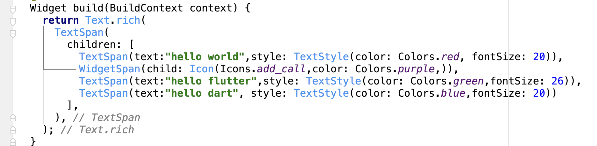

效果：

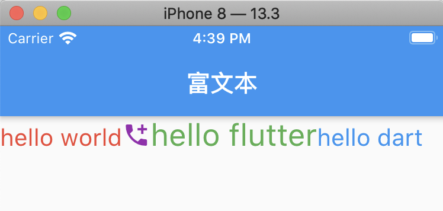

### 三. 图片Widget
图片可以让我们的应用更加丰富多彩，Flutter中使用Image组件

Image组件有很多的构造函数，我们这里主要学习两个：

- Image.assets：加载本地资源图片；
- Image.network：加载网络中的图片；

### 3.1. 加载网络图片
相对来讲，Flutter中加载网络图片会更加简单，直接传入URL并不需要什么配置，所以我们先来看一下Flutter中如何加载网络图片。

我们先来看看Image有哪些属性可以设置：

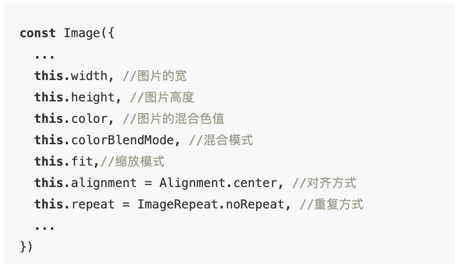

- width、height：用于设置图片的宽、高，当不指定宽高时，图片会根据当前父容器的限制，尽可能的显示其原始大小，如果只设置width、height的其中一个，那么另一个属性默认会按比例缩放，但可以通过下面介绍的fit属性来指定适应规则。
- fit：该属性用于在图片的显示空间和图片本身大小不同时指定图片的适应模式。适应模式是在BoxFit中定义，它是一个枚举类型，有如下值：
 - fill：会拉伸填充满显示空间，图片本身长宽比会发生变化，图片会变形。
 - cover：会按图片的长宽比放大后居中填满显示空间，图片不会变形，超出显示空间部分会被剪裁。
 - contain：这是图片的默认适应规则，图片会在保证图片本身长宽比不变的情况下缩放以适应当前显示空间，图片不会变形。
 - fitWidth：图片的宽度会缩放到显示空间的宽度，高度会按比例缩放，然后居中显示，图片不会变形，超出显示空间部分会被剪裁。
 - fitHeight：图片的高度会缩放到显示空间的高度，宽度会按比例缩放，然后居中显示，图片不会变形，超出显示空间部分会被剪裁。
 - none：图片没有适应策略，会在显示空间内显示图片，如果图片比显示空间大，则显示空间只会显示图片中间部分。
- color和 colorBlendMode：在图片绘制时可以对每一个像素进行颜色混合处理，color指定混合色，而colorBlendMode指定混合模式；
- repeat：当图片本身大小小于显示空间时，指定图片的重复规则。

我们对其中某些属性做一个演练：

- 注意，这里我用了一个Container，大家可以把它理解成一个UIView或者View，就是一个容器；
- 后面我会专门讲到这个组件的使用；

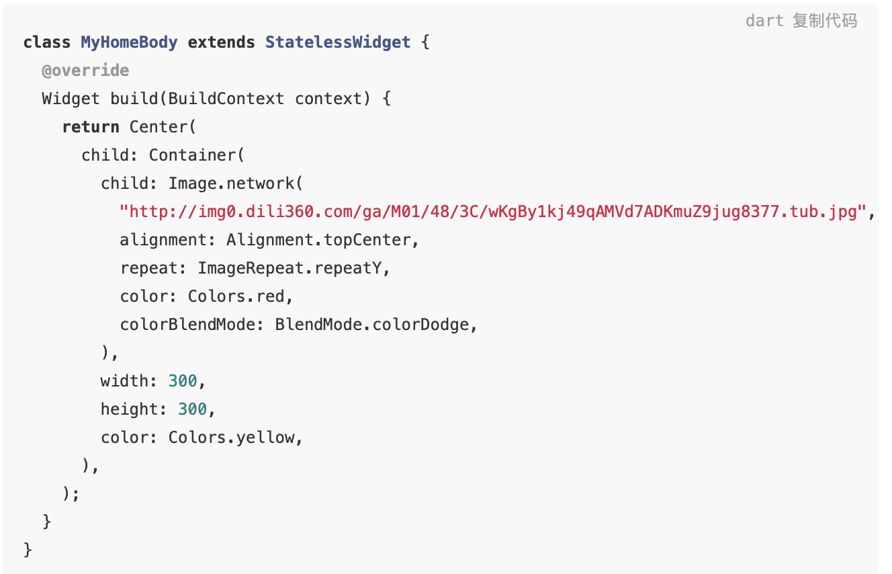

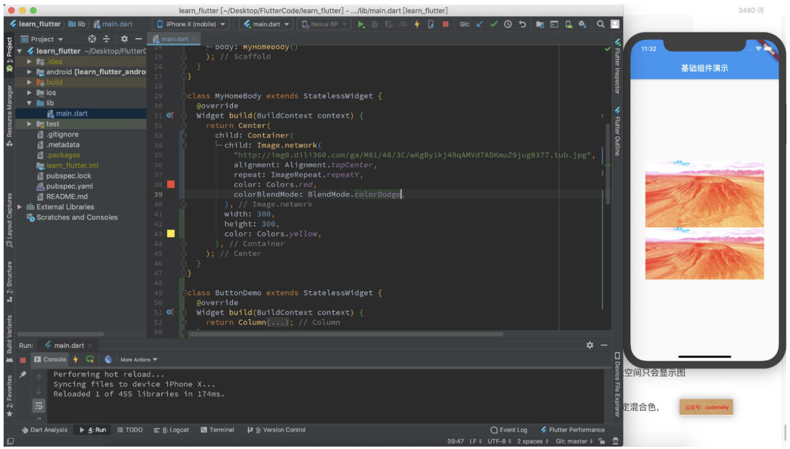


### 3.2. 加载本地图片
加载本地图片稍微麻烦一点，需要将图片引入，并且进行配置


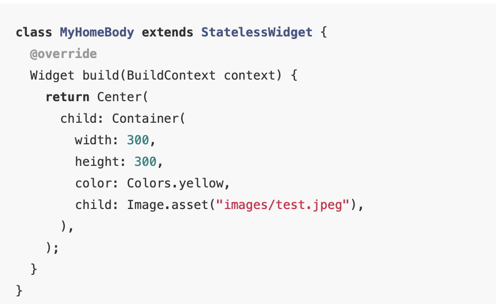

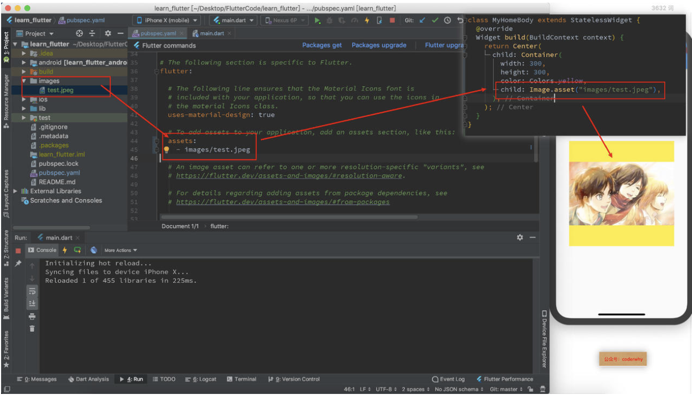
### 3.3. 实现圆角图像

在Flutter中实现圆角效果也是使用一些Widget来实现的。

#### 3.3.1. 实现圆角头像
**方式一：CircleAvatar**

CircleAvatar可以实现圆角头像，也可以添加一个子Widget：

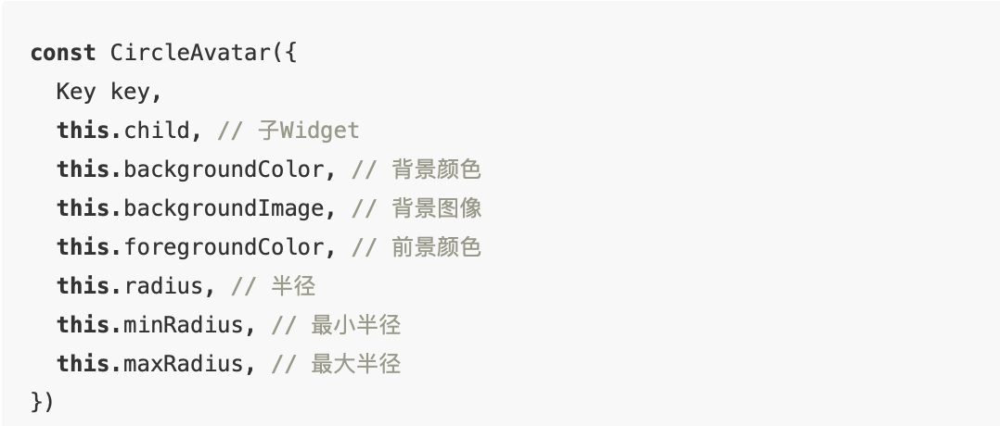


我们来实现一个圆形头像：

- 注意一：这里我们使用的是NetworkImage，因为backgroundImage要求我们传入一个ImageProvider；
 - ImageProvider是一个抽象类，事实上所有我们前面创建的Image对象都有包含image属性，该属性就是一个ImageProvider
- 注意二：这里我还在里面添加了一个文字，但是我在文字外层包裹了一个Container；
 - 这里Container的作用是为了可以控制文字在其中的位置调整；


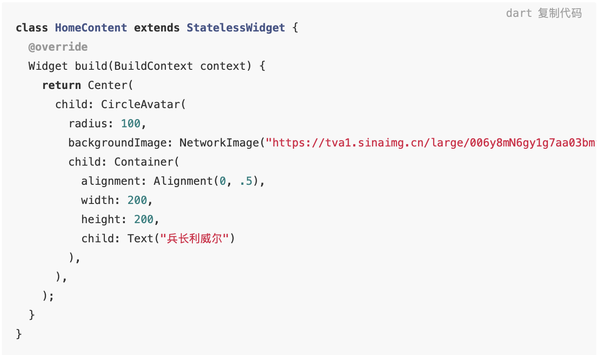

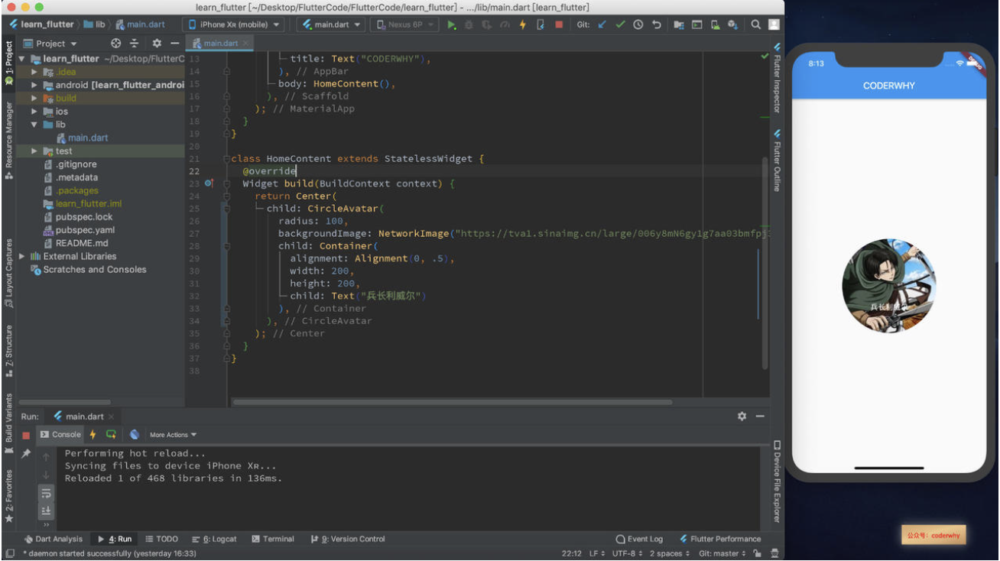


**方式二：ClipOval**

ClipOval也可以实现圆角头像，而且通常是在只有头像时使用

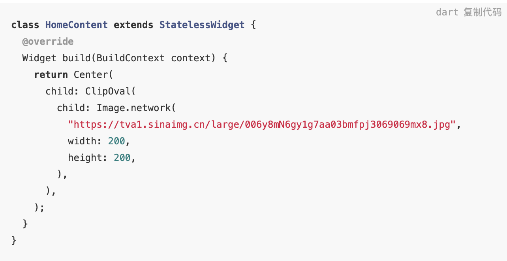

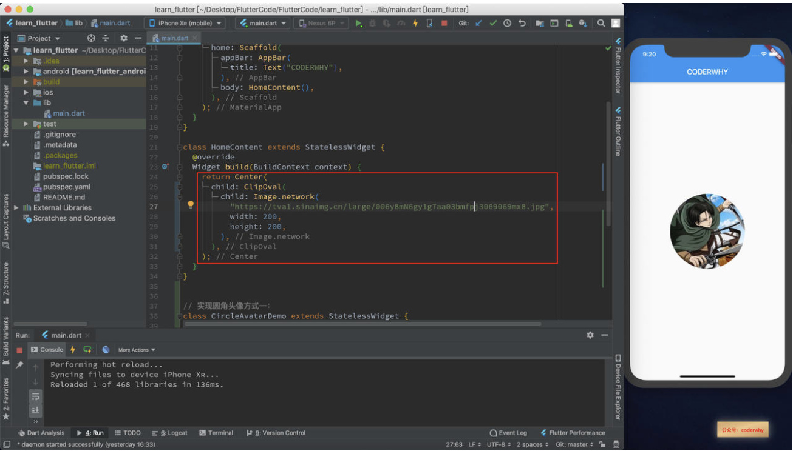

#### 3.3.2. 实现圆角图片

**方式一：ClipRRect**
ClipRRect用于实现圆角效果，可以设置圆角的大小。

实现代码如下，非常简单：

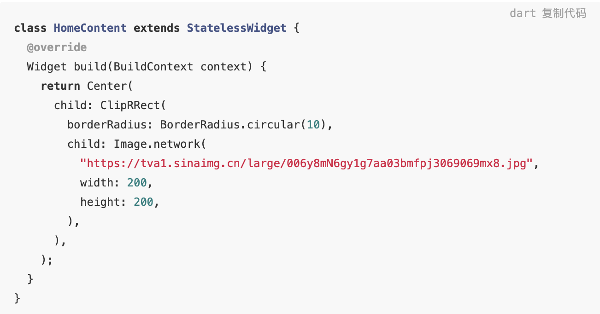


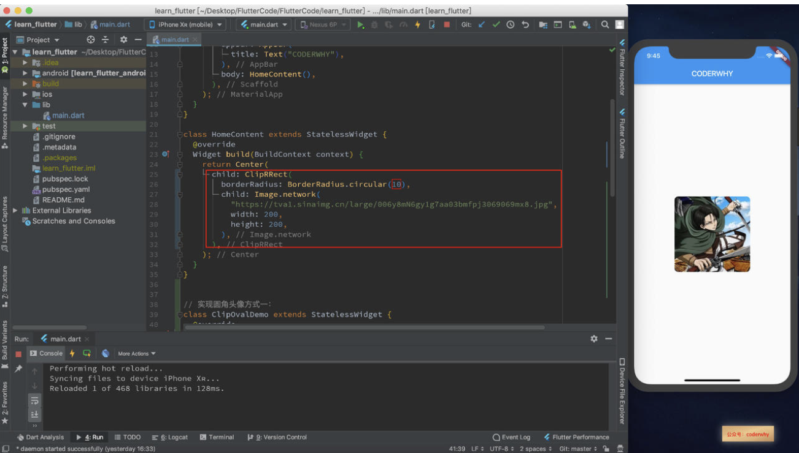


## 参考资料
> - []()
> - []()
