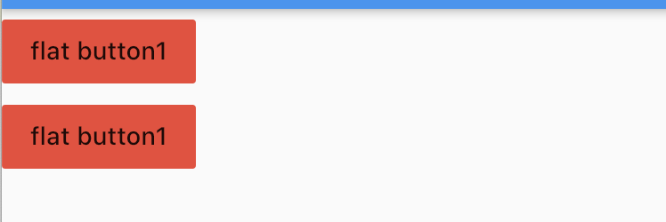
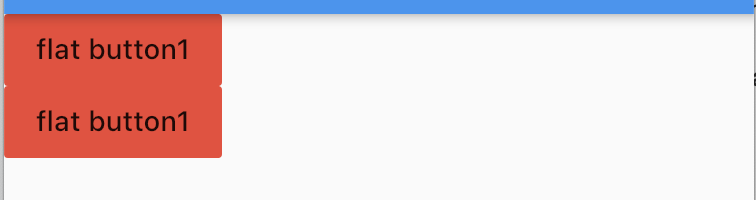
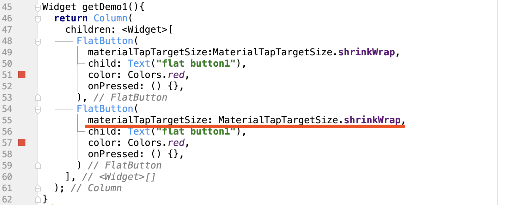
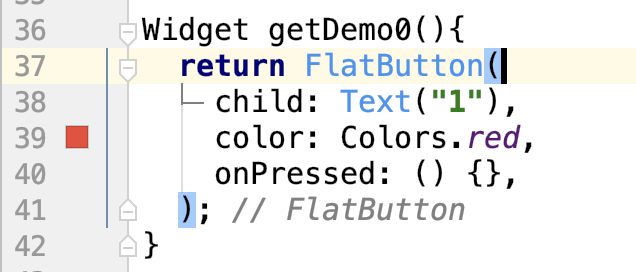
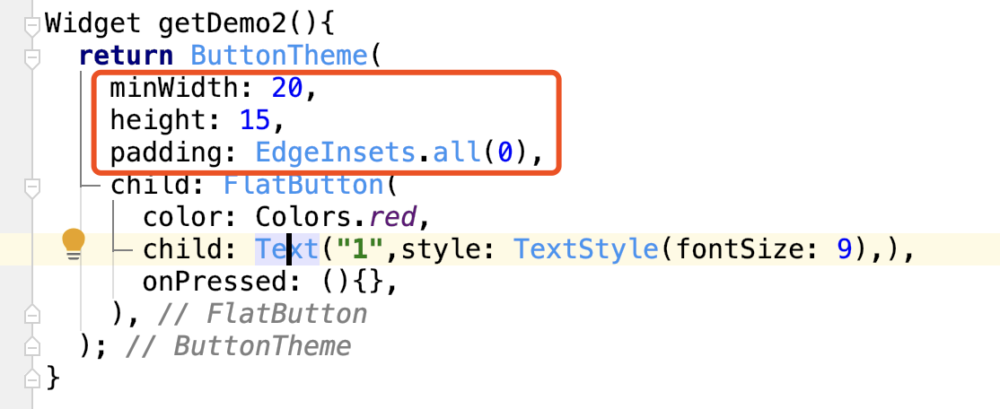

### 1，通过上边的了解，我们发现，按钮是有外边距的



当前实现的代码：

```
Widget getDemo1(){
  return Column(
    children: <Widget>[
      FlatButton(
        child: Text("flat button1"),
        color: Colors.red,
        onPressed: () {},
      ),
      FlatButton(
        child: Text("flat button1"),
        color: Colors.red,
        onPressed: () {},
      )
    ],
  );
}
```

解决办法：添加属性设置：

materialTapTargetSize:MaterialTapTargetSize.shrinkWrap,   //最小包裹



实现代码：



### 2，将文字设置为1，我们发现，按钮是有最小宽度和高度的




那么如何设置按钮的大小呢？

解决办法：

将FlatButton用ButtonTheme组件包裹起来，并且设置宽度和高度, 以及内边距



效果:


## 参考资料
> - []()
> - []()
