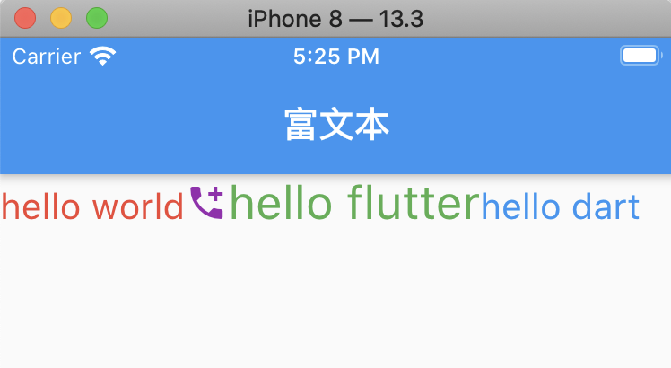
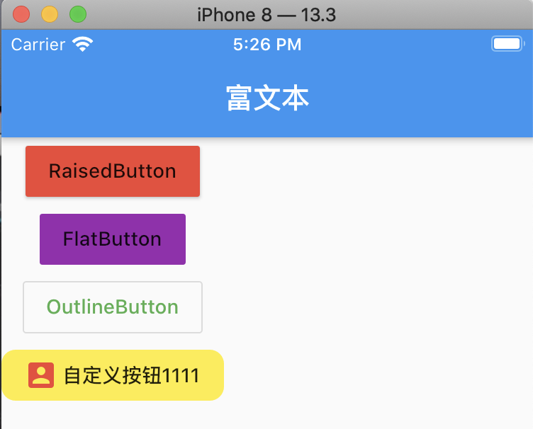
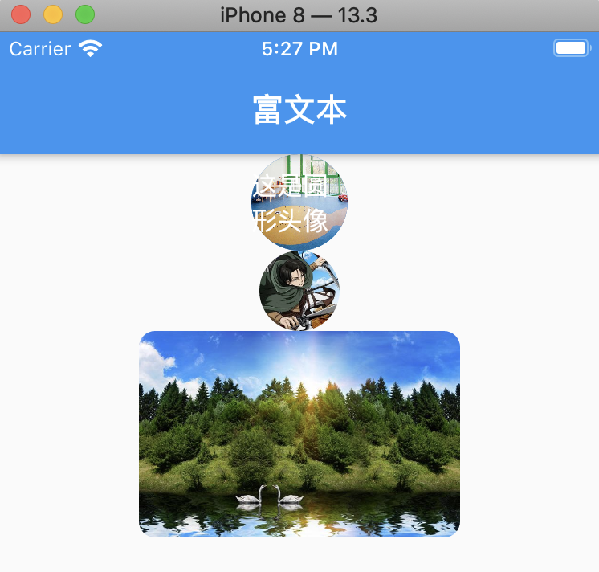

# 一：图文混排效果：



代码：

```
class HYContentBody extends StatelessWidget{
  @override
  Widget build(BuildContext context) {
    return Text.rich(
      TextSpan(
        children: [
          TextSpan(text:"hello world",style: TextStyle(color: Colors.red, fontSize: 20)),
          WidgetSpan(child: Icon(Icons.add_call,color: Colors.purple,)),
          TextSpan(text:"hello flutter",style: TextStyle(color: Colors.green,fontSize: 26)),
          TextSpan(text:"hello dart", style: TextStyle(color: Colors.blue,fontSize: 20))
        ],
      ),
    );
  }
}
```

# 二，按钮使用的效果



实现代码：
```
class HYContentBody extends StatelessWidget{
  @override
  Widget build(BuildContext context) {
    return Column(
//      crossAxisAlignment: CrossAxisAlignment.start,
      children: <Widget>[
        RaisedButton(
          child: Text("RaisedButton"),
          color: Colors.red,
          onPressed: () => print("RaisedButton click"),
        ),
        FlatButton(
            color: Colors.purple,
            onPressed: () => print("FlatButton click"),
            child: Text("FlatButton")
        ),
        OutlineButton(
          color: Colors.blue,
          textColor: Colors.green,
          onPressed: () => print("OutlineButton click"),
          child: Text("OutlineButton"),
        ),
        // 图标 + 文字 + 背景 + 圆角
        FlatButton(
          shape: RoundedRectangleBorder(
            borderRadius: BorderRadius.circular(10),
          ),
          onPressed: (){
            print("自定义button实现");
          },
          color: Colors.yellow,
          child: Row(
            mainAxisSize: MainAxisSize.min,  //自适应到最小
            children: <Widget>[
              Icon(Icons.account_box,color: Colors.red,),
              SizedBox(width: 3,),
              Text("自定义按钮1111")
            ],
          ),
        )
      ],
    );
  }
}
```

# 三： 图片实现的效果



代码：

```
class HYContentBody extends StatelessWidget{
  final url = "https://timgsa.baidu.com/timg?image&quality=80&size=b9999_10000&sec=1589191476392&di=c7e1699d62fe37ba74ff92362cc71296&imgtype=0&src=http%3A%2F%2Ffile02.16sucai.com%2Fd%2Ffile%2F2014%2F0829%2Fb871e1addf5f8e96f3b390ece2b2da0d.jpg";
  @override
  Widget build(BuildContext context) {
    return Center(
        child: Column(
          children: <Widget>[
            CircleAvatar(
              radius: 30,
              backgroundImage: NetworkImage("https://timgsa.baidu.com/timg?image&quality=80&size=b9999_10000&sec=1589191476390&di=15174b862ac6db450939ff0637c35ba4&imgtype=0&src=http%3A%2F%2F3732784.s21i-3.faidns.com%2F2%2FABUIABACGAAgxaP3qQUogPOy4QIwywg44AU.jpg"),
              child: Text("这是圆形头像"),
            ),
            ClipOval(
                child: Image.network(
                  "https://tva1.sinaimg.cn/large/006y8mN6gy1g7aa03bmfpj3069069mx8.jpg",
                  width: 50,
                  height: 50,
                )
            ),
            ClipRRect(
              borderRadius: BorderRadius.circular(10),
              child: Image.network(url,width: 200,),
            ),
          ],
        )
    );
  }
}

//通过Image方式,调用网络图片
Image getImage1(url){
  return Image(
    width: 200,
    height: 200,
    image: NetworkImage(url),
    fit: BoxFit.fitWidth,
  );
}

//通过Image方式 调用本地图片
/**
 * 1,在项目中创建 assets/images/2.0x 或者 3.0 文件夹
 * 2,在pubspec.yaml文件中，开启assets， 注意assets前面的的空格要去掉，与 uses-material-design 同一个级别。
 * 3,使用图片
 * */
Image getImage2(){
  return Image(
    //设置颜色以及混入模式
      color: Colors.red,
      colorBlendMode: BlendMode.difference,
      width: 200,
      height: 200,
      image: AssetImage(
        "assets/images/xingkong.jpeg",
      )
  );
}

```

## 参考资料
> - []()
> - []()
