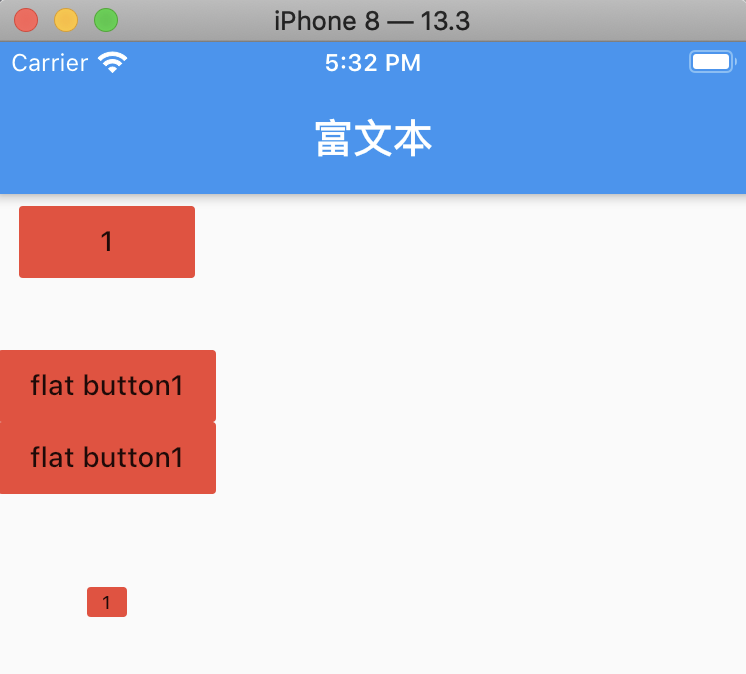
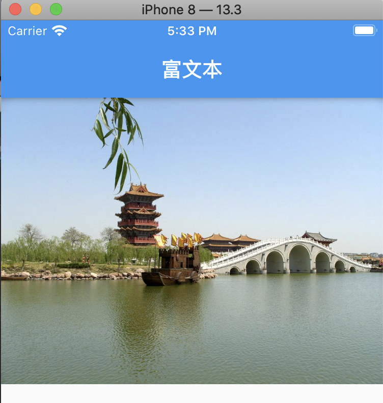
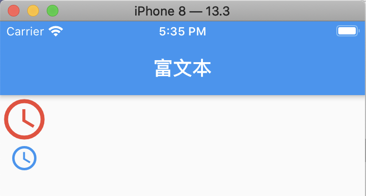
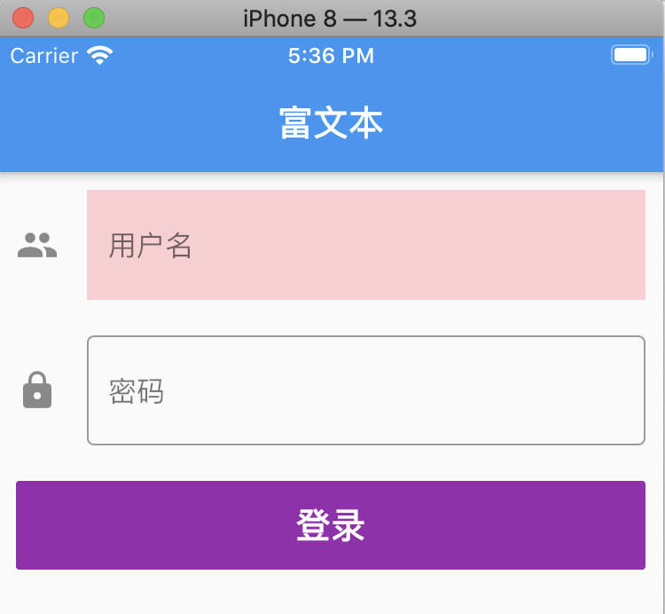
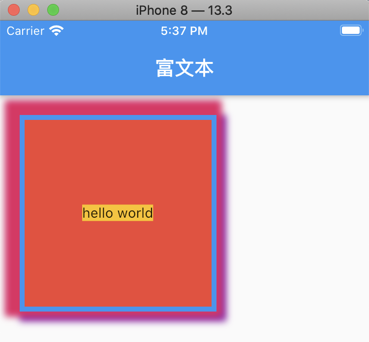
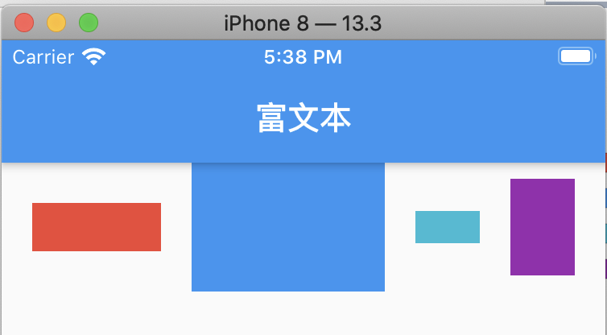
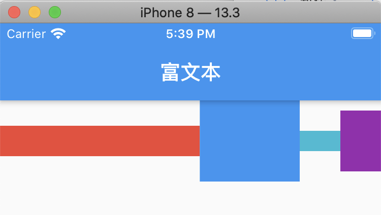
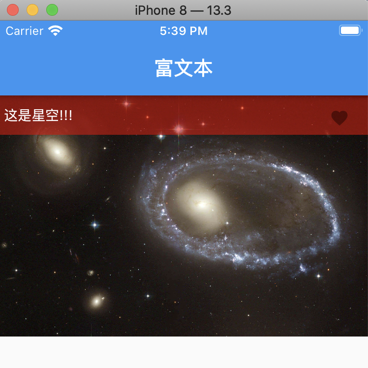

# 一：按钮设置



代码：

```
class HYContentBody extends StatelessWidget {
  @override
  Widget build(BuildContext context) {
    return Column(
      children: <Widget>[
        getDemo0(),
        SizedBox(height:30),
        getDemo1(),
        SizedBox(height:30),
        getDemo2()
      ],
    );
  }
}

Widget getDemo0(){
  return FlatButton(
    child: Text("1"),
    color: Colors.red,
    onPressed: () {},
  );
}

Widget getDemo1(){
  return Column(
    children: <Widget>[
      FlatButton(
        materialTapTargetSize:MaterialTapTargetSize.shrinkWrap,
        child: Text("flat button1"),
        color: Colors.red,
        onPressed: () {},
      ),
      FlatButton(
        materialTapTargetSize: MaterialTapTargetSize.shrinkWrap,
        child: Text("flat button1"),
        color: Colors.red,
        onPressed: () {},
      )
    ],
  );
}

Widget getDemo2(){
  return ButtonTheme(
    minWidth: 20,
    height: 15,
    padding: EdgeInsets.all(0),
    child: FlatButton(
      color: Colors.red,
      child: Text("1",style: TextStyle(fontSize: 9),),
      onPressed: (){},
    ),
  );
}

```

# 二：给图片增加占位图



实现代码：

```
class HYContentBody extends StatelessWidget {
  @override
  Widget build(BuildContext context) {
    return FadeInImage(
        fadeInDuration: Duration(seconds: 1),   //淡入时间
        fadeOutDuration: Duration(seconds: 1),  //淡出时间
        placeholder: AssetImage("assets/images/xingkong.jpeg"), //占位图
        image: NetworkImage("https://timgsa.baidu.com/timg?image&quality=80&size=b9999_10000&sec=1589203158053&di=4ca63350aef3bf0b0459e872ca7db5e7&imgtype=0&src=http%3A%2F%2Fa3.att.hudong.com%2F14%2F75%2F01300000164186121366756803686.jpg")
    );
  }
}

```

# 三：图标的使用



代码：

```
class HYContentBody extends StatelessWidget {
  @override
  Widget build(BuildContext context) {
    /**
     * Icon字体图标 和 图片图标
     * 1,字体图标是矢量图(放大的时候不会失真)
     * 2,字体图标可以设置颜色
     * 3,图标很多时，占据空间更小
     * 4,  0xe192 -> unicode编码
     *     设置对象的字体
     * */
//    return Icon(Icons.access_time,color: Colors.red,size: 300,);
//    IconData(0xe192, fontFamily: 'MaterialIcons');
//    return Text("\ue192",style: TextStyle(fontFamily: "MaterialIcons",color: Colors.blue,fontSize: 30),);
      return Column(
        children: <Widget>[
          Icon(Icons.access_time,color: Colors.red,size: 50,),
          Text("\ue192",style: TextStyle(fontFamily: "MaterialIcons",color: Colors.blue,fontSize: 30),),
        ],
      );
  }
}

```

# 四：文本输入框



实现代码：

```
class HYContentBody extends StatelessWidget {
  final userNameController = TextEditingController();
  final passwordController = TextEditingController();
  @override
  Widget build(BuildContext context) {
    return Theme(
      data:ThemeData(
        primaryColor: Colors.red,
      ),
      child: Padding(
        padding: EdgeInsets.all(10),
        child: Column(
          children: <Widget>[
            Column(
              children: <Widget>[
                TextField(
                  controller: userNameController,
//                  keyboardType: TextInputType.number, //键盘类型
                  decoration: InputDecoration(
                      icon: Icon(Icons.people),
                      labelText: "用户名",
//                  border: OutlineInputBorder(),
                      border: InputBorder.none,
                      hintText: "请输入用户名",
                      filled: true,
                      fillColor: Colors.red[100]
                  ),
                  onChanged: (value){
                    print("onChanged:$value");
                  },
                  onSubmitted: (value){
                    print("onSubmitted:$value");
                  },
                ),
                SizedBox(height:20),
                TextField(
                  controller: passwordController,
                  decoration: InputDecoration(
                      icon: Icon(Icons.lock),
                      labelText: "密码",
                      hintText: "请输入密码",
                      border: OutlineInputBorder(
                          borderSide: BorderSide(
                              color: Colors.red,
                              width: 2
                          )
                      )
                  ),
                  onChanged: (value){
                    print("password onChange:$value");
                  },
                ),
                SizedBox(height:20),
                Container(
//                  width: 200,
                  width: double.infinity,
                  height: 50,
                  child: FlatButton(
                    color: Colors.purple,
                    child: Text("登录",style: TextStyle(color: Colors.white, fontSize: 20),),
                    onPressed: (){
                      final userName = userNameController.text;
                      final password = passwordController.text;
                      print("userName;$userName, password:$password");

                      //清空数据
                      userNameController.clear();
                      passwordController.clear();
                    },
                  ),
                ),
              ],
            ),
          ],
        ),
      ),
    );
  }
}
```

# 五：Container组件



代码：

```
class HYContentBody extends StatelessWidget {
  final userNameController = TextEditingController();
  final passwordController = TextEditingController();
  @override
  Widget build(BuildContext context) {
    return Container(
      width: 200,
      height: 200,
//      color: Colors.red,
      padding: EdgeInsets.all(10),
      margin: EdgeInsets.all(20),
      decoration: BoxDecoration(
          color: Colors.red,
          border: Border.all(
              color:Colors.blue,  //边框颜色
              width: 5            //边框宽度
          ),

          //设置圆角
//        borderRadius: BorderRadius.all(
//            Radius.circular(10),
//        ),

//        borderRadius: BorderRadius.circular(100),   //设置圆形
          boxShadow: [
            BoxShadow(
              color: Colors.purple,
              offset: Offset(5,5),
              spreadRadius: 5,
              blurRadius: 5,
            ),
            BoxShadow(
                color: Colors.pink,     //阴影颜色
                offset: Offset(-5,-5),  //偏移量
                spreadRadius: 10, //扩展半径
                blurRadius: 5  //模糊半径
            )
          ]
      ),
      alignment: Alignment.center,
//      child: Icon(Icons.pets,color: Colors.white,size: 30,)
//      child: Text("hello",textAlign: TextAlign.justify,),
      child: Text("hello world",style: TextStyle(backgroundColor: Colors.amber),),
    );
  }
}
```

# 六：Row组件



实现代码：

```
class HYContentBody extends StatelessWidget {
  final userNameController = TextEditingController();
  final passwordController = TextEditingController();
  @override
  Widget build(BuildContext context) {
    /**
     * Row 特点：
     *  - 水平方向尽可能占据比较大的客供件
     *    * 水平方向尽可能的包括内容，那么设置 mainAxisSize = min
     *  - 垂直方向包括内容
     *  MainAxisAlignment:
     *    - start: 主轴的开始位置挨个摆放元素(默认值)
     *    - end: 主轴的结束位置挨个摆放元素
     *    - center: 主轴的中心点对齐
     *    - spaceBetween: 左右两边的间距为0，其他元素之间平分间距
     *    - spaceAround: 左右两边的间距是其他元素之间的间距一半
     *    - spaceEvenly: 所有的元素间距平分空间
     *  CrossAxisAlignment:
     *    - start: 交叉轴的起始位置对齐
     *    - end: 交叉抽的结束位置对齐
     *    - center: 中心点对齐(默认值)
     *    - baseline: 基线对齐(必须有文字的时候才起效果)
     *    - stretch: 先Row占据交叉抽尽可能的空间，将所有的子widget交叉抽的高度，拉伸到最大。
     * */
    return Container(
//      height: 150,
//      color: Colors.black26,
      child: Row(
        mainAxisAlignment: MainAxisAlignment.spaceEvenly,
//        mainAxisSize: MainAxisSize.max,
//        crossAxisAlignment: CrossAxisAlignment.stretch,
        children: <Widget>[
          Container(width: 80, height: 30, color: Colors.red,),
          Container(width: 120, height: 80, color: Colors.blue,),
          Container(width:40, height: 20, color: Colors.cyan,),
          Container(width: 40, height: 60, color: Colors.purple,)

        ],
      ),
    );
  }
}
```

# 七：Expanded组件



代码：

```
class HYContentBody extends StatelessWidget {
  @override
  Widget build(BuildContext context) {
    return Container(
      child: Row(
        children: <Widget>[
          Expanded(
              flex: 2,
              child: Container(width: 80, height: 30, color: Colors.red,)
          ),
          Expanded(
            flex: 1,
            child: Container(width: 120, height: 80, color: Colors.blue,),
          ),
          Container(width:40, height: 20, color: Colors.cyan,),
          Container(width: 40, height: 60, color: Colors.purple,)

        ],
      ),
    );
  }
}
```

# 八：Stack组件



实现代码：

```
/**
 * Stack 默认的大小是包裹内容的
 *  - alignment: 从什么位置开始排布所有的子widget
 *  - fit: expand(很少用), 将子元素拉伸到尽可能到大
 *  - overflow: 超出部分如何处理。
 * */

class HYContentBody extends StatelessWidget {
  @override
  Widget build(BuildContext context) {
    return Container(
      child: Stack(
//        alignment: Alignment.bottomCenter,
        overflow: Overflow.clip,  //超出部分裁剪
        children: <Widget>[
          Image.asset("assets/images/xingkong.jpeg"),
          Positioned(
            left: 0,
            top:0,
            right:0,
            child:
            Container(
                height: 40,
                color: Color.fromARGB(130, 255, 0, 0),
                padding: EdgeInsets.all(5),
                alignment: Alignment.center,
                child: Row(
                  mainAxisAlignment: MainAxisAlignment.spaceBetween,
                  children: <Widget>[
                    Text(
                      "这是星空!!!",
                      style: TextStyle(
                          color: Colors.white
                      ),
                    ),
                    IconButton(
                      icon:Icon(Icons.favorite,size: 20,),
                      color: Colors.white,
                    )
                  ],
                )
            ),
          )
        ],
      ),
    );
  }
}
```

## 参考资料
> - []()
> - []()
