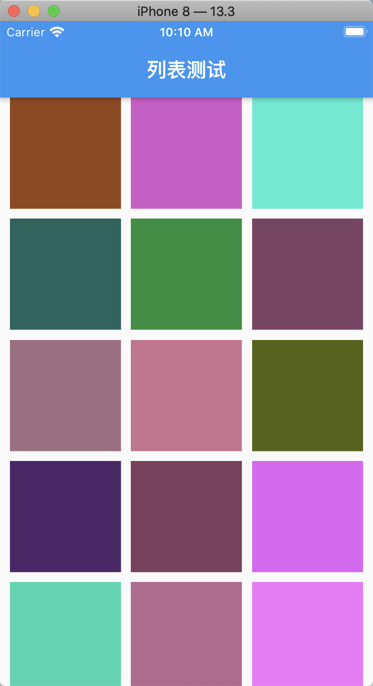
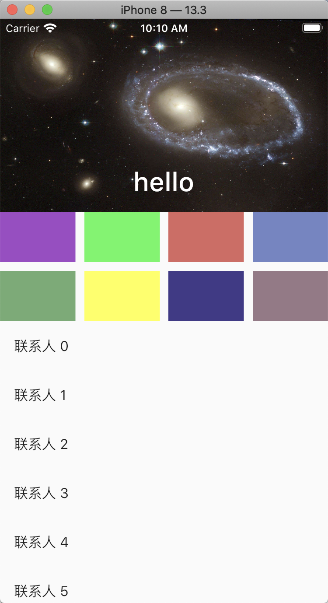
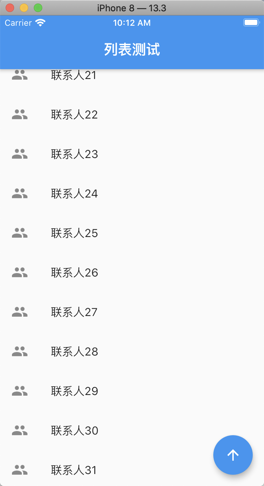

# 一：ListView组件的使用

```
import 'package:flutter/material.dart';

void main() {
  runApp(MyApp());
}

class MyApp extends StatelessWidget {
  @override
  Widget build(BuildContext context) {
    return MaterialApp(
      debugShowCheckedModeBanner: false,
      home: HYHomePage(),
    );
  }
}

class HYHomePage extends StatelessWidget {
  @override
  Widget build(BuildContext context) {
    return Scaffold(
      appBar: AppBar(
        title: Text("富文本"),
      ),
      body: HYContentBody(),
    );
  }
}

class HYContentBody extends StatelessWidget {
  @override
  Widget build(BuildContext context) {
    return ListView.separated(
        itemBuilder: (BuildContext ctx, int index){
          return ListTile(
            title: Text("联系人$index",style: TextStyle(backgroundColor: Colors.blue),),
          );
        },
        separatorBuilder: (BuildContext ctx, int index){
          return Divider(
            color: Colors.red,
            indent: 60,   //前边的距离
            endIndent: 100,   //后边的距离
            height: 5,       //分割线所占的高度
            thickness: 10,    //分割线的厚度，即高度
          );
        },
        itemCount: 100);
  }
}


class HYContentBody3 extends StatelessWidget {
  @override
  Widget build(BuildContext context) {
    return ListView.builder(
        itemExtent: 80,   //项的高度，或者宽度
//        scrollDirection: Axis.horizontal,
//        reverse: true,   //列表数据反转
        itemCount: 100,
        itemBuilder: (BuildContext ctx, int index) {
          return ListTile(
            leading: Icon(Icons.people),
            trailing: Icon(Icons.delete),
            title: Text("联系人 $index"),
            subtitle: Text("电话号码 18811112222"),
          );
        }
    );
  }
}


class HYContentBody2 extends StatelessWidget {
  @override
  Widget build(BuildContext context) {
    return ListView(
      children: List.generate(100, (index){
        return Text("Hello world $index",style: TextStyle(fontSize: 30),);
      }),
    );
  }
}


class HYContentBody1 extends StatelessWidget {
  @override
  Widget build(BuildContext context) {
    return ListView(
      children: <Widget>[
        Text("hello world 1"),
        Text("hello world 2"),
        Text("hello world 3"),
      ],
    );
  }
}

```

# 二：GridView的使用
效果图：



实现代码：

```
import 'dart:ffi';
import 'dart:math';

import 'package:flutter/material.dart';

void main() {
  runApp(MyApp());
}

class MyApp extends StatelessWidget {
  @override
  Widget build(BuildContext context) {
    return MaterialApp(
      debugShowCheckedModeBanner: false,
      home: HYHomePage(),
    );
  }
}

class HYHomePage extends StatelessWidget {
  @override
  Widget build(BuildContext context) {
    return Scaffold(
      appBar: AppBar(
        title: Text("列表测试"),
      ),
      body: HYContentBody(),
    );
  }
}

class HYContentBody extends StatelessWidget {
  @override
  Widget build(BuildContext context) {
    return Padding(
      padding: EdgeInsets.symmetric(horizontal:10),  //对称间距，水平方向上间距10个点
      child: GridView.builder(
          gridDelegate: SliverGridDelegateWithFixedCrossAxisCount(
              crossAxisCount: 3,
              mainAxisSpacing: 10,
              crossAxisSpacing: 10
          ),
          itemBuilder: (BuildContext ctx,int index){
            return Container(
              color: Color.fromARGB(255, Random().nextInt(256), Random().nextInt(256), Random().nextInt(256)),
            );
          }
      ),
    );
  }
}

//代理： SliverGridDelegateWithMaxCrossAxisExtent(最大交叉轴)
class HYContentBody2 extends StatelessWidget {
  @override
  Widget build(BuildContext context) {
    return GridView(
        gridDelegate: SliverGridDelegateWithMaxCrossAxisExtent(
            maxCrossAxisExtent: 200,  //交叉轴的数量
            mainAxisSpacing: 10, //主轴上的间距
            crossAxisSpacing: 10,  //交叉轴上的间距
            childAspectRatio: 0.8 //宽高比
        ),
        children: List.generate(100, (index){
          return Container(
            color: Color.fromARGB(255, Random().nextInt(256), Random().nextInt(256), Random().nextInt(256)),
          );
        })
    );
  }
}

//代理： SliverGridDelegateWithFixedCrossAxisCount (固定轴上数量)
class HYContentBody1 extends StatelessWidget {
  @override
  Widget build(BuildContext context) {
    return GridView(
        gridDelegate: SliverGridDelegateWithFixedCrossAxisCount(
            crossAxisCount: 3,  //交叉轴的数量
            crossAxisSpacing: 10,  //交叉轴上的间距
            mainAxisSpacing: 20,  //主轴上的间距
            childAspectRatio:0.7  //宽高比例
        ),
        children: List.generate(100, (index){
          return Container(
            color: Color.fromARGB(255, Random().nextInt(256), Random().nextInt(256), Random().nextInt(256)),
          );
        })
    );
  }
}

```

# 三，自定义滚动view CustomScrollView



实现代码：

```
import 'dart:ffi';
import 'dart:math';

import 'package:flutter/material.dart';

void main() {
  runApp(MyApp());
}

class MyApp extends StatelessWidget {
  @override
  Widget build(BuildContext context) {
    return MaterialApp(
      debugShowCheckedModeBanner: false,
      home: HYHomePage(),
    );
  }
}

class HYHomePage extends StatelessWidget {
  @override
  Widget build(BuildContext context) {
    return Scaffold(
//      appBar: AppBar(
//        title: Text("列表测试"),
//      ),
      body: HYContentBody(),
    );
  }
}

class HYContentBody extends StatelessWidget {
  @override
  Widget build(BuildContext context) {
    return CustomScrollView(
      slivers: <Widget>[
        SliverAppBar(
//          title: Text("这是title"),
          expandedHeight: 200,
          flexibleSpace: FlexibleSpaceBar(
            title: Text("hello"),
            background: Image.asset("assets/images/xingkong.jpeg",fit:BoxFit.fill),
          ),
        ),
        SliverGrid(
          gridDelegate: SliverGridDelegateWithFixedCrossAxisCount(
              crossAxisCount: 4,
              mainAxisSpacing: 10,
              crossAxisSpacing: 10,
              childAspectRatio: 1.5
          ),
          delegate: SliverChildBuilderDelegate(
                  (BuildContext ctx, int index){
                return Container(
                  color: Color.fromARGB(255, Random().nextInt(256), Random().nextInt(256), Random().nextInt(256)),
                );
              },
              childCount: 8
          ),
        ),
        SliverList(
          delegate: SliverChildBuilderDelegate(
                  (BuildContext ctx,int index) {
                return ListTile(
                  title: Text("联系人 $index"),
                );
              },
              childCount: 20
          ),
        ),
      ],
    );
  }
}

```

# 四：滚动监听



实现代码：

```
import 'dart:ffi';
import 'dart:math';

import 'package:flutter/material.dart';

void main() {
  runApp(MyApp());
}

class MyApp extends StatelessWidget {
  @override
  Widget build(BuildContext context) {
    return MaterialApp(
      debugShowCheckedModeBanner: false,
      home: HYHomePage(),
    );
  }
}

class HYHomePage extends StatefulWidget {
  @override
  _HYHomePageState createState() => _HYHomePageState();
}

class _HYHomePageState extends State<HYHomePage> {

  ScrollController _scrollController = new ScrollController(initialScrollOffset: 100);

  bool _isShowFloatingButton = false;
  @override
  void initState() {
    super.initState();
    _scrollController.addListener(() {
//      print("监听到滚动......当前滚动位置：${_scrollController.offset}");
      setState(() {
        _isShowFloatingButton = _scrollController.offset > 800;
      });
    });
  }

  @override
  Widget build(BuildContext context) {
    return Scaffold(
      appBar: AppBar(
        title: Text("列表测试"),
      ),
      body: NotificationListener(
        onNotification: (ScrollNotification notification){
          //开始滚动的通知
          if(notification is ScrollStartNotification){
            print("开始滚动.....");
          }else if(notification is ScrollUpdateNotification){
            print("正在滚动中.....总体位置：${notification.metrics.maxScrollExtent} ,当前位置${notification.metrics.pixels}");
          }else if(notification is ScrollEndNotification){
            print("结束滚动....");
          }
        },
        child: ListView.builder(
          controller: _scrollController,
          itemBuilder: (BuildContext ctx,int index){
            return ListTile(
              leading: Icon(Icons.people),
              title: Text("联系人$index"),
            );
          },
          itemCount: 100,
        ),
      ),
      floatingActionButton: (_isShowFloatingButton ? FloatingActionButton(
          child: Icon(Icons.arrow_upward),
          onPressed: (){
            //滚动到顶部
            _scrollController.animateTo(0, duration: Duration(milliseconds:250), curve: Curves.easeIn
            );
          }
      ) : null),
    );
  }
}

```


## 参考资料
> - []()
> - []()
