# 一. Dart的异步模型
### 1.1. Dart是单线程的

##### 1.1.1. 程序中的耗时操作

开发中的耗时操作：

- 在开发中，我们经常会遇到一些耗时的操作需要完成，比如网络请求、文件读取等等；

- 如果我们的主线程一直在等待这些耗时的操作完成，那么就会进行阻塞，无法响应其它事件，比如用户的点击；

- 显然，我们不能这么干！！

如何处理耗时的操作呢？

针对如何处理耗时的操作，不同的语言有不同的处理方式。

- 处理方式一： 多线程，比如Java、C++，我们普遍的做法是开启一个新的线程（Thread），在新的线程中完成这些异步的操作，再通过线程间通信的方式，将拿到的数据传递给主线程。

- 处理方式二： 单线程+事件循环，比如JavaScript、Dart都是基于单线程加事件循环来完成耗时操作的处理。不过单线程如何能进行耗时的操作呢？！

##### 1.1.2. 单线程的异步操作

我之前碰到很多开发者都对单线程的异步操作充满了问号？？？


其实它们并不冲突：

- 因为我们的一个应用程序大部分时间都是处于空闲的状态的，并不是无限制的在和用户进行交互。
- 比如等待用户点击、网络请求数据的返回、文件读写的IO操作，这些等待的行为并不会阻塞我们的线程；
- 这是因为类似于网络请求、文件读写的IO，我们都可以基于非阻塞调用；

**阻塞式调用和非阻塞式调用**

如果想搞懂这个点，我们需要知道操作系统中的**阻塞式调用**和**非阻塞式调用**的概念。

阻塞和非阻塞关注的是程序在等待调用结果（消息，返回值）时的状态。

- 阻塞式调用： 调用结果返回之前，当前线程会被挂起，调用线程只有在得到调用结果之后才会继续执行。
- 非阻塞式调用： 调用执行之后，当前线程不会停止执行，只需要过一段时间来检查一下有没有结果返回即可。

我们用一个生活中的例子来模拟：

你中午饿了，需要点一份外卖，点外卖的动作就是我们的调用，拿到最后点的外卖就是我们要等待的结果。

- 阻塞式调用： 点了外卖，不再做任何事情，就是在傻傻的等待，你的线程停止了任何其他的工作。
- 非阻塞式调用： 点了外卖，继续做其他事情：继续工作、打把游戏，你的线程没有继续执行其他事情，只需要偶尔去看一下有没有人敲门，外卖有没有送到即可。

而我们开发中的很多耗时操作，都可以基于这样的 非阻塞式调用：

- 比如网络请求本身使用了Socket通信，而Socket本身提供了select模型，可以进行非阻塞方式的工作；
- 比如文件读写的IO操作，我们可以使用操作系统提供的基于事件的回调机制；

这些操作都不会阻塞我们单线程的继续执行，我们的线程在等待的过程中可以继续去做别的事情：喝杯咖啡、打把游戏，等真正有了响应，再去进行对应的处理即可。

这时，我们可能有两个问题：

- 问题一： 如果在多核CPU中，单线程是不是就没有充分利用CPU呢？这个问题，我会放在后面来讲解。
- 问题二： 单线程是如何来处理网络通信、IO操作它们返回的结果呢？答案就是事件循环（Event Loop）。

### 1.2. Dart事件循环

##### 1.2.1. 什么是事件循环

单线程模型中主要就是在维护着一个事件循环（Event Loop）。

事件循环是什么呢？

- 事实上事件循环并不复杂，它就是将需要处理的一系列事件（包括点击事件、IO事件、网络事件）放在一个事件队列（Event Queue）中。
- 不断的从事件队列（Event Queue）中取出事件，并执行其对应需要执行的代码块，直到事件队列清空位置。

我们来写一个事件循环的伪代码：

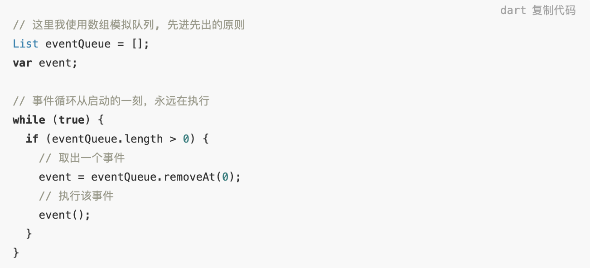

当我们有一些事件时，比如点击事件、IO事件、网络事件时，它们就会被加入到eventLoop中，当发现事件队列不为空时发现，就会取出事件，并且执行。

- 齿轮就是我们的事件循环，它会从队列中一次取出事件来执行。

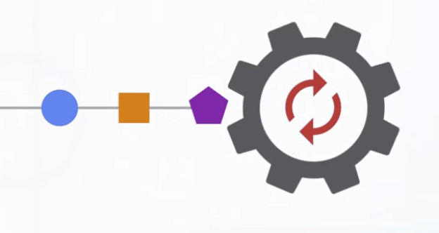

##### 1.2.2. 事件循环代码模拟

这里我们来看一段伪代码，理解点击事件和网络请求的事件是如何被执行的：

这是一段Flutter代码，很多东西大家可能不是特别理解，但是耐心阅读你会读懂我们在做什么。

一个按钮RaisedButton，当发生点击时执行onPressed函数。

onPressed函数中，我们发送了一个网络请求，请求成功后会执行then中的回调函数。

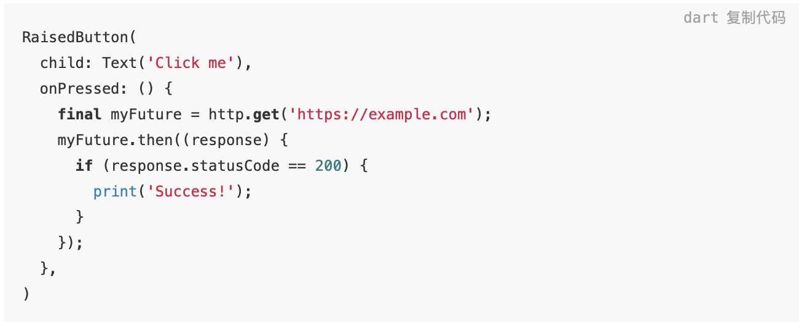

这些代码是如何放在事件循环中执行呢？

1、当用户发生点击的时候，onPressed回调函数被放入事件循环中执行，执行的过程中发送了一个网络请求。
2、网络请求发出去后，该事件循环不会被阻塞，而是发现要执行的onPressed函数已经结束，会将它丢弃掉。
3、网络请求成功后，会执行then中传入的回调函数，这也是一个事件，该事件被放入到事件循环中执行，执行完毕后，事件循环将其丢弃。

尽管onPressed和then中的回调有一些差异，但是它们对于事件循环来说，都是告诉它：我有一段代码需要执行，快点帮我完成。

# 二. Dart的异步操作

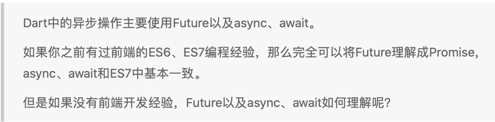

### 2.1. 认识Future

##### 2.1.1. 同步的网络请求

我们先来看一个例子吧：

- 在这个例子中，我使用getNetworkData来模拟了一个网络请求；
- 该网络请求需要3秒钟的时间，之后返回数据；

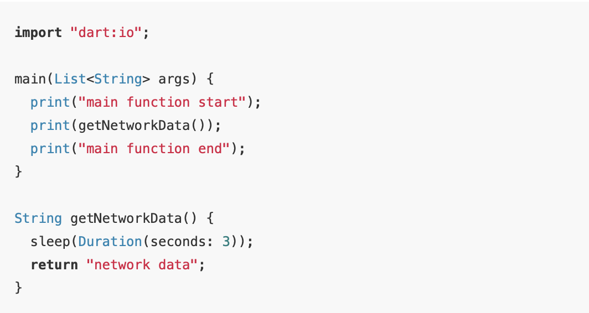

这段代码会运行怎么的结果呢？

- getNetworkData会阻塞main函数的执行

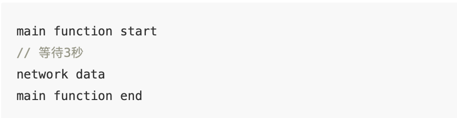

显然，上面的代码不是我们想要的执行效果，因为网络请求阻塞了main函数，那么意味着其后所有的代码都无法正常的继续执行。

##### 2.1.2. 异步的网络请求
我们来对我们上面的代码进行改进，代码如下：

- 和刚才的代码唯一的区别在于我使用了Future对象来将耗时的操作放在了其中传入的函数中；
- 稍后，我们会讲解它具体的一些API，我们就暂时知道我创建了一个Future实例即可；

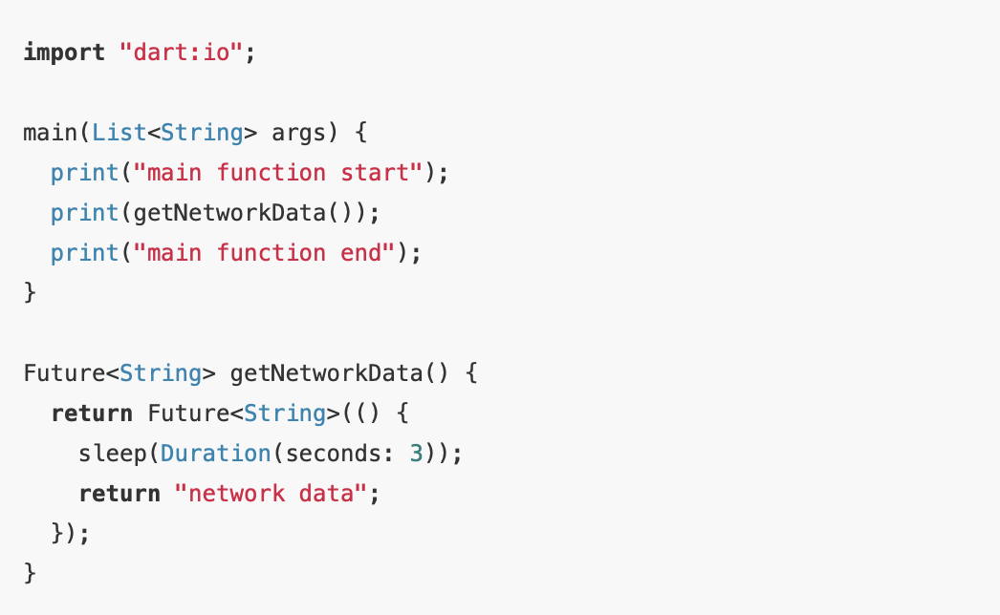


我们来看一下代码的运行结果：

- 1、这一次的代码顺序执行，没有出现任何的阻塞现象；
- 2、和之前直接打印结果不同，这次我们打印了一个Future实例；
- 结论：我们将一个耗时的操作隔离了起来，这个操作不会再影响我们的主线程执行了。
- 问题：我们如何去拿到最终的结果呢？

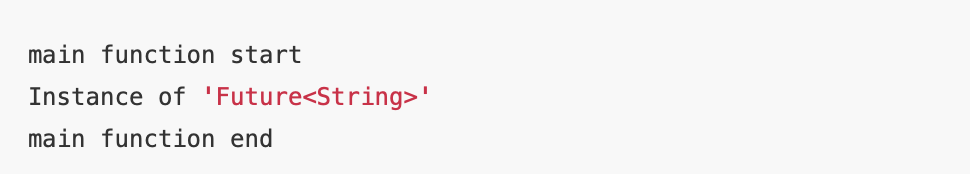

获取Future得到的结果

有了Future之后，如何去获取请求到的结果：通过.then的回调：

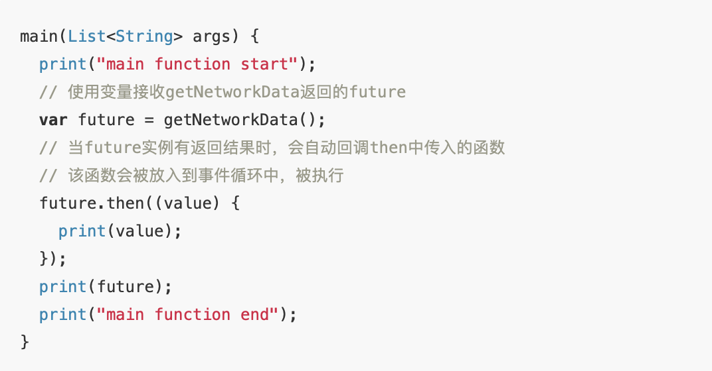

上面代码的执行结果：

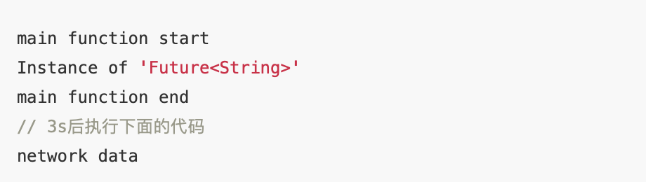

**执行中出现异常**

如果调用过程中出现了异常，拿不到结果，如何获取到异常的信息呢？

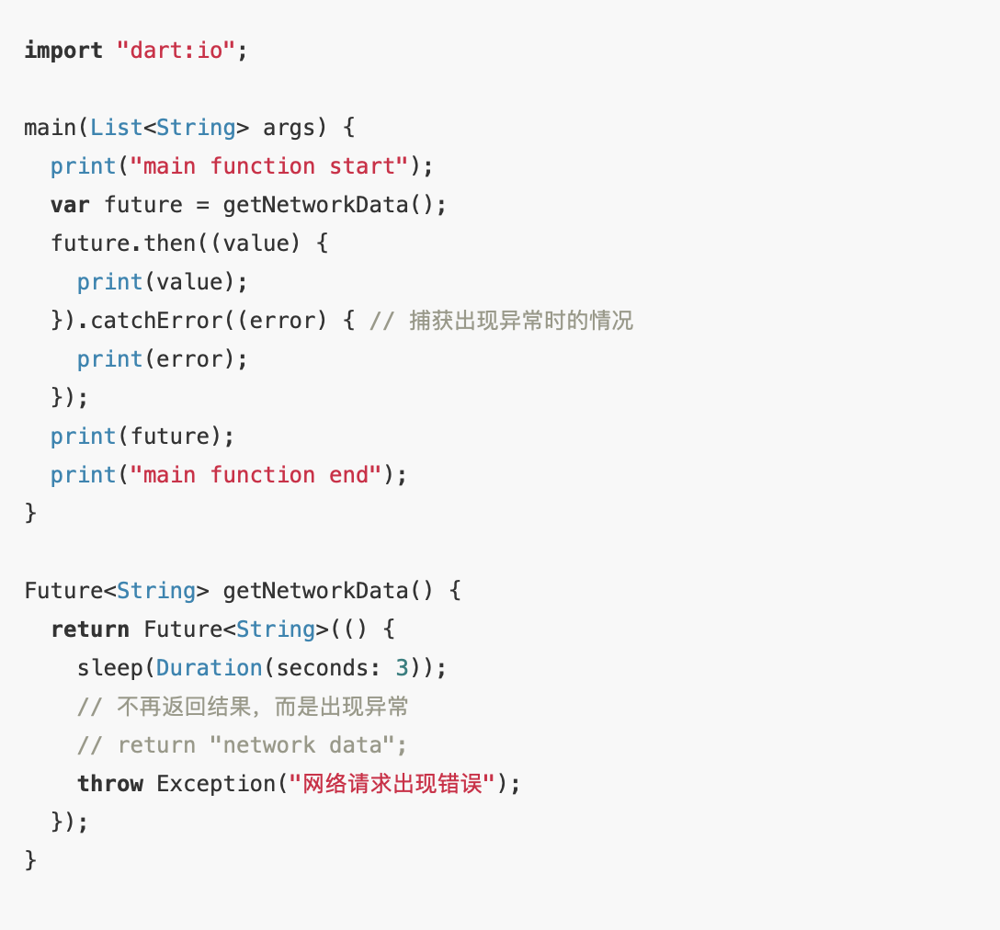

上面代码的执行结果：

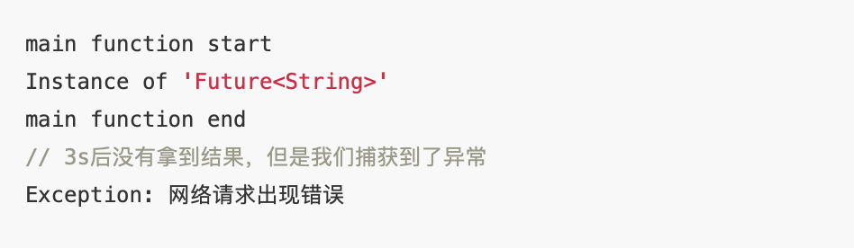

##### 2.1.3. Future使用补充

**补充一：上面案例的小结**
我们通过一个案例来学习了一些Future的使用过程：

- 1、创建一个Future（可能是我们创建的，也可能是调用内部API或者第三方API获取到的一个Future，总之你需要获取到一个Future实例，Future通常会对一些异步的操作进行封装）；
- 2、通过.then(成功回调函数)的方式来监听Future内部执行完成时获取到的结果；
- 3、通过.catchError(失败或异常回调函数)的方式来监听Future内部执行失败或者出现异常时的错误信息；

**补充二：Future的两种状态**
事实上Future在执行的整个过程中，我们通常把它划分成了两种状态：

状态一：未完成状态（uncompleted）

 - 执行Future内部的操作时（在上面的案例中就是具体的网络请求过程，我们使用了延迟来模拟），我们称这个过程为未完成状态

状态二：完成状态（completed）

 - 当Future内部的操作执行完成，通常会返回一个值，或者抛出一个异常。
这两种情况，我们都称Future为完成状态。

Dart官网有对这两种状态解析，之所以贴出来是区别于Promise的三种状态

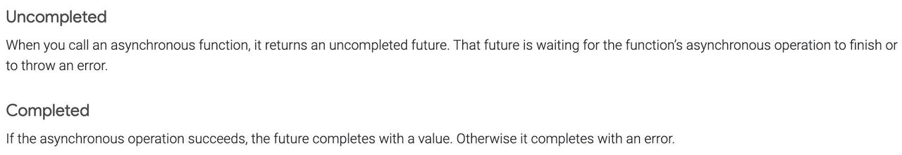

**补充三：Future的链式调用**

上面代码我们可以进行如下的改进：
 
 - 我们可以在then中继续返回值，会在下一个链式的then调用回调函数中拿到返回的结果

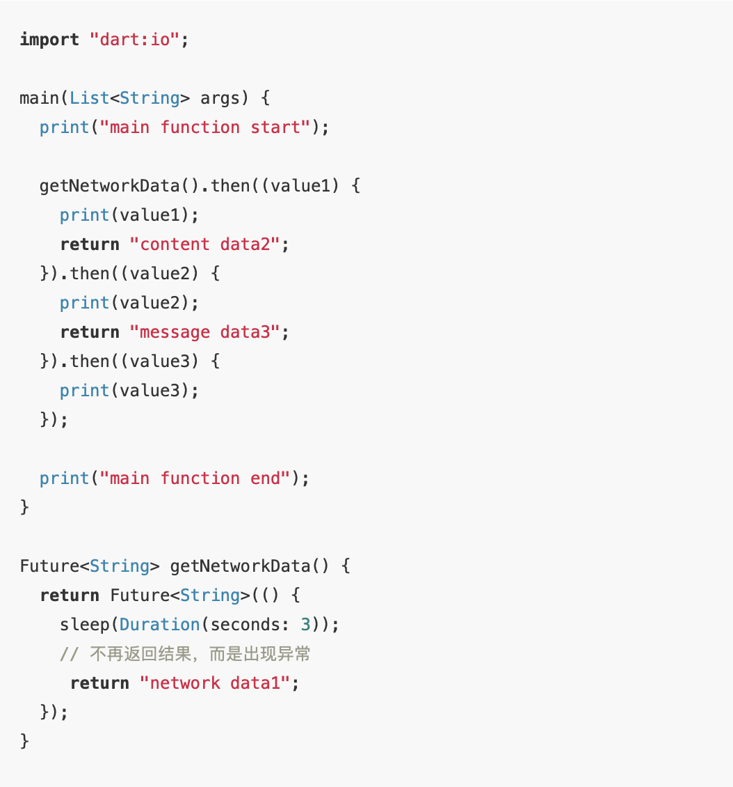


打印结果：

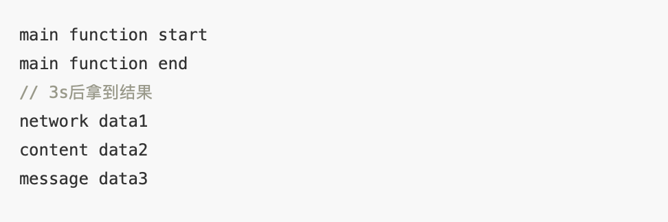

**补充四：Future其他API**

Future.value(value)

 - 直接获取一个完成的Future，该Future会直接调用then的回调函数

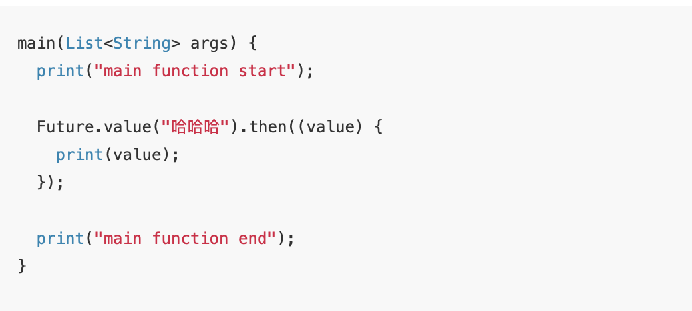

打印结果如下：

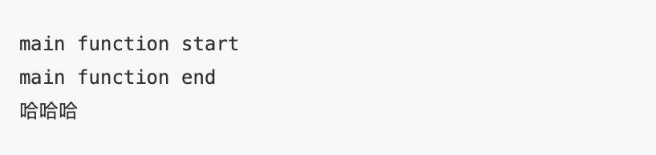

疑惑：为什么立即执行，但是哈哈哈是在最后打印的呢？

 - 这是因为Future中的then会作为新的任务会加入到事件队列中（Event Queue），加入之后你肯定需要排队执行了

*Future.error(object)*

 - 直接获取一个完成的Future，但是是一个发生异常的Future，该Future会直接调用catchError的回调函数

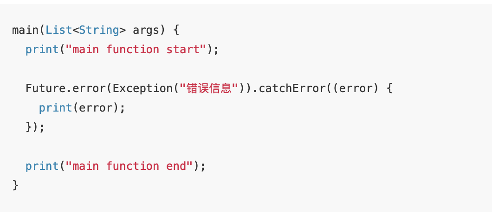

打印结果如下：

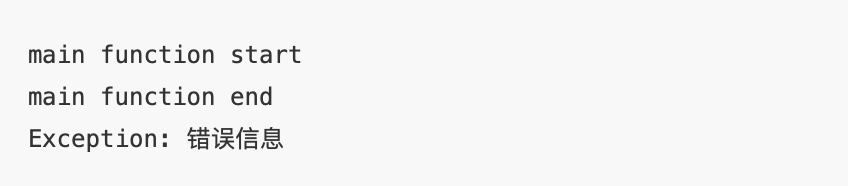

*Future.delayed(时间, 回调函数)*

 - 在延迟一定时间时执行回调函数，执行完回调函数后会执行then的回调；
 - 之前的案例，我们也可以使用它来模拟，但是直接学习这个API会让大家更加疑惑；

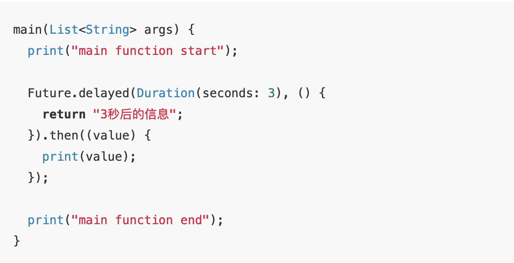

### 2.2. await、async

##### 2.2.1. 理论概念理解

如果你已经完全搞懂了Future，那么学习await、async应该没有什么难度。

await、async是什么呢？

- 它们是Dart中的关键字（你这不是废话吗？废话也还是要强调的，万一你用它做变量名呢，无辜脸。）
- 它们可以让我们用同步的代码格式，去实现异步的调用过程。
- 并且，通常一个async的函数会返回一个Future（别着急，马上就看到代码了）。

我们已经知道，Future可以做到不阻塞我们的线程，让线程继续执行，并且在完成某个操作时改变自己的状态，并且回调then或者errorCatch回调。

如何生成一个Future呢？

 - 1、通过我们前面学习的Future构造函数，或者后面学习的Future其他API都可以。
 - 2、还有一种就是通过async的函数。

##### 2.2.2. 案例代码演练

Talk is cheap. Show me the code.

我们来对之前的Future异步处理代码进行改造，改成await、async的形式。

我们知道，如果直接这样写代码，代码是不能正常执行的：

 - 因为Future.delayed返回的是一个Future对象，我们不能把它看成同步的返回数据："network data"去使用
 - 也就是我们不能把这个异步的代码当做同步一样去使用！

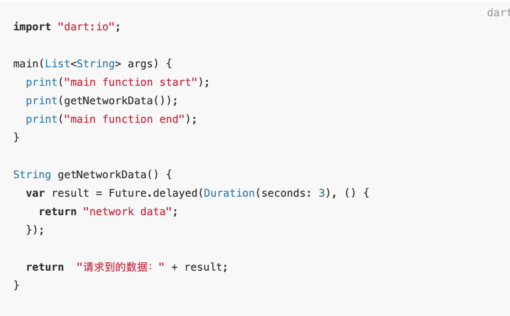

现在我使用await修改下面这句代码：

 - 你会发现，我在Future.delayed函数前加了一个await。
 - 一旦有了这个关键字，那么这个操作就会等待Future.delayed的执行完毕，并且等待它的结果。

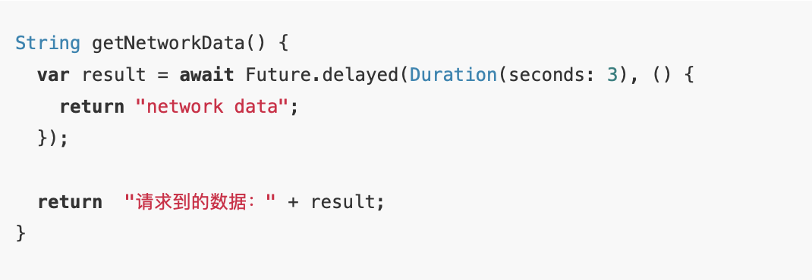

修改后执行代码，会看到如下的错误：

 - 错误非常明显：await关键字必须存在于async函数中。
 - 所以我们需要将getNetworkData函数定义成async函数。

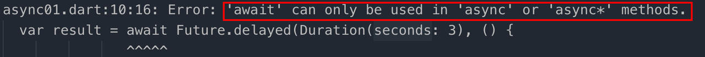

继续修改代码如下：

也非常简单，只需要在函数的()后面加上一个async关键字就可以了

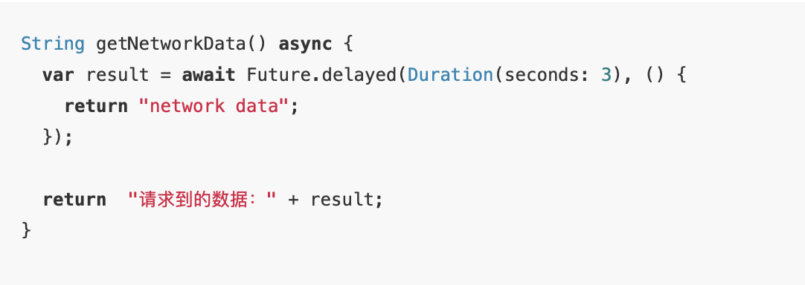

运行代码，依然报错（心想：你妹啊）：

 - 错误非常明显：使用async标记的函数，必须返回一个Future对象。
 - 所以我们需要继续修改代码，将返回值写成一个Future。

继续修改代码如下：

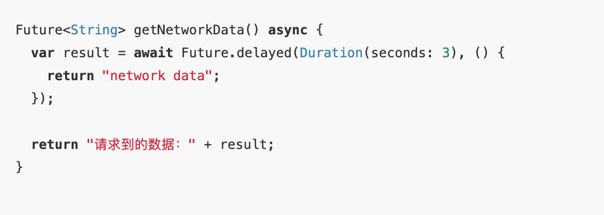

这段代码应该是我们理想当中执行的代码了

 - 我们现在可以像同步代码一样去使用Future异步返回的结果；
 - 等待拿到结果之后和其他数据进行拼接，然后一起返回；
 - 返回的时候并不需要包装一个Future，直接返回即可，但是返回值会默认被包装在一个Future中；

### 2.3. 读取json案例

我这里给出了一个在Flutter项目中，读取一个本地的json文件，并且转换成模型对象，返回出去的案例；

这个案例作为大家学习前面Future和await、async的一个参考，我并不打算展开来讲，因为需要用到Flutter的相关知识；

后面我会在后面的案例中再次讲解它在Flutter中我使用的过程中；

读取json案例代码（了解一下即可）

```
import 'package:flutter/services.dart' show rootBundle;
import 'dart:convert';
import 'dart:async';

main(List<String> args) {
  getAnchors().then((anchors) {
    print(anchors);
  });
}

class Anchor {
  String nickname;
  String roomName;
  String imageUrl;

  Anchor({
    this.nickname,
    this.roomName,
    this.imageUrl
  });

  Anchor.withMap(Map<String, dynamic> parsedMap) {
    this.nickname = parsedMap["nickname"];
    this.roomName = parsedMap["roomName"];
    this.imageUrl = parsedMap["roomSrc"];
  }
}

Future<List<Anchor>> getAnchors() async {
  // 1.读取json文件
  String jsonString = await rootBundle.loadString("assets/yz.json");

  // 2.转成List或Map类型
  final jsonResult = json.decode(jsonString);

  // 3.遍历List，并且转成Anchor对象放到另一个List中
  List<Anchor> anchors = new List();
  for (Map<String, dynamic> map in jsonResult) {
    anchors.add(Anchor.withMap(map));
  }
  return anchors;
}
```


# 三. Dart的异步补充

### 3.1. 任务执行顺序

##### 3.1.1. 认识微任务队列

在前面学习学习中，我们知道Dart中有一个事件循环（Event Loop）来执行我们的代码，里面存在一个事件队列（Event Queue），事件循环不断从事件队列中取出事件执行。

但是如果我们严格来划分的话，在Dart中还存在另一个队列：微任务队列（Microtask Queue）。

 - 微任务队列的优先级要高于事件队列；
 - 也就是说事件循环都是优先执行微任务队列中的任务，再执行 事件队列 中的任务；

那么在Flutter开发中，哪些是放在事件队列，哪些是放在微任务队列呢？

 - 所有的外部事件任务都在事件队列中，如IO、计时器、点击、以及绘制事件等；
 - 而微任务通常来源于Dart内部，并且微任务非常少。这是因为如果微任务非常多，就会造成事件队列排不上队，会阻塞任务队列的执行（比如用户点击没有反应的情况）；

说到这里，你可能已经有点凌乱了，在Dart的单线程中，代码到底是怎样执行的呢？

 - 1、Dart的入口是main函数，所以main函数中的代码会优先执行；
 - 2、main函数执行完后，会启动一个事件循环（Event Loop）就会启动，启动后开始执行队列中的任务；
 - 3、首先，会按照先进先出的顺序，执行 微任务队列（Microtask Queue）中的所有任务；
 - 4、其次，会按照先进先出的顺序，执行 事件队列（Event Queue）中的所有任务；

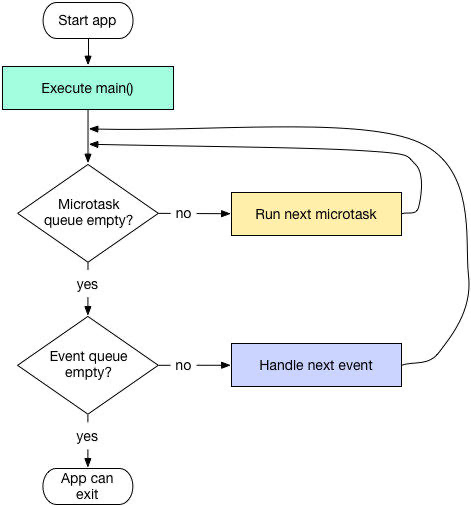

##### 3.1.2. 如何创建微任务

在开发中，我们可以通过dart中async下的scheduleMicrotask来创建一个微任务：

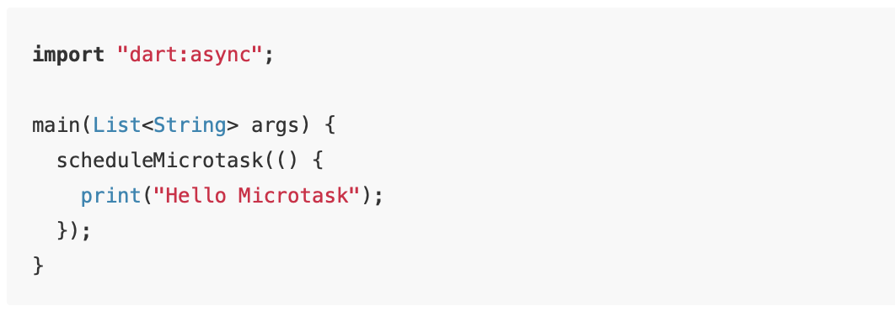

在开发中，如果我们有一个任务不希望它放在Event Queue中依次排队，那么就可以创建一个微任务了。

Future的代码是加入到事件队列还是微任务队列呢？

Future中通常有两个函数执行体：

 - Future构造函数传入的函数体
 - then的函数体（catchError等同看待）

那么它们是加入到什么队列中的呢？

Future构造函数传入的函数体放在事件队列中

then的函数体要分成三种情况：

 - 情况一：Future没有执行完成（有任务需要执行），那么then会直接被添加到Future的函数执行体后；
 - 情况二：如果Future执行完后就then，该then的函数体被放到如微任务队列，当前Future执行完后执行微任务队列；
 - 情况三：如果Future世链式调用，意味着then未执行完，下一个then不会执行；

```
// future_1加入到eventqueue中，紧随其后then_1被加入到eventqueue中
Future(() => print("future_1")).then((_) => print("then_1"));

// Future没有函数执行体，then_2被加入到microtaskqueue中
Future(() => null).then((_) => print("then_2"));

// future_3、then_3_a、then_3_b依次加入到eventqueue中
Future(() => print("future_3")).then((_) => print("then_3_a")).then((_) => print("then_3_b"));
```

##### 3.1.3. 代码执行顺序

我们根据前面的规则来学习一个极的代码执行顺序案例：

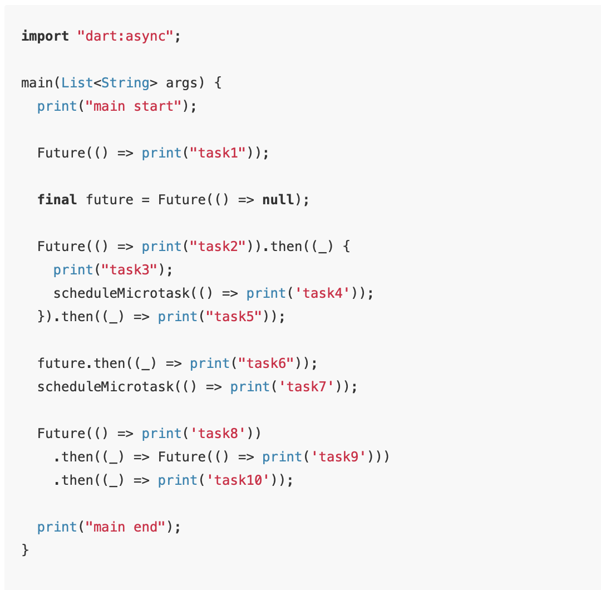


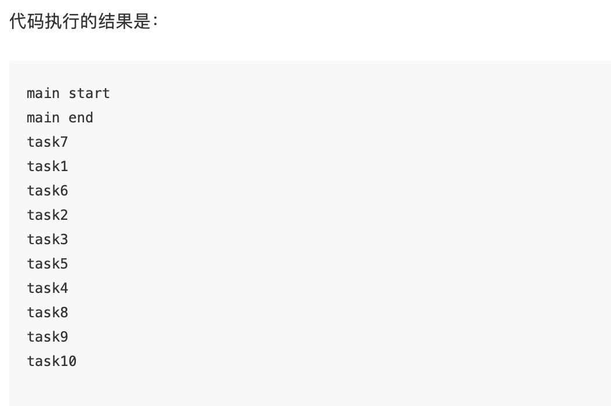

代码分析：

 - 1、main函数先执行，所以main start和main end先执行，没有任何问题；
 - 2、main函数执行过程中，会将一些任务分别加入到EventQueue和MicrotaskQueue中；
 - 3、task7通过scheduleMicrotask函数调用，所以它被最早加入到MicrotaskQueue，会被先执行；
 - 4、然后开始执行EventQueue，task1被添加到EventQueue中被执行；
 - 5、通过final future = Future(() => null);创建的future的then被添加到微任务中，微任务直接被优先执行，所以会执行task6；
 - 6、一次在EventQueue中添加task2、task3、task5被执行；
 - 7、task3的打印执行完后，调用scheduleMicrotask，那么在执行完这次的EventQueue后会执行，所以在task5后执行task4（注意：scheduleMicrotask的调用是作为task3的一部分代码，所以task4是要在task5之后执行的）
 - 8、task8、task9、task10一次添加到EventQueue被执行；

事实上，上面的代码执行顺序有可能出现在面试中，我们开发中通常不会出现这种复杂的嵌套，并且需要完全搞清楚它的执行顺序；

但是，了解上面的代码执行顺序，会让你对EventQueue和microtaskQueue有更加深刻的理解。

### 3.2. 多核CPU的利用

##### 3.2.1. Isolate的理解

在Dart中，有一个Isolate的概念，它是什么呢？

- 我们已经知道Dart是单线程的，这个线程有自己可以访问的内存空间以及需要运行的事件循环；
- 我们可以将这个空间系统称之为是一个Isolate；
- 比如Flutter中就有一个Root Isolate，负责运行Flutter的代码，比如UI渲染、用户交互等等；

在 Isolate 中，资源隔离做得非常好，每个 Isolate 都有自己的 Event Loop 与 Queue，

- Isolate 之间不共享任何资源，只能依靠消息机制通信，因此也就没有资源抢占问题。

但是，如果只有一个Isolate，那么意味着我们只能永远利用一个线程，这对于多核CPU来说，是一种资源的浪费。

如果在开发中，我们有非常多耗时的计算，完全可以自己创建Isolate，在独立的Isolate中完成想要的计算操作。

**如何创建Isolate呢？**

创建Isolate是比较简单的，我们通过Isolate.spawn就可以创建了：

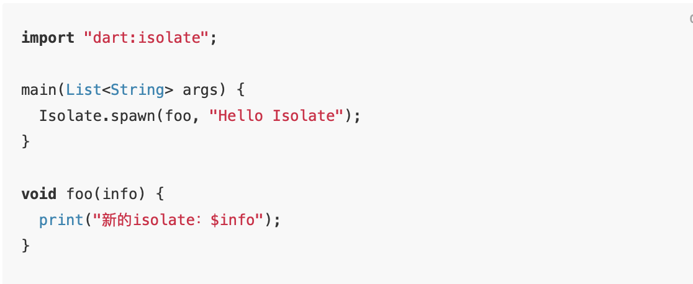

##### 3.2.2. Isolate通信机制

但是在真实开发中，我们不会只是简单的开启一个新的Isolate，而不关心它的运行结果：

 - 我们需要新的Isolate进行计算，并且将计算结果告知Main Isolate（也就是默认开启的Isolate）；
 - Isolate 通过发送管道（SendPort）实现消息通信机制；
 - 我们可以在启动并发Isolate时将Main Isolate的发送管道作为参数传递给它；
 - 并发在执行完毕时，可以利用这个管道给Main Isolate发送消息；

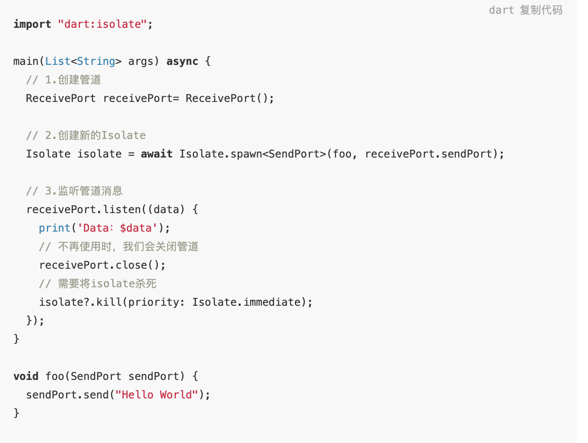

但是我们上面的通信变成了单向通信，如果需要双向通信呢？

- 事实上双向通信的代码会比较麻烦；
- Flutter提供了支持并发计算的compute函数，它内部封装了Isolate的创建和双向通信；
- 利用它我们可以充分利用多核心CPU，并且使用起来也非常简单；

注意：下面的代码不是dart的API，而是Flutter的API，所以只有在Flutter项目中才能运行


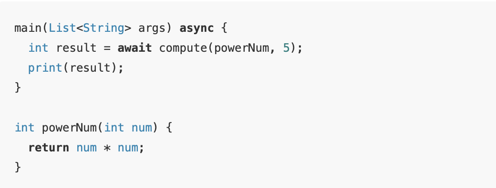

