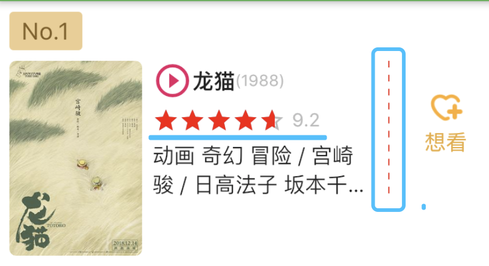

我们需要封装的组件效果：



# 一，虚线的封装

```
import 'package:flutter/material.dart';

class HYDashedLine extends StatelessWidget {
  final Axis axis;
  final double dashedWidth;
  final double dashedHeight;
  final int count;
  final Color color;

  HYDashedLine({
    this.axis = Axis.horizontal,
    this.dashedWidth = 1,
    this.dashedHeight = 1,
    this.count = 10,
    this.color = Colors.red
  });

  @override
  Widget build(BuildContext context) {
    return Flex(
      direction: this.axis,
      mainAxisAlignment: MainAxisAlignment.spaceBetween,
      children: List.generate(this.count, (_){
        return SizedBox(
          width: this.dashedWidth,
          height: this.dashedHeight,
          child: DecoratedBox(
            decoration:BoxDecoration(color: this.color),
          ),
        );
      }),
    );
  }
}
```

# 二， 星星评分的封装

```
import 'package:flutter/cupertino.dart';
import 'package:flutter/material.dart';

/**
 *  星星评分
 */
class HYStarRating extends StatefulWidget {
  final double rating;    //当前分数
  final double maxRating; //最大分数
  final int count;        //星星数量
  final double size;         //星星的大小
  final Color unSelectedColor;  //未选中的颜色
  final Color selectedColor;    //选中的颜色

  final Widget unSelectedImage;   //未选中的图片
  final Widget selectedImage;   //选中的图片

  HYStarRating({
    @required this.rating,
    this.maxRating = 10,
    this.count = 5,
    this.size = 30,
    this.unSelectedColor = const Color(0xffbbbbbb),
    this.selectedColor = const Color(0xffff0000),
    Widget unSelectedImage,
    Widget selectedImage,
  }):
        this.unSelectedImage = unSelectedImage ?? Icon(Icons.star_border,size: size,color: unSelectedColor,),
        this.selectedImage = selectedImage ?? Icon(Icons.star,size: size, color: selectedColor,);

  @override
  _HYStarRatingState createState() => _HYStarRatingState();
}

class _HYStarRatingState extends State<HYStarRating> {
  @override
  Widget build(BuildContext context) {
    return Stack(
      children: <Widget>[
        Row(
          mainAxisSize: MainAxisSize.min,
          children: buildUnSelectedStar(),
        ),
        Row(
          mainAxisSize: MainAxisSize.min,
          children: buildSelectedStar(),
        ),
      ],
    );
  }

  //未选中的星星组件列表集合
  List<Widget> buildUnSelectedStar(){
    return List.generate(this.widget.count, (index){
      return widget.unSelectedImage;
    });
  }

  //选中的星星组件列表集合
  List<Widget> buildSelectedStar(){
    final star = widget.selectedImage;
    //1. 创建stars
    List<Widget> stars = [];

    //2. 创建满填充的star
    double oneValue = widget.maxRating / widget.count;
    int entireCount = (widget.rating / oneValue).floor();  //floor(): 向下取整
    for(int i = 0; i < entireCount; i++){
      stars.add(star);
    }

    //3. 创建部分填充star
    double leftWidth = ((widget.rating - oneValue * entireCount)/oneValue) * widget.size;

    final halfStar = ClipRect(
      clipper: HYStarClipper(leftWidth),
      child: star,
    );
    stars.add(halfStar);

    return stars;
  }
}

class HYStarClipper extends CustomClipper<Rect> {
  double width;

  HYStarClipper(this.width);

  @override
  Rect getClip(Size size) {
    return Rect.fromLTRB(0, 0, width, size.height);
  }

  //是否重新裁剪
  @override
  bool shouldReclip(HYStarClipper oldClipper) {
    //宽度不一致，重新裁剪
    return oldClipper.width != this.width;
  }
 }
 ```
