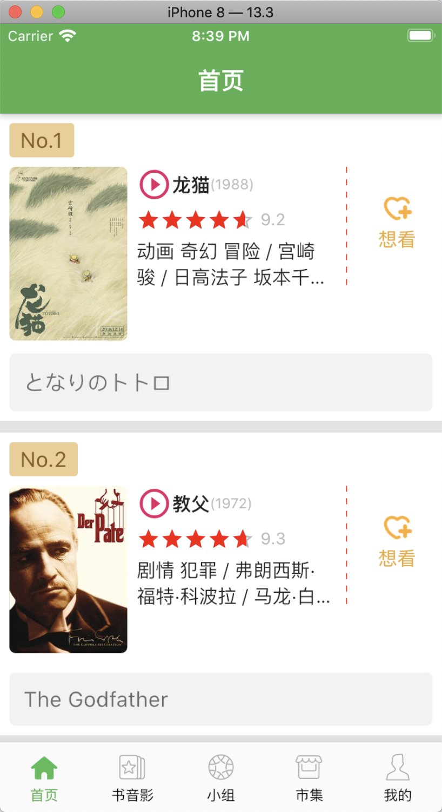
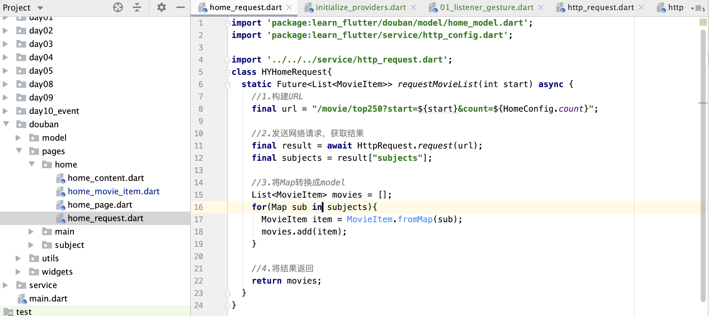
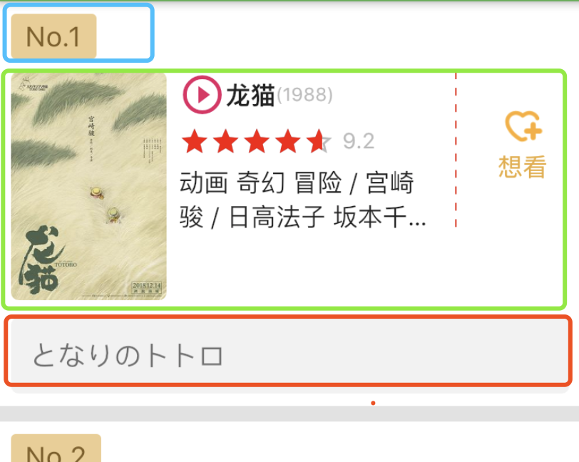
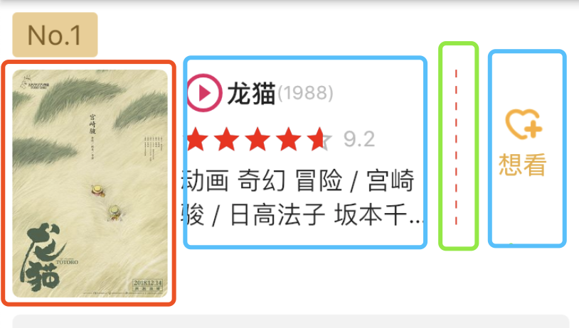

先来看一下，豆瓣首页的效果



通过上边的页面，我们可以通过下边的步骤，进行实现：

- 1， 需要实现底部的tabbar
- 2，通用请求工具封装
- 3，页面请求工具封装
- 4，首页item项的封装

# 一， 底部tabbar的实现

### 1.1， 首页代码

```
import 'package:flutter/cupertino.dart';
import 'package:flutter/material.dart';
import 'package:learn_flutter/douban/pages/main/bottom_bar_item.dart';
import 'package:learn_flutter/douban/pages/main/initialize_items.dart';
import 'package:learn_flutter/douban/widgets/dashed_line.dart';
import 'package:learn_flutter/douban/widgets/star_rating.dart';

void main(){
  runApp(MyApp());
}

class MyApp extends StatelessWidget {
  @override
  Widget build(BuildContext context) {
    return MaterialApp(
      debugShowCheckedModeBanner: false,
      theme: ThemeData(
        primaryColor: Colors.green,
        primaryColorLight: Colors.transparent,
        splashColor: Colors.transparent
      ),
      home: HYMainPage()
    );
  }
}

class HYMainPage extends StatefulWidget {
  @override
  _HYMainPageState createState() => _HYMainPageState();
}

class _HYMainPageState extends State<HYMainPage> {
  int _currentIndex = 0;

  @override
  Widget build(BuildContext context) {
    return Scaffold(
      body: IndexedStack(
        index: _currentIndex,
        children: pages
      ),
      bottomNavigationBar: BottomNavigationBar(
        currentIndex: _currentIndex,
        type: BottomNavigationBarType.fixed,
        selectedFontSize: 12,               //选中的字体大小
        unselectedFontSize: 12,             //未选中的字体大小
        selectedItemColor: Colors.green,      //选中的颜色
        unselectedItemColor: Colors.black, //未选中的颜色
        items: items,
        onTap: (index){
          setState(() {
            _currentIndex = index;
          });
        },
      ),
    );
  }
}

```

### 1.2，初始化项封装

```
import 'package:flutter/material.dart';

import 'bottom_bar_item.dart';
import '../home/home_page.dart';
import '../subject/subject_page.dart';


List<HYBottomBarItem> items = [
  HYBottomBarItem("home","首页"),
  HYBottomBarItem("subject","书音影"),
  HYBottomBarItem("group","小组"),
  HYBottomBarItem("mall","市集"),
  HYBottomBarItem("profile","我的"),
];

List<Widget> pages = [
  HYHomePage(),
  HYSubjectPage(),
  HYSubjectPage(),
  HYSubjectPage(),
  HYSubjectPage(),
];
1.3，底部tabbarItem的封装
import 'package:flutter/material.dart';

class HYBottomBarItem extends BottomNavigationBarItem {
  HYBottomBarItem(String iconName, String title): super(
    title: Text(title),
    icon: Image.asset("assets/images/tabbar/${iconName}.png",width: 30,height: 30,),
    activeIcon: Image.asset("assets/images/tabbar/${iconName}_active.png" ,width: 30,height: 30,),
  );
}

```

# 二，通用请求工具的封装

### 2.1, 请求工具的实现

```
import 'package:dio/dio.dart';
import 'http_config.dart';
class HttpRequest{
  static BaseOptions baseOptions = BaseOptions(baseUrl: HttpConfig.baseURL, connectTimeout: HttpConfig.timeout);
  static Dio dio = Dio(baseOptions);
  static Future request(String url,
      {String method = "get", Map<String,dynamic> params, Interceptor inter}) async {

    //1.创建单独配置
    final options = Options(method: method);

    //全局拦截器
    //创建默认的全局拦截器
    Interceptor defaultInter = InterceptorsWrapper(
      onRequest: (options){
        print("请求拦截");
        return options;
      },
      onResponse: (response){
        print("响应拦截");
        return response;
      },
      onError: (err){
        print("错误拦截");
        return err;
      }
    );

    List<Interceptor> inters = [defaultInter];
    //请求单独的拦截器(传过来的)
    if(inter != null){
      inters.add(inter);
    }
    dio.interceptors.addAll(inters);

    //2.发送网络请求
    try{
      Response response = await dio.request(url,queryParameters: params,options: options);
      return response.data;
    } on DioError catch(e){
      return Future.error(e);
    }
  }
}
```

### 2.1, 配置类

```
class HttpConfig{
  static const String baseURL = "https://douban-api.uieee.com/v2";
  static const int timeout = 10000;
}

class HomeConfig{
  static const int count = 20;
}

```

# 三，首页请求工具封装



# 四，首页Item的实现



首页item, 我们可以分为上中下三块，可以使用Column包裹




中间部分，我们可以通过Row包括， 电影信息这块，我们可以通过Column包裹
实现代码如下：

```
import 'package:flutter/material.dart';
import 'package:learn_flutter/douban/model/home_model.dart';
import 'package:learn_flutter/douban/utils/log.dart';
import 'package:learn_flutter/douban/widgets/dashed_line.dart';
import 'package:learn_flutter/douban/widgets/star_rating.dart';

class HYHomeMovieItem extends StatelessWidget {
  final MovieItem item;

  HYHomeMovieItem(this.item);

  @override
  Widget build(BuildContext context) {
    return Container(
      padding: EdgeInsets.all(8),
      decoration: BoxDecoration(
        color: Colors.white,
        border: Border(
          bottom: BorderSide(width: 10,color: Color(0xffe2e2e2))
        )
      ),
      child: Column(
        crossAxisAlignment: CrossAxisAlignment.start,
        children: <Widget>[
          buildHeader(),
          SizedBox(height:8),
          buildContent(),
          SizedBox(height:8),
          buildFooter(),
        ],
      ),
    );
  }

  //1.构建header
  Widget buildHeader(){
    return Container(
      padding: EdgeInsets.fromLTRB(9, 4, 9, 4),
      decoration: BoxDecoration(
        color: Color.fromARGB(255, 238, 205, 144),
        borderRadius: BorderRadius.circular(3),
      ),
      child: Text(
        "No.${item.rank}",
        style: TextStyle(
          fontSize: 18,
          color: Color.fromARGB(255, 131, 95, 36)
        ),
      ),
    );
  }

  //2.构建内容
  Widget buildContent(){
    return Container(
      height: 150,
      child: Row(
        crossAxisAlignment: CrossAxisAlignment.start,
        children: <Widget>[
          buildContentImage(),
          SizedBox(width: 8,),
          buildContentInfo(),
          SizedBox(width: 8,),
          buildContentDashedLine(),
          SizedBox(width: 8,),
          buildContentWish()
        ],
      ),
    );
  }

  //2.1 构建内容 - 图片
  Widget buildContentImage() {
    return ClipRRect(
      borderRadius: BorderRadius.circular(5),
      child: Image.network(item.imageURL, width: 100,),
    );
  }

  //2.2 构建内容信息
  Widget buildContentInfo(){
    return Expanded(
      child: Container(
        child: Column(
          crossAxisAlignment: CrossAxisAlignment.start,
          children: <Widget>[
            buildContentInfoTitle(),
            SizedBox(height: 5,),
            buildContentInfoRating(),
            SizedBox(height: 5,),
            buildContentInfoDesc(),
          ],
        ),
      ),
    );
  }

  //2.2.1 构建内容信息 - 标题
  Widget buildContentInfoTitle(){
//    hyLog("hylog test",StackTrace.current);
    return Text.rich(
        TextSpan(
          children: [
            WidgetSpan(
              child: Icon(Icons.play_circle_outline,color: Colors.pink, size: 30,),
              baseline: TextBaseline.ideographic,
              alignment: PlaceholderAlignment.middle
            ),
            ...item.title.runes.map((rune){
              return WidgetSpan(
                  baseline: TextBaseline.ideographic,
                  alignment: PlaceholderAlignment.middle,
                  child: Text(
                    new String.fromCharCode(rune),
                    style: TextStyle(fontSize: 16,fontWeight: FontWeight.bold)
              ));
            }).toList(),
            WidgetSpan(
              baseline: TextBaseline.ideographic,
              alignment: PlaceholderAlignment.middle,
              child: Text(
                  "(${item.playDate})",
                  style: TextStyle(fontSize: 12,color: Color(0xffbbbbbb))
              )
            ),
          ]
        )
    );
  }

  //2.2.2 构建内容信息 - 评分
  Widget buildContentInfoRating(){
    return FittedBox(
      child: Row(
        children: <Widget>[
          HYStarRating(
            rating: item.rating,
            size: 20,
          ),
          SizedBox(width: 5,),
          Text("${item.rating}",style: TextStyle(color: Color(0xffbbbbbb)),)
        ],
      ),
    );
  }

  //2.2.3 构建内容信息 - 描述
  Widget buildContentInfoDesc(){
    final genresString = item.genres.join(" ");
    final directorString = item.director.name;
    final actorString = item.casts.map((item) => item.name).join(" ");

    return Text(
      "${genresString} / ${directorString} / ${actorString}",
      maxLines: 2,
      overflow: TextOverflow.ellipsis,
      style: TextStyle(fontSize: 16),
    );
  }

  //2.3 构建分割线
  Widget buildContentDashedLine(){
    return Container(
      width: 10,
      height: 100,
      child: HYDashedLine(
        axis: Axis.vertical,
        dashedWidth: 1,
        dashedHeight: 5,
        color: Colors.red
      ),
    );
  }

  //2.4 构建想看
  Widget buildContentWish(){
    return Container(
      width: 60,
      child: Column(
        children: <Widget>[
          SizedBox(height: 20,),
          Image.asset("assets/images/home/wish.png",width: 30,height: 30,),
          Text("想看",style: TextStyle(fontSize: 16,color:Color.fromARGB(255, 235, 170, 60)),)
        ],
      ),
    );
  }

  //3. 构建电影简介(原生名称)
  Widget buildFooter(){
    return Container(
      padding: EdgeInsets.all(12),
      width: double.infinity,
      decoration: BoxDecoration(
        color: Color(0xfff2f2f2),
        borderRadius: BorderRadius.circular(5),
      ),
      child: Text(item.origianlTitle,style: TextStyle(fontSize: 18,color: Colors.black54),),
    );
  }
}
```
