# 一. Flutter的渲染流程

### 1.1. Widget-Element-RenderObject关系

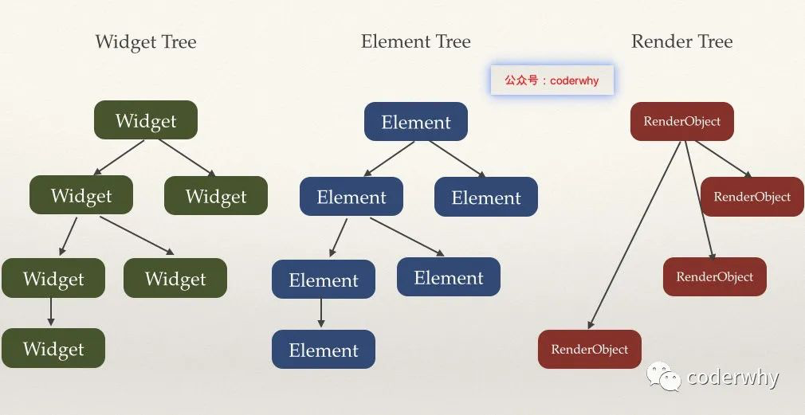

### 1.2. Widget是什么？

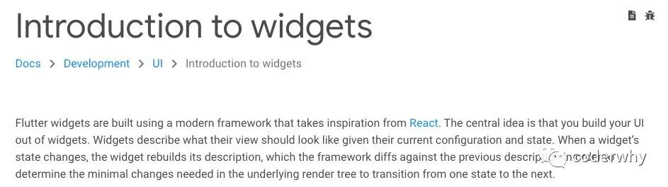

官方对Widget的说明：

- Flutter的Widgets的灵感来自React，中心思想是构造你的UI使用这些Widgets。
- Widget使用配置和状态，描述这个View（界面）应该长什么样子。
- 当一个Widget发生改变时，Widget就会重新build它的描述，框架会和之前的描述进行对比，来决定使用最小的改变（minimal changes）在渲染树中，从一个状态到另一个状态。

自己的理解：

- Widget就是一个个描述文件，这些描述文件在我们进行状态改变时会不断的build。
- 但是对于渲染对象来说，只会使用最小的开销来更新渲染界面。

### 1.3. Element是什么？

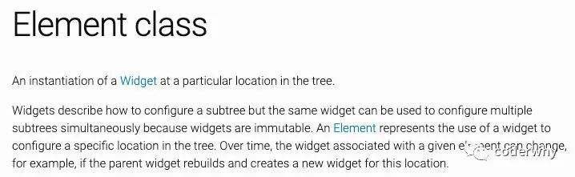

官方对Element的描述：

- Element是一个Widget的实例，在树中详细的位置。
- Widget描述和配置子树的样子，而Element实际去配置在Element树中特定的位置。

### 1.4. RenderObject

官方对RenderObject的描述：

- 渲染树上的一个对象
- RenderObject层是渲染库的核心。

# 二. 对象的创建过程

我们这里以Padding为例，Padding用来设置内边距

### 2.1. Widget

Padding是一个Widget，并且继承自SingleChildRenderObjectWidget

继承关系如下：

**Padding -> SingleChildRenderObjectWidget -> RenderObjectWidget -> Widget**

我们之前在创建Widget时，经常使用StatelessWidget和StatefulWidget，这种Widget只是将其他的Widget在build方法中组装起来，并不是一个真正可以渲染的Widget（在之前的课程中其实有提到）。

在Padding的类中，我们找不到任何和渲染相关的代码，这是因为Padding仅仅作为一个配置信息，这个配置信息会随着我们设置的属性不同，频繁的销毁和创建。

**问题：频繁的销毁和创建会不会影响Flutter的性能呢？**

请看Dart的垃圾回收

那么真正的渲染相关的代码在哪里执行呢？

 - RenderObject

### 2.2. RenderObject

我们来看Padding里面的代码，有一个非常重要的方法：

 - 这个方法其实是来自RenderObjectWidget的类，在这个类中它是一个抽象方法；
 - 抽象方法是必须被子类实现的，但是它的子类SingleChildRenderObjectWidget也是一个抽象类，所以可以不实现父类的抽象方法
 - 但是Padding不是一个抽象类，必须在这里实现对应的抽象方法，而它的实现就是下面的实现

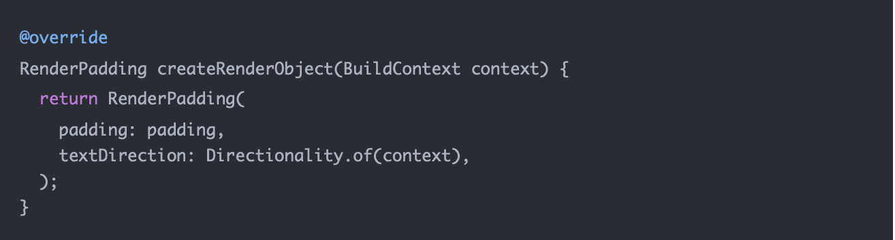

上面的代码创建了什么呢？RenderPadding

RenderPadding的继承关系是什么呢？


我们来具体查看一下RenderPadding的源代码：

 - 如果传入的_padding和原来保存的value一样，那么直接return；
 - 如果不一致，调用_markNeedResolution，而_markNeedResolution内部调用了markNeedsLayout；
 - 而markNeedsLayout的目的就是标记在下一帧绘制时，需要重新布局performLayout；
 - 如果我们找的是Opacity，那么RenderOpacity是调用markNeedsPaint，RenderOpacity中是有一个paint方法的；

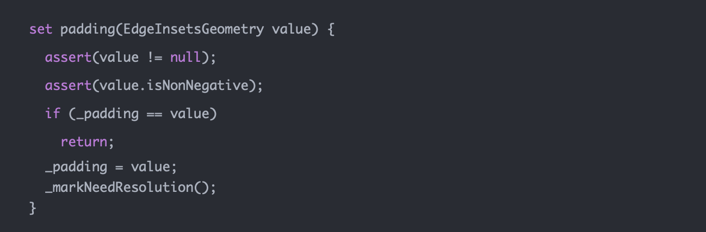

### 2.3. Element

**我们来思考一个问题：**

 - 之前我们写的大量的Widget在树结构中存在引用关系，但是Widget会被不断的销毁和重建，那么意味着这棵树非常不稳定；
 - 那么由谁来维系整个Flutter应用程序的树形结构的稳定呢？
 - 答案就是Element。
 - 官方的描述：Element是一个Widget的实例，在树中详细的位置。

**Element什么时候创建？**

在每一次创建Widget的时候，会创建一个对应的Element，然后将该元素插入树中。

 - Element保存着对Widget的引用；

在SingleChildRenderObjectWidget中，我们可以找到如下代码：
 
 - 在Widget中，Element被创建，并且在创建时，将this（Widget）传入了；
 - Element就保存了对Widget的应用；

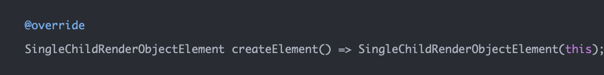

在创建完一个Element之后，Framework会调用mount方法来将Element插入到树中具体的位置：

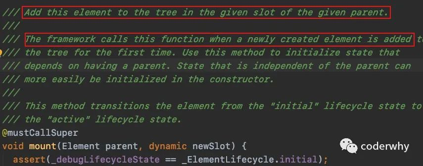

在调用mount方法时，会同时使用Widget来创建RenderObject，并且保持对RenderObject的引用：

 - _renderObject = widget.createRenderObject(this);

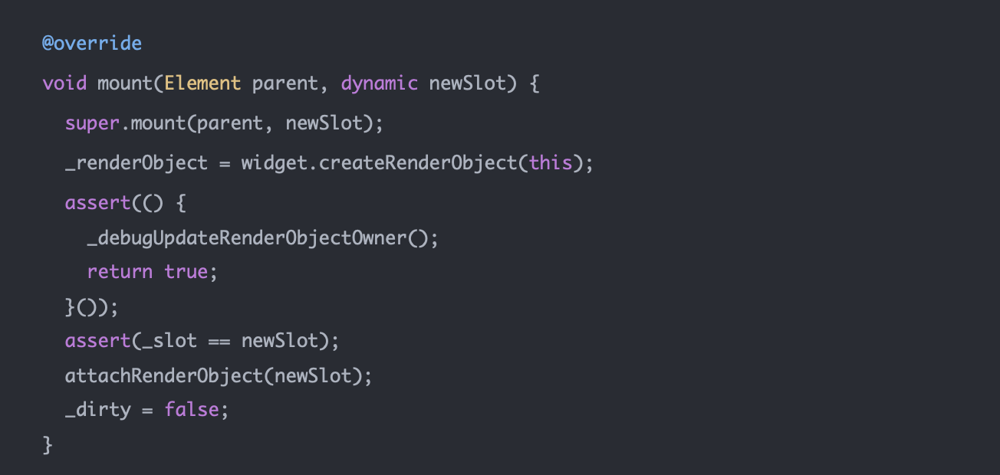


但是，如果你去看类似于Text这种组合类的Widget，它也会执行mount方法，但是mount方法中并没有调用createRenderObject这样的方法。

 - 我们发现ComponentElement最主要的目的是挂载之后，调用_firstBuild方法

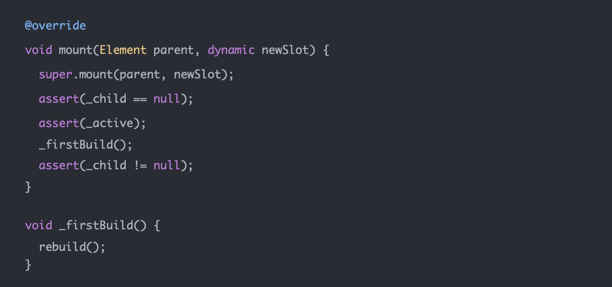

如果是一个StatefulWidget，则创建出来的是一个StatefulElement

我们来看一下StatefulElement的构造器：

 - 调用widget的createState()
 - 所以StatefulElement对创建出来的State是有一个引用的
 - 而_state又对widget有一个引用

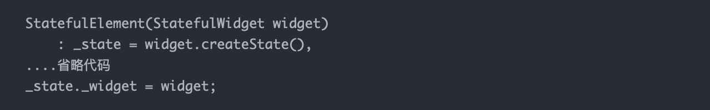

而调用build的时候，本质上调用的是_state中的build方法：


### 2.4. build的context是什么

在StatelessElement中，我们发现是将this传入，所以本质上BuildContext就是当前的Element


我们来看一下继承关系图：

 - Element是实现了BuildContext类（隐式接口）

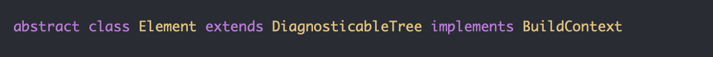


在StatefulElement中，build方法也是类似，调用state的build方式时，传入的是this


### 2.5. 创建过程小结

Widget只是描述了配置信息：

 - 其中包含createElement方法用于创建Element
 - 也包含createRenderObject，但是不是自己在调用

Element是真正保存树结构的对象：

 - 创建出来后会由framework调用mount方法；
 - 在mount方法中会调用widget的createRenderObject对象；
 - 并且Element对widget和RenderObject都有引用；
 
RenderObject是真正渲染的对象：

 - 其中有markNeedsLayout performLayout markNeedsPaint paint等方法

# 三. Widget的key

在我们创建Widget的时候，总是会看到一个key的参数，它又是做什么的呢？

### 3.1. key的案例需求

我们一起来做一个key的案例需求

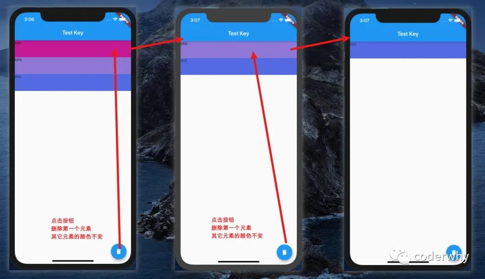


home界面的基本代码：

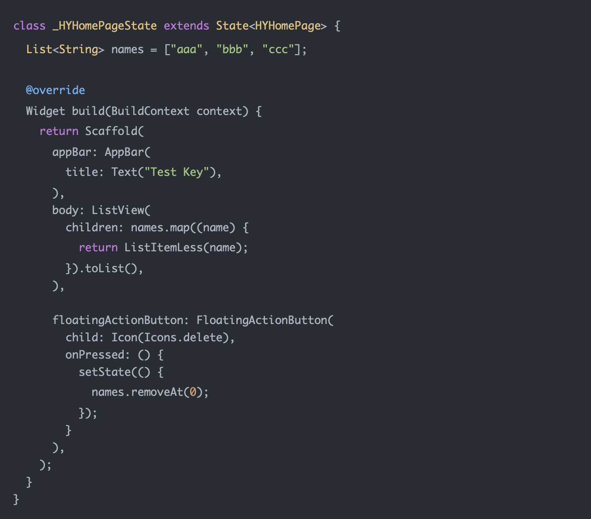

注意：待会儿我们会修改返回的ListItem为ListItemLess或者ListItemFul

### 3.2. StatelessWidget的实现

我们先对ListItem使用一个StatelessWidget进行实现：

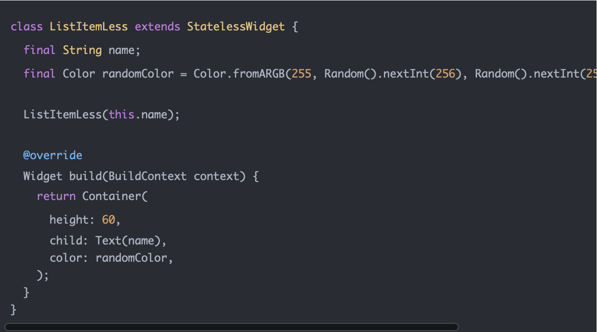

它的实现效果是每删除一个，所有的颜色都会发现一次变化

 - 原因非常简单，删除之后调用setState，会重新build，重新build出来的新的StatelessWidget会重新生成一个新的随机颜色

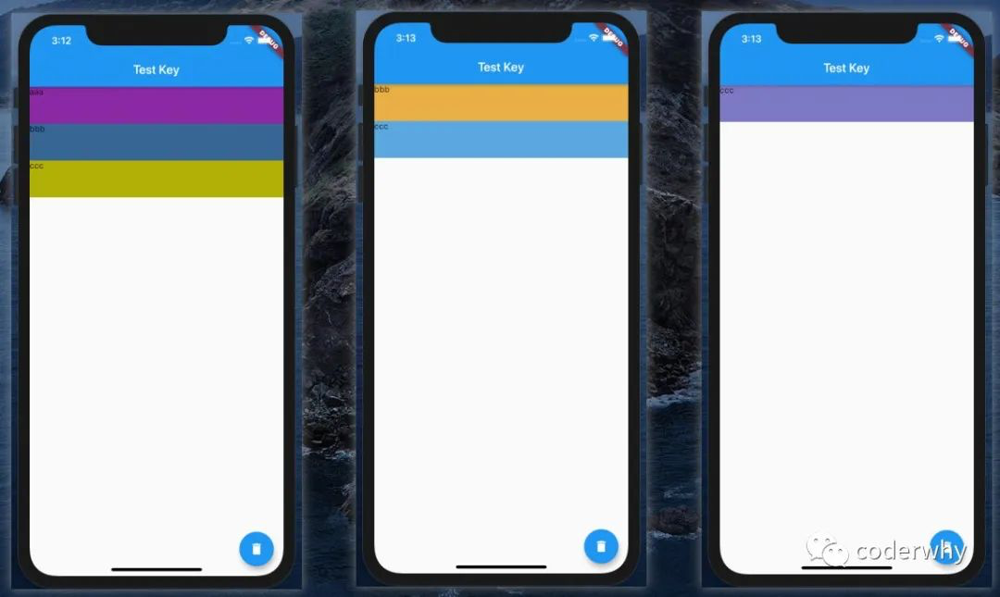

### 3.3. StatefulWidget的实现（没有key）

我们对ListItem使用StatefulWidget来实现

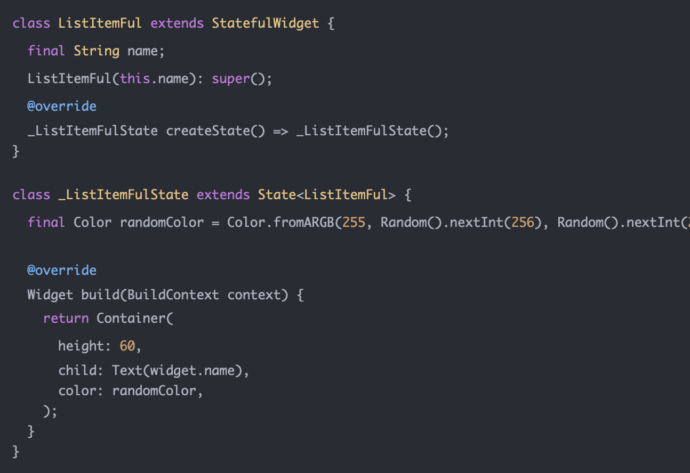

我们发现一个很奇怪的现象，颜色不变化，但是数据向上移动了

 - 这是因为在删除第一条数据的时候，Widget对应的Element并没有改变；
 - 而Element中对应的State引用也没有发生改变；
 - 在更新Widget的时候，Widget使用了没有改变的Element中的State；

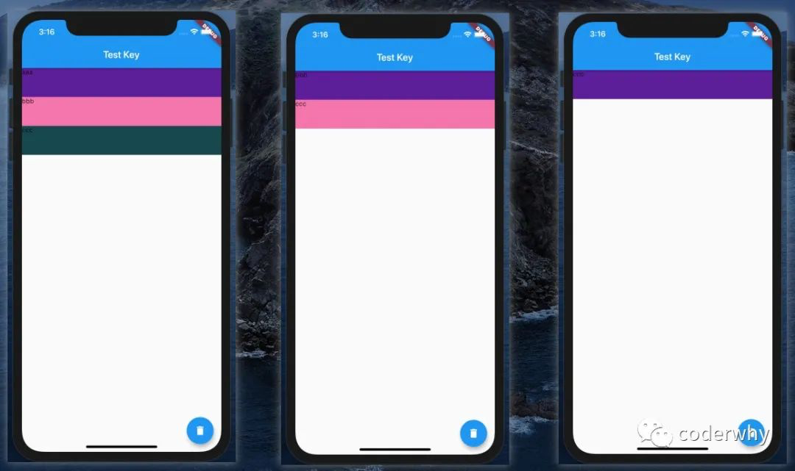

### 3.4. StatefulWidget的实现（随机key）

我们使用一个随机的key

ListItemFul的修改如下：


home界面代码修改如下：

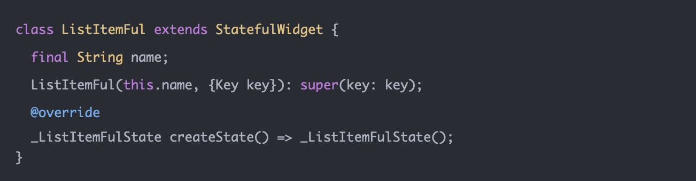

这一次我们发现，每次删除都会出现随机颜色的现象：

 - 这是因为修改了key之后，Element会强制刷新，那么对应的State也会重新创建

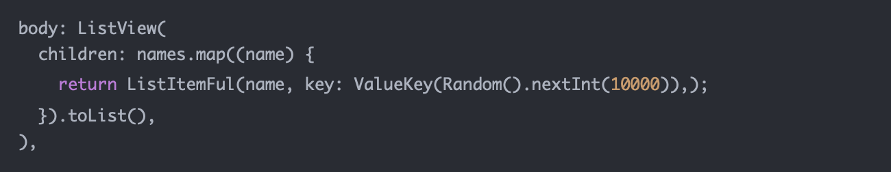

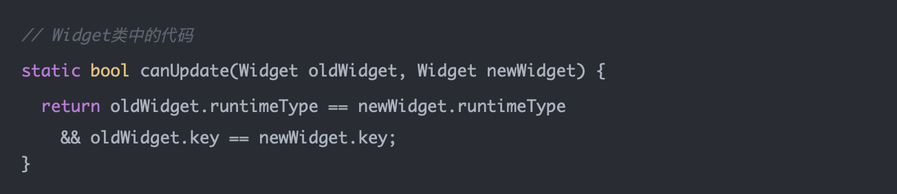


### 3.5. StatefulWidget的实现（name为key）

这次，我们将name作为key来看一下结果：

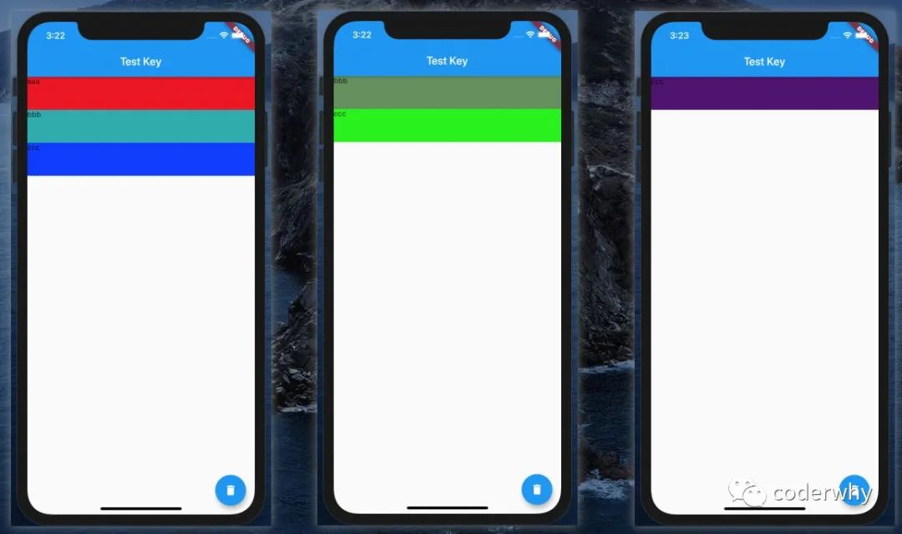


我们理想中的效果：

 - 因为这是在更新widget的过程中根据key进行了diff算法
 - 在前后进行对比时，发现bbb对应的Element和ccc对应的Element会继续使用，那么就会删除之前aaa对应的Element，而不是直接删除最后一个Element

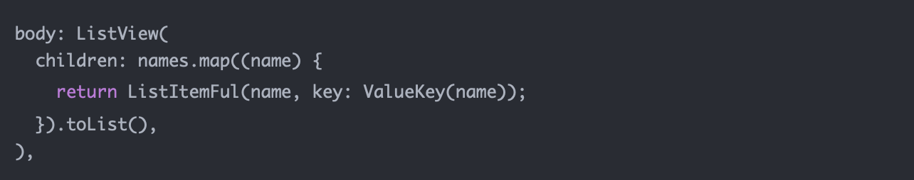

### 3.6. Key的分类

Key本身是一个抽象，不过它也有一个工厂构造器，创建出来一个ValueKey

直接子类主要有：LocalKey和GlobalKey

 - LocalKey，它应用于具有相同父Element的Widget进行比较，也是diff算法的核心所在；
 - GlobalKey，通常我们会使用GlobalKey某个Widget对应的Widget或State或Element

##### 3.6.1. LocalKey

LocalKey有三个子类

ValueKey:

 - ValueKey是当我们以特定的值作为key时使用，比如一个字符串、数字等等

ObjectKey:

 - 如果两个学生，他们的名字一样，使用name作为他们的key就不合适了
 - 我们可以创建出一个学生对象，使用对象来作为key

UniqueKey:

 - 如果我们要确保key的唯一性，可以使用UniqueKey；
 - 比如我们之前使用随机数来保证key的不同，这里我们就可以换成UniqueKey；

##### 3.6.2. GlobalKey

GlobalKey可以帮助我们访问某个Widget的信息，包括Widget或State或Element等对象

我们来看下面的例子：我希望可以在HYHomePage中直接访问HYHomeContent中的内容


```
class HYHomePage extends StatelessWidget {
  final GlobalKey<_HYHomeContentState> homeKey = GlobalKey();

  @override
  Widget build(BuildContext context) {
    return Scaffold(
      appBar: AppBar(
        title: Text("列表测试"),
      ),
      body: HYHomeContent(key: homeKey),
      floatingActionButton: FloatingActionButton(
        child: Icon(Icons.data_usage),
        onPressed: () {
          print("${homeKey.currentState.value}");
          print("${homeKey.currentState.widget.name}");
          print("${homeKey.currentContext}");
        },
      ),
    );
  }
}

class HYHomeContent extends StatefulWidget {
  final String name = "123";

  HYHomeContent({Key key}): super(key: key);

  @override
  _HYHomeContentState createState() => _HYHomeContentState();
}

class _HYHomeContentState extends State<HYHomeContent> {
  final String value = "abc";

  @override
  Widget build(BuildContext context) {
    return Container();
  }
}

```