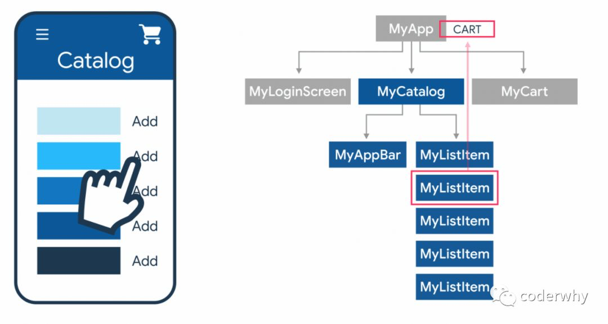
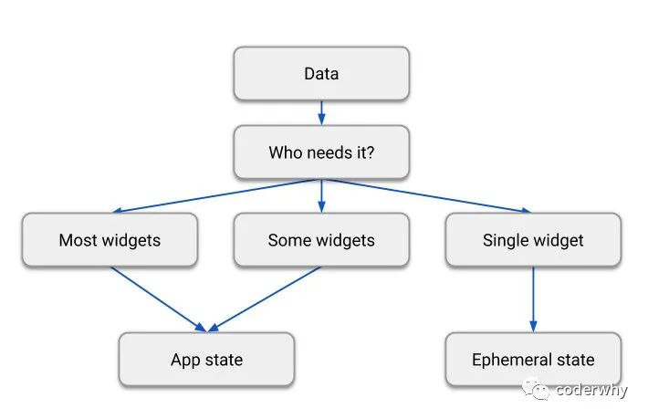
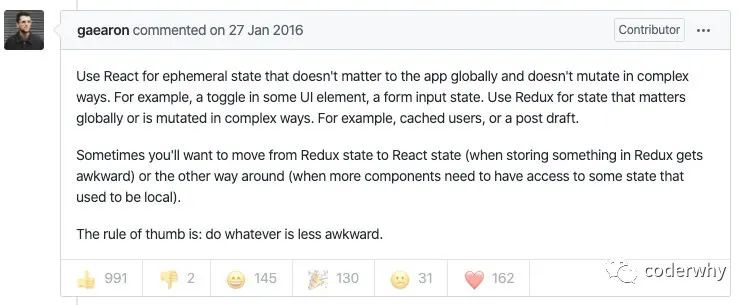
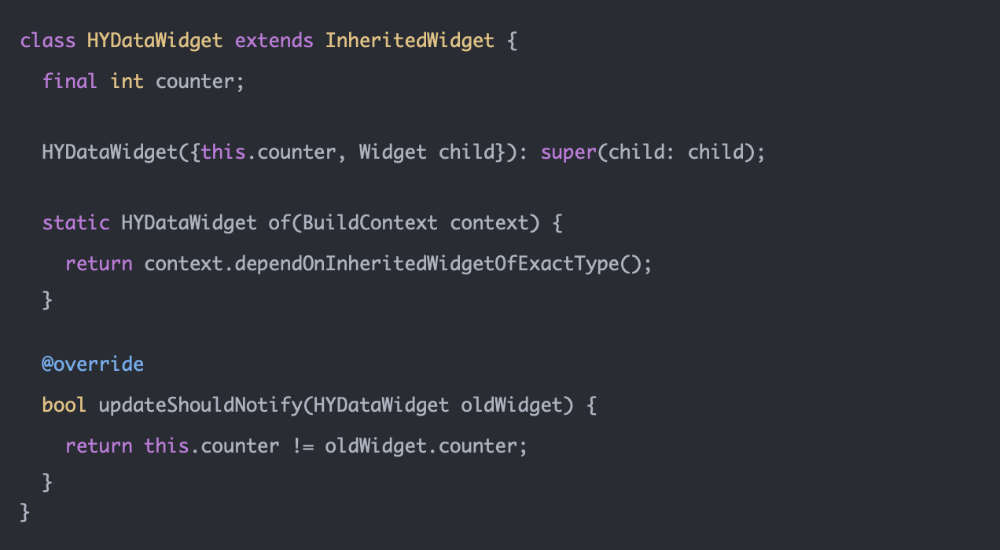
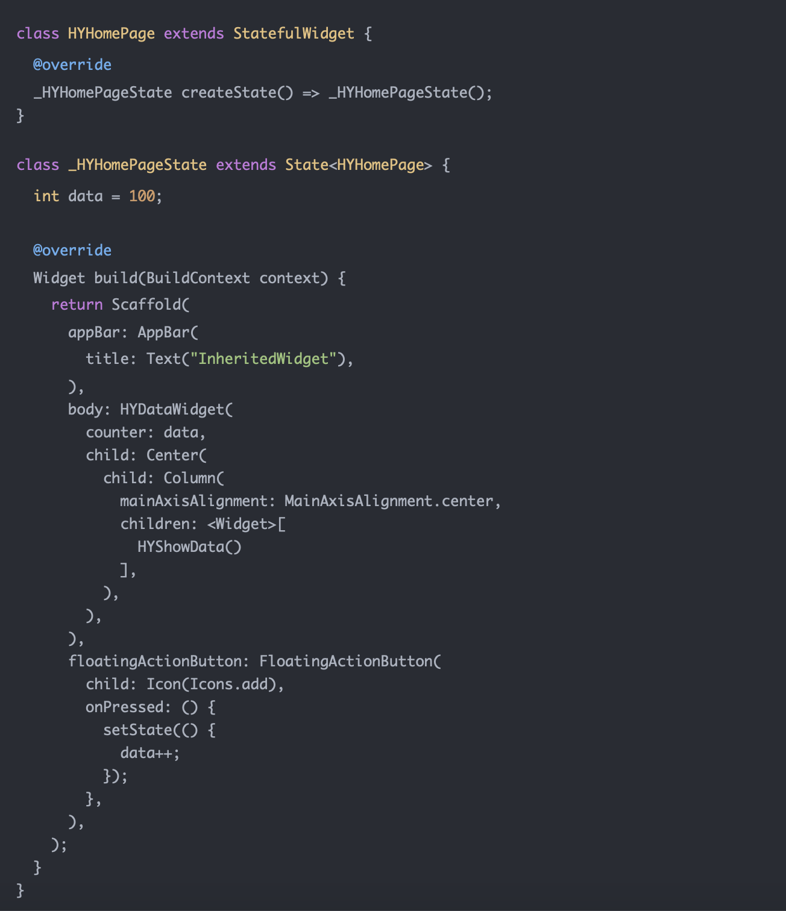
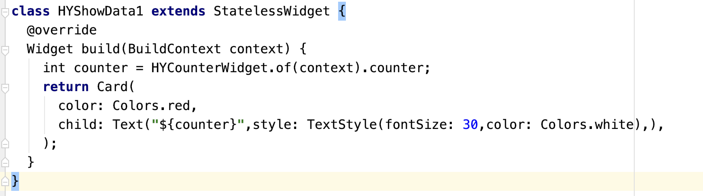
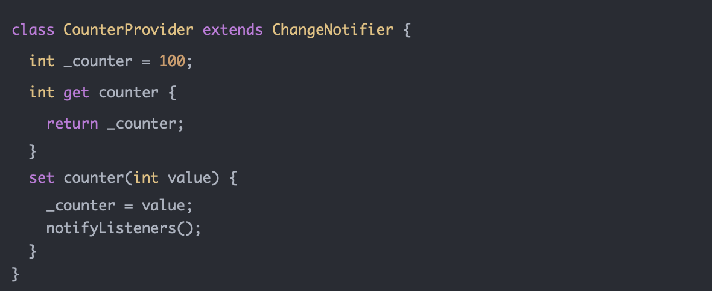

状态管理是声明式编程非常重要的一个概念，我们在前面介绍过Flutter是声明式编程的，也区分声明式编程和命令式编程的区别。

这里，我们就来系统的学习一下Flutter声明式编程中非常重要的状态管理

# 一. 为什么需要状态管理？

### 1.1. 认识状态管理

很多从命令式编程框架（Android或iOS原生开发者）转成声明式编程（Flutter、Vue、React等）刚开始并不适应，因为需要一个新的角度来考虑APP的开发模式。

Flutter作为一个现代的框架，是声明式编程的：

在编写一个应用的过程中，我们有大量的State需要来进行管理，而正是对这些State的改变，来更新界面的刷新：

### 1.2. 不同状态管理分类

##### 1.2.1. 短时状态Ephemeral state

某些状态只需要在自己的Widget中使用即可

 - 比如我们之前做的简单计数器counter
 - 比如一个PageView组件记录当前的页面
 - 比如一个动画记录当前的进度
 - 比如一个BottomNavigationBar中当前被选中的tab

这种状态我们只需要使用StatefulWidget对应的State类自己管理即可，Widget树中的其它部分并不需要访问这个状态。

这种方式在之前的学习中，我们已经应用过非常多次了。

##### 1.2.2. 应用状态App state

开发中也有非常多的状态需要在多个部分进行共享

 - 比如用户一个个性化选项
 - 比如用户的登录状态信息
 - 比如一个电商应用的购物车
 - 比如一个新闻应用的已读消息或者未读消息

这种状态我们如果在Widget之间传递来、传递去，那么是无穷尽的，并且代码的耦合度会变得非常高，牵一发而动全身，无论是代码编写质量、后期维护、可扩展性都非常差。

这个时候我们可以选择全局状态管理的方式，来对状态进行统一的管理和应用。

### 1.2.3. 如何选择不同的管理方式

开发中，没有明确的规则去区分哪些状态是短时状态，哪些状态是应用状态。

 - 某些短时状态可能在之后的开发维护中需要升级为应用状态。

但是我们可以简单遵守下面这幅流程图的规则：

针对React使用setState还是Redux中的Store来管理状态哪个更好的问题，Redux的issue上，Redux的作者Dan Abramov，它这样回答的：

The rule of thumb is: Do whatever is less awkward

经验原则就是：选择能够减少麻烦的方式。

# 二. 共享状态管理

### 2.1. InheritedWidget

InheritedWidget和React中的context功能类似，可以实现跨组件数据的传递。

定义一个共享数据的InheritedWidget，需要继承自InheritedWidget

这里定义了一个of方法，该方法通过context开始去查找祖先的HYDataWidget（可以查看源码查找过程）

updateShouldNotify方法是对比新旧HYDataWidget，是否需要对更新相关依赖的Widget

创建HYDataWidget，并且传入数据（这里点击按钮会修改数据，并且重新build）

在某个Widget中使用共享的数据，并且监听

### 2.2. Provider

Provider是目前官方推荐的全局状态管理工具，由社区作者Remi Rousselet 和 Flutter Team共同编写。

使用之前，我们需要先引入对它的依赖，截止这篇文章，Provider的最新版本为4.0.4：

##### 2.2.1. Provider的基本使用

在使用Provider的时候，我们主要关心三个概念：

 - ChangeNotifier：真正数据（状态）存放的地方
 - ChangeNotifierProvider：Widget树中提供数据（状态）的地方，会在其中创建对应的ChangeNotifier
 - Consumer：Widget树中需要使用数据（状态）的地方

我们先来完成一个简单的案例，将官方计数器案例使用Provider来实现：

**第一步：创建自己的ChangeNotifier**

我们需要一个ChangeNotifier来保存我们的状态，所以创建它
 
 - 这里我们可以使用继承自ChangeNotifier，也可以使用混入，这取决于概率是否需要继承自其它的类
 - 我们使用一个私有的_counter，并且提供了getter和setter
 - 在setter中我们监听到_counter的改变，就调用notifyListeners方法，通知所有的Consumer进行更新

**第二步：在Widget Tree中插入ChangeNotifierProvider**

我们需要在Widget Tree中插入ChangeNotifierProvider，以便Consumer可以获取到数据：
将ChangeNotifierProvider放到了顶层，这样方便在整个应用的任何地方可以使用CounterProvider

第三步：在首页中使用Consumer引入和修改状态
引入位置一：在body中使用Consumer，Consumer需要传入一个builder回调函数，当数据发生变化时，就会通知依赖数据的Consumer重新调用builder方法来构建；
引入位置二：在floatingActionButton中使用Consumer，当点击按钮时，修改CounterNotifier中的counter数据；

Consumer的builder方法解析：
参数一：context，每个build方法都会有上下文，目的是知道当前树的位置
参数二：ChangeNotifier对应的实例，也是我们在builder函数中主要使用的对象
参数三：child，目的是进行优化，如果builder下面有一颗庞大的子树，当模型发生改变的时候，我们并不希望重新build这颗子树，那么就可以将这颗子树放到Consumer的child中，在这里直接引入即可（注意我案例中的Icon所放的位置）

步骤四：创建一个新的页面，在新的页面中修改数据

2.2.2. Provider.of的弊端
事实上，因为Provider是基于InheritedWidget，所以我们在使用ChangeNotifier中的数据时，我们可以通过Provider.of的方式来使用，比如下面的代码：

我们会发现很明显上面的代码会更加简洁，那么开发中是否要选择上面这种方式呢？
答案是否定的，更多时候我们还是要选择Consumer的方式。

为什么呢？因为Consumer在刷新整个Widget树时，会尽可能少的rebuild Widget。
方式一：Provider.of的方式完整的代码：
当我们点击了floatingActionButton时，HYHomePage的build方法会被重新调用。
这意味着整个HYHomePage的Widget都需要重新build

方式二：将Text中的内容采用Consumer的方式修改如下：
你会发现HYHomePage的build方法不会被重新调用；
设置如果我们有对应的child widget，可以采用上面案例中的方式来组织，性能更高；

2.2.3. Selector的选择
Consumer是否是最好的选择呢？并不是，它也会存在弊端

比如当点击了floatingActionButton时，我们在代码的两处分别打印它们的builder是否会重新调用；
我们会发现只要点击了floatingActionButton，两个位置都会被重新builder；
但是floatingActionButton的位置有重新build的必要吗？没有，因为它是否在操作数据，并没有展示；
如何可以做到让它不要重新build了？使用Selector来代替Consumer

我们先直接实现代码，在解释其中的含义：

Selector和Consumer对比，不同之处主要是三个关键点：

关键点1：泛型参数是两个
泛型参数一：我们这次要使用的Provider
泛型参数二：转换之后的数据类型，比如我这里转换之后依然是使用CounterProvider，那么他们两个就是一样的类型
关键点2：selector回调函数
转换的回调函数，你希望如何进行转换
S Function(BuildContext, A) selector
我这里没有进行转换，所以直接将A实例返回即可
关键点3：是否希望重新rebuild
这里也是一个回调函数，我们可以拿到转换前后的两个实例；
bool Function(T previous, T next);
因为这里我不希望它重新rebuild，无论数据如何变化，所以这里我直接return false；

这个时候，我们重新测试点击floatingActionButton，floatingActionButton中的代码并不会进行rebuild操作。
所以在某些情况下，我们可以使用Selector来代替Consumer，性能会更高。

2.2.4. MultiProvider
在开发中，我们需要共享的数据肯定不止一个，并且数据之间我们需要组织到一起，所以一个Provider必然是不够的。
我们在增加一个新的ChangeNotifier

如果在开发中我们有多个Provider需要提供应该怎么做呢？
方式一：多个Provider之间嵌套

这样做有很大的弊端，如果嵌套层级过多不方便维护，扩展性也比较差

方式二：使用MultiProvider

