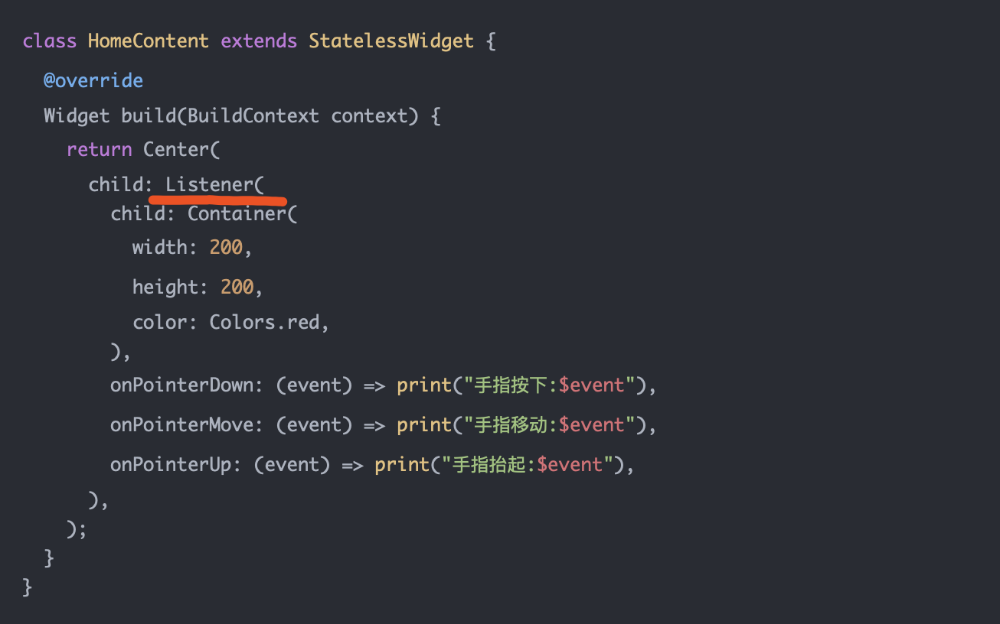
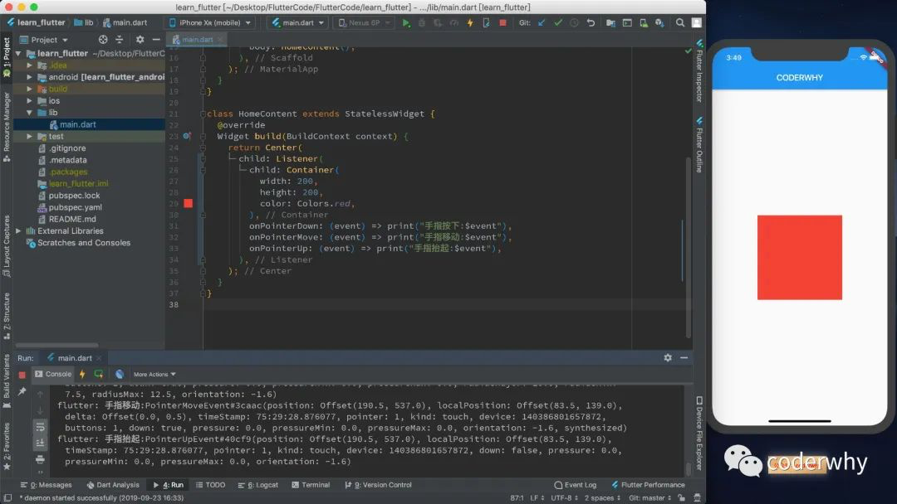
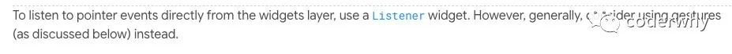
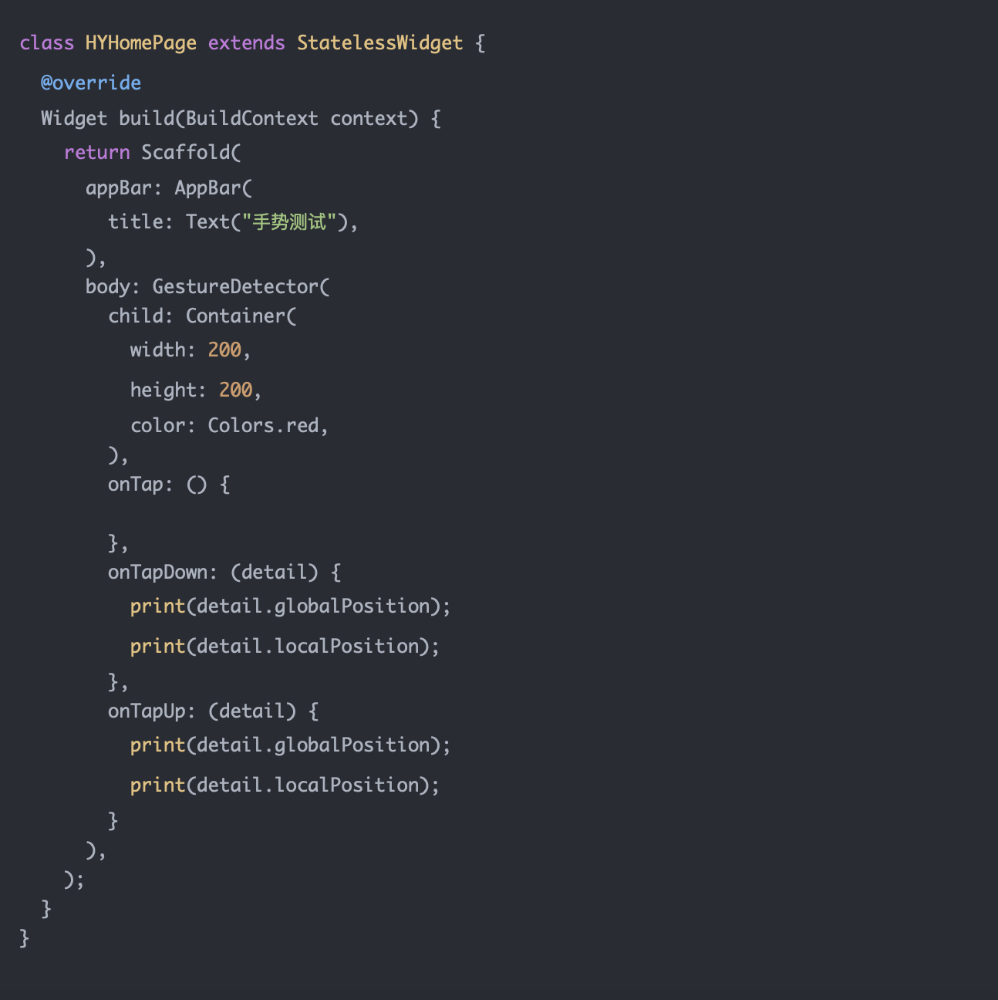
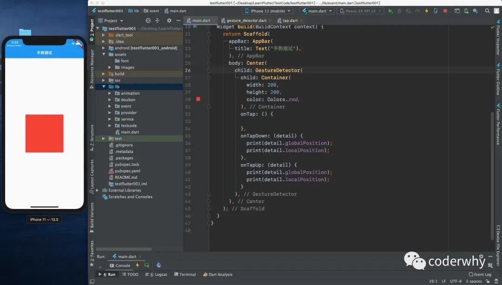
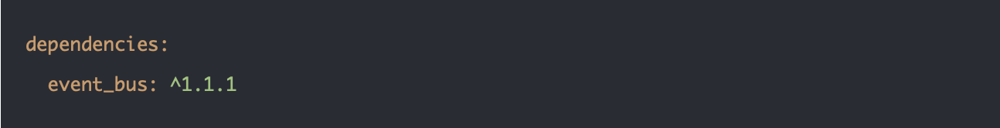
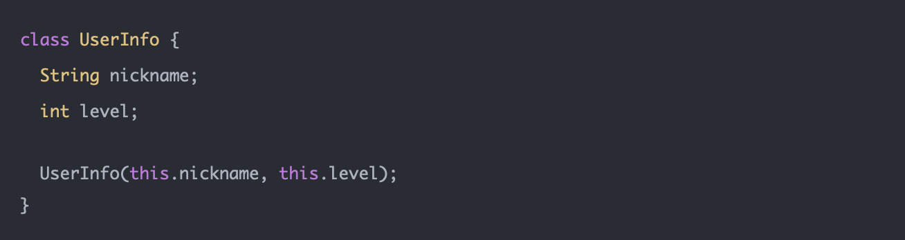
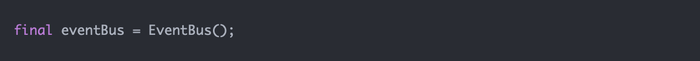
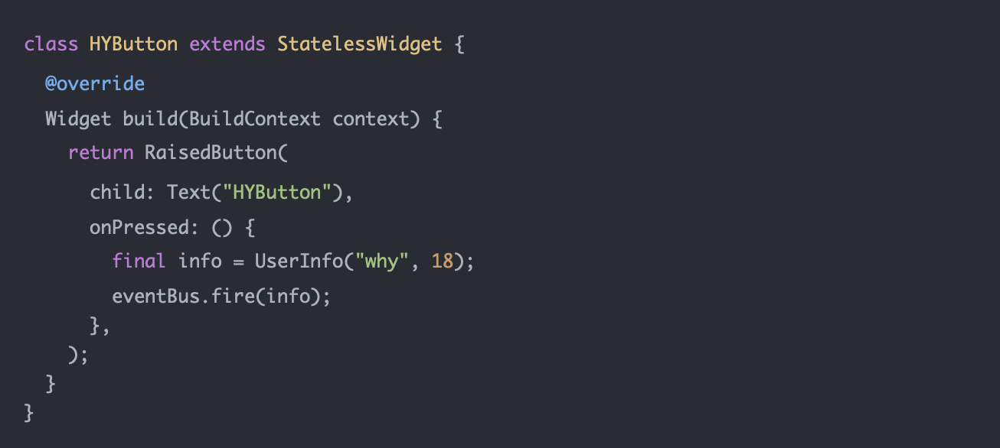
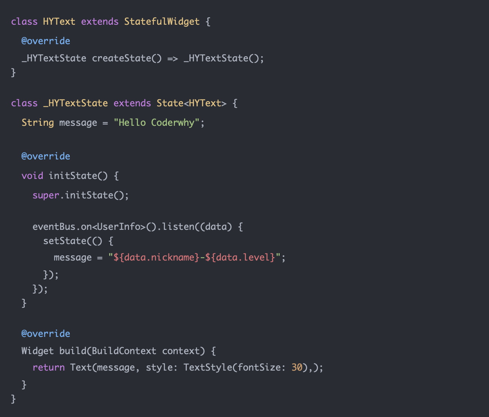

# 一. 事件监听

在大前端的开发中，必然存在各种各样和用户交互的情况：比如手指点击、手指滑动、双击、长按等等。

在Flutter中，手势有两个不同的层次：

 - 第一层：原始指针事件（Pointer Events）：描述了屏幕上由触摸板、鼠标、指示笔等触发的指针的位置和移动。
 - 第二层：手势识别（Gesture Detector）：这个是在原始事件上的一种封装。
 	
 	* 比如我们要监听用户长按，如果自己封装原始事件我们需要监听从用户按下到抬起的时间来判断是否是一次长按事件；
	* 比如我们需要监听用户双击事件，我们需要自己封装监听用户两次按下抬起的时间间隔；
	* 幸运的是各个平台几乎都对它们进行了封装，而Flutter中的手势识别就是对原始指针事件的封装；
	* 包括哪些手势呢？比如点击、双击、长按、拖动等

### 1.1. 指针事件Pointer

Pointer 代表的是人机界面交互的原始数据。一共有四种指针事件：

 - PointerDownEvent 指针在特定位置与屏幕接触
 - PointerMoveEvent 指针从屏幕的一个位置移动到另外一个位置
 - PointerUpEvent 指针与屏幕停止接触
 - PointerCancelEvent 指针因为一些特殊情况被取消

Pointer的原理是什么呢？

 - 在指针落下时，框架做了一个 hit test 的操作，确定与屏幕发生接触的位置上有哪些Widget以及分发给最内部的组件去响应；
 - 事件会沿着最内部的组件向组件树的根冒泡分发；
 - 并且不存在用于取消或者停止指针事件进一步分发的机制；


原始指针事件使用Listener来监听：





### 1.2. 手势识别Gesture

Gesture是对一系列Pointer的封装，官方建议开发中尽可能使用Gesture，而不是Pointer



**Gesture分层非常多的种类：**

点击：

 - onTapDown：用户发生手指按下的操作
 - onTapUp：用户发生手指抬起的操作
 - onTap：用户点击事件完成
 - onTapCancel：事件按下过程中被取消

双击：

 - onDoubleTap：快速点击了两次

长按：

 - onLongPress：在屏幕上保持了一段时间

纵向拖拽：

 - onVerticalDragStart：指针和屏幕产生接触并可能开始纵向移动；
 - onVerticalDragUpdate：指针和屏幕产生接触，在纵向上发生移动并保持移动；
 - onVerticalDragEnd：指针和屏幕产生接触结束；

横线拖拽：

 - onHorizontalDragStart：指针和屏幕产生接触并可能开始横向移动；
 - onHorizontalDragUpdate：指针和屏幕产生接触，在横向上发生移动并保持移动；
 - onHorizontalDragEnd：指针和屏幕产生接触结束；

移动：

 - onPanStart：指针和屏幕产生接触并可能开始横向移动或者纵向移动。如果设置了
 - onHorizontalDragStart 或者 onVerticalDragStart，该回调方法会引发崩溃；
 - onPanUpdate：指针和屏幕产生接触，在横向或者纵向上发生移动并保持移动。如果设置了
 - onHorizontalDragUpdate 或者 onVerticalDragUpdate，该回调方法会引发崩溃。
 - onPanEnd：指针先前和屏幕产生了接触，并且以特定速度移动，此后不再在屏幕接触上发生移动。如果设置了  
 - onHorizontalDragEnd 或者 onVerticalDragEnd，该回调方法会引发崩溃。

从Widget的层面来监听手势，我们需要使用：GestureDetector

 - 当然，我们也可以使用RaisedButton、FlatButton、InkWell等来监听手势
 - globalPosition用于获取相对于屏幕的位置信息
 - localPosition用于获取相对于当前Widget的位置信息







### 1.3 忽略内层的点击

```
class IgnoreInnerClickDemo3 extends StatelessWidget {
  @override
  Widget build(BuildContext context) {
    return Center(
      child: GestureDetector(
        onTapDown: (details){
          print("outter click");
        },
        child: Container(
          width: 200,
          height: 200,
          color: Colors.red,
          alignment: Alignment.center,
          child: IgnorePointer(
            child: GestureDetector(
              onTapDown: (details){
                print("inner click");
              },
              child: Container(
                width: 100,
                height: 100,
                color: Colors.blue,
              ),
            ),
          ),
        ),
      ),
    );
  }
}
```

### 1.4 使用Stack堆叠组件

```
//4.使用Stack堆叠组件
class StackDemo4 extends StatelessWidget {
  @override
  Widget build(BuildContext context) {
    return Center(
        child: Stack(
          alignment: Alignment.center,
          children: <Widget>[
            GestureDetector(
              onTapDown: (details){
                print("outter click");
              },
              child: Container(
                width: 200,
                height: 200,
                color: Colors.red,
              ),
            ),
            GestureDetector(
              onTapDown: (details){
                print("inner click");
              },
              child: Container(
                  width: 100,
                  height: 100,
                  color: Colors.blue
              ),
            ),
          ],
        )
    );
  }
}
```

# 二. 跨组件事件
在组件之间如果有事件需要传递，一方面可以一层层来传递，另一方面我们也可以使用一个EventBus工具来完成。

其实EventBus在Vue、React中都是一种非常常见的跨组件通信的方式：

 - EventBus相当于是一种订阅者模式，通过一个全局的对象来管理；
 - 这个EventBus我们可以自己实现，也可以使用第三方的EventBus；

这里我们直接选择第三方的EventBus：



第一：我们需要定义一个希望在组件之间传递的对象：

 - 我们可以称之为一个时间对象，也可以是我们平时开发中用的模型对象（model）



第二：创建一个全局的EventBus对象



第三：在某个Widget中，发出事件：



第四：在某个Widget中，监听事件

