我们通常会用屏（Screen）来称呼一个页面（Page），一个完整的App应该是有多个Page组成的。

在之前的案例（豆瓣）中，我们通过IndexedStack来管理了首页中的Page切换：

首页-书影音-小组-市集-我的

通过点击BottomNavigationBarItem来设置IndexedStack的index属性来切换

除了上面这种管理页面的方式，我们还需要实现其它功能的页面跳转：比如点击一个商品跳转到详情页，某个按钮跳转到发送朋友圈、微博的编辑页面。

这种页面的管理和导航，我们通常会使用路由进行统一管理。

# 一. 路由管理

### 1.1. 认识Flutter路由

路由的概念由来已久，包括网络路由、后端路由，到现在广为流行的前端路由。

- 无论路由的概念如何应用，它的核心是一个路由映射表
- 比如：名字 detail 映射到 DetailPage 页面等
- 有了这个映射表之后，我们就可以方便的根据名字来完成路由的转发（在前端表现出来的就是页面跳转）

在Flutter中，路由管理主要有两个类：Route和Navigator

### 1.2. Route

Route：一个页面要想被路由统一管理，必须包装为一个Route

 - 官方的说法很清晰：An abstraction for an entry managed by a Navigator.
 
但是Route是一个抽象类，所以它是不能实例化的

 - 在上面有一段注释，让我们查看MaterialPageRoute来使用

事实上MaterialPageRoute并不是Route的直接子类：

 - MaterialPageRoute在不同的平台有不同的表现
 - 对Android平台，打开一个页面会从屏幕底部滑动到屏幕的顶部，关闭页面时从顶部滑动到底部消失
 - 对iOS平台，打开一个页面会从屏幕右侧滑动到屏幕的左侧，关闭页面时从左侧滑动到右侧消失
 - 当然，iOS平台我们也可以使用CupertinoPageRoute

### 1.3. Navigator

Navigator：管理所有的Route的Widget，通过一个Stack来进行管理的

 - 官方的说法也很清晰：A widget that manages a set of child widgets with a stack discipline.

那么我们开发中需要手动去创建一个Navigator吗？

 - 并不需要，我们开发中使用的MaterialApp、CupertinoApp、WidgetsApp它们默认是有插入Navigator的
 - 所以，我们在需要的时候，只需要直接使用即可

Navigator有几个最常见的方法：

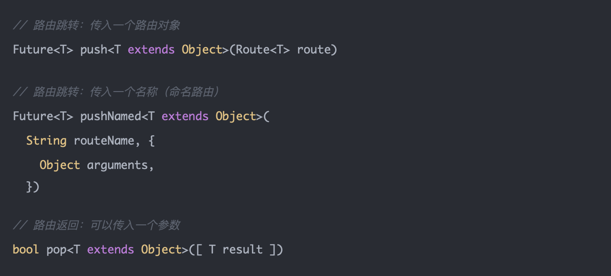

# 二. 路由基本使用

### 2.1. 基本跳转

我们来实现一个最基本跳转：

 - 创建首页页面，中间添加一个按钮，点击按钮跳转到详情页面
 - 创建详情页面，中间添加一个按钮，点击按钮返回到首页页面

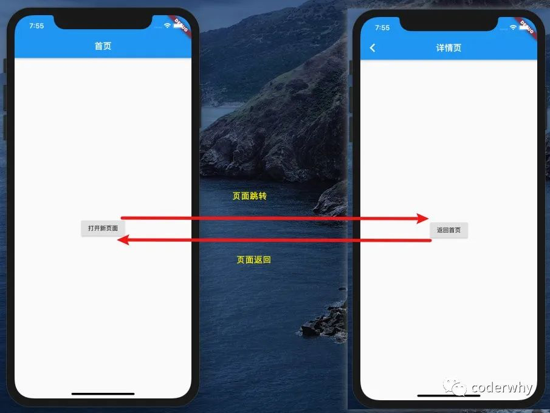

核心的跳转代码如下（首页中代码）：

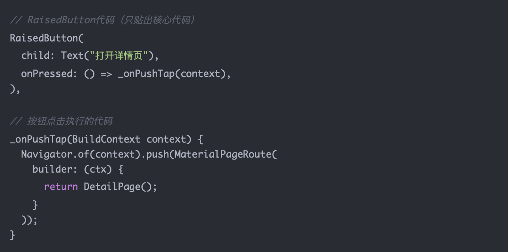

核心的返回代码如下（详情页中代码）：

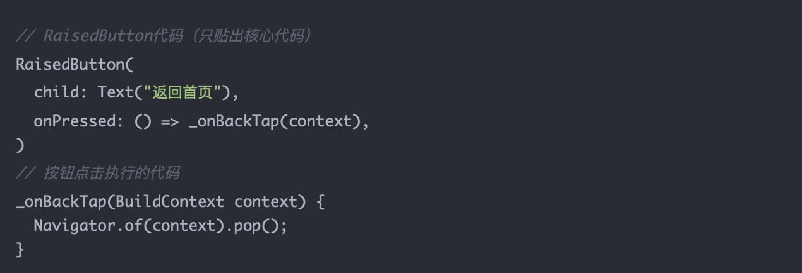

### 2.2. 参数传递

在跳转过程中，我们通常可能会携带一些参数，比如

 - 首页跳到详情页，携带一条信息：a home message
 - 详情页返回首页，携带一条信息：a detail message

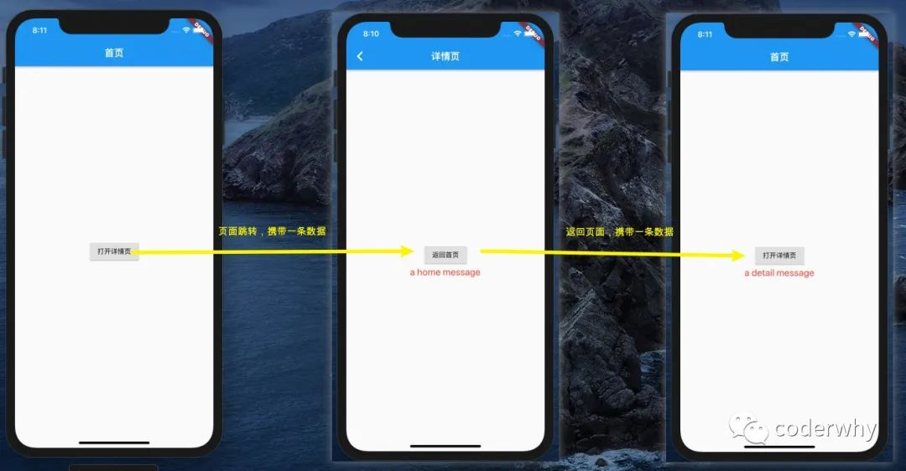

首页跳转核心代码：

 - 在页面跳转时，会返回一个Future
 - 该Future会在详情页面调用pop时，回调对应的then函数，并且会携带结果

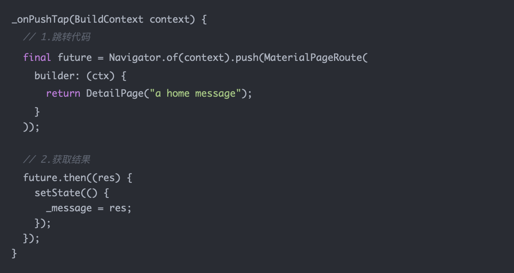

详情页返回核心代码：

### 2.3. 返回细节

但是这里有一个问题，如果用户是点击右上角的返回按钮，如何监听呢？

方法一：自定义返回的按钮（在详情页中修改Scaffold的appBar）

方法二：监听返回按钮的点击（给Scaffold包裹一个WillPopScope）

 - WillPopScope有一个onWillPop的回调函数，当我们点击返回按钮时会执行
 - 这个函数要求有一个Future的返回值：
	- true：那么系统会自动帮我们执行pop操作
	- false：系统不再执行pop操作，需要我们自己来执行

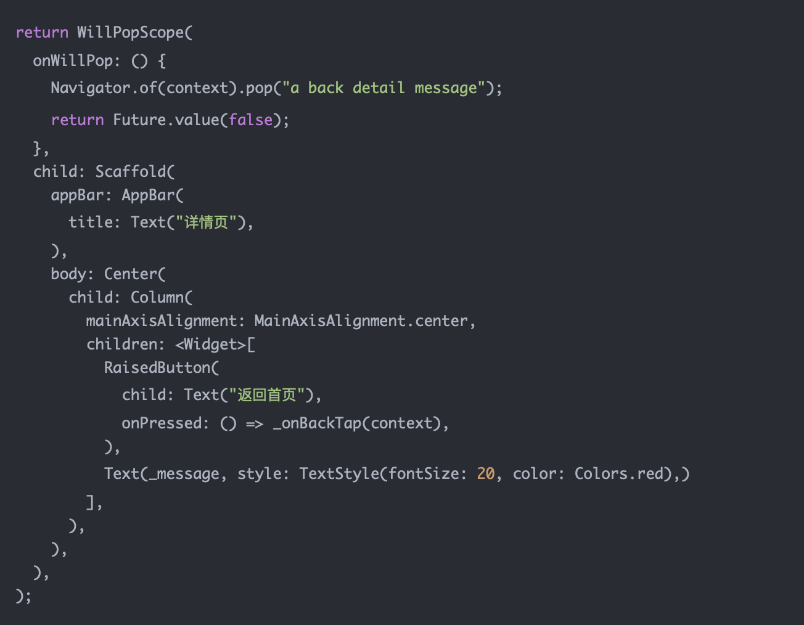

# 三. 命名路由使用

### 3.1. 基本跳转

我们可以通过创建一个新的Route，使用Navigator来导航到一个新的页面，但是如果在应用中很多地方都需要导航到同一个页面（比如在开发中，首页、推荐、分类页都可能会跳到详情页），那么就会存在很多重复的代码。

在这种情况下，我们可以使用命名路由（named route）

 - 命名路由是将名字和路由的映射关系，在一个地方进行统一的管理
 - 有了命名路由，我们可以通过Navigator.pushNamed() 方法来跳转到新的页面

命名路由在哪里管理呢？可以放在MaterialApp的 initialRoute 和 routes 中

 - initialRoute：设置应用程序从哪一个路由开始启动，设置了该属性，就不需要再设置home属性了
 - routes：定义名称和路由之间的映射关系，类型为Map<String, WidgetBuilder>

修改MaterialApp中的代码：

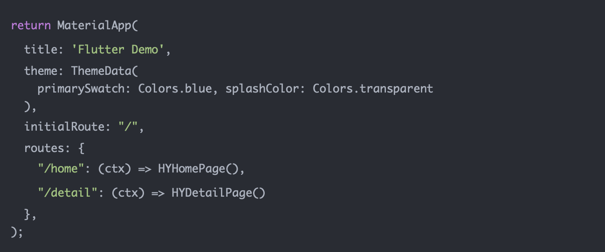

修改跳转的代码：

在开发中，为了让每个页面对应的routeName统一，我们通常会在每个页面中定义一个路由的常量来使用：

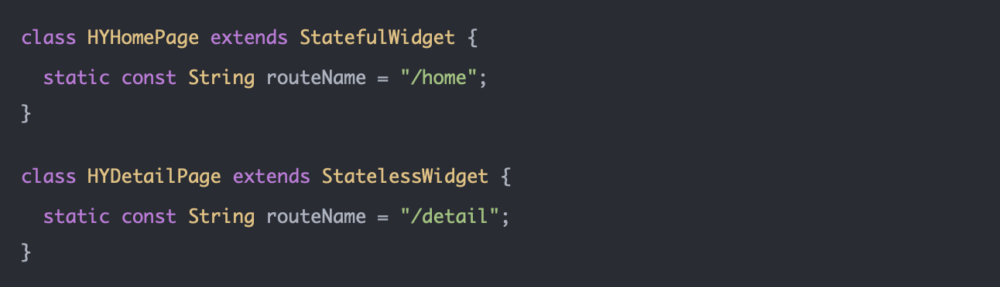

修改MaterialApp中routes的key

### 3.2. 参数传递

因为通常命名路由，我们会在定义路由时，直接创建好对象，比如HYDetailPage()

那么，命名路由如果有参数需要传递呢？

pushNamed时，如何传递参数：

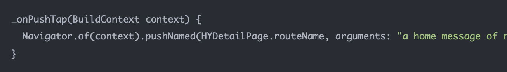

在HYDetailPage中，如何获取到参数呢？

 - 在build方法中ModalRoute.of(context)可以获取到传递的参数

### 3.3. 路由钩子

##### 3.3.1. onGenerateRoute

假如我们有一个HYAboutPage，也希望在跳转时，传入对应的参数message，并且已经有一个对应的构造方法

在HYHomePage中添加跳转的代码：

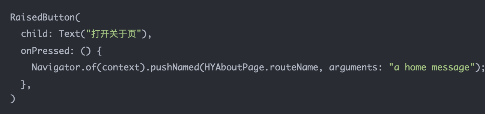

HYAboutPage的代码：

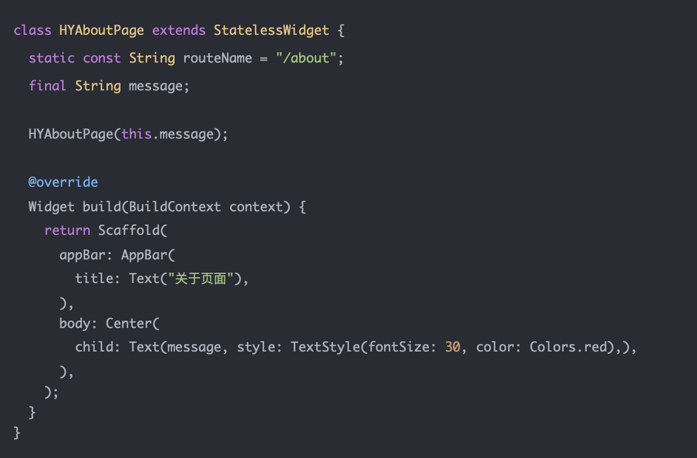

但是我们继续使用routes中的映射关系，就不好进行配置了，因为HYAboutPage必须要求传入一个参数；

这个时候我们可以使用onGenerateRoute的钩子函数：

 - 当我们通过pushNamed进行跳转，但是对应的name没有在routes中有映射关系，那么就会执行onGenerateRoute钩子函数；
 - 我们可以在该函数中，手动创建对应的Route进行返回；
 - 该函数有一个参数RouteSettings，该类有两个常用的属性：
	- name: 跳转的路径名称
 	- arguments：跳转时携带的参数

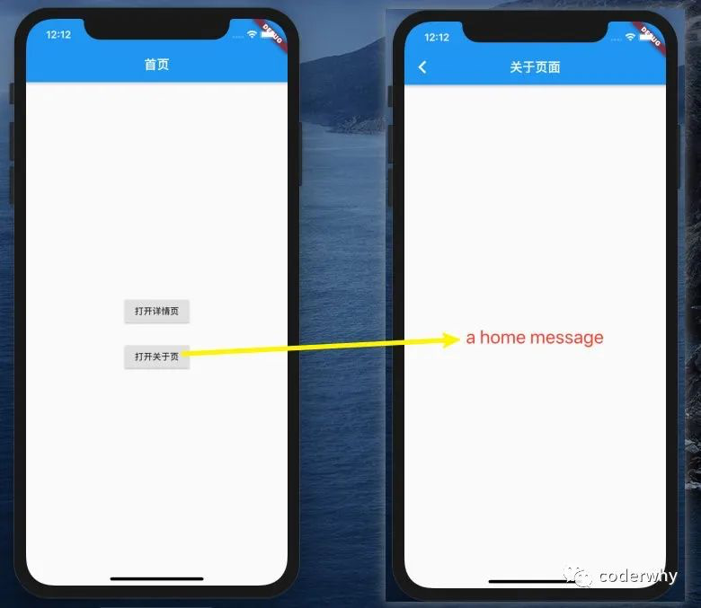

##### 3.3.2. onUnknownRoute

如果我们打开的一个路由名称是根本不存在，这个时候我们希望跳转到一个统一的错误页面。
比如下面的abc是不存在有对应的页面的

 - 如果没有进行特殊的处理，那么Flutter会报错。

我们可以创建一个错误的页面：

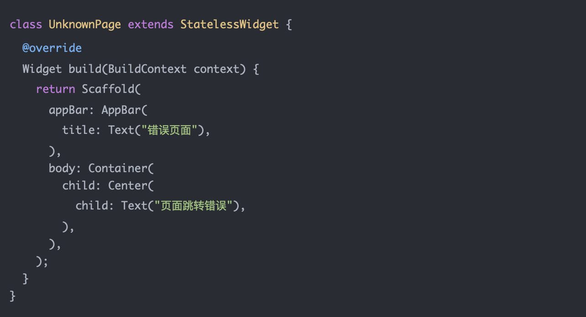

并且设置onUnknownRoute

