# 一. 主题简单介绍
Theme分为：全局Theme和局部Theme

主题有两个作用：

 - 设置了主题之后，某些Widget会自动使用主题的样式（比如AppBar的颜色）
 - 将某些样式放到主题中统一管理，在应用程序的其它地方直接引用

### 1.1. 全局Theme

全局Theme会影响整个app的颜色和字体样式。

使用起来非常简单，只需要向MaterialApp构造器传入 ThemeData 即可。

 - 如果没有设置Theme，Flutter将会使用预设的样式。
 - 当然，我们可以对它进行定制。

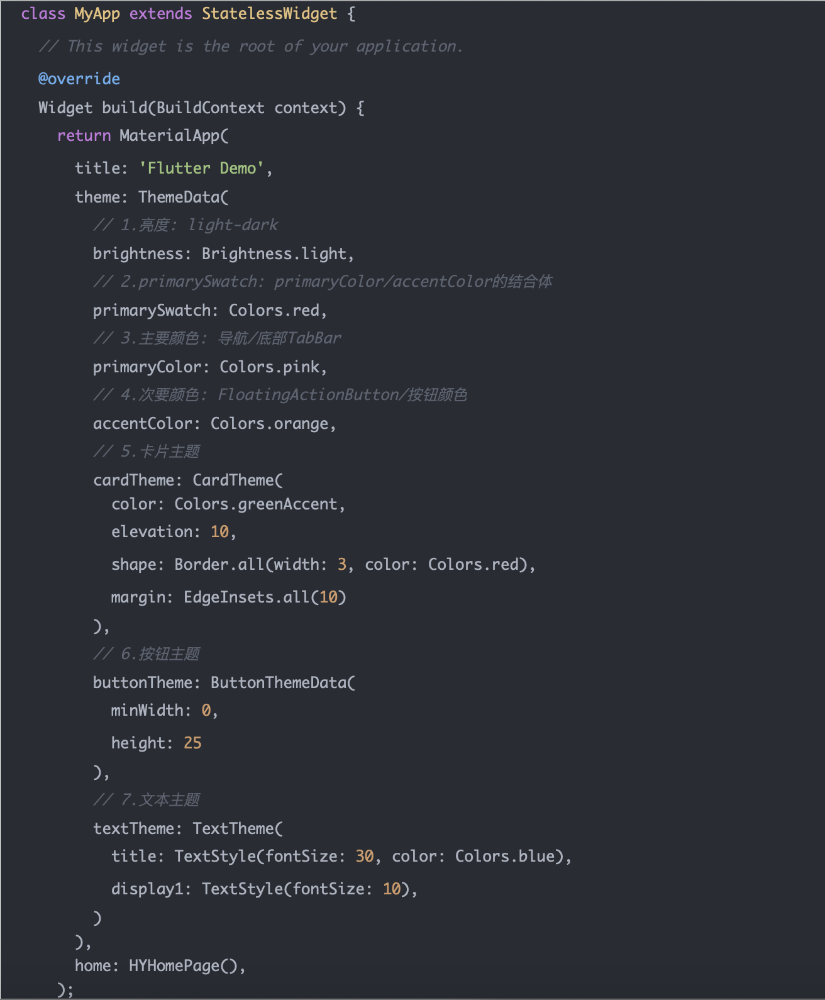

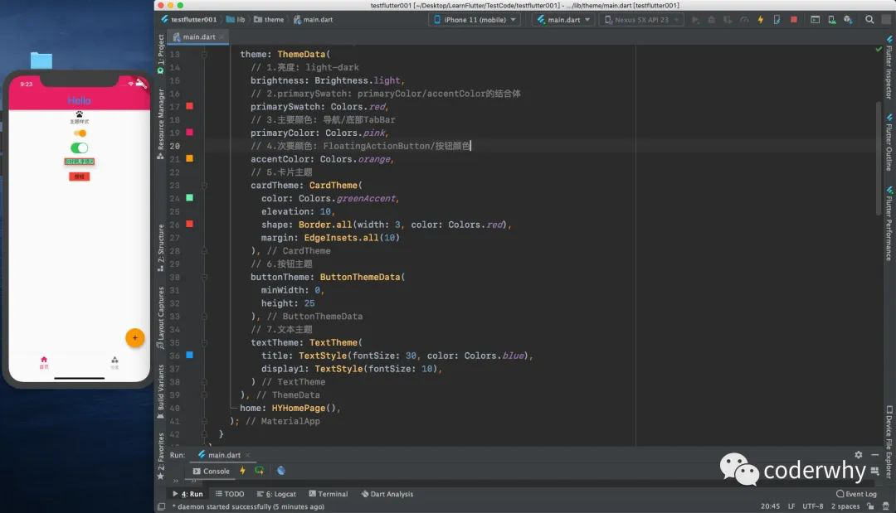

### 1.2. 局部Theme

如果某个具体的Widget不希望直接使用全局的Theme，而希望自己来定义，应该如何做呢？

 - 非常简单，只需要在Widget的父节点包裹一下Theme即可

创建另外一个新的页面，页面中使用新的主题：

 - 在新的页面的Scaffold外，包裹了一个Theme，并且设置data为一个新的ThemeData

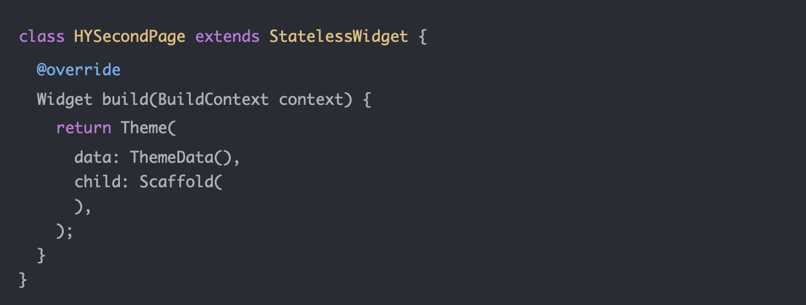

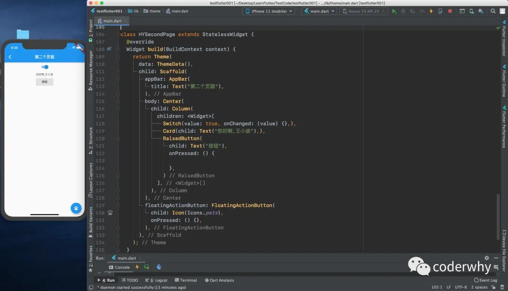

但是，我们很多时候并不是想完全使用一个新的主题，而且在之前的主题基础之上进行修改：

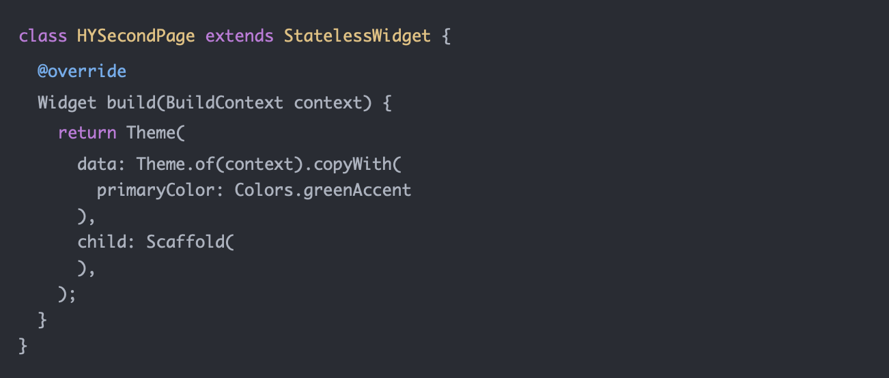

### 1.3. Flutter中文网错误

但是这里有一个注意事项：accentColor在这里并不会被覆盖。

为什么不能覆盖呢？https://github.com/material-components/material-components-flutter-codelabs/issues/106

我摘抄一点官方人员的回复：

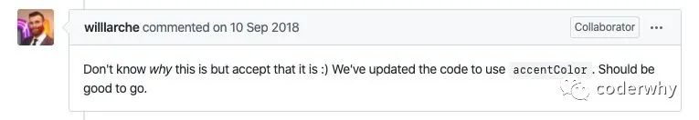

其实官网文档中之前也出现了类似的错误，比如Flutter中文网之前是翻译官方文档的

 - https://flutterchina.club/cookbook/design/themes/其中就有该错误

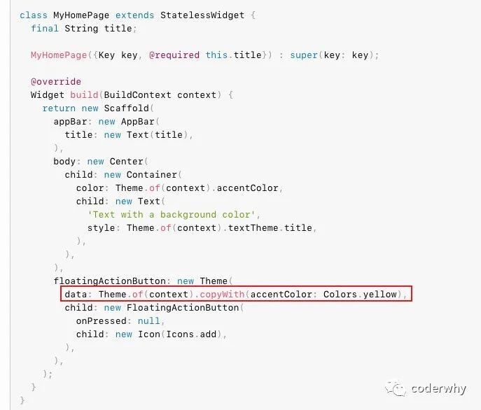

后来官网文档中对这个问题进行了修正：

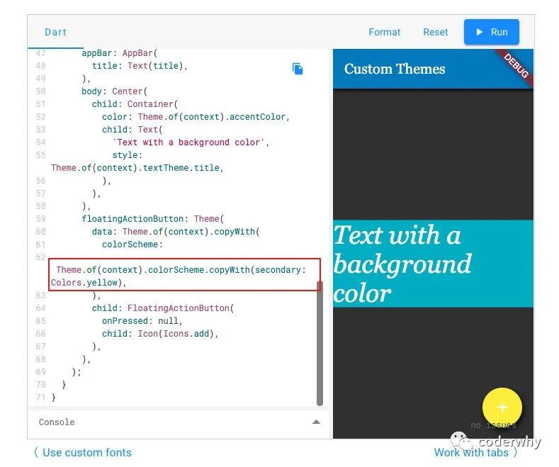

# 二. 暗黑Theme适配

### 2.1. darkTheme

目前很多应用程序都需要适配暗黑模式，Flutter中如何做到暗黑模式的适配呢？

事实上，MaterialApp中有theme和dartTheme两个参数：

 - 按照下面的写法，我们已经默认适配了暗黑主题

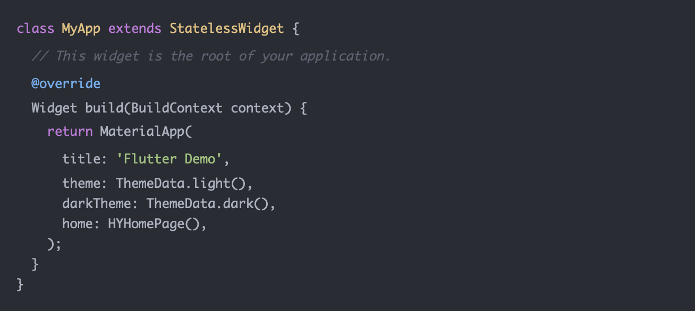

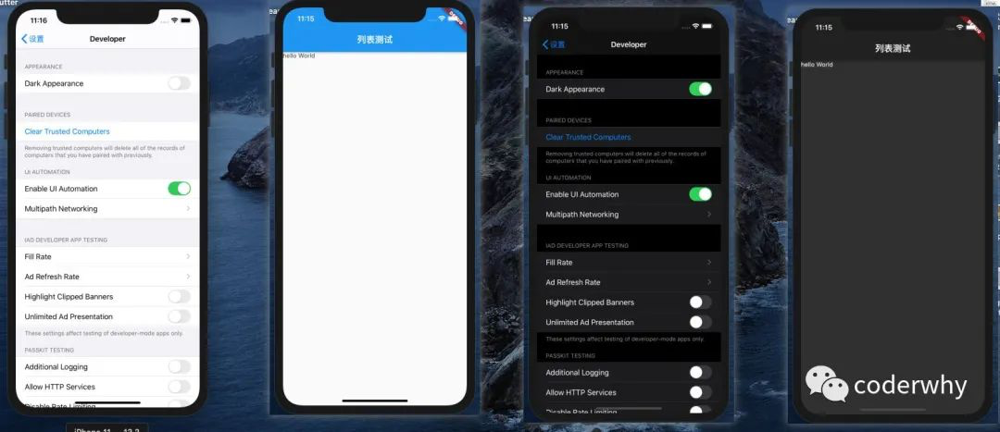

### 2.2. 开发中适配

在开发中，为了能适配两种主题（设置是更多的主题），我们可以封装一个AppTheme

 - 1.公共的样式抽取成常量
 - 2.封装一个亮色主题
 - 3.封装一个暗黑主题

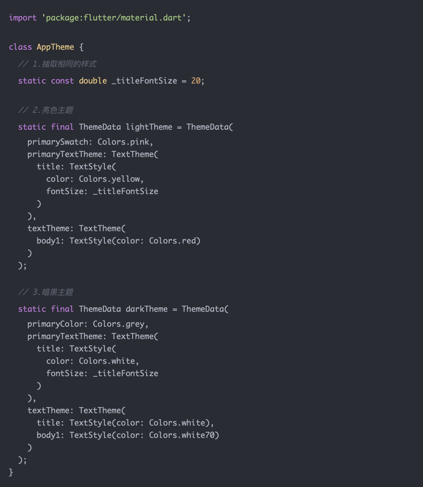

在MaterialApp中，可以决定使用哪一个主题：

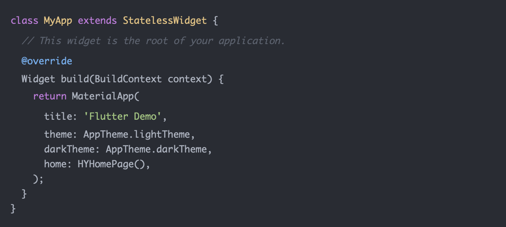