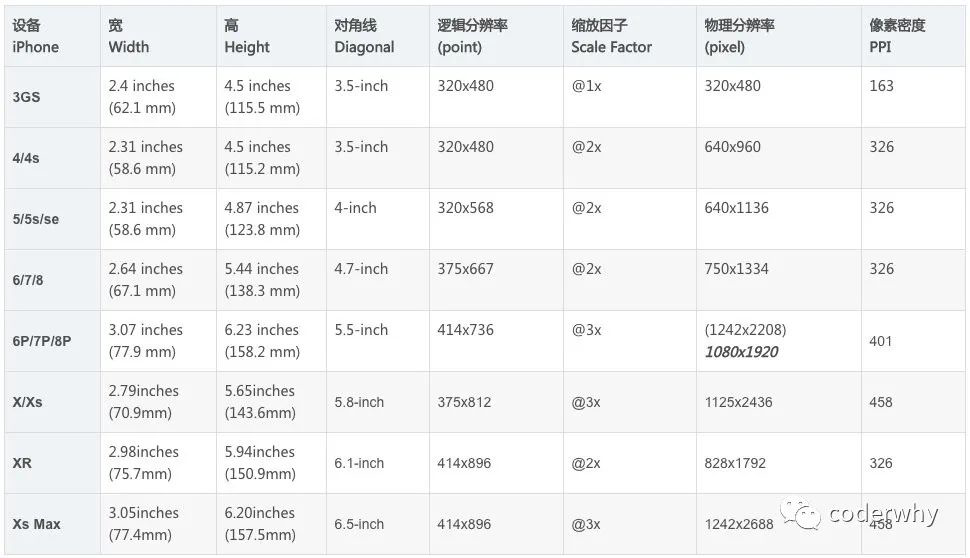
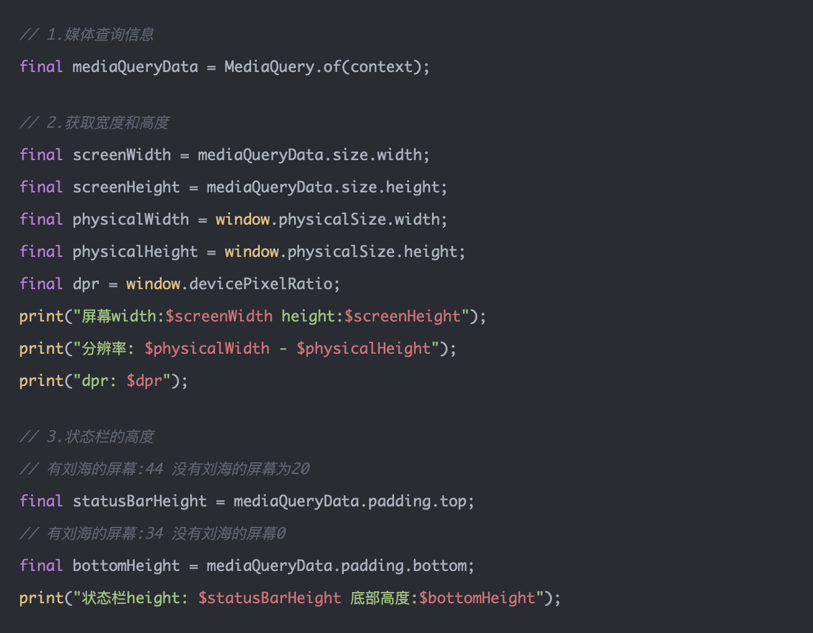
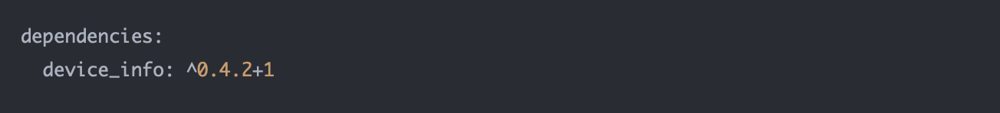
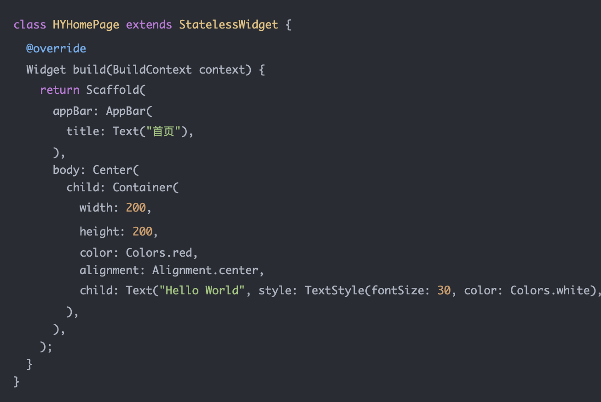
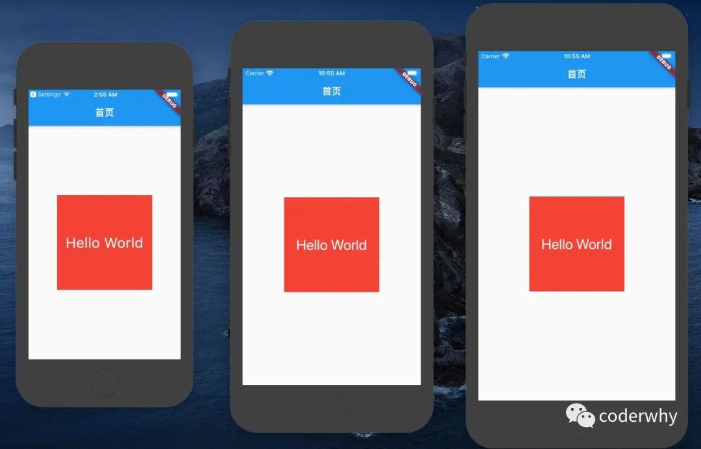
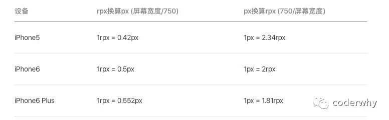
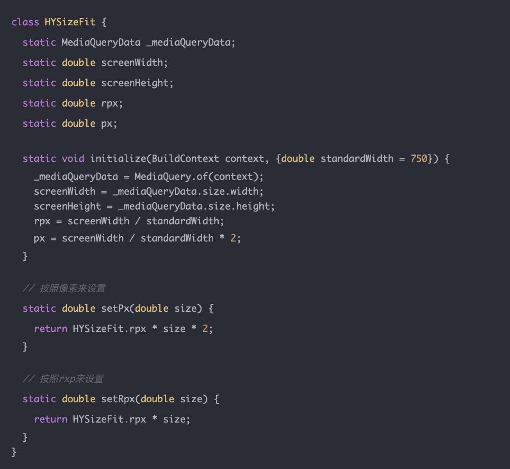
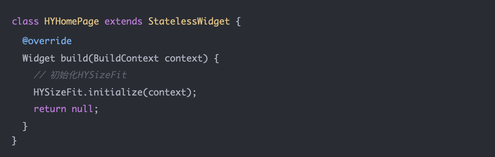
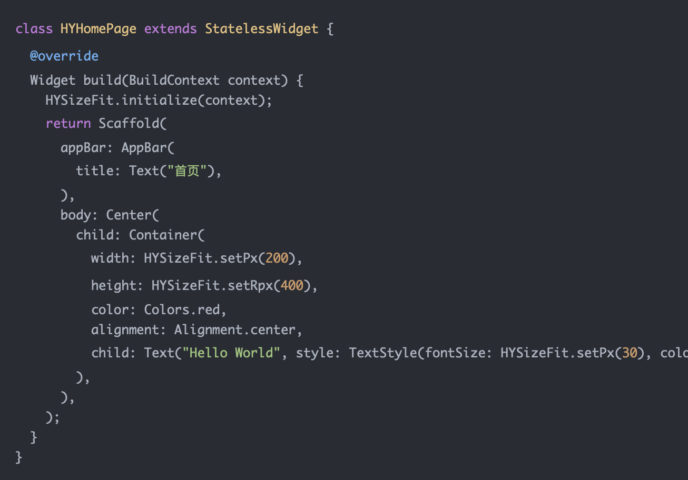
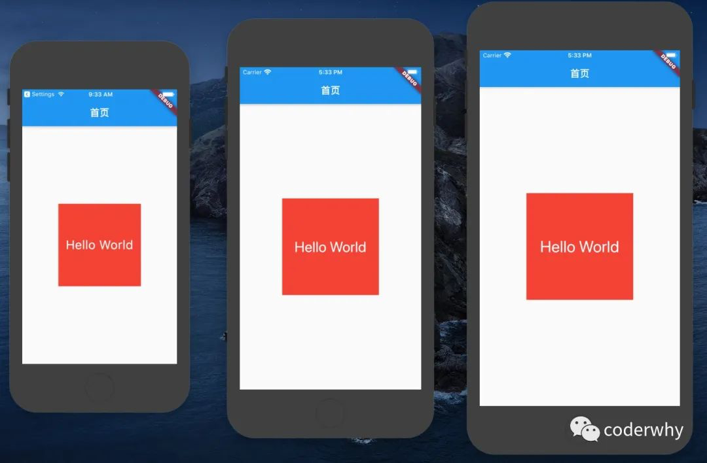

目前移动端的设备已经非常多，并且不同的设备手机屏幕也不相同。

目前做移动端开发都要针对不同的设备进行一定的适配，无论是移动原生开发、小程序、H5页面。

Flutter中如何针对不同的手机屏幕来进行适配呢？我们一起来聊聊这个话题。

# 一. Flutter单位

### 1.1. Flutter中的单位

在进行Flutter开发时，我们通常不需要传入尺寸的单位，那么Flutter使用的是什么单位呢？

 - Flutter使用的是类似于iOS中的点pt，也就是point。
 - 所以我们经常说iPhone6的尺寸是375x667，但是它的分辨率其实是750x1334。
 - 因为iPhone6的dpr（devicePixelRatio）是2.0，iPhone6plus的dpr是3.0

在Flutter开发中，我们使用的是对应的逻辑分辨率

### 1.2. Flutter设备信息

获取屏幕上的一些信息，可以通过MediaQuery：

获取一些设备相关的信息，可以使用官方提供的一个库：

# 二. 适配方案

### 2.1. 适配概述

假如我们有下面这样一段代码：

 - 在屏幕中间显示一个200*200的Container
 - Container中有一段文字是30

上面的代码在不同屏幕上会有不同的表现：

 - 很明显，如果按照上面的规则，在iPhone5上面，尺寸过大，在iPhone6plus上面尺寸过小
 - 在开发中，我们应该可以根据不同的屏幕来完成尺寸的缩放

在前端开发中，针对不同的屏幕常见的适配方案有下面几种：

 - rem：
	- rem是给根标签（HTML标签）设置一个字体大小；
	- 但是不同的屏幕要动画设置不同的字体大小（可以通过媒体查询，也可以通过js动态计算）；
	- 其它所有的单位都使用rem单位（相对于根标签）；

 - vw、wh：
	- vw和vh是将屏幕（视口）分成100等份，一个1vw相当于是1%的大小；
	- 其它所有的单位都使用vw或wh单位；
	
 - rpx：
	- rpx是小程序中的适配方案，它将750px作为设计稿，1rpx=屏幕宽度/750；
	- 其它所有的单位都使用rpx单位；

这里我采用小程序的rpx来完成Flutter的适配

### 2.2. rpx适配

小程序中rpx的原理是什么呢？

 - 不管是什么屏幕，统一分成750份
 - 在iPhone5上：1rpx = 320/750 = 0.4266 ≈ 0.42px
 - 在iPhone6上：1rpx = 375/750 = 0.5px
 - 在iPhone6plus上：1rpx = 414/750 = 0.552px

那么我们就可以通过上面的计算方式，算出一个rpx，再将自己的size和rpx单位相乘即可：

 - 比如100px的宽度：100 * 2 * rpx
 - 在iPhone5上计算出的结果是84px
 - 在iPhone6上计算出的结果是100px
 - 在iPhone6plus上计算出的结果是110.4px

我们自己来封装一个工具类：

 - 工具类需要进行初始化，传入context
	- 可以通过传入context，利用媒体查询获取屏幕的宽度和高度
	- 也可以传入一个可选的参数，以什么尺寸作为设计稿

初始化HYSizeFit类的属性：

 - 注意：必须在已经有MaterialApp的Widget中使用context，否则是无效的

使用rpx来完成屏幕适配：

我们来看一下实现效果：

屏幕适配也可以使用第三方库：flutter_screenutil

 - https://github.com/OpenFlutter/flutter_screenutil

