真正开发一个完成的跨平台App需要针对不同的平台设置不同的应用信息

 - 比如应用标识、应用名称、应用图标、应用启动图等等

# 一. 应用标识

### 1.1. Android应用标识

Android应用标识在对应的Android目录下：Android/app/build.gradle

 - applicationId：是打包时的应用标识

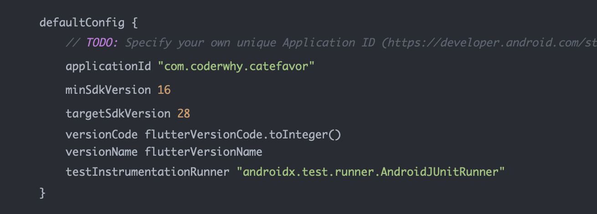

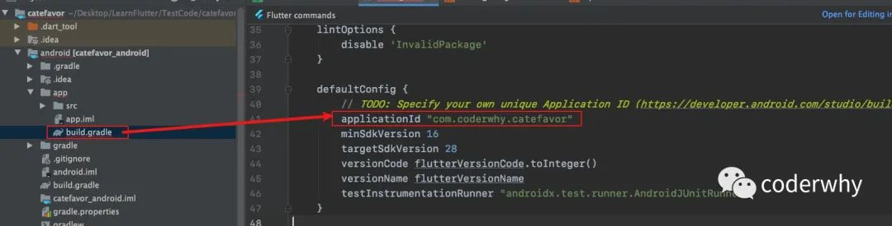

### 1.2. iOS应用标识

iOS应用标识在对应的iOS目录下：ios/Runner/Info.plist（可以通过Xcode打开来进行修改）

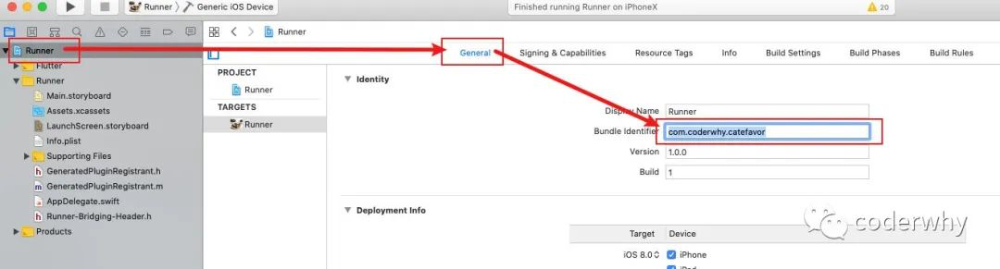

# 二. 应用名称

### 2.1. Android应用名称

Android应用名称在对应的Android目录下：android/app/src/main/AndroidMainifest.xml

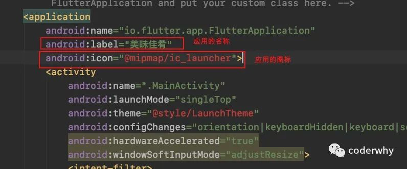

### 2.2. iOS应用名称

iOS应用名称在对应的iOS目录下：ios/Runner/Info.plist（可以通过Xcode打开来进行修改）

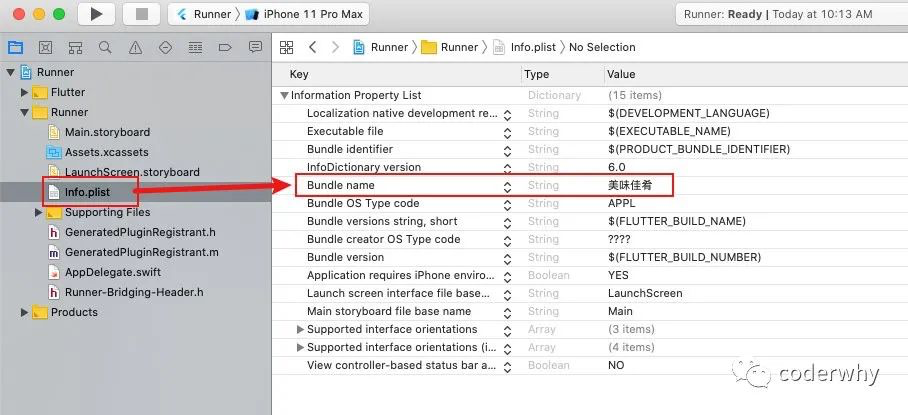

# 三. 应用图标

### 3.1. Android应用图标

官方建议将图标（icon）根据不同的dpi放置在res/mipmap文件夹下。

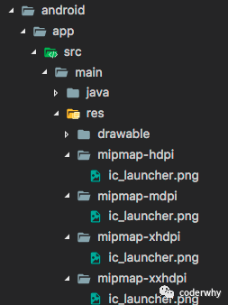

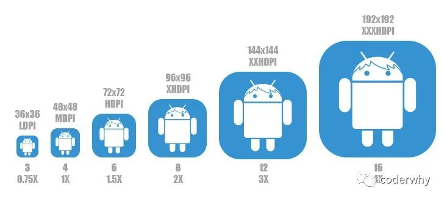

### 3.2. iOS应用图标

iOS的应用图标在ios/Runner/Assets.xcassets/AppIcon.appiconset中管理（可以直接打开Xcode将对应的图标拖入）

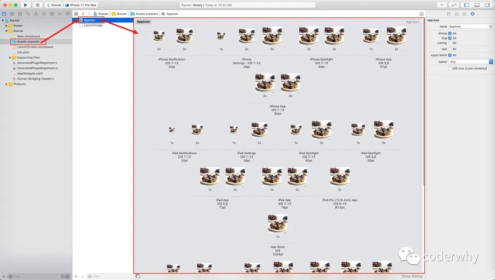

# 四. 应用启动图

### 4.1. Android应用启动图
Android中默认的启动图是一片空白的，这是Flutter的默认设置效果。

 - 在哪里设置呢？android/app/src/main/res/drawable/launch_background.xml

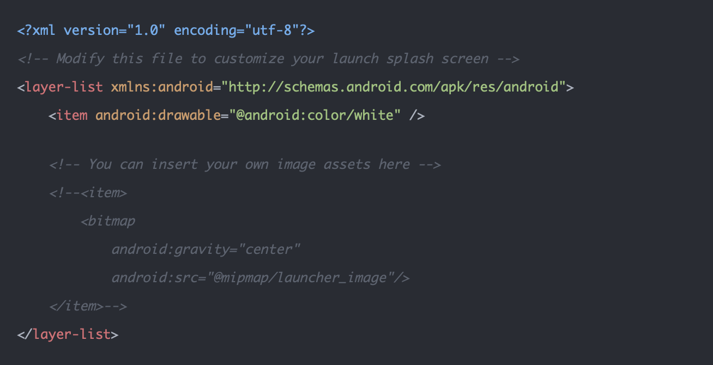

我们可以进行如下修改：

第一步：将对应的启动图片，添加到对应的minimap文件夹中

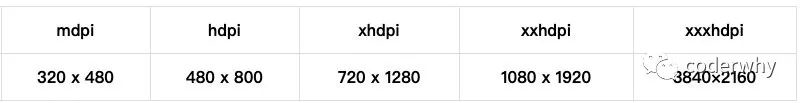

第二步：修改launch_background.xml文件如下：

 - 注意：我这里启动图命名为launcher_image，需要修改为你的名称

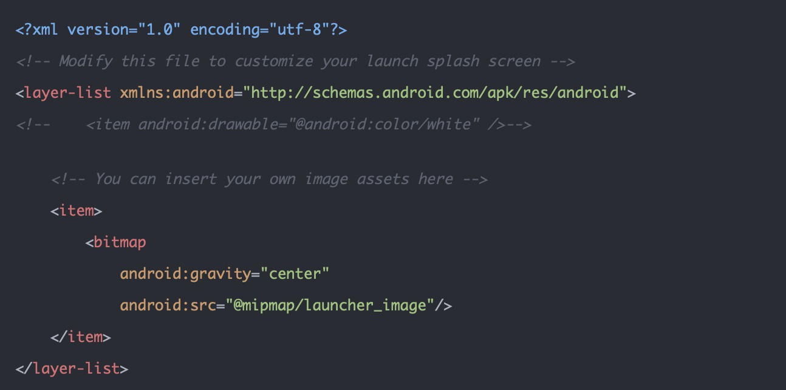

### 4.2. iOS应用启动图

iOS需要两步来完成：

第一步：将启动图片添加到资源依赖中

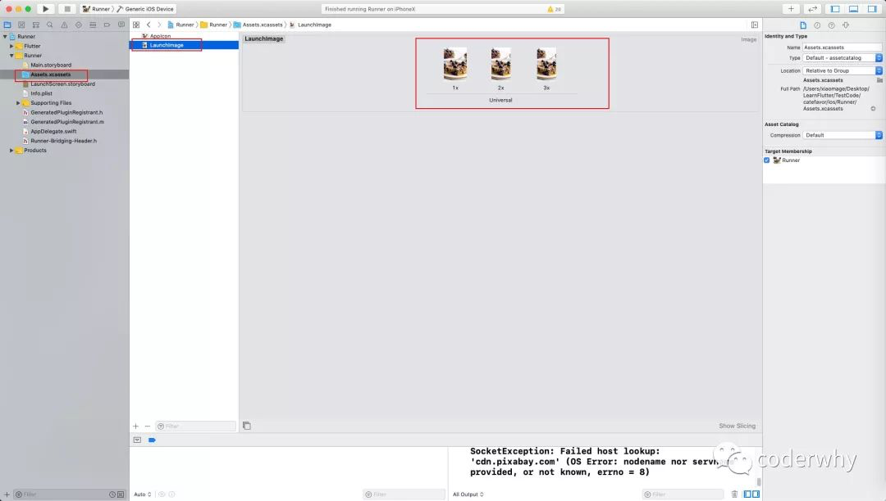

第二步：在LaunchScreen.storyboard中，添加一个ImageView，并且添加约束

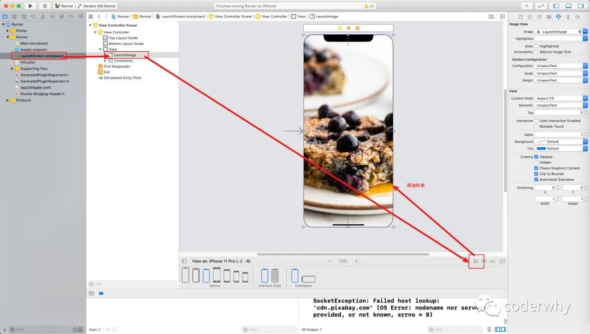

